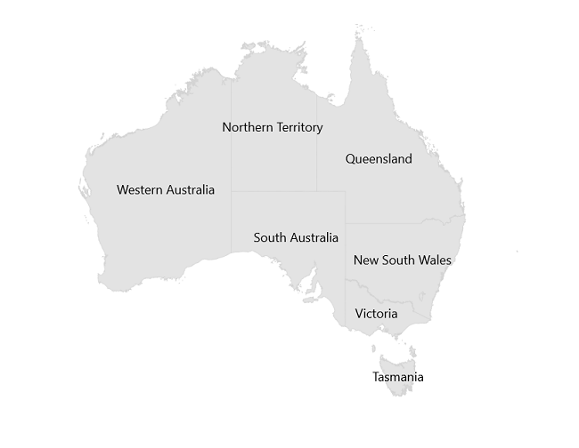
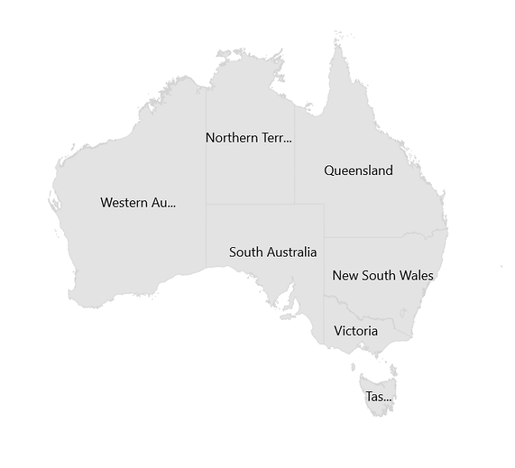

# Data Labels in .NET MAUI Maps (SfMaps)

Data labels provides identification for the shapes by displaying their names. You can trim or hide the labels if they exceed the shape bounds.

## Show data labels

You can show data labels on the map using the `ShowDataLabels` and `DataLabelPath` properties. The `ShowDataLabels` is used to control the visibility of data labels, the `DataLabelPath` is used to decide which underline property has to be displayed as data labels. The default value of `ShowDataLabels` is `false`. 





<map:SfMaps>
    <map:SfMaps.Layer>
        <map:MapShapeLayer DataSource="{Binding Data}"        
                           PrimaryValuePath="State" 
                           ShapeDataField="STATE_NAME" 
                           ShowDataLabels="True">

            <map:MapShapeLayer.DataLabelSettings>
                <map:MapDataLabelSettings DataLabelPath="State" />
            </map:MapShapeLayer.DataLabelSettings>
        </map:MapShapeLayer>
    </map:SfMaps.Layer>
</map:SfMaps>





public MainPage()
{
    InitializeComponent();
    ViewModel viewModel = new ViewModel();
    this.BindingContext = viewModel;
	
    MapShapeLayer layer = new MapShapeLayer();
    layer.ShapesSource = MapSource.FromResource("MyProject.australia.json");
    layer.DataSource = viewModel.Data;
    layer.PrimaryValuePath = "State";
    layer.ShapeDataField = "STATE_NAME";
    layer.ShowDataLabels = true;

    layer.DataLabelSettings = new MapDataLabelSettings()
    {
       DataLabelPath = "State",
    };
	
    SfMaps maps = new SfMaps();
    maps.Layer = layer;
    this.Content = maps;
}

public class ViewModel
{
    public ObservableCollection<Model> Data { get; set; }
    
	public ViewModel()
    {
       Data = new ObservableCollection<Model>();
       Data.Add(new Model("New South Wales", "New\nSouth Wales"));
       Data.Add(new Model("Queensland", "Queensland"));
       Data.Add(new Model("Northern Territory", "Northern\nTerritory"));
       Data.Add(new Model("Victoria", "Victoria"));
       Data.Add(new Model("Tasmania", "Tasmania"));
       Data.Add(new Model("Western Australia", "Western Australia"));
       Data.Add(new Model("South Australia", "South Australia"));
    }
}

public class Model
{
    public String State { get; set; }
    public String StateCode { get; set; }
	
    public Model(string state, string stateCode)
    {
        State = state;
        StateCode = stateCode;
    }
}





## Overflow mode

You can trim or remove the data label when it is overflowed from the shape using the `OverflowMode` property. The possible values are `None`, `Trim`, and `Hide`. The default value of the `OverflowMode` property is `MapLabelOverflowMode.None`.

By default, the data labels will render even if it overflows from the shape. 





<map:SfMaps>
    <map:SfMaps.Layer>
        <map:MapShapeLayer DataSource="{Binding Data}"        
                           PrimaryValuePath="State" 
                           ShapeDataField="STATE_NAME" 
                           ShowDataLabels="True">

            <map:MapShapeLayer.DataLabelSettings>
                <map:MapDataLabelSettings OverflowMode="Trim"
                                          DataLabelPath="State" />
            </map:MapShapeLayer.DataLabelSettings>
        </map:MapShapeLayer>
    </map:SfMaps.Layer>
</map:SfMaps>





public MainPage()
{
    InitializeComponent();
    ViewModel viewModel = new ViewModel();
    this.BindingContext = viewModel;
	
    MapShapeLayer layer = new MapShapeLayer();
    layer.ShapesSource = MapSource.FromResource("MyProject.australia.json");
    layer.DataSource = viewModel.Data;
    layer.PrimaryValuePath = "State";
    layer.ShapeDataField = "STATE_NAME";
    layer.ShowDataLabels = true;

    layer.DataLabelSettings = new MapDataLabelSettings()
    {
       DataLabelPath = "State",
       OverflowMode = MapLabelOverflowMode.Trim,
    };
	
    SfMaps maps = new SfMaps();
    maps.Layer = layer;
    this.Content = maps;
}

public class ViewModel
{
    public ObservableCollection<Model> Data { get; set; }
	
    public ViewModel()
    {
       Data = new ObservableCollection<Model>();
       Data.Add(new Model("New South Wales", "New South Wales"));
       Data.Add(new Model("Queensland", "Queensland"));
       Data.Add(new Model("Northern Territory", "Northern Territory"));
       Data.Add(new Model("Victoria", "Victoria"));
       Data.Add(new Model("Tasmania", "Tasmania"));
       Data.Add(new Model("Western Australia", "Western Australia"));
       Data.Add(new Model("South Australia", "South Australia"));
    }
}

public class Model
{
    public String State { get; set; }
    public String StateCode { get; set; }
	
    public Model(string state, string stateCode)
    {
        State = state;
        StateCode = stateCode;
    }
}





## Appearance customization

You can customize the data labels using the `DataLabelStyle` property.





<map:SfMaps>
    <map:SfMaps.Layer>
        <map:MapShapeLayer DataSource="{Binding Data}" 
                           PrimaryValuePath="State" 
                           ShapeDataField="STATE_NAME" 
                           ShowDataLabels="True">

            <map:MapShapeLayer.DataLabelSettings>
                <map:MapDataLabelSettings OverflowMode="Trim"
                                          DataLabelPath="State">
                        <map:MapDataLabelSettings.DataLabelStyle>
                                <map:MapLabelStyle FontSize="12"
                                                   TextColor="#ff4e41"
                                                   FontAttributes="Italic" />
                        </map:MapDataLabelSettings.DataLabelStyle>
                </map:MapDataLabelSettings>
            </map:MapShapeLayer.DataLabelSettings>

        </map:MapShapeLayer>
    </map:SfMaps.Layer>
</map:SfMaps>





public MainPage()
{
    InitializeComponent();
    ViewModel viewModel = new ViewModel();
    this.BindingContext = viewModel;
	
    MapShapeLayer layer = new MapShapeLayer();
    layer.ShapesSource = MapSource.FromResource("MyProject.australia.json");
    layer.DataSource = viewModel.Data;
    layer.PrimaryValuePath = "State";
    layer.ShapeDataField = "STATE_NAME";
    layer.ShowDataLabels = true;

    layer.DataLabelSettings = new MapDataLabelSettings()
    {
       DataLabelPath = "State",
       OverflowMode = MapLabelOverflowMode.Trim,
       DataLabelStyle = new MapLabelStyle()
       {
           FontSize = 12,
           FontAttributes = FontAttributes.Italic,
           TextColor = Color.FromRgb(255, 78, 65)
       },
    };
	
    SfMaps maps = new SfMaps();
    maps.Layer = layer;
    this.Content = maps;
}

public class ViewModel
{
    public ObservableCollection<Model> Data { get; set; }
	
    public ViewModel()
    {
       Data = new ObservableCollection<Model>();
       Data.Add(new Model("New South Wales", "New\nSouth Wales"));
       Data.Add(new Model("Queensland", "Queensland"));
       Data.Add(new Model("Northern Territory", "Northern\nTerritory"));
       Data.Add(new Model("Victoria", "Victoria"));
       Data.Add(new Model("Tasmania", "Tasmania"));
       Data.Add(new Model("Western Australia", "Western Australia"));
       Data.Add(new Model("South Australia", "South Australia"));
    }
}

public class Model
{
    public String State { get; set; }
    public String StateCode { get; set; }
	
    public Model(string state, string stateCode)
    {
        State = state;
        StateCode = stateCode;
    }
}





