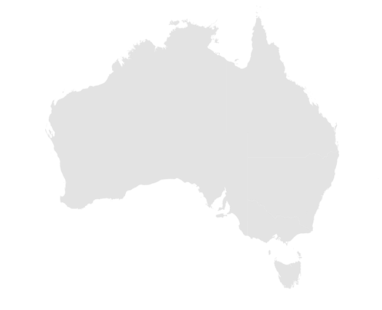

# Getting started with MAUI Maps (SfMaps)

This section explains the steps required to add the maps control with the shape layer and its elements such as data labels, tooltip, markers, and legends. This section covers only basic features needed to know to get started with Syncfusion maps. Follow the steps below to add .NET MAUI Maps control to your project.

To get start quickly with our .NET MAUI Maps, you can check the below video.



## Prerequisites

Before proceeding, ensure the following are setup:
1. Install [.NET 7 SDK](https://dotnet.microsoft.com/en-us/download/dotnet/7.0) or later is installed.
2. Set up a .NET MAUI environment with Visual Studio 2022 (v17.3 or later) or VS Code. For VS Code users, ensure that the .NET MAUI workload is installed and configured as described [here.](https://learn.microsoft.com/en-us/dotnet/maui/get-started/installation?view=net-maui-8.0&tabs=visual-studio-code)

## Step 1: Create a New .NET MAUI Project

### Visual Studio

1. Go to **File > New > Project** and choose the **.NET MAUI App** template.
2. Name the project and choose a location, then click **Next**.
3. Select the .NET framework version and click **Create**.

### Visual Studio Code

1. Open the command palette by pressing `Ctrl+Shift+P` and type **.NET:New Project** and enter.
2. Choose the **.NET MAUI App** template.
3. Select the project location, type the project name and press enter.
4. Then choose **Create project.**

## Step 2: Install the Syncfusion MAUI Maps NuGet Package

1. In **Solution Explorer,** right-click the project and choose **Manage NuGet Packages.**
2. Search for [Syncfusion.Maui.Maps](https://www.nuget.org/packages/Syncfusion.Maui.Maps/) and install the latest version.
3. Ensure the necessary dependencies are installed correctly, and the project is restored.

## Step 3: Register the handler

The [Syncfusion.Maui.Core](https://www.nuget.org/packages/Syncfusion.Maui.Core/) NuGet is a dependent package for all Syncfusion .NET MAUI controls. In the **MauiProgram.cs** file, register the handler for Syncfusion core.



using Microsoft.Maui;
using Microsoft.Maui.Hosting;
using Microsoft.Maui.Controls.Compatibility;
using Microsoft.Maui.Controls.Hosting;
using Microsoft.Maui.Controls.Xaml;
using Syncfusion.Maui.Core.Hosting;

namespace MyProject
{
    public static class MauiProgram
    {
        public static MauiApp CreateMauiApp()
        {
            var builder = MauiApp.CreateBuilder();
            builder
            .UseMauiApp<App>()
            .ConfigureSyncfusionCore()
            .ConfigureFonts(fonts =>
            {
                fonts.AddFont("OpenSans-Regular.ttf", "OpenSansRegular");
            });

            return builder.Build();
        }
    }
}



## Step 4: Add .NET MAUI Maps

1. To initialize the control, import the `Syncfusion.Maui.Maps` namespace into your code.
2. Initialize [SfMaps](https://help.syncfusion.com/cr/maui/Syncfusion.Maui.Maps.SfMaps.html)





xmlns:map="clr-namespace:Syncfusion.Maui.Maps;assembly=Syncfusion.Maui.Maps"





using Syncfusion.Maui.Maps;





Create an instance for the maps control, and add it as content.





<map:SfMaps>
  
</map:SfMaps>





SfMaps map = new SfMaps();
	
this.Content = map;





## Set GeoJSON data or shapefile for shape layer from various source

The [`Layer`](https://help.syncfusion.com/cr/maui/Syncfusion.Maui.Maps.SfMaps.html#Syncfusion_Maui_Maps_SfMaps_Layer) in [`SfMaps`](https://help.syncfusion.com/cr/maui/Syncfusion.Maui.Maps.SfMaps.html) holds [`MapShapeLayer`](https://help.syncfusion.com/cr/maui/Syncfusion.Maui.Maps.MapShapeLayer.html). The actual geographical rendering is done in the each [`MapShapeLayer`](https://help.syncfusion.com/cr/maui/Syncfusion.Maui.Maps.MapShapeLayer.html). The [`ShapesSource`](https://help.syncfusion.com/cr/maui/Syncfusion.Maui.Maps.MapShapeLayer.html#Syncfusion_Maui_Maps_MapShapeLayer_ShapesSource) property of the [`MapShapeLayer`](https://help.syncfusion.com/cr/maui/Syncfusion.Maui.Maps.MapShapeLayer.html) is of type [`MapSource`](https://help.syncfusion.com/cr/maui/Syncfusion.Maui.Maps.MapSource.html). The [`ShapesSource`](https://help.syncfusion.com/cr/maui/Syncfusion.Maui.Maps.MapShapeLayer.html#Syncfusion_Maui_Maps_MapShapeLayer_ShapesSource) can be set as the .json source or shapefile.

I> The Mercator projection is the default projection in the maps.

The [`ShapesSource`](https://help.syncfusion.com/cr/maui/Syncfusion.Maui.Maps.MapShapeLayer.html#Syncfusion_Maui_Maps_MapShapeLayer_ShapesSource) property is used to load shapes from different sources:

* [`FromFile`](https://help.syncfusion.com/cr/maui/Syncfusion.Maui.Maps.MapSource.html#Syncfusion_Maui_Maps_MapSource_FromFile_System_String_) returns a MapSource that reads a shape source from a local file.
* [`FromUri`](https://help.syncfusion.com/cr/maui/Syncfusion.Maui.Maps.MapSource.html#Syncfusion_Maui_Maps_MapSource_FromUri_System_Uri_) returns an MapSource that downloads and reads a shape source from a specified URI.
* `FromResource` returns a MapSource that reads a shape source file embedded in an assembly.
* [`FromStream`](https://help.syncfusion.com/cr/maui/Syncfusion.Maui.Maps.MapSource.html#Syncfusion_Maui_Maps_MapSource_FromStream_System_IO_Stream_) returns a MapSource that reads a shape source from a stream that supplies source data.

### Loading a local file

SfMaps provides support to load the json data or shapefile from local path. 





public MainPage()
{
    InitializeComponent();
    SfMaps map = new SfMaps();
    MapShapeLayer layer = new MapShapeLayer();
    layer.ShapesSource = MapSource.FromFile(@"D:\MyProject\usa_state.shp");
    map.Layer = layer;
    this.Content = map;
}





The [`MapSource.FromFile`](https://help.syncfusion.com/cr/maui/Syncfusion.Maui.Maps.MapSource.html#Syncfusion_Maui_Maps_MapSource_FromFile_System_String_) method requires a string argument, and returns a new [`MapSource`](https://help.syncfusion.com/cr/maui/Syncfusion.Maui.Maps.MapSource.html) object that reads the data from the shape source file. There's also an implicit conversion operator that enables the filename to be specified as a string argument to the [`ShapesSource`](https://help.syncfusion.com/cr/maui/Syncfusion.Maui.Maps.MapShapeLayer.html#Syncfusion_Maui_Maps_MapShapeLayer_ShapesSource) property





<map:SfMaps>
    <map:SfMaps.Layer>
        <map:MapShapeLayer ShapesSource="D:\MyProject\usa_state.shp" />
    </map:SfMaps.Layer>
</map:SfMaps>





public MainPage()
{
    InitializeComponent();
    SfMaps map = new SfMaps();
    MapShapeLayer layer = new MapShapeLayer();
    layer.ShapesSource = MapSource.FromFile(@"D:\MyProject\usa_state.shp");
    map.Layer = layer;
    this.Content = map;
}





### Load a remote file

SfMaps provides support to load the json data or shapefile from the uri.





public MainPage()
{
    InitializeComponent();
    SfMaps map = new SfMaps();
    MapShapeLayer layer = new MapShapeLayer();
    layer.ShapesSource = MapSource.FromUri(new Uri("https://cdn.syncfusion.com/maps/map-data/world-map.json"));
    map.Layer = layer;
    this.Content = map;
}





The [`MapSource.FromUri`](https://help.syncfusion.com/cr/maui/Syncfusion.Maui.Maps.MapSource.html#Syncfusion_Maui_Maps_MapSource_FromFile_System_String_) method requires a Uri argument, and returns a new [`MapSource`](https://help.syncfusion.com/cr/maui/Syncfusion.Maui.Maps.MapSource.html) object that reads the shape source from the Uri. There's also an implicit conversion for string-based URIs.





<map:SfMaps>
    <map:SfMaps.Layer>
        <map:MapShapeLayer ShapesSource="https://cdn.syncfusion.com/maps/map-data/world-map.json" />
    </map:SfMaps.Layer>
</map:SfMaps>





public MainPage()
{
    InitializeComponent();
    SfMaps map = new SfMaps();
    MapShapeLayer layer = new MapShapeLayer();
    layer.ShapesSource = MapSource.FromUri(new Uri("https://cdn.syncfusion.com/maps/map-data/world-map.json"));
    map.Layer = layer;
    this.Content = map;
}





### Load an embedded file

* Embedded sources are loaded based on their resource ID, which is compromised of the name of the project and its location in the project. 
* You can load both json data and shapefile.
* For example, placing `australia.json` in the root folder of a project named `MyProject` will result in a resource ID of `MyProject.australia.json.` Similarly, placing `world1.shp` in the Assets folder of a project named MyProject will result in a resource ID of `MyProject.Assets.world1.shp`
* Right-click the added shapefile, and navigate to properties.
* Choose the `EmbeddedResource` option under BuildAction of respective shapefile.

N> You can get the [`australia.json`](https://www.syncfusion.com/downloads/support/directtrac/general/ze/australia-json-910278184.zip) file here.





public MainPage()
{
    InitializeComponent();
    SfMaps map = new SfMaps();
    MapShapeLayer layer = new MapShapeLayer();
    layer.ShapesSource = MapSource.FromResource("MyProject.australia.json");
    map.Layer = layer;
    this.Content = map;
}





### Loading from stream

SfMaps provides support to load the json data or shapefile as bytes from stream.





public MainPage()
{
    InitializeComponent();
    SfMaps map = new SfMaps();
    MapShapeLayer layer = new MapShapeLayer();
    Assembly assembly = Application.Current?.GetType().GetTypeInfo().Assembly;
    var jsonStream = assembly?.GetManifestResourceStream("MyProject.Assets.australia.json");
    layer.ShapesSource = MapSource.FromStream(jsonStream);
    map.Layer = layer;
    this.Content = map;
}





## Mapping the data source for shape layer

The [`DataSource`](https://help.syncfusion.com/cr/maui/Syncfusion.Maui.Maps.MapShapeLayer.html#Syncfusion_Maui_Maps_MapShapeLayer_DataSource) property accepts the collection values as input. The [`PrimaryValuePath`](https://help.syncfusion.com/cr/maui/Syncfusion.Maui.Maps.MapShapeLayer.html#Syncfusion_Maui_Maps_MapShapeLayer_PrimaryValuePath) property refers to the data ID in [`DataSource`](https://help.syncfusion.com/cr/maui/Syncfusion.Maui.Maps.MapShapeLayer.html#Syncfusion_Maui_Maps_MapShapeLayer_DataSource).

The [`ShapeDataField`](https://help.syncfusion.com/cr/maui/Syncfusion.Maui.Maps.MapShapeLayer.html#Syncfusion_Maui_Maps_MapShapeLayer_ShapeDataField) property is similar to the [`PrimaryValuePath`](https://help.syncfusion.com/cr/maui/Syncfusion.Maui.Maps.MapShapeLayer.html#Syncfusion_Maui_Maps_MapShapeLayer_PrimaryValuePath) property. It refers to the column name in the data property of shape layers to identify the shape. When the values of the [`PrimaryValuePath`](https://help.syncfusion.com/cr/maui/Syncfusion.Maui.Maps.MapShapeLayer.html#Syncfusion_Maui_Maps_MapShapeLayer_PrimaryValuePath) property in the [`DataSource`](https://help.syncfusion.com/cr/maui/Syncfusion.Maui.Maps.MapShapeLayer.html#Syncfusion_Maui_Maps_MapShapeLayer_DataSource) property and the values of [`ShapeDataField`](https://help.syncfusion.com/cr/maui/Syncfusion.Maui.Maps.MapShapeLayer.html#Syncfusion_Maui_Maps_MapShapeLayer_ShapeDataField) in the data property match, the associated object from the dataSource will be bound to the corresponding shape.





<map:SfMaps>
    <map:SfMaps.Layer>
        <map:MapShapeLayer x:Name="layer"
                           ShapesSource="https://cdn.syncfusion.com/maps/map-data/australia.json"
                           ShapeDataField="STATE_NAME"
                           DataSource="{Binding Data}"        
                           PrimaryValuePath="State"  />
    </map:SfMaps.Layer>
</map:SfMaps>





public MainPage()
{
	InitializeComponent();
	layer.ShapesSource = MapSource.FromUri(new Uri("https://cdn.syncfusion.com/maps/map-data/australia.json"));
}

public class ViewModel
{
    public ObservableCollection<Model> Data { get; set; }
    public ViewModel()
    {
        Data = new ObservableCollection<Model>();
        Data.Add(new Model("New South Wales", "New\nSouth Wales", 1));
        Data.Add(new Model("Queensland", "Queensland",2));
        Data.Add(new Model("Northern Territory", "Northern\nTerritory",3));
        Data.Add(new Model("Victoria", "Victoria",4));
        Data.Add(new Model("Tasmania", "Tasmania",5));
        Data.Add(new Model("Western Australia", "Western Australia",6));
        Data.Add(new Model("South Australia", "South Australia",7));
    }

    public class Model
    {
        public string State { get; set; }
        public string StateCode { get; set; }
        public int ID { get; set; }
        public Model(string state, string stateCode, int id)
        {
            State = state;
            StateCode = stateCode;
            ID = id;
        }
    }
}





N>
* Refer to the [`PrimaryValuePath`](https://help.syncfusion.com/cr/maui/Syncfusion.Maui.Maps.MapShapeLayer.html#Syncfusion_Maui_Maps_MapShapeLayer_PrimaryValuePath), for mapping the data of the data source collection with the respective [`ShapeDataField`](https://help.syncfusion.com/cr/maui/Syncfusion.Maui.Maps.MapShapeLayer.html#Syncfusion_Maui_Maps_MapShapeLayer_ShapeDataField) in .json source.
* Refer to the [`BubbleSettings`](https://help.syncfusion.com/cr/maui/Syncfusion.Maui.Maps.MapShapeLayer.html#Syncfusion_Maui_Maps_MapShapeLayer_BubbleSettings), for customizing the bubble.
* Refer to the [`DataLabelSettings`](https://help.syncfusion.com/cr/maui/Syncfusion.Maui.Maps.MapShapeLayer.html#Syncfusion_Maui_Maps_MapShapeLayer_DataLabelSettings), for customizing the data label.
* Refer to the [`ColorMappings`](https://help.syncfusion.com/cr/maui/Syncfusion.Maui.Maps.MapShapeLayer.html#Syncfusion_Maui_Maps_MapShapeLayer_ColorMappings), for customizing the shape colors.

## Add shape layer maps elements

Add the basic maps elements such as data labels, legend, and tooltip as shown in the below code snippet.

* **[Data labels](https://help.syncfusion.com/maui/maps/data-labels)** - You can show data labels using the [`ShowDataLabels`](https://help.syncfusion.com/cr/maui/Syncfusion.Maui.Maps.MapShapeLayer.html#Syncfusion_Maui_Maps_MapShapeLayer_ShowDataLabels) property and also, customize it using the [`DataLabelSettings`](https://help.syncfusion.com/cr/maui/Syncfusion.Maui.Maps.MapShapeLayer.html#Syncfusion_Maui_Maps_MapShapeLayer_DataLabelSettings) property.

* **[Markers](https://help.syncfusion.com/maui/maps/markers)** - You can show markers at any position on the map by providing latitude and longitude position to the [`MapMarker`](https://help.syncfusion.com/cr/maui/Syncfusion.Maui.Maps.MapMarker.html), which is from the [`Markers`](https://help.syncfusion.com/cr/maui/Syncfusion.Maui.Maps.MapLayer.html#Syncfusion_Maui_Maps_MapLayer_Markers) collection.

* **[Legend](https://help.syncfusion.com/maui/maps/legend)** - You can enable legend using the [`Legend`](https://help.syncfusion.com/cr/maui/Syncfusion.Maui.Maps.MapShapeLayer.html#Syncfusion_Maui_Maps_MapShapeLayer_Legend) property. The legend's text is displayed based on the [`ColorMapping.Text`](https://help.syncfusion.com/cr/maui/Syncfusion.Maui.Maps.ColorMapping.html#Syncfusion_Maui_Maps_ColorMapping_Text) property. It is possible to customize the legend text using the [`TextStyle`](https://help.syncfusion.com/cr/maui/Syncfusion.Maui.Maps.MapLegend.html#Syncfusion_Maui_Maps_MapLegend_TextStyle) property.

* **[Tooltip](https://help.syncfusion.com/maui/maps/tooltip)** - You can enable tooltip for the shapes using the [`ShowShapeTooltip`](https://help.syncfusion.com/cr/maui/Syncfusion.Maui.Maps.MapShapeLayer.html#Syncfusion_Maui_Maps_MapShapeLayer_ShowShapeTooltip) property. It will be displayed when you interacts with the shapes i.e., while tapping in touch devices and hover in the mouse enabled devices.





<Grid>
    <Grid.BindingContext>
        <local:ViewModel />
    </Grid.BindingContext>

    <map:SfMaps>
        <map:SfMaps.Layer>
            <map:MapShapeLayer x:Name="layer"
                               ShapesSource="https://cdn.syncfusion.com/maps/map-data/australia.json"
                               ShapeDataField="STATE_NAME"
                               DataSource="{Binding Data}"
                               PrimaryValuePath="State" 
                               ShowDataLabels="True"
                               ShowShapeTooltip="True"
                               ShapeColorValuePath="ID">

                <!--Set Data Label-->
                <map:MapShapeLayer.DataLabelSettings>
                    <map:MapDataLabelSettings DataLabelPath="StateCode" />
                </map:MapShapeLayer.DataLabelSettings>
                
                <!--Set Color mapping-->
                <map:MapShapeLayer.ColorMappings>
                    <map:EqualColorMapping Color="#d0b800"
                                           Value="1"
                                           Text="NSW" />
                    <map:EqualColorMapping Color="#00d5cf"
                                           Value="2"
                                           Text="Queensland" />
                    <map:EqualColorMapping Color="#cf4eee"
                                           Value="3"
                                           Text="Victoria" />
                    <map:EqualColorMapping Color="#4f93d8"
                                           Value="4"
                                           Text="Tasmania" />
                    <map:EqualColorMapping Color="#8b6adf"
                                           Value="5"
                                           Text="WA" />
                    <map:EqualColorMapping Color="#7bff67"
                                           Value="6"
                                           Text="SA" />
                    <map:EqualColorMapping Color="#ff4e42"
                                           Value="7"
                                           Text="NT" />
                </map:MapShapeLayer.ColorMappings>

                <!--Set Markers-->
                <map:MapShapeLayer.Markers>
                    <map:MapMarkerCollection>
                        <map:MapMarker x:Name="Adelaide"
                                       Latitude="-34.928497"
                                       Longitude="138.600739" />
                    </map:MapMarkerCollection>
                </map:MapShapeLayer.Markers>
                
                <!--Set Legend-->
                <map:MapShapeLayer.Legend>
                    <map:MapLegend SourceType="Shape"
                                   Placement="Bottom" />
                </map:MapShapeLayer.Legend>
            </map:MapShapeLayer>
        </map:SfMaps.Layer>
    </map:SfMaps>
</Grid>





public MainPage()
{
    InitializeComponent();
    ViewModel viewModel = new ViewModel();
    this.BindingContext = viewModel;
    SfMaps maps = new SfMaps();
    MapShapeLayer layer = new MapShapeLayer();
    layer.ShapesSource = MapSource.FromUri(new Uri("https://cdn.syncfusion.com/maps/map-data/australia.json"));
    layer.DataSource = viewModel.Data;
    layer.PrimaryValuePath = "State";
    layer.ShapeDataField = "STATE_NAME";
    layer.ShapeColorValuePath = "ID";
    layer.ShowDataLabels = true;
    layer.ShowShapeTooltip = true;

    layer.DataLabelSettings = new MapDataLabelSettings()
    {
        DataLabelPath = "StateCode"
    };

    layer.ColorMappings = new ObservableCollection<ColorMapping>()
    {
        new EqualColorMapping
		   {
		      Color = Color.FromRgb(208,183,0),
			  Value = "1",
              Text="NSW"
		   },
        new EqualColorMapping
		   { 
		      Color = Color.FromRgb(0,213,207),
		      Value = "2" ,
			  Text="Queensland"
		   },
        new EqualColorMapping
		   {
		      Color = Color.FromRgb(207,78,238),
			  Value = "3",
              Text="Victoria"
		   },
        new EqualColorMapping
		   {
		      Color = Color.FromRgb(79,147,216),
			  Value = "4",
			  Text="Tasmania"
		   },
        new EqualColorMapping
		   {
		      Color = Color.FromRgb(139,106,223),
			  Value = "5",
			  Text="WA"
		   },
        new EqualColorMapping
		   {
		      Color = Color.FromRgb(123,255,103),
			  Value = "6",
			  Text="SA"
		   },
        new EqualColorMapping
		   {
		      Color = Color.FromRgb(255,78,66),
			  Value = "7",
			  Text="NT"
		   },
    };

    MapMarker mapMarker = new MapMarker();
    mapMarker.Latitude = -34.928497;
    mapMarker.Longitude = 138.600739;
    MapMarkerCollection mapMarkers =new MapMarkerCollection
    {
       mapMarker
    };
    layer.Markers = mapMarkers;

    MapLegend legendSet = new MapLegend();
    legendSet.SourceType = LegendSourceType.Shape;
    legendSet.Placement = LegendPlacement.Bottom;
    layer.Legend = legendSet;

    maps.Layer = layer;
    this.Content = maps;
}

public class ViewModel
{
    public ObservableCollection<Model> Data { get; set; }
    public ViewModel()
    {
        Data = new ObservableCollection<Model>();
        Data.Add(new Model("New South Wales", "New\nSouth Wales", 1));
        Data.Add(new Model("Queensland", "Queensland",2));
        Data.Add(new Model("Northern Territory", "Northern\nTerritory",3));
        Data.Add(new Model("Victoria", "Victoria",4));
        Data.Add(new Model("Tasmania", "Tasmania",5));
        Data.Add(new Model("Western Australia", "Western Australia",6));
        Data.Add(new Model("South Australia", "South Australia",7));
    }
    
    public class Model
    {
        public string State { get; set; }
        public string StateCode { get; set; }
        public int ID { get; set; }
        public Model(string state, string stateCode, int id)
        {
            State = state;
            StateCode = stateCode;
            ID = id;
        }
    }
}





## Add tile layer

The [`MapTileLayer`](https://help.syncfusion.com/cr/maui/Syncfusion.Maui.Maps.MapTileLayer.html?tabs=tabid-1) needs to be assign to the [`Layer`](https://help.syncfusion.com/cr/maui/Syncfusion.Maui.Maps.SfMaps.html#Syncfusion_Maui_Maps_SfMaps_Layer) property in [`SfMaps`](https://help.syncfusion.com/cr/maui/Syncfusion.Maui.Maps.SfMaps.html?tabs=tabid-1). The URL of the providers must be set in the [`MapTileLayer.UrlTemplate`](https://help.syncfusion.com/cr/maui/Syncfusion.Maui.Maps.MapTileLayer.html#Syncfusion_Maui_Maps_MapTileLayer_UrlTemplate) property.

Kindly refer the [tile layer](https://help.syncfusion.com/maui/maps/tile-layer) section for more information.





 <maps:SfMaps>
    <maps:SfMaps.Layer>
        <maps:MapTileLayer UrlTemplate="https://tile.openstreetmap.org/{z}/{x}/{y}.png" />
    </maps:SfMaps.Layer>
</maps:SfMaps>





SfMaps map = new SfMaps();
MapTileLayer tileLayer = new MapTileLayer();
tileLayer.UrlTemplate = "https://tile.openstreetmap.org/{z}/{x}/{y}.png";
map.Layer = tileLayer;
this.Content = map;





N>
* Get the complete getting started sample from [GitHub](https://github.com/SyncfusionExamples/.NET-MAUI-Maps-Getting-Started) link.
* You can refer to our [.NET MAUI Maps](https://www.syncfusion.com/maui-controls/maui-maps) feature tour page for its groundbreaking feature representations. You can also explore our [.NET MAUI Maps Example](https://github.com/syncfusion/maui-demos/tree/master/MAUI/Maps) that shows you how to render the Maps in .NET MAUI.
