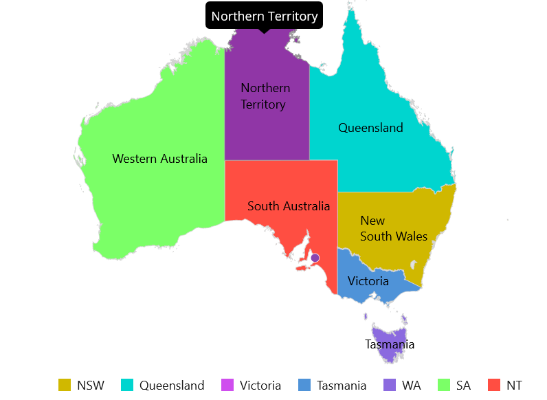

# Getting started with MAUI Maps (SfMaps)

This section explains the steps required to add the maps widget with shape layer and its elements such as data labels, tooltip, markers, and legends. This section covers only basic features needed to know to get started with Syncfusion maps.

## Creating an application using the .NET MAUI Maps

* Create a new .NET MAUI application in the Visual Studio.

* Syncfusion .NET MAUI components are available on [nuget.org](https://www.nuget.org/). To add SfMaps to your project, open the NuGet package manager in Visual Studio, search for [Syncfusion.Maui.Maps], and [Syncfusion.Maui.Core] then install that.

### Register the handler

Syncfusion.Maui.Core NuGet is a dependent package for all Syncfusion controls of .NET MAUI. In the MauiProgram.cs file, register the handler for Syncfusion core.



using Microsoft.Maui;
using Microsoft.Maui.Hosting;
using Microsoft.Maui.Controls.Compatibility;
using Microsoft.Maui.Controls.Hosting;
using Microsoft.Maui.Controls.Xaml;
using Syncfusion.Maui.Core.Hosting;

namespace GaugeMauiSample
{
    public static class MauiProgram
    {
        public static MauiApp CreateMauiApp()
        {
            var builder = MauiApp.CreateBuilder();
            builder
            .UseMauiApp<App>()
            .ConfigureSyncfusionCore()
            .ConfigureFonts(fonts =>
            {
                fonts.AddFont("OpenSans-Regular.ttf", "OpenSansRegular");
            });

            return builder.Build();
        }
    }
}



## Adding namespace

Add the following namespace.





xmlns:map="clr-namespace:Syncfusion.Maui.Maps;assembly=Syncfusion.Maui.Maps"





using Syncfusion.Maui.Maps;





## Initializing maps

Create an instance for the maps control, and add it as content.





<map:SfMaps >
  
</map:SfMaps>





SfMaps map = new SfMaps();
	
this.Content = map;





## Set GeoJSON data for shape layer from various source

The [`Layer`]() in [`SfMaps`](https://pub.dev/documentation/syncfusion_flutter_maps/latest/maps/SfMaps-class.html) contains collection of [`MapShapeLayer`](https://pub.dev/documentation/syncfusion_flutter_maps/latest/maps/MapShapeLayer-class.html). The actual geographical rendering is done in the each [`MapShapeLayer`](https://pub.dev/documentation/syncfusion_flutter_maps/latest/maps/MapShapeLayer-class.html). The [`ShapesSource`](https://pub.dev/documentation/syncfusion_flutter_maps/latest/maps/MapShapeLayer/source.html) property of the [`MapShapeLayer`](https://pub.dev/documentation/syncfusion_flutter_maps/latest/maps/MapShapeLayer-class.html) is of type [`MapShapeSource`](https://pub.dev/documentation/syncfusion_flutter_maps/latest/maps/MapShapeSource-class.html). The [`ShapesSource`](https://pub.dev/documentation/syncfusion_flutter_maps/latest/maps/MapShapeLayer/source.html) can be set as the .json source from file, from network and from stream as bytes. Use the respective constructor depends on the type of the source.

The [`ShapeDataField`](https://pub.dev/documentation/syncfusion_flutter_maps/latest/maps/MapShapeSource/shapeDataField.html) property of the [`MapShapeLayer`](https://pub.dev/documentation/syncfusion_flutter_maps/latest/maps/MapShapeSource-class.html) is used to refer the unique field name in the .json source to identify each shapes. In [`Mapping the data source`](https://help.syncfusion.com/flutter/maps/getting-started#mapping-the-data-source-for-shape-layer) section of this document, this [`ShapeDataField`](https://pub.dev/documentation/syncfusion_flutter_maps/latest/maps/MapShapeSource/shapeDataField.html) will be used to map with respective value returned in [`PrimaryValuePath`](https://pub.dev/documentation/syncfusion_flutter_maps/latest/maps/MapShapeSource/primaryValueMapper.html) from the data source.

N> It supports reading and loading the shape files in .shp file format.

I> The Mercator projection is the default projection in the maps.

### From file

Load .json data from file.

N> You can get the [`australia.json`](https://www.syncfusion.com/downloads/support/directtrac/general/ze/australia-json-910278184.zip) file here.





public MapSourcePage()
{
    InitializeComponent();
    SfMaps map = new SfMaps();
    MapShapeLayer layer = new MapShapeLayer();
    layer.ShapesSource = MapSource.FromResource("australia.json");
    map.Layer = layer;
    this.Content = map;
}





### From network

Load .json data from the network.





public MapSourcePage()
{
    InitializeComponent();
    SfMaps map = new SfMaps();
    MapShapeLayer layer = new MapShapeLayer();
    layer.ShapesSource = MapSource.FromUri(new Uri("https://cdn.syncfusion.com/maps/map-data/australia.json"));
    map.Layer = layer;
    this.Content = map;
}





### From Stream

Load .json data as bytes from stream.





public MapSourcePage()
{
    InitializeComponent();
    SfMaps map = new SfMaps();
    MapShapeLayer layer = new MapShapeLayer();
    Assembly assembly = Application.Current?.GetType().GetTypeInfo().Assembly;
    var jsonStream = assembly?.GetManifestResourceStream("australia.json");
    layer.ShapesSource = MapSource.FromStream(jsonStream);
    map.Layer = layer;
    this.Content = map;
}





## Mapping the data source for shape layer

By default, the value specified for the [`ShapeDataField`](https://pub.dev/documentation/syncfusion_flutter_maps/latest/maps/MapShapeSource/shapeDataField.html) in the GeoJSON source will be used in the elements like data labels, tooltip, and legend for their respective shapes. However, it is possible to keep a data source and customize these elements based on the requirement. As mentioned above, [`ShapeDataField`](https://pub.dev/documentation/syncfusion_flutter_maps/latest/maps/MapShapeSource/shapeDataField.html) will be used to map with respective value returned in [`PrimaryValuePath`](https://pub.dev/documentation/syncfusion_flutter_maps/latest/maps/MapShapeSource/primaryValueMapper.html) from the data source.





public MapSourcePage()
{
    InitializeComponent();
    ObservableCollection<Model> Data = new ObservableCollection<Model>();
    Data.Add(new Model("New South Wales", "New\nSouth Wales"));
    Data.Add(new Model("Queensland", "Queensland"));
    Data.Add(new Model("Northern Territory", "Northern\nTerritory"));
    Data.Add(new Model("Victoria", "Victoria"));
    Data.Add(new Model("Western Australia", "Western Australia"));
    Data.Add(new Model("Tasmania", "Tasmania"));
    SfMaps maps = new SfMaps();
    MapShapeLayer layer = new MapShapeLayer();
    layer.ShapesSource = MapSource.FromUri(new Uri("https://cdn.syncfusion.com/maps/map-data/australia.json"));
    layer.PrimaryValuePath = "state";
    layer.ShapeDataField = "STATE_NAME";
    maps.Layer = layer;
    this.Content = maps;
}

public class Model
{
    public Model(string state, string stateCode)
    {
        State = state;
        StateCode = stateCode;
    }
        public String State { get; set; }
        public String StateCode { get; set; }
}





N>
* Refer the [`MapShapeLayer.PrimaryValuePath`](https://pub.dev/documentation/syncfusion_flutter_maps/latest/maps/MapShapeSource/primaryValueMapper.html), for mapping the data of the data source collection with the respective [`MapShapeLayer.ShapeDataField`](https://pub.dev/documentation/syncfusion_flutter_maps/latest/maps/MapShapeSource/shapeDataField.html) in .json source.
* Refer the [`MapShapeLayer.BubbleSettings`](https://pub.dev/documentation/syncfusion_flutter_maps/latest/maps/MapShapeSource/bubbleSizeMapper.html), for customizing the bubble.
* Refer the [`MapShapeLayer.DataLabelSettings`](https://pub.dev/documentation/syncfusion_flutter_maps/latest/maps/MapShapeSource/dataLabelMapper.html), for customizing the data label.
* Refer the [`MapShapeLayer.ColorMappings`](https://pub.dev/documentation/syncfusion_flutter_maps/latest/maps/MapShapeSource/shapeColorValueMapper.html), for customizing the shape colors.

## Add shape layer maps elements

Add the basic maps elements such as data labels, legend, and tooltip as shown in the below code snippet.

* **Data labels** - You can show data labels using the [`MapShapeLayer.ShowDataLabels`](https://pub.dev/documentation/syncfusion_flutter_maps/latest/maps/MapShapeLayer/showDataLabels.html) property and also, it is possible to show data labels only for the particular shapes/or show custom text using the [`MapShapeLayer.DataLabelSettings`](https://pub.dev/documentation/syncfusion_flutter_maps/latest/maps/MapShapeSource/dataLabelMapper.html) property.

* **Legend** - You can enable legend using the [`MapShapeLayer.Legend`](https://pub.dev/documentation/syncfusion_flutter_maps/latest/maps/MapShapeLayer/legend.html) property. The icons color of the legend is applied based on the colors returned in the [`MapShapeLayer.ColorMappings`](https://pub.dev/documentation/syncfusion_flutter_maps/latest/maps/MapShapeSource/shapeColorValueMapper.html) property. It is possible to customize the legend text customizations using the [`MapLegend.TextStyle`](https://pub.dev/documentation/syncfusion_flutter_maps/latest/maps/MapShapeSource/shapeColorMappers.html) property.

* **Tooltip** - You can enable tooltip for the shapes using the [`MapShapeLayer. ShowShapeTooltip`](https://pub.dev/documentation/syncfusion_flutter_maps/latest/maps/MapShapeLayer/shapeTooltipBuilder.html) property. It will be called with the corresponding index every time when you interacts with the shapes i.e., while tapping in touch devices and hover enter in the mouse enabled devices.





public MapSourcePage()
{
    InitializeComponent();
     ObservableCollection<Model> Data = new ObservableCollection<Model>();
        Data.Add(new Model("New South Wales", "New\nSouth Wales",6000));
        Data.Add(new Model("Queensland", "Queensland",8000));
        Data.Add(new Model("Northern Territory", "Northern\nTerritory",10000));
        Data.Add(new Model("Victoria", "Victoria",5000));
        Data.Add(new Model("Tasmania", "Tasmania",90000));
        Data.Add(new Model("Western Australia", "Western Australia", 7000));
        Data.Add(new Model("South Australia", "South Australia", 3000));
        SfMaps maps = new SfMaps();
        MapShapeLayer layer = new MapShapeLayer();
        layer.ShapesSource = MapSource.FromUri(new Uri("https://cdn.syncfusion.com/maps/map-data/australia.json"));
        layer.DataSource = Data;
        layer.PrimaryValuePath = "State";
        layer.ShapeDataField = "STATE_NAME";
        layer.ShowShapeTooltip = true;
        layer.ShapeColorValuePath = "Population";
        layer.ShowDataLabels = true;

        layer.DataLabelSettings = new MapDataLabelSettings()
        {
            DataLabelPath = "StateCode",
            DataLabelStyle = new MapLabelStyle()
            {
                FontSize = 14,
                FontAttributes = FontAttributes.Bold,
                TextColor = Colors.Black
            },

            OverflowMode = MapLabelOverflowMode.None,
        };

        layer.ColorMappings = new ObservableCollection<ColorMapping>()
        {
            new EqualColorMapping { Color = Colors.Yellow, Value = "6000" },
            new EqualColorMapping { Color = Colors.LimeGreen, Value = "8000" },
            new EqualColorMapping { Color = Colors.Violet, Value = "5000" },
            new EqualColorMapping { Color = Colors.Blue, Value = "90000" },
            new EqualColorMapping { Color = Colors.Red, Value = "7000" },
            new EqualColorMapping { Color = Colors.Orange, Value = "3000" },
        };
        maps.Layer = layer;
        this.Content = maps;
    }

    public class Model
    {
        public Model(string state, string stateCode,int population)
        {
            State = state;
            StateCode = stateCode;
            Population = population;
        }
        public String State { get; set; }
        public String StateCode { get; set; }
        public int Population { get; set; }
    }





N> You can refer to our [MAUI Maps](https://www.syncfusion.com/flutter-widgets/flutter-maps) feature tour page for its groundbreaking feature representations. You can also explore our [MAUI Maps example](https://flutter.syncfusion.com/#/maps/shape-layer/range-color-mapping) that shows how to configure a Maps in MAUI.