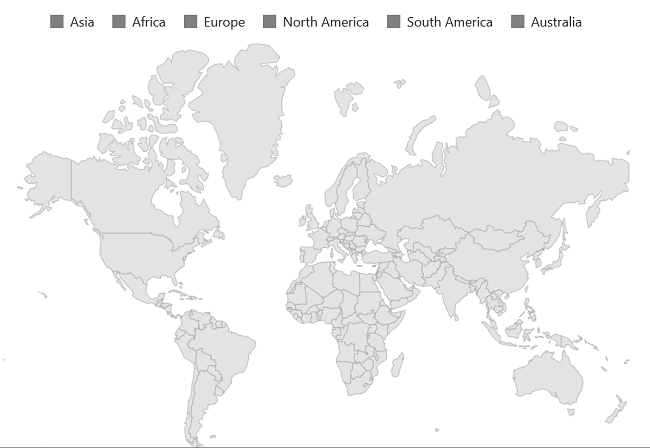
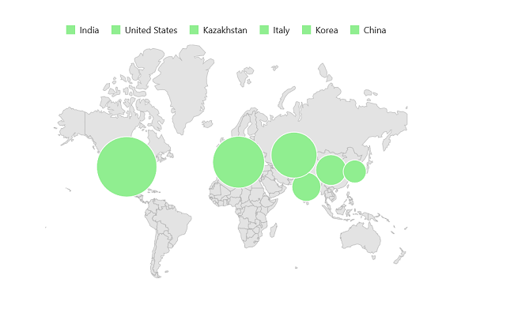
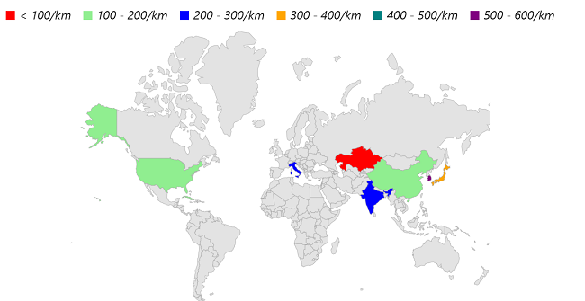
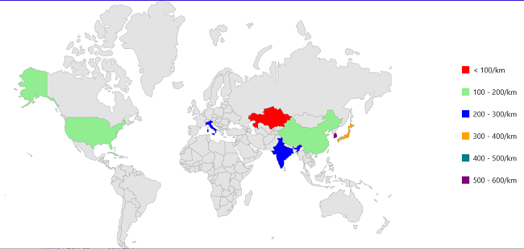
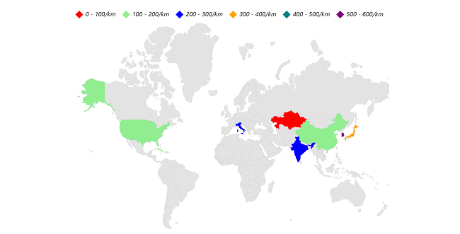
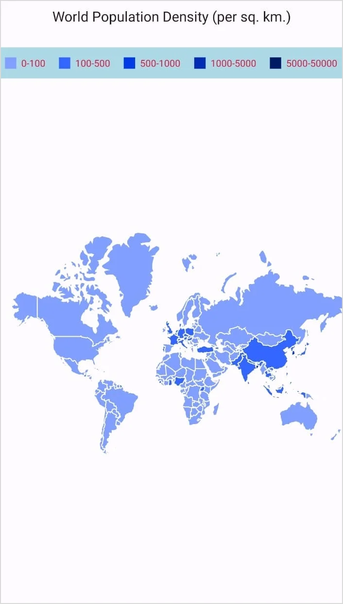
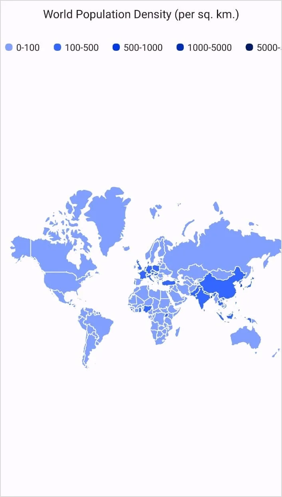

# Legend in .NET MAUI Maps (SfMaps)

Using a legend, you can provide clear information on the data plotted on the map.

To learn more about the .NET MAUI Maps legend, you can check the following video.

 <iframe id='MAUIMapsVideoTutorial' src="https://www.youtube.com/embed/mNkPkNfYG0g?start=170"></iframe>

## Shape legend

You can show shape legend by setting the [`Legend`](https://help.syncfusion.com/cr/maui/Syncfusion.Maui.Maps.MapShapeLayer.html#Syncfusion_Maui_Maps_MapShapeLayer_Legend) property as [`MapLegend`](https://help.syncfusion.com/cr/maui/Syncfusion.Maui.Maps.MapLegend.html) with [`SourceType`](https://help.syncfusion.com/cr/maui/Syncfusion.Maui.Maps.MapLegend.html#Syncfusion_Maui_Maps_MapLegend_SourceType) as [`Shape`](https://help.syncfusion.com/cr/maui/Syncfusion.Maui.Maps.LegendSourceType.html#Syncfusion_Maui_Maps_LegendSourceType_Shape). The legend item’s default text is displayed based on the value of [`ColorMappings.Text`](https://help.syncfusion.com/cr/maui/Syncfusion.Maui.Maps.ColorMapping.html#Syncfusion_Maui_Maps_ColorMapping_Text) property. The default value of the [`Legend`](https://help.syncfusion.com/cr/maui/Syncfusion.Maui.Maps.MapShapeLayer.html#Syncfusion_Maui_Maps_MapShapeLayer_Legend) property is `null` and hence the legend will not be shown by default.





<map:SfMaps>
    <map:SfMaps.Layer>
        <map:MapShapeLayer  ShapesSource="https://cdn.syncfusion.com/maps/map-data/world-map.json"
                            DataSource="{Binding Data}"
                            PrimaryValuePath="State" 
                            ShapeDataField="name" 
                            ShapeStroke="DarkGrey">
                
                <map:MapShapeLayer.ColorMappings>
                    <map:EqualColorMapping Color="LightGray"
                                            Value="51"
                                            Text="India" />
                    <map:EqualColorMapping Color="LightGray"
                                            Value="58"
                                            Text="United States" />
                    <map:EqualColorMapping Color="LightGray"
                                            Value="41"
                                            Text="Kazakhstan" />
                    <map:EqualColorMapping Color="LightGray"
                                            Value="48"
                                            Text="Italy" />
                    <map:EqualColorMapping Color="LightGray"
                                            Value="14"
                                            Text="Korea" />
                    <map:EqualColorMapping Color="LightGray"
                                            Value="23"
                                            Text="China" />
                </map:MapShapeLayer.ColorMappings>
    
                <map:MapShapeLayer.Legend>
                    <map:MapLegend SourceType="Shape"
                                    Placement="Top" />
                </map:MapShapeLayer.Legend>
                
        </map:MapShapeLayer>
    </map:SfMaps.Layer>
</map:SfMaps>





public MainPage()
{
    InitializeComponent();
    ViewModel viewModel = new ViewModel();
    this.BindingContext = viewModel;

    SfMaps maps = new SfMaps();
    MapShapeLayer layer = new MapShapeLayer();
    layer.ShapesSource = MapSource.FromUri(new Uri("https://cdn.syncfusion.com/maps/map-data/world-map.json"));
    layer.DataSource = viewModel.Data;
    layer.PrimaryValuePath = "State";
    layer.ShapeDataField = "name";
    layer.ShapeStroke = Colors.DarkGrey;

    layer.ColorMappings.Add(new EqualColorMapping()
                            {
                                Color = Colors.LightGray,
                                Value = "51",
                                Text = "India"
                            });
    layer.ColorMappings.Add(new EqualColorMapping()
                            {
                                Color = Colors.LightGray,
                                Value = "58",
                                Text = "United States"
                            });
    layer.ColorMappings.Add(new EqualColorMapping()
                            {
                                Color = Colors.LightGray,
                                Value = "41",
                                Text = "Kazakhstan"
                            });
    layer.ColorMappings.Add(new EqualColorMapping()
                            {
                                Color = Colors.LightGray,
                                Value = "48",
                                Text = "Italy"
                            });
    layer.ColorMappings.Add(new EqualColorMapping()
                            {
                                Color = Colors.LightGray,
                                Value = "14",
                                Text = "Korea"
                            });
    layer.ColorMappings.Add(new EqualColorMapping()
                            {
                                Color = Colors.LightGray,
                                Value = "23",
                                Text = "China"
                            });

    MapLegend legendSet = new MapLegend();
    legendSet.SourceType = LegendSourceType.Shape;
    legendSet.Placement = Syncfusion.Maui.Core.LegendPlacement.Top;
    layer.Legend = legendSet;

    maps.Layer = layer;
    this.Content = maps;
}

public class ViewModel
{
    public ObservableCollection<Model> Data { get; set; }
	
    public ViewModel()
    {
        Data = new ObservableCollection<Model>();
        Data.Add(new Model("India", 51));
        Data.Add(new Model("United States", 58));
        Data.Add(new Model("Kazakhstan", 41));
        Data.Add(new Model("Italy", 48));
        Data.Add(new Model("Korea", 14));
        Data.Add(new Model("China", 23));
    }
}

public class Model
{
    public String State { get; set; }
    public int Population { get; set; }
	
    public Model(string state, int population)
    {
        State = state;
        Population = population;
    }
}





## Bubble legend

You can show bubble legend by setting the [`MapShapeLayer.Legend`](https://help.syncfusion.com/cr/maui/Syncfusion.Maui.Maps.MapLegend.html) property as [`SourceType.Bubble`](https://help.syncfusion.com/cr/maui/Syncfusion.Maui.Maps.LegendSourceType.html#Syncfusion_Maui_Maps_LegendSourceType_Bubble). By default, the legend item's text is displayed based on the [`ColorMapping.Text`](https://help.syncfusion.com/cr/maui/Syncfusion.Maui.Maps.ColorMapping.html#Syncfusion_Maui_Maps_ColorMapping_Text) value.





<map:SfMaps>
    <map:SfMaps.Layer>
        <map:MapShapeLayer  ShapesSource="https://cdn.syncfusion.com/maps/map-data/world-map.json"
                            DataSource="{Binding Data}"  
                            ShowBubbles="True" 
                            PrimaryValuePath="State" 
                            ShapeDataField="name" 
                            ShapeStroke="DarkGray">
    
                <map:MapShapeLayer.BubbleSettings>
                    <map:MapBubbleSettings ColorValuePath="Population"
                                            SizeValuePath="Population"
                                            MinSize="30"
                                            MaxSize="80">
    
                        <map:MapBubbleSettings.ColorMappings>
                            <map:EqualColorMapping Color="LightGreen"
                                                    Value="21"
                                                    Text="India" />
                            <map:EqualColorMapping Color="LightGreen"
                                                    Value="58"
                                                    Text="United States" />
                            <map:EqualColorMapping Color="LightGreen"
                                                    Value="41"
                                                    Text="Kazakhstan" />
                            <map:EqualColorMapping Color="LightGreen"
                                                    Value="48"
                                                    Text="Italy" />
                            <map:EqualColorMapping Color="LightGreen"
                                                    Value="14"
                                                    Text="Korea" />
                            <map:EqualColorMapping Color="LightGreen"
                                                    Value="23"
                                                    Text="China" />
                        </map:MapBubbleSettings.ColorMappings>
                    </map:MapBubbleSettings>
                </map:MapShapeLayer.BubbleSettings>
                
                <map:MapShapeLayer.Legend>
                    <map:MapLegend SourceType="Bubble" Placement="Top" />
                </map:MapShapeLayer.Legend>
                
        </map:MapShapeLayer>
    </map:SfMaps.Layer>
</map:SfMaps>





public MainPage()
{
    InitializeComponent();
    ViewModel viewModel = new ViewModel();
    this.BindingContext = viewModel;

    MapShapeLayer layer = new MapShapeLayer();
    layer.ShapesSource = MapSource.FromUri(new Uri("https://cdn.syncfusion.com/maps/map-data/world-map.json"));
    layer.DataSource = viewModel.Data;
    layer.PrimaryValuePath = "State";
    layer.ShapeDataField = "name";
    layer.ShowBubbles = true;
    layer.ShapeStroke = Colors.DarkGrey;
    
    MapBubbleSettings bubbleSetting = new MapBubbleSettings()
    {
        ColorValuePath = "Population",
        SizeValuePath = "Population",
        MinSize = 30,
        MaxSize = 80,
    };

    bubbleSetting.ColorMappings.Add(new EqualColorMapping()
                                    {
                                        Color = Colors.LightGreen,
                                        Value = "21",
                                        Text = "India"
                                    });
    bubbleSetting.ColorMappings.Add(new EqualColorMapping()
                                    {
                                        Color = Colors.LightGreen,
                                        Value = "58",
                                        Text = "United States"
                                    });
    bubbleSetting.ColorMappings.Add(new EqualColorMapping()
                                    {
                                        Color = Colors.LightGreen,
                                        Value = "41",
                                        Text = "Kazakhstan"
                                    });
    bubbleSetting.ColorMappings.Add(new EqualColorMapping()
                                    {
                                        Color = Colors.LightGreen,
                                        Value = "48",
                                        Text = "Italy"
                                    });
    bubbleSetting.ColorMappings.Add(new EqualColorMapping()
                                    {
                                        Color = Colors.LightGreen,
                                        Value = "14",
                                        Text = "Korea"
                                    });
    bubbleSetting.ColorMappings.Add(new EqualColorMapping()
                                    {
                                        Color = Colors.LightGreen,
                                        Value = "23",
                                        Text = "China"
                                    });

    layer.BubbleSettings = bubbleSetting;
    MapLegend legendSet = new MapLegend();
    legendSet.SourceType = LegendSourceType.Bubble;
    legendSet.Placement = Syncfusion.Maui.Core.LegendPlacement.Top;
    layer.Legend = legendSet;

    SfMaps maps = new SfMaps();
    maps.Layer = layer;
    this.Content = maps;
}

public class ViewModel
{
    public ObservableCollection<Model> Data { get; set; }
	
    public ViewModel()
    {
        Data = new ObservableCollection<Model>();
        Data.Add(new Model("India", 21));
        Data.Add(new Model("United States", 58));
        Data.Add(new Model("Kazakhstan", 41));
        Data.Add(new Model("Italy", 48));
        Data.Add(new Model("Korea", 14));
        Data.Add(new Model("China", 23));
    }
}

public class Model
{
    public String State { get; set; }
    public int Population { get; set; }
	
    public Model(string state, int population)
    {
        State = state;
        Population = population;
    }
}





## Legend text customization

You can customize the legend item's text style using the [`MapLegend.TextStyle`](https://help.syncfusion.com/cr/maui/Syncfusion.Maui.Maps.MapLegend.html#Syncfusion_Maui_Maps_MapLegend_TextStyle) property.





<map:SfMaps>
    <map:SfMaps.Layer>
        <map:MapShapeLayer ShapesSource="https://cdn.syncfusion.com/maps/map-data/world-map.json"
                           DataSource="{Binding Data}"
                           PrimaryValuePath="State"
                           ShapeDataField="name"
                           ShapeStroke="DarkGray"
                           ShapeColorValuePath="Population">

            <map:MapShapeLayer.ColorMappings>
                <map:RangeColorMapping Color="Red"
                                       From="0"
                                       To="100"
                                       Text="0 - 100/km" />
                <map:RangeColorMapping Color="LightGreen"
                                       From="101"
                                       To="200"
                                       Text="100 - 200/km" />
                <map:RangeColorMapping Color="Blue"
                                       From="201"
                                       To="300"
                                       Text="200 - 300/km" />
                <map:RangeColorMapping Color="Orange"
                                       From="301"
                                       To="400"
                                       Text="300 - 400/km" />
                <map:RangeColorMapping Color="Teal"
                                       From="401"
                                       To="500"
                                       Text="400 - 500/km" />
                <map:RangeColorMapping Color="Purple"
                                       From="501"
                                       To="600"
                                       Text="500 - 600/km" />
            </map:MapShapeLayer.ColorMappings>

            <map:MapShapeLayer.Legend>
                <map:MapLegend SourceType="Shape"
                               Placement="Top">
                    <map:MapLegend.TextStyle>
                        <map:MapLabelStyle FontSize="16"
                                           TextColor="Black"
                                           FontFamily="Times"
                                           FontAttributes="Italic" />
                    </map:MapLegend.TextStyle>
                </map:MapLegend>
            </map:MapShapeLayer.Legend>

        </map:MapShapeLayer>
    </map:SfMaps.Layer>
</map:SfMaps>





    public MainPage()
    {
        InitializeComponent();
        ViewModel viewModel = new ViewModel();
        this.BindingContext = viewModel;

        MapShapeLayer layer = new MapShapeLayer();
        layer.ShapesSource = MapSource.FromUri(new Uri("https://cdn.syncfusion.com/maps/map-data/world-map.json"));
        layer.DataSource = viewModel.Data;
        layer.PrimaryValuePath = "State";
        layer.ShapeDataField = "name";
        layer.ShapeStroke = Colors.DarkGrey;
        layer.ShapeColorValuePath = "Population";

        layer.ColorMappings.Add(new RangeColorMapping() 
        {
            Color = Colors.Red,
            From = 0,
            To = 100,
            Text = "< 100/km"
        });
        layer.ColorMappings.Add(new RangeColorMapping() 
        {
            Color = Colors.LightGreen,
            From = 101,
            To = 200,
            Text = "100 - 200/km"
        });
        layer.ColorMappings.Add(new RangeColorMapping()
        { 
            Color = Colors.Blue,
            From = 201,
            To = 300,
            Text = "200 - 300/km"
        });
        layer.ColorMappings.Add(new RangeColorMapping()
        {
            Color = Colors.Orange,
            From = 301,
            To = 400,
            Text = "300 - 400/km"
        });
        layer.ColorMappings.Add(new RangeColorMapping()
        {
            Color = Colors.Teal,
            From = 401,
            To = 500,
            Text = "400 - 500/km"
        });
        layer.ColorMappings.Add(new RangeColorMapping()
        {
            Color = Colors.Purple,
            From = 501,
            To = 600,
            Text = "500 - 600/km"
        });

        MapLegend legendSet = new MapLegend();
        legendSet.SourceType = LegendSourceType.Shape;
        legendSet.Placement = Syncfusion.Maui.Core.LegendPlacement.Top;

        MapLabelStyle mapLabelStyle = new MapLabelStyle();
        mapLabelStyle.TextColor = Colors.Black;
        mapLabelStyle.FontSize = 16;
        mapLabelStyle.FontFamily = "Times";
        mapLabelStyle.FontAttributes = FontAttributes.Italic;
        
        legendSet.TextStyle = mapLabelStyle;
        layer.Legend = legendSet;

        SfMaps maps = new SfMaps();
        maps.Layer = layer;
        this.Content = maps;
    }
	
	public class ViewModel
	{
		public ObservableCollection<Model> Data { get; set; }
		
		public ViewModel()
		{
			Data = new ObservableCollection<Model>();
			Data.Add(new Model("India", 205));
			Data.Add(new Model("United States", 190));
			Data.Add(new Model("Kazakhstan", 37));
			Data.Add(new Model("Italy", 201));
			Data.Add(new Model("Korea", 512));
			Data.Add(new Model("Japan", 335));
			Data.Add(new Model("Cuba", 103));
			Data.Add(new Model("China", 148));
		}
	}

	public class Model
	{
		public String State { get; set; }
		public int Population { get; set; }
		
		public Model(string state, int population)
		{
			State = state;
			Population = population;
		}
	}





## Position

You can position the legend items in different directions using the [`MapLegend.Placement`](https://help.syncfusion.com/cr/maui/Syncfusion.Maui.Maps.MapLegend.html#Syncfusion_Maui_Maps_MapLegend_Placement) property. The default value of the [`Placement`](https://help.syncfusion.com/cr/maui/Syncfusion.Maui.Maps.MapLegend.html#Syncfusion_Maui_Maps_MapLegend_Placement) property is [`Placement.Top`](https://help.syncfusion.com/cr/maui/Syncfusion.Maui.Core.LegendPlacement.html#Syncfusion_Maui_Core_LegendPlacement_Top). The possible values are [`Left`](https://help.syncfusion.com/cr/maui/Syncfusion.Maui.Core.LegendPlacement.html#Syncfusion_Maui_Core_LegendPlacement_Left), [`Right`](https://help.syncfusion.com/cr/maui/Syncfusion.Maui.Core.LegendPlacement.html#Syncfusion_Maui_Core_LegendPlacement_Right), [`Top`](https://help.syncfusion.com/cr/maui/Syncfusion.Maui.Core.LegendPlacement.html#Syncfusion_Maui_Core_LegendPlacement_Top), and [`Bottom`](https://help.syncfusion.com/cr/maui/Syncfusion.Maui.Core.LegendPlacement.html#Syncfusion_Maui_Core_LegendPlacement_Bottom).





<map:SfMaps>
    <map:SfMaps.Layer>
        <map:MapShapeLayer ShapesSource="https://cdn.syncfusion.com/maps/map-data/world-map.json"
                           DataSource="{Binding Data}"
                           PrimaryValuePath="State"
                           ShapeDataField="name"
                           ShapeStroke="DarkGray"
                           ShapeColorValuePath="Population">

            <map:MapShapeLayer.ColorMappings>
                <map:RangeColorMapping Color="Red"
                                       From="0"
                                       To="100"
                                       Text="0 - 100/km" />
                <map:RangeColorMapping Color="LightGreen"
                                       From="101"
                                       To="200"
                                       Text="100 - 200/km" />
                <map:RangeColorMapping Color="Blue"
                                       From="201"
                                       To="300"
                                       Text="200 - 300/km" />
                <map:RangeColorMapping Color="Orange"
                                       From="301"
                                       To="400"
                                       Text="300 - 400/km" />
                <map:RangeColorMapping Color="Teal"
                                       From="401"
                                       To="500"
                                       Text="400 - 500/km" />
                <map:RangeColorMapping Color="Purple"
                                       From="501"
                                       To="600"
                                       Text="500 - 600/km" />
            </map:MapShapeLayer.ColorMappings>

            <map:MapShapeLayer.Legend>
                <map:MapLegend SourceType="Shape"
                               Placement="Right" />
            </map:MapShapeLayer.Legend>

        </map:MapShapeLayer>
    </map:SfMaps.Layer>
</map:SfMaps>





public MainPage()
{
    InitializeComponent();
    ViewModel viewModel = new ViewModel();
    this.BindingContext = viewModel;

    MapShapeLayer layer = new MapShapeLayer();
    layer.ShapesSource = MapSource.FromUri(new Uri("https://cdn.syncfusion.com/maps/map-data/world-map.json"));
    layer.DataSource = viewModel.Data;
    layer.PrimaryValuePath = "State";
    layer.ShapeDataField = "name";
    layer.ShapeStroke = Colors.DarkGrey;
    layer.ShapeColorValuePath = "Population";

    layer.ColorMappings.Add(new RangeColorMapping() 
    {
        Color = Colors.Red,
        From = 0,
        To = 100,
        Text = "< 100/km"
    });
    layer.ColorMappings.Add(new RangeColorMapping() 
    {
        Color = Colors.LightGreen,
        From = 101,
        To = 200,
        Text = "100 - 200/km"
    });
    layer.ColorMappings.Add(new RangeColorMapping()
    { 
        Color = Colors.Blue,
        From = 201,
        To = 300,
        Text = "200 - 300/km"
    });
    layer.ColorMappings.Add(new RangeColorMapping()
    {
        Color = Colors.Orange,
        From = 301,
        To = 400,
        Text = "300 - 400/km"
    });
    layer.ColorMappings.Add(new RangeColorMapping()
    {
        Color = Colors.Teal,
        From = 401,
        To = 500,
        Text = "400 - 500/km"
    });
    layer.ColorMappings.Add(new RangeColorMapping()
    {
        Color = Colors.Purple,
        From = 501,
        To = 600,
        Text = "500 - 600/km"
    });

    MapLegend legendSet = new MapLegend();
    legendSet.SourceType = LegendSourceType.Shape;
    legendSet.Placement = Syncfusion.Maui.Core.LegendPlacement.Right;

    MapLabelStyle mapLabelStyle = new MapLabelStyle();
    mapLabelStyle.TextColor = Colors.Black;
    mapLabelStyle.FontSize = 16;
    mapLabelStyle.FontFamily = "Times";
    mapLabelStyle.FontAttributes = FontAttributes.Italic;
    
    legendSet.TextStyle = mapLabelStyle;
    layer.Legend = legendSet;

    SfMaps maps = new SfMaps();
    maps.Layer = layer;
    this.Content = maps;
}

public class ViewModel
{
    public ObservableCollection<Model> Data { get; set; }
	
    public ViewModel()
    {
        Data = new ObservableCollection<Model>();
        Data.Add(new Model("India", 205));
        Data.Add(new Model("United States", 190));
        Data.Add(new Model("Kazakhstan", 37));
        Data.Add(new Model("Italy", 201));
        Data.Add(new Model("Korea", 512));
        Data.Add(new Model("Japan", 335));
        Data.Add(new Model("Cuba", 103));
        Data.Add(new Model("China", 148));
    }
}

public class Model
{
    public String State { get; set; }
    public int Population { get; set; }
	
    public Model(string state, int population)
    {
        State = state;
        Population = population;
    }
}





## Appearance customization

Customize the legend items using the following properties.

* **IconType** - Used to change the icon shape. The default value of the [`IconType`](https://help.syncfusion.com/cr/maui/Syncfusion.Maui.Maps.MapLegend.html#Syncfusion_Maui_Maps_MapLegend_IconType) property is [`ShapeType.Rectangle`](https://help.syncfusion.com/cr/maui/Syncfusion.Maui.Core.ShapeType.html#Syncfusion_Maui_Core_ShapeType_Rectangle). The possible values are `Circle`, `Rectangle`, `Triangle`, and `Diamond`.
* **IconSize** - Used to change the size of the icon. The default value of [`IconSize`](https://help.syncfusion.com/cr/maui/Syncfusion.Maui.Maps.MapLegend.html#Syncfusion_Maui_Maps_MapLegend_IconSize) property is Size(12.0, 12.0).





<map:SfMaps>
    <map:SfMaps.Layer>
        <map:MapShapeLayer ShapesSource="https://cdn.syncfusion.com/maps/map-data/world-map.json"
                           DataSource="{Binding Data}"
                           PrimaryValuePath="State"
                           ShapeDataField="name"
                           ShapeStroke="DarkGray"
                           ShapeColorValuePath="Population">

            <map:MapShapeLayer.ColorMappings>
                <map:RangeColorMapping Color="Red"
                                       From="0"
                                       To="100"
                                       Text="0 - 100/km" />
                <map:RangeColorMapping Color="LightGreen"
                                       From="101"
                                       To="200"
                                       Text="100 - 200/km" />
                <map:RangeColorMapping Color="Blue"
                                       From="201"
                                       To="300"
                                       Text="200 - 300/km" />
                <map:RangeColorMapping Color="Orange"
                                       From="301"
                                       To="400"
                                       Text="300 - 400/km" />
                <map:RangeColorMapping Color="Teal"
                                       From="401"
                                       To="500"
                                       Text="400 - 500/km" />
                <map:RangeColorMapping Color="Purple"
                                       From="501"
                                       To="600"
                                       Text="500 - 600/km" />
            </map:MapShapeLayer.ColorMappings>

            <map:MapShapeLayer.Legend>
                <map:MapLegend SourceType="Shape"
                               Placement="Top"
                               IconSize="20,20"
                               IconType="Diamond" />
            </map:MapShapeLayer.Legend>

        </map:MapShapeLayer>
    </map:SfMaps.Layer>
</map:SfMaps>





public MainPage()
{
    InitializeComponent();
    ViewModel viewModel = new ViewModel();
    this.BindingContext = viewModel;

    MapShapeLayer layer = new MapShapeLayer();
    layer.ShapesSource = MapSource.FromUri(new Uri("https://cdn.syncfusion.com/maps/map-data/world-map.json"));
    layer.DataSource = viewModel.Data;
    layer.PrimaryValuePath = "State";
    layer.ShapeDataField = "name";
    layer.ShapeStroke = Colors.DarkGrey;
    layer.ShapeColorValuePath = "Population";

    layer.ColorMappings.Add(new RangeColorMapping() 
    {
        Color = Colors.Red,
        From = 0,
        To = 100,
        Text = "< 100/km"
    });
    layer.ColorMappings.Add(new RangeColorMapping() 
    {
        Color = Colors.LightGreen,
        From = 101,
        To = 200,
        Text = "100 - 200/km"
    });
    layer.ColorMappings.Add(new RangeColorMapping()
    { 
        Color = Colors.Blue,
        From = 201,
        To = 300,
        Text = "200 - 300/km"
    });
    layer.ColorMappings.Add(new RangeColorMapping()
    {
        Color = Colors.Orange,
        From = 301,
        To = 400,
        Text = "300 - 400/km"
    });
    layer.ColorMappings.Add(new RangeColorMapping()
    {
        Color = Colors.Teal,
        From = 401,
        To = 500,
        Text = "400 - 500/km"
    });
    layer.ColorMappings.Add(new RangeColorMapping()
    {
        Color = Colors.Purple,
        From = 501,
        To = 600,
        Text = "500 - 600/km"
    });

    MapLegend legendSet = new MapLegend();
    legendSet.SourceType = LegendSourceType.Shape;
    legendSet.Placement = Syncfusion.Maui.Core.LegendPlacement.Top;
    legendSet.IconSize = new Size(20, 20);
    legendSet.IconType = Syncfusion.Maui.Core.ShapeType.Diamond;
    
    layer.Legend = legendSet;

    SfMaps maps = new SfMaps();
    maps.Layer = layer;
    this.Content = maps;
}

public class ViewModel
{
    public ObservableCollection<Model> Data { get; set; }
	
    public ViewModel()
    {
        Data = new ObservableCollection<Model>();
        Data.Add(new Model("India", 205));
        Data.Add(new Model("United States", 190));
        Data.Add(new Model("Kazakhstan", 37));
        Data.Add(new Model("Italy", 201));
        Data.Add(new Model("Korea", 512));
        Data.Add(new Model("Japan", 335));
        Data.Add(new Model("Cuba", 103));
        Data.Add(new Model("China", 148));
    }
}

public class Model
{
    public String State { get; set; }
    public int Population { get; set; }
	
    public Model(string state, int population)
    {
        State = state;
        Population = population;
    }
}





## Customize items layout

The [`ItemsLayout`](https://help.syncfusion.com/cr/maui/Syncfusion.Maui.Maps.MapLegend.html#Syncfusion_Maui_Maps_MapLegend_ItemsLayout) property is used to customize the arrangement and position of each legend item. The default value is null. This property accepts any layout type.




<map:SfMaps x:Name="maps">
    <map:SfMaps.BindingContext>
        <local:LegendViewModel />
    </map:SfMaps.BindingContext>
            
    <map:SfMaps.Resources>
        FlexLayout x:Key="legendLayout" 
                    HorizontalOptions="Start"
                    Margin="10"
                    Background="LightBlue"/>
    </map:SfMaps.Resources>

    <map:SfMaps.Layer>
        <map:MapShapeLayer x:Name="mapShapeLayer" ShapesSource="https://cdn.syncfusion.com/maps/map-data/world-map.json"
               DataSource="{Binding Data}"
               PrimaryValuePath="State"
               ShapeDataField="name" ShowShapeTooltip="True"
               ShapeStroke="DarkGray" ShowDataLabels="True"
               ShapeColorValuePath="Population">
            <map:MapShapeLayer.DataLabelSettings>
                <map:MapDataLabelSettings>
                    <map:MapDataLabelSettings.DataLabelStyle>
                        <map:MapLabelStyle FontSize="12" TextColor="Crimson" FontAutoScalingEnabled="True"/>
                    </map:MapDataLabelSettings.DataLabelStyle>
                </map:MapDataLabelSettings>
            </map:MapShapeLayer.DataLabelSettings>

            <map:MapShapeLayer.ColorMappings>
                <map:RangeColorMapping Color="#809fff"
                                            From="0" To="100"
                                            Text="0-100"/>
                    <map:RangeColorMapping Color="#3366ff" 
                                            From="100" 
                                            To="500" 
                                            Text="100-500"/>
                    <map:RangeColorMapping Color="#0039e6" 
                                            From="500" 
                                            To="1000" 
                                            Text="500-1000"/>
                    <map:RangeColorMapping Color="#002db3" 
                                            From="1000" 
                                            To="5000" 
                                            Text="1000-5000"/>
                    <map:RangeColorMapping Color="#001a66"
                                            From="5000"
                                            To="50000"
                                            Text="5000-50000"/>
            </map:MapShapeLayer.ColorMappings>

            <map:MapShapeLayer.Legend>
                <map:MapLegend ItemsLayout="{StaticResource legendLayout}">
                    <map:MapLegend.TextStyle>
                        <map:MapLabelStyle FontSize="12" TextColor="Crimson" FontAutoScalingEnabled="True" />
                    </map:MapLegend.TextStyle>
                </map:MapLegend>
            </map:MapShapeLayer.Legend>
            <map:MapShapeLayer.BubbleTooltipSettings>
                <map:MapTooltipSettings>
                    <map:MapTooltipSettings.TextStyle>
                        <map:MapLabelStyle FontSize="12" TextColor="Crimson" FontAutoScalingEnabled="True"/>
                    </map:MapTooltipSettings.TextStyle>
                </map:MapTooltipSettings>
            </map:MapShapeLayer.BubbleTooltipSettings>
        </map:MapShapeLayer>
    </map:SfMaps.Layer>
</map:SfMaps>




this.BindingContext = viewModel;
MapShapeLayer layer = new MapShapeLayer();
layer.ShapesSource = MapSource.FromUri(new Uri("https://cdn.syncfusion.com/maps/map-data/world-map.json"));
layer.DataSource = viewModel.Data;
layer.PrimaryValuePath = "State";
layer.ShapeDataField = "name";
layer.ShapeStroke = Colors.DarkGrey;
layer.ShapeColorValuePath = "Population";

layer.ColorMappings.Add(new RangeColorMapping()
{
    Color = Color.FromArgb(#809fff),
    From = 0,
    To = 100,
    Text = "0-100"
});
layer.ColorMappings.Add(new RangeColorMapping()
{
    Color = Color.FromArgb(#3366ff),
    From = 1000,
    To = 500,
    Text = "100-500"
});
layer.ColorMappings.Add(new RangeColorMapping()
{
    Color = Color.FromArgb(#0039e6),
    From = 500,
    To = 1000,
    Text = "500 - 1000"
});
layer.ColorMappings.Add(new RangeColorMapping()
{
    Color = Color.FromArgb(#002db3),
    From = 1000,
    To = 5000,
    Text = "1000-5000"
});
layer.ColorMappings.Add(new RangeColorMapping()
{
    Color = Color.FromArgb(#001a66),
    From = 5000,
    To = 50000,
    Text = "5000-50000"
});

MapLegend legendSet = new MapLegend();
legendSet.SourceType = LegendSourceType.Shape;
legendSet.Placement = Syncfusion.Maui.Core.LegendPlacement.Top;
legendSet.ItemsLayout = new FlexLayout
{
    Margin = new Thickness(10);
    Background = new SolidColorBrush(Colors.LightBlue),
};

layer.Legend = legendSet;
SfMaps maps = new SfMaps();
maps.Layer = layer;
this.Content = maps;

public class ViewModel
{
    public ObservableCollection<Model> Data { get; set; }
	
    public ViewModel()
    {
        Data = new ObservableCollection<Model>();
        Data.Add(new Model("India", 205));
        Data.Add(new Model("United States", 190));
        Data.Add(new Model("Kazakhstan", 37));
        Data.Add(new Model("Italy", 201));
        Data.Add(new Model("Korea", 512));
        Data.Add(new Model("Japan", 335));
        Data.Add(new Model("Cuba", 103));
        Data.Add(new Model("China", 148));
    }
}

public class Model
{
    public String State { get; set; }
    public int Population { get; set; }
	
    public Model(string state, int population)
    {
        State = state;
        Population = population;
    }
}




{:width="313" height="480"  loading="lazy" .lazy .shadow-effect .section-padding .img-padding}

## Customize items template

You can customize the appearance of legend items with your template by using [`ItemTemplate`](https://help.syncfusion.com/cr/maui/Syncfusion.Maui.Maps.MapLegend.html#Syncfusion_Maui_Maps_MapLegend_ItemTemplate) property of [`MapLegend`](https://help.syncfusion.com/cr/maui/Syncfusion.Maui.Maps.MapLegend.html).




 <map:SfMaps x:Name="maps">
    <map:SfMaps.BindingContext>
        <local:LegendViewModel />
    </map:SfMaps.BindingContext>
        
    <map:SfMaps.Resources>
        <DataTemplate x:DataType="core:LegendItem" >
            <Grid ColumnDefinitions="Auto,Auto" Padding="5,0,5,0" Margin="2">
                <BoxView Grid.Column="0"
                        Color="{Binding IconBrush}"
                        HorizontalOptions="Center"  
                        VerticalOptions="Center"
                        CornerRadius="4"
                        HeightRequest="10"
                        WidthRequest="10" />
                <Label Grid.Column="1"
                    FontSize="13"
                    VerticalTextAlignment="Center"
                    Text="{Binding Text}"
                    HorizontalOptions="Start"
                    HorizontalTextAlignment="Center"
                    Padding="5" />
            </Grid>
        </DataTemplate>
    </map:SfMaps.Resources>

     <map:SfMaps.Layer>
         <map:MapShapeLayer x:Name="mapShapeLayer" ShapesSource="https://cdn.syncfusion.com/maps/map-data/world-map.json"
                DataSource="{Binding Data}"
                PrimaryValuePath="State"
                ShapeDataField="name" ShowShapeTooltip="True"
                ShapeStroke="DarkGray" ShowDataLabels="True"
                ShapeColorValuePath="Population">
             <map:MapShapeLayer.DataLabelSettings>
                 <map:MapDataLabelSettings>
                     <map:MapDataLabelSettings.DataLabelStyle>
                         <map:MapLabelStyle FontSize="12" TextColor="Crimson" FontAutoScalingEnabled="True"/>
                     </map:MapDataLabelSettings.DataLabelStyle>
                 </map:MapDataLabelSettings>
             </map:MapShapeLayer.DataLabelSettings>

             <map:MapShapeLayer.ColorMappings>
                    <map:RangeColorMapping Color="#809fff"
                                            From="0" To="100"
                                            Text="0-100"/>
                    <map:RangeColorMapping Color="#3366ff" 
                                            From="100" 
                                            To="500" 
                                            Text="100-500"/>
                    <map:RangeColorMapping Color="#0039e6" 
                                            From="500" 
                                            To="1000" 
                                            Text="500-1000"/>
                    <map:RangeColorMapping Color="#002db3" 
                                            From="1000" 
                                            To="5000" 
                                            Text="1000-5000"/>
                    <map:RangeColorMapping Color="#001a66"
                                            From="5000"
                                            To="50000"
                                            Text="5000-50000"/>
             </map:MapShapeLayer.ColorMappings>

             <map:MapShapeLayer.Legend>
                 <map:MapLegend ItemTemplate="{StaticResource legendTemplate}">
                     <map:MapLegend.TextStyle>
                         <map:MapLabelStyle FontSize="12" TextColor="Crimson" FontAutoScalingEnabled="True" />
                     </map:MapLegend.TextStyle>
                 </map:MapLegend>
             </map:MapShapeLayer.Legend>
             <map:MapShapeLayer.BubbleTooltipSettings>
                 <map:MapTooltipSettings>
                     <map:MapTooltipSettings.TextStyle>
                         <map:MapLabelStyle FontSize="12" TextColor="Crimson" FontAutoScalingEnabled="True"/>
                     </map:MapTooltipSettings.TextStyle>
                 </map:MapTooltipSettings>
             </map:MapShapeLayer.BubbleTooltipSettings>
         </map:MapShapeLayer>
     </map:SfMaps.Layer>
 </map:SfMaps>




N> The BindingContext of the [ItemTemplate](https://help.syncfusion.com/cr/maui/Syncfusion.Maui.Maps.MapLegend.html#Syncfusion_Maui_Maps_MapLegend_ItemTemplate) is the corresponding underlying legend item provided in the [MapLegend](https://help.syncfusion.com/cr/maui/Syncfusion.Maui.Maps.MapLegend.html) class.

{:width="313" height="480"  loading="lazy" .lazy .shadow-effect .section-padding .img-padding}

N> You can refer to our [.NET MAUI Maps](https://www.syncfusion.com/maui-controls/maui-maps) feature tour page for its groundbreaking feature representations. You can also explore our [.NET MAUI Maps Legend example](https://github.com/syncfusion/maui-demos/) that shows how to configure a Maps in .NET MAUI.