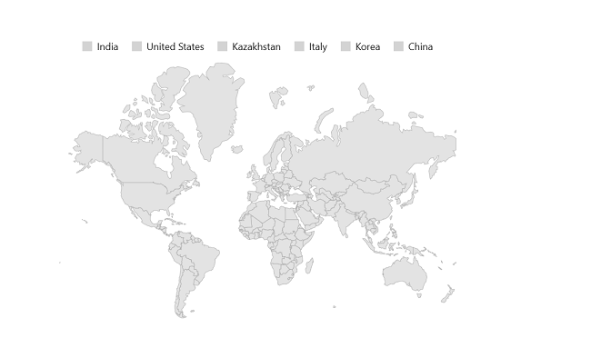
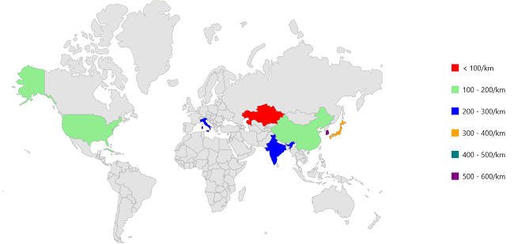

# Legend in MAUI Maps (SfMaps)

You can provide clear information on the data plotted on the map using legend.

## Shape legend

You can show shape legend by setting the [`MapShapeLayer.Legend`](https://pub.dev/documentation/syncfusion_flutter_maps/latest/maps/MapLegend-class.html) property as `MapLegend(LegendSourceType.Shape)`. By default, the legend item's text is rendered based on the value of [`ShapeDataField`](https://pub.dev/documentation/syncfusion_flutter_maps/latest/maps/MapShapeSource/shapeDataField.html) property. The default value of the [`Legend`](https://pub.dev/documentation/syncfusion_flutter_maps/latest/maps/MapLegend-class.html) property is `null` and hence the legend will not be shown by default.





     <map:SfMaps>
            <map:SfMaps.Layer>
                <map:MapShapeLayer 
                        ShapesSource="https://cdn.syncfusion.com/maps/map-data/world-map.json" DataSource="{Binding Data}"
                                   PrimaryValuePath="Continent" ShapeDataField="continent" ShapeStroke="Gray" ShapeColorValuePath="Population">

                        <map:MapShapeLayer.ColorMappings>
                            <map:EqualColorMapping  Color="Gray" Value="58" Text="Asia" />
                            <map:EqualColorMapping  Color="Gray" Value="51" Text="Africa" />
                            <map:EqualColorMapping  Color="Gray" Value="41" Text="Europe" />
                            <map:EqualColorMapping  Color="Gray" Value="48" Text="North America" />
                            <map:EqualColorMapping  Color="Gray" Value="23" Text="South America" />
                            <map:EqualColorMapping  Color="Gray" Value="14" Text="Australia" />
                        </map:MapShapeLayer.ColorMappings>

                        <map:MapShapeLayer.Legend>
                            <map:MapLegend SourceType="Shape" Placement="Top" />
                        </map:MapShapeLayer.Legend>
                        
                </map:MapShapeLayer>
           </map:SfMaps.Layer>
    </map:SfMaps>





public MainPage()
    {
        InitializeComponent();
        ObservableCollection<Model> Data = new ObservableCollection<Model>();
        Data.Add(new Model("Asia", 51));
        Data.Add(new Model("Africa", 58));
        Data.Add(new Model("Europe", 48));
        Data.Add(new Model("North America", 41));
        Data.Add(new Model("South America", 14));
        Data.Add(new Model("Australia", 23));

        SfMaps maps = new SfMaps();
        MapShapeLayer layer = new MapShapeLayer();

        layer.ShapesSource = MapSource.FromUri(new Uri("https://cdn.syncfusion.com/maps/map-data/world-map.json"));
        layer.DataSource = Data;
        layer.PrimaryValuePath = "Continent";
        layer.ShapeDataField = "continent";
        layer.ShapeStroke = Colors.DarkGrey;

        layer.ColorMappings.Add(new EqualColorMapping() { Color = Colors.Gray, Value = "51", Text = "Asia"});
        layer.ColorMappings.Add(new EqualColorMapping() { Color = Colors.Gray, Value = "58", Text = "Africa" });
        layer.ColorMappings.Add(new EqualColorMapping() { Color = Colors.Gray, Value = "41", Text = "Europe" });
        layer.ColorMappings.Add(new EqualColorMapping() { Color = Colors.Gray, Value = "48", Text = "North America" });
        layer.ColorMappings.Add(new EqualColorMapping() { Color = Colors.Gray, Value = "14", Text = "South America" });
        layer.ColorMappings.Add(new EqualColorMapping() { Color = Colors.Gray, Value = "23", Text = "Australia" });

        MapLegend legendSet = new MapLegend();
        legendSet.SourceType = LegendSourceType.Shape;
        legendSet.Placement = Syncfusion.Maui.Core.LegendPlacement.Top;
        layer.Legend = legendSet;

        maps.Layer = layer;
        this.Content = maps;
    }
   public class Model
    {
        public Model(string continent, int population)
        {
            Continent = continent;
            Population = population;
        }
        public String Continent { get; set; }
        public int Population { get; set; }
    }





## Bubble legend

You can show bubble legend by setting the [`MapShapeLayer.Legend`](https://pub.dev/documentation/syncfusion_flutter_maps/latest/maps/MapLegend-class.html) property as `MapLegend(SourceType.Bubble)`. By default, the legend item's text is rendered based on the value of [`ShapeDataField`](https://pub.dev/documentation/syncfusion_flutter_maps/latest/maps/MapShapeSource/shapeDataField.html) property.





     <map:SfMaps>
            <map:SfMaps.Layer>
                <map:MapShapeLayer 
                        ShapesSource="https://cdn.syncfusion.com/maps/map-data/world-map.json" DataSource="{Binding Data}"  ShowBubbles="True" PrimaryValuePath="Continent" ShapeDataField="name" ShapeStroke="Gray" ShapeColorValuePath="Population">

                        <map:MapShapeLayer.BubbleSettings>
                            <map:MapBubbleSettings ColorValuePath="Population"  SizeValuePath="Population"  Opacity="1" MinSize="30"  MaxSize="80">

                            <map:MapBubbleSettings.ColorMappings>
                                <map:EqualColorMapping  Color="LightGreen" Value="58" Text="Asia" />
                                <map:EqualColorMapping  Color="LightGreen" Value="51" Text="Africa" />
                                <map:EqualColorMapping  Color="LightGreen" Value="41" Text="Europe" />
                                <map:EqualColorMapping  Color="LightGreen" Value="48" Text="North America" />
                                <map:EqualColorMapping  Color="LightGreen" Value="23" Text="South America" />
                                <map:EqualColorMapping  Color="LightGreen" Value="14" Text="Australia" />
                            </map:MapBubbleSettings.ColorMappings>
                        
                        <map:MapShapeLayer.Legend>
                            <map:MapLegend SourceType="Bubble" Placement="Top" />
                        </map:MapShapeLayer.Legend>
                        
                </map:MapShapeLayer>
           </map:SfMaps.Layer>
    </map:SfMaps>





public MainPage()
    {
        this.BindingContext = this;
        InitializeComponent();
        ObservableCollection<Model> Data = new ObservableCollection<Model>();
        Data.Add(new Model("Asia", 51));
        Data.Add(new Model("Africa", 58));
        Data.Add(new Model("Europe", 48));
        Data.Add(new Model("North America", 41));
        Data.Add(new Model("South America", 14));
        Data.Add(new Model("Australia", 23));

        SfMaps maps = new SfMaps();
        MapShapeLayer layer = new MapShapeLayer();

        layer.ShapesSource = MapSource.FromUri(new Uri("https://cdn.syncfusion.com/maps/map-data/world-map.json"));
        layer.DataSource = Data;
        layer.PrimaryValuePath = "Continent";
        layer.ShapeDataField = "continent";
        layer.ShowBubbles = true;
        layer.ShapeStroke = Colors.DarkGrey;
       
        MapBubbleSettings bubbleSetting = new MapBubbleSettings()
        {
            ColorValuePath = "Population",
            SizeValuePath = "Population",
            Opacity = 1,
            MinSize = 30,
            MaxSize = 80,
        };

        bubbleSetting.ColorMappings.Add(new EqualColorMapping() { Color = Colors.LightGreen, Value = "51", Text = "Asia"});
        bubbleSetting.ColorMappings.Add(new EqualColorMapping() { Color = Colors.LightGreen, Value = "58", Text = "Africa" });
        bubbleSetting.ColorMappings.Add(new EqualColorMapping() { Color = Colors.LightGreen, Value = "41", Text = "Europe" });
        bubbleSetting.ColorMappings.Add(new EqualColorMapping() { Color = Colors.LightGreen, Value = "48", Text = "North America" });
        bubbleSetting.ColorMappings.Add(new EqualColorMapping() { Color = Colors.LightGreen, Value = "14", Text = "South America" });
        bubbleSetting.ColorMappings.Add(new EqualColorMapping() { Color = Colors.LightGreen, Value = "23", Text = "Australia" });

        layer.BubbleSettings = bubbleSetting;
        MapLegend legendSet = new MapLegend();
        legendSet.SourceType = LegendSourceType.Bubble;
        legendSet.Placement = Syncfusion.Maui.Core.LegendPlacement.Top;
        layer.Legend = legendSet;

        maps.Layer = layer;
        this.Content = maps;
    }
   public class Model
    {
        public Model(string continent, int population)
        {
            Continent = continent;
            Population = population;
        }
        public String Continent { get; set; }
        public int Population { get; set; }
    }





## Legend text customization

You can customize the legend item's text style using the [`MapLegend.TextStyle`](https://pub.dev/documentation/syncfusion_flutter_maps/latest/maps/MapLegend/textStyle.html) property.





     <map:SfMaps>
            <map:SfMaps.Layer>
                <map:MapShapeLayer 
                        ShapesSource="https://cdn.syncfusion.com/maps/map-data/world-map.json" DataSource="{Binding Data}"
                                   PrimaryValuePath="Continent" ShapeDataField="name" ShapeStroke="Gray" ShapeColorValuePath="Population">

                        <map:MapShapeLayer.ColorMappings>
                            <map:RangeColorMapping  Color="Red" From="0" To="100" Text="0 - 100/km" />
                            <map:RangeColorMapping  Color="LightGreen" From="101" To="200"  Text="100 - 200/km" />
                            <map:RangeColorMapping  Color="Blue" From="201" To="300"  Text="200 - 300/km" />
                            <map:RangeColorMapping  Color="Orange" From="301" To="400"  Text="300 - 400/km" />
                            <map:RangeColorMapping  Color="Teal" From="401" To="500"  Text="400 - 500/km" />
                            <map:RangeColorMapping  Color="Purple" From="501" To="600"  Text="500 - 600/km" />
                        </map:MapShapeLayer.ColorMappings>

                        <map:MapShapeLayer.Legend>
                            <map:MapLegend SourceType="Shape" Placement="Top">
                                <map:MapLegend.TextStyle>
                                    <map:MapLabelStyle
                                        FontSize="16"
                                        TextColor="Black"
                                        FontFamily="Times"
                                        FontAttributes="Italic"/>
                                </map:MapLegend.TextStyle>
                            </map:MapLegend>    
                        </map:MapShapeLayer.Legend>
                        
                </map:MapShapeLayer>
           </map:SfMaps.Layer>
    </map:SfMaps>





    public MainPage()
    {
        InitializeComponent();
        ObservableCollection<Model> Data = new ObservableCollection<Model>();
        Data.Add(new Model("India", 205));
        Data.Add(new Model("United States", 190));
        Data.Add(new Model("Kazakhstan", 37));
        Data.Add(new Model("Italy", 201));
        Data.Add(new Model("Korea", 512));
        Data.Add(new Model("Japan", 335));
        Data.Add(new Model("Cuba", 103));
        Data.Add(new Model("China", 148));

        SfMaps maps = new SfMaps();
        MapShapeLayer layer = new MapShapeLayer();

        layer.ShapesSource = MapSource.FromUri(new Uri("https://cdn.syncfusion.com/maps/map-data/world-map.json"));
        layer.DataSource = Data;
        layer.PrimaryValuePath = "Continent";
        layer.ShapeDataField = "name";
        layer.ShapeStroke = Colors.DarkGrey;
        layer.ShapeColorValuePath = "Population";

        layer.ColorMappings.Add(new RangeColorMapping() { Color = Colors.Red, From = 0, To = 100, Text = "< 100/km" });
        layer.ColorMappings.Add(new RangeColorMapping() { Color = Colors.LightGreen, From = 101, To = 200, Text = "100 - 200/km" });
        layer.ColorMappings.Add(new RangeColorMapping() { Color = Colors.Blue, From = 201, To = 300, Text = "200 - 300/km" });
        layer.ColorMappings.Add(new RangeColorMapping() { Color = Colors.Orange, From = 301, To = 400, Text = "300 - 400/km" });
        layer.ColorMappings.Add(new RangeColorMapping() { Color = Colors.Teal, From = 401, To = 500, Text = "400 - 500/km" });
        layer.ColorMappings.Add(new RangeColorMapping() { Color = Colors.Purple, From = 501, To = 600, Text = "500 - 600/km" });

        MapLegend legendSet = new MapLegend();
        legendSet.SourceType = LegendSourceType.Shape;
        legendSet.Placement = Syncfusion.Maui.Core.LegendPlacement.Top;

        MapLabelStyle mapLabelStyle = new MapLabelStyle();
        mapLabelStyle.TextColor = Colors.Black;
        mapLabelStyle.FontSize = 16;
        mapLabelStyle.FontFamily = "Times";
        mapLabelStyle.FontAttributes = FontAttributes.Italic;
       
        
        legendSet.TextStyle = mapLabelStyle;
        layer.Legend = legendSet;

        maps.Layer = layer;
        this.Content = maps;
    }
   public class Model
    {
        public Model(string continent, int population)
        {
            Continent = continent;
            Population = population;
        }
        public String Continent { get; set; }
        public int Population { get; set; }
       
    }





## Position

You can position the legend items in different directions using the [`MapLegend.Placement`](https://pub.dev/documentation/syncfusion_flutter_maps/latest/maps/MapLegend/position.html) property. The default value of the [`Placement`](https://pub.dev/documentation/syncfusion_flutter_maps/latest/maps/MapLegend/position.html) property is `Placement.Top`. The possible values are `Left`, `Right`, `Top`, and `Bottom`.





     <map:SfMaps>
            <map:SfMaps.Layer>
                <map:MapShapeLayer 
                        ShapesSource="https://cdn.syncfusion.com/maps/map-data/world-map.json" DataSource="{Binding Data}"
                                   PrimaryValuePath="Continent" ShapeDataField="name" ShapeStroke="Gray" ShapeColorValuePath="Population">

                        <map:MapShapeLayer.ColorMappings>
                            <map:RangeColorMapping  Color="Red" From="0" To="100" Text="0 - 100/km" />
                            <map:RangeColorMapping  Color="LightGreen" From="101" To="200"  Text="100 - 200/km" />
                            <map:RangeColorMapping  Color="Blue" From="201" To="300"  Text="200 - 300/km" />
                            <map:RangeColorMapping  Color="Orange" From="301" To="400"  Text="300 - 400/km" />
                            <map:RangeColorMapping  Color="Teal" From="401" To="500"  Text="400 - 500/km" />
                            <map:RangeColorMapping  Color="Purple" From="501" To="600"  Text="500 - 600/km" />
                        </map:MapShapeLayer.ColorMappings>

                        <map:MapShapeLayer.Legend>
                            <map:MapLegend SourceType="Shape" Placement="Right" />
                        </map:MapShapeLayer.Legend>
                        
                </map:MapShapeLayer>
           </map:SfMaps.Layer>
    </map:SfMaps>





 public MainPage()
    {
        InitializeComponent();
        ObservableCollection<Model> Data = new ObservableCollection<Model>();
        Data.Add(new Model("India", 205));
        Data.Add(new Model("United States", 190));
        Data.Add(new Model("Kazakhstan", 37));
        Data.Add(new Model("Italy", 201));
        Data.Add(new Model("Korea", 512));
        Data.Add(new Model("Japan", 335));
        Data.Add(new Model("Cuba", 103));
        Data.Add(new Model("China", 148));

        SfMaps maps = new SfMaps();
        MapShapeLayer layer = new MapShapeLayer();

        layer.ShapesSource = MapSource.FromUri(new Uri("https://cdn.syncfusion.com/maps/map-data/world-map.json"));
        layer.DataSource = Data;
        layer.PrimaryValuePath = "Continent";
        layer.ShapeDataField = "name";
        layer.ShowBubbles = true;
        layer.ShapeStroke = Colors.DarkGrey;
        layer.ShapeColorValuePath = "Population";

        layer.ColorMappings.Add(new RangeColorMapping() { Color = Colors.Red, From = 0, To = 100, Text = "< 100/km" });
        layer.ColorMappings.Add(new RangeColorMapping() { Color = Colors.LightGreen, From = 101, To = 200, Text = "100 - 200/km" });
        layer.ColorMappings.Add(new RangeColorMapping() { Color = Colors.Blue, From = 201, To = 300, Text = "200 - 300/km" });
        layer.ColorMappings.Add(new RangeColorMapping() { Color = Colors.Orange, From = 301, To = 400, Text = "300 - 400/km" });
        layer.ColorMappings.Add(new RangeColorMapping() { Color = Colors.Teal, From = 401, To = 500, Text = "400 - 500/km" });
        layer.ColorMappings.Add(new RangeColorMapping() { Color = Colors.Purple, From = 501, To = 600, Text = "500 - 600/km" });

        MapLegend legendSet = new MapLegend();
        legendSet.SourceType = LegendSourceType.Shape;
        legendSet.Placement = Syncfusion.Maui.Core.LegendPlacement.Right;
        layer.Legend = legendSet;

        maps.Layer = layer;
        this.Content = maps;
    }
    public class Model
    {
        public Model(string continent, int population)
        {
            Continent = continent;
            Population = population;
        }
        public String Continent { get; set; }
        public int Population { get; set; }
    }





N> You can refer to our [MAUI Maps](https://www.syncfusion.com/flutter-widgets/flutter-maps) feature tour page for its groundbreaking feature representations. You can also explore our [MAUI Maps Legend example](https://flutter.syncfusion.com/#/maps/shape-layer/legend) that shows how to configure a Maps in MAUI.

