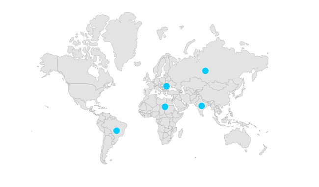
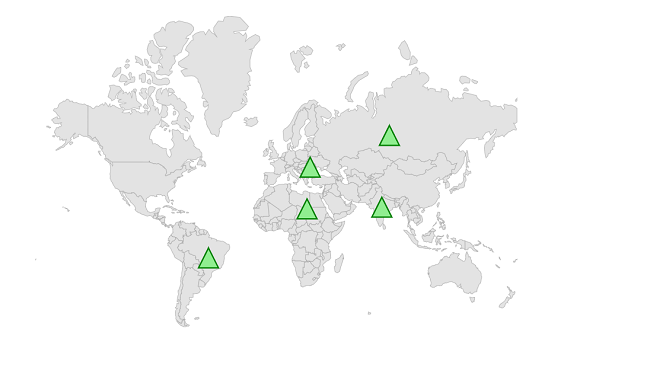
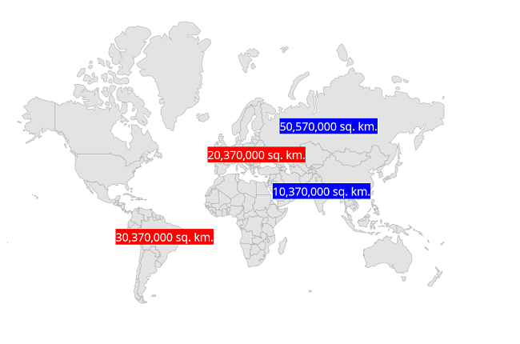

# Markers in MAUI Maps (SfMaps)

Markers can be used to denote the locations. It is possible to use the built-in symbols or display a custom widget at a specific latitude and longitude on a map.

## Adding markers

### Shape layer

You can show markers at any position on the map by providing latitude and longitude position to the [`MapMarker`](https://pub.dev/documentation/syncfusion_flutter_maps/latest/maps/MapMarker-class.html), which is the widget returns from the [`Markers`](https://pub.dev/documentation/syncfusion_flutter_maps/latest/maps/MapLayer/markerBuilder.html) property.





<map:SfMaps>
            <map:SfMaps.Layer>
                <map:MapShapeLayer 
                                   ShapesSource="https://cdn.syncfusion.com/maps/map-data/world-map.json"
                                   ShapeStroke="DarkGrey"
                                   ShowMarkerTooltip="True">
                    <map:MapShapeLayer.Markers>
                        <map:MapMarkerCollection>
                            <map:MapMarker
                              Latitude="20.5595" IconWidth="15" IconHeight="15" IconFill="#00ccff" IconType="Circle" 
                                 Longitude="22.9375" />
                            <map:MapMarker
                              Latitude="21.7679" IconWidth="15" IconHeight="15" IconFill=" #00ccff" IconType="Circle" 
                                 Longitude="78.8718"  />
                            <map:MapMarker
                              Latitude="133.7751" IconWidth="15" IconHeight="15" IconFill=" #00ccff" IconType="Circle" 
                                 Longitude="25.2744" />
                            <map:MapMarker
                              Latitude="60.2551" IconWidth="15" IconHeight="15" IconFill=" #00ccff" IconType="Circle" 
                                 Longitude="84.5260" />
                            <map:MapMarker
                              Latitude="195.4915" IconWidth="15" IconHeight="15" IconType="Circle" IconFill=" #00ccff"
                                 Longitude="-50.7832" />
                        </map:MapMarkerCollection>
                    </map:MapShapeLayer.Markers>
                </map:MapShapeLayer>
            </map:SfMaps.Layer>
        </map:SfMaps>





public MarkerTool()
	{
		InitializeComponent();
        SfMaps map = new SfMaps();
        MapShapeLayer layer = new MapShapeLayer();
        layer.ShapesSource = MapSource.FromUri(new Uri("https://cdn.syncfusion.com/maps/map-data/world-map.json"));

        MapMarker mapMarker = new MapMarker();
        mapMarker.Latitude = 20.5595;
        mapMarker.Longitude = 22.9375;
        mapMarker.IconHeight = 15;
        mapMarker.IconWidth = 15;
        mapMarker.IconType = MapIconType.Circle;
        mapMarker.IconFill = Color.FromRgb(0, 204, 255);

        MapMarker mapMarker1 = new MapMarker();
        mapMarker1.Latitude = 21.7679;
        mapMarker1.Longitude = 78.8718;
        mapMarker1.IconHeight = 15;
        mapMarker1.IconWidth = 15;
        mapMarker1.IconType = MapIconType.Circle;
        mapMarker1.IconFill = Color.FromRgb(0, 204, 255);

        MapMarker mapMarker2 = new MapMarker();
        mapMarker2.Latitude = 133.7751;
        mapMarker2.Longitude = 25.2744;
        mapMarker2.IconHeight = 15;
        mapMarker2.IconWidth = 15;
        mapMarker2.IconType = MapIconType.Circle;
        mapMarker2.IconFill = Color.FromRgb(0, 204, 255);

        MapMarker mapMarker3 = new MapMarker();
        mapMarker3.Latitude = 60.2551;
        mapMarker3.Longitude = 84.5260;
        mapMarker3.IconHeight = 15;
        mapMarker3.IconWidth = 15;
        mapMarker3.IconType = MapIconType.Circle;
        mapMarker3.IconFill = Color.FromRgb(0, 204, 255);

        MapMarker mapMarker4 = new MapMarker();
        mapMarker4.Latitude = 195.4915;
        mapMarker4.Longitude = -50.7832;
        mapMarker4.IconHeight = 15;
        mapMarker4.IconWidth = 15;
        mapMarker4.IconType = MapIconType.Circle;
        mapMarker4.IconFill = Color.FromRgb(0, 204, 255);

        MapMarkerCollection mapMarkers =new MapMarkerCollection();
        mapMarkers.Add(mapMarker);
        mapMarkers.Add(mapMarker1);
        mapMarkers.Add(mapMarker2);
        mapMarkers.Add(mapMarker3);
        mapMarkers.Add(mapMarker4);
        layer.Markers = mapMarkers;

        map.Layer = layer;
        map.Margin = new Thickness(0, 50, 0, 0);
        this.Content = map;
    }





N>
* Refer the [`markerBuilder`](https://pub.dev/documentation/syncfusion_flutter_maps/latest/maps/MapLayer/markerBuilder.html), for returning the [`MapMarker`](https://pub.dev/documentation/syncfusion_flutter_maps/latest/maps/MapMarker-class.html).
* Refer the [`controller`](https://pub.dev/documentation/syncfusion_flutter_maps/latest/maps/MapShapeLayer/controller.html), for dynamically updating the markers.

## Appearance customization

You can customize the built-in markers appearance using the [`IconType`](https://pub.dev/documentation/syncfusion_flutter_maps/latest/maps/MapMarker/iconType.html), [`IconFill`](https://pub.dev/documentation/syncfusion_flutter_maps/latest/maps/MapMarker/iconColor.html), [`IconStroke`](https://pub.dev/documentation/syncfusion_flutter_maps/latest/maps/MapMarker/iconStrokeColor.html), [`IconStrokeThickness`](https://pub.dev/documentation/syncfusion_flutter_maps/latest/maps/MapMarker/iconStrokeWidth.html), [`IconWidth`](https://pub.dev/documentation/syncfusion_flutter_maps/latest/maps/MapMarker/size.html) and [`IconHeight`](https://pub.dev/documentation/syncfusion_flutter_maps/latest/maps/MapMarker/size.html) properties of the [`MapMarker`](https://pub.dev/documentation/syncfusion_flutter_maps/latest/maps/MapMarker-class.html).

* **Alignment** - You can change the position of the marker from the given coordinate using the `HorizontalAlignment` and `VerticalAlignment` property. The default value is `MapAlignment.Center`. The available alignment options are `Center`, `Start`, `End`.
* **Offset** - You can adjust the marker position from the given coordinate using the `Offset` property. The default value of the `Offset` property is `Offset.zero`.

N>
* The default value of the [`IconType`](https://pub.dev/documentation/syncfusion_flutter_maps/latest/maps/MapMarker/iconType.html) is `MapIconType.circle`.
* The default value of the [`IconStrokeThickness`](https://pub.dev/documentation/syncfusion_flutter_maps/latest/maps/MapMarker/iconStrokeWidth.html) is `1.0`.
* The default value of the [`IconFill`](https://pub.dev/documentation/syncfusion_flutter_maps/latest/maps/MapMarker/iconColor.html) is `Colors.blue`.
* The default value of the [`IconWidth`](https://pub.dev/documentation/syncfusion_flutter_maps/latest/maps/MapMarker/size.html) and [`IconHeight`](https://pub.dev/documentation/syncfusion_flutter_maps/latest/maps/MapMarker/size.html) is `14.0`.





<map:SfMaps>
            <map:SfMaps.Layer>
                <map:MapShapeLayer 
                                   ShapesSource="https://cdn.syncfusion.com/maps/map-data/world-map.json"
                                   ShapeStroke="DarkGrey"
                                   ShowMarkerTooltip="True">
                    <map:MapShapeLayer.Markers>
                        <map:MapMarkerCollection>
                            <map:MapMarker
                              Latitude="20.5595" IconWidth="20" IconHeight="20" IconFill="LightGreen" IconType="Triangle" 
                                 Longitude="22.9375" IconStroke="Green" IconStrokeThickness="3" />
                            <map:MapMarker
                              Latitude="21.7679" IconWidth="20" IconHeight="20" IconFill=" LightGreen" IconType="Triangle" 
                                 Longitude="78.8718" IconStroke="Green" IconStrokeThickness="3" />
                            <map:MapMarker
                              Latitude="133.7751" IconWidth="20" IconHeight="20" IconFill=" LightGreen" IconType="Triangle" 
                                 Longitude="25.2744" IconStroke="Green" IconStrokeThickness="3" />
                            <map:MapMarker
                              Latitude="60.2551" IconWidth="20" IconHeight="20" IconFill=" LightGreen" IconType="Triangle" 
                                 Longitude="84.5260" IconStroke="Green" IconStrokeThickness="3"/>
                            <map:MapMarker
                              Latitude="195.4915" IconWidth="20" IconHeight="20" IconType="Triangle" IconFill=" LightGreen"
                                 Longitude="-50.7832" IconStroke="Green" IconStrokeThickness="3" />
                        </map:MapMarkerCollection>
                    </map:MapShapeLayer.Markers>
                </map:MapShapeLayer>
            </map:SfMaps.Layer>
        </map:SfMaps>





public MarkerTool()
	{
		InitializeComponent();
         SfMaps map = new SfMaps();
         MapShapeLayer layer = new MapShapeLayer();
         layer.ShapesSource = MapSource.FromUri(new Uri("https://cdn.syncfusion.com/maps/map-data/world-map.json"));

        MapMarker mapMarker = new MapMarker();
        mapMarker.Latitude = 20.5595;
        mapMarker.Longitude = 22.9375;
        mapMarker.IconHeight = 20;
        mapMarker.IconWidth = 20;
        mapMarker.IconType = MapIconType.Triangle;
        mapMarker.IconFill = Colors.LightGreen;
        mapMarker.IconStroke = Colors.Green;
        mapMarker.IconStrokeThickness = 3;

        MapMarker mapMarker1 = new MapMarker();
        mapMarker1.Latitude = 21.7679;
        mapMarker1.Longitude = 78.8718;
        mapMarker1.IconHeight = 20;
        mapMarker1.IconWidth = 20;
        mapMarker1.IconType = MapIconType.Triangle;
        mapMarker1.IconFill = Colors.LightGreen;
        mapMarker1.IconStroke = Colors.Green;
        mapMarker1.IconStrokeThickness = 3;

        MapMarker mapMarker2 = new MapMarker();
        mapMarker2.Latitude = 133.7751;
        mapMarker2.Longitude = 25.2744;
        mapMarker2.IconHeight = 20;
        mapMarker2.IconWidth = 20;
        mapMarker2.IconType = MapIconType.Triangle;
        mapMarker2.IconFill = Colors.LightGreen;
        mapMarker2.IconStroke = Colors.Green;
        mapMarker2.IconStrokeThickness = 3;

        MapMarker mapMarker3 = new MapMarker();
        mapMarker3.Latitude = 60.2551;
        mapMarker3.Longitude = 84.5260;
        mapMarker3.IconHeight = 20;
        mapMarker3.IconWidth = 20;
        mapMarker3.IconType = MapIconType.Triangle;
        mapMarker3.IconFill = Colors.LightGreen;
        mapMarker3.IconStroke = Colors.Green;
        mapMarker3.IconStrokeThickness = 3;

        MapMarker mapMarker4 = new MapMarker();
        mapMarker4.Latitude = 195.4915;
        mapMarker4.Longitude = -50.7832;
        mapMarker4.IconHeight = 20;
        mapMarker4.IconWidth = 20;
        mapMarker4.IconType = MapIconType.Triangle;
        mapMarker4.IconFill = Colors.LightGreen;
        mapMarker4.IconStroke = Colors.Green;
        mapMarker4.IconStrokeThickness = 3;

        MapMarkerCollection mapMarkers = new MapMarkerCollection();
        mapMarkers.Add(mapMarker);
        mapMarkers.Add(mapMarker1);
        mapMarkers.Add(mapMarker2);
        mapMarkers.Add(mapMarker3);
        mapMarkers.Add(mapMarker4);
        layer.Markers = mapMarkers;

        map.Layer = layer;
        this.Content = map;
    }





## Adding custom markers

You can show custom marker using the `MarkerTemplate` property of the [`MapShapeLayer`](https://pub.dev/documentation/syncfusion_flutter_maps/latest/maps/MapMarker-class.html) which returns the template to customize markers.




<ContentPage.Resources>
        <ResourceDictionary>
            <DataTemplate x:Key="LowPopulationTemplate">
                <StackLayout 
                      HorizontalOptions="StartAndExpand"
                      VerticalOptions="Center">
                    <Image Source="map.png"
                       HeightRequest="30"
                       WidthRequest="30"></Image>
                </StackLayout>
            </DataTemplate>
        </ResourceDictionary>
    </ContentPage.Resources>
     <map:SfMaps>
            <map:SfMaps.Layer>
                <map:MapShapeLayer 
                                   ShapesSource="https://cdn.syncfusion.com/maps/map-data/world-map.json"
                                   ShapeStroke="DarkGrey"
                                   MarkerTemplate="{StaticResource LowPopulationTemplate}"
                                   ShowMarkerTooltip="True">
                    <map:MapShapeLayer.Markers>
                        <map:MapMarkerCollection>
                            <map:MapMarker Latitude="20.5595" Longitude="22.9375"  />
                            <map:MapMarker Latitude="21.7679" Longitude="78.8718"  />
                            <map:MapMarker Latitude="133.7751"  Longitude="25.2744"  />
                            <map:MapMarker Latitude="60.2551" Longitude="84.5260" />
                            <map:MapMarker Latitude="195.4915"  Longitude="-50.7832"  />
                        </map:MapMarkerCollection>
                    </map:MapShapeLayer.Markers>
                </map:MapShapeLayer>
            </map:SfMaps.Layer>
        </map:SfMaps>





public MainPage()
    {
        InitializeComponent();
        SfMaps map = new SfMaps();
        MapShapeLayer layer = new MapShapeLayer();
        layer.ShapesSource = MapSource.FromUri(new Uri("https://cdn.syncfusion.com/maps/map-data/world-map.json"));

        MapMarker mapMarker = new MapMarker();
        mapMarker.Latitude = 20.5595;
        mapMarker.Longitude = 22.9375;

        MapMarker mapMarker1 = new MapMarker();
        mapMarker1.Latitude = 21.7679;
        mapMarker1.Longitude = 78.8718;

        MapMarker mapMarker2 = new MapMarker();
        mapMarker2.Latitude = 133.7751;
        mapMarker2.Longitude = 25.2744;

        MapMarker mapMarker3 = new MapMarker();
        mapMarker3.Latitude = 60.2551;
        mapMarker3.Longitude = 84.5260;

        MapMarker mapMarker4 = new MapMarker();
        mapMarker4.Latitude = 195.4915;
        mapMarker4.Longitude = -50.7832;

        MapMarkerCollection mapMarkers = new MapMarkerCollection();
        mapMarkers.Add(mapMarker);
        mapMarkers.Add(mapMarker1);
        mapMarkers.Add(mapMarker2);
        mapMarkers.Add(mapMarker3);
        mapMarkers.Add(mapMarker4);
        
        layer.Markers = mapMarkers;

        layer.MarkerTemplate = CreateDataTemplate();
        map.Layer = layer;
        map.Margin = new Thickness(0, 50, 0, 0);
        this.Content = map;
    }
    private DataTemplate CreateDataTemplate()
    {
        return new DataTemplate(() =>
        {
            var stackLayout = new StackLayout();
            var image = new Image { Source = "map.png", WidthRequest = 20, HeightRequest = 20 };
            stackLayout.Add(image);
            return new ViewCell { View = stackLayout };
        });
    }





## Customizing Data Templates in Marker ToolTip

Data template can be customized for items and headers of the control. The following code example shows the usage of DataTemplate.




<ContentPage.Resources>
        <ResourceDictionary>
            <DataTemplate x:Key="LowPopulationTemplate">
                <StackLayout 
                      HorizontalOptions="StartAndExpand"
                      VerticalOptions="Center">
                    <Image Source="map.png"
                       HeightRequest="30"
                       WidthRequest="30"></Image>
                </StackLayout>
            </DataTemplate>
        </ResourceDictionary>
    </ContentPage.Resources>
      <map:SfMaps>
            <map:SfMaps.Layer>
                <map:MapShapeLayer 
                                   ShapesSource="https://cdn.syncfusion.com/maps/map-data/world-map.json"
                                   ShapeStroke="DarkGrey"
                                   MarkerTemplate="{StaticResource LowPopulationTemplate}"
                                   ShowMarkerTooltip="True">
                      <map:MapShapeLayer.Markers>
                        <map:MapMarkerCollection>
                            <local:CustomMarker Name="South africa" Area="38,570,000 sq. km."  Latitude="20.5595" Longitude="22.9375"  />
                            <local:CustomMarker Name="India" Area="30,370,000 sq. km." Latitude="21.7679" Longitude="78.8718"  />
                            <local:CustomMarker Name="Europe" Area="20,370,000 sq. km." Latitude="133.7751"  Longitude="25.2744"  />
                            <local:CustomMarker Name="Asia" Area="50,570,000 sq. km." Latitude="60.2551" Longitude="84.5260" />
                            <local:CustomMarker Name="South America" Area="30,370,000 sq. km." Latitude="195.4915"  Longitude="-50.7832"  />
                        </map:MapMarkerCollection>
                    </map:MapShapeLayer.Markers>
                    <map:MapShapeLayer.MarkerTooltipTemplate>
                        <DataTemplate>
                            <Grid Padding="10" WidthRequest="150">
                                <Grid.RowDefinitions>
                                    <RowDefinition Height="Auto" />
                                    <RowDefinition Height="Auto" />
                                    <RowDefinition Height="Auto" />
                                </Grid.RowDefinitions>
                                <Grid.ColumnDefinitions>
                                    <ColumnDefinition Width="10"/>
                                    <ColumnDefinition Width="Auto"/>
                                </Grid.ColumnDefinitions>
                                <Image Source="flag.png" Grid.Column="0" Grid.Row="0" WidthRequest="20" HeightRequest="20"></Image>
                                <Label Text="{Binding Name}" TextColor="White"  Grid.Column="1" Grid.Row="0" Padding="10"/>
                                <BoxView Grid.Row="1" Grid.ColumnSpan="2" HeightRequest="2" />
                                <Label Grid.Row="2" Grid.ColumnSpan="2"  Text="{Binding Population}" TextColor="White" />
                            </Grid>
                        </DataTemplate>
                    </map:MapShapeLayer.MarkerTooltipTemplate>
                </map:MapShapeLayer>
            </map:SfMaps.Layer>
        </map:SfMaps>





 public MainPage()
    {
        InitializeComponent();
        
        SfMaps map = new SfMaps();
        MapShapeLayer layer = new MapShapeLayer();
        layer.ShapesSource = MapSource.FromUri(new Uri("https://cdn.syncfusion.com/maps/map-data/world-map.json"));

        CustomMarker customMarker = new CustomMarker();
        customMarker.Latitude = 20.5595;
        customMarker.Longitude = 22.9375;
        customMarker.Name = "South africa";
        customMarker.Area = "38,570,000 sq. km.";

        CustomMarker customMarker1 = new CustomMarker();
        customMarker1.Latitude = 21.7679;
        customMarker1.Longitude = 78.8718;
        customMarker.Name = "India";
        customMarker.Area = "30,370,000 sq. km.";

        CustomMarker customMarker2 = new CustomMarker();
        customMarker2.Latitude = 133.7751;
        customMarker2.Longitude = 25.2744;
        customMarker.Name = "Europe";
        customMarker.Area = "20,370,000 sq. km.";

        CustomMarker customMarker3 = new CustomMarker();
        customMarker3.Latitude = 60.2551;
        customMarker3.Longitude = 84.5260;
        customMarker.Name = "Asia";
        customMarker.Area = "50,570,000 sq. km.";

        CustomMarker customMarker4 = new CustomMarker();
        customMarker4.Latitude = 195.4915;
        customMarker4.Longitude = -50.7832;
        customMarker.Name = "South America";
        customMarker.Area = "30,370,000 sq. km.";

        MapMarkerCollection mapMarkers = new MapMarkerCollection();
        mapMarkers.Add(customMarker);
        mapMarkers.Add(customMarker1);
        mapMarkers.Add(customMarker2);
        mapMarkers.Add(customMarker3);
        mapMarkers.Add(customMarker4);

        layer.Markers = mapMarkers;

        layer.MarkerTemplate = CreateDataTemplate();
        layer.MarkerTooltipTemplate = CreateToolTip();
        layer.ShowMarkerTooltip = true;
        map.Layer = layer;
        map.Margin = new Thickness(0, 50, 0, 0);
        this.Content = map;
    }
    private DataTemplate CreateDataTemplate()
    {
        return new DataTemplate(() =>
        {
            var stackLayout = new StackLayout();
            var image = new Image { Source = "map.png", WidthRequest = 20, HeightRequest = 20 };
            stackLayout.Add(image);
            return new ViewCell { View = stackLayout };
        });
    }
    private DataTemplate CreateToolTip()
    {
        return new DataTemplate(() =>
        {
            var grid = new Grid()
            {
                RowDefinitions =
                {
                  new RowDefinition { Height = GridLength.Auto },
                  new RowDefinition{ Height = GridLength.Auto },
                  new RowDefinition { Height = GridLength.Auto }
                },
                ColumnDefinitions =
                {
                    new ColumnDefinition{ Width = 10},
                    new ColumnDefinition{ Width = GridLength.Auto},
                }
            };
            grid.WidthRequest = 120;
            var image = new Image { Source = "flag.png", WidthRequest = 20, HeightRequest = 20 };
            grid.SetRow(image, 0); grid.SetColumn(image, 0);
            var label = new Label { FontAttributes = FontAttributes.Bold, TextColor = Colors.White, Padding = 5, Text = "Asia", };
            grid.SetRow(label, 0); grid.SetColumn(label, 1);
            var boxView = new BoxView { BackgroundColor = Colors.Red, HeightRequest = 1, };
            grid.SetRow(boxView, 1); grid.SetColumnSpan(boxView, 2);
            var areaLabel = new Label { FontAttributes = FontAttributes.Bold, Text = "10,180,000 sq. km.", TextColor = Colors.White, };
            grid.SetRow(areaLabel, 2); grid.SetColumnSpan(areaLabel, 2);
            grid.Children.Add(image);
            grid.Children.Add(label);
            grid.Children.Add(boxView);
            grid.Children.Add(areaLabel);
            return new ViewCell { View = grid };
        });
    }

public class CustomMarker : MapMarker
{
	public string Name { get; set; }
    public string Area { get; set; }
}




## Customizing Data Templates selector in Markers

Data template selector can be customized for template of the control.You can change the template dynamically. The following code example shows the usage of DataTemplate selector.





<ContentPage.Resources>
        <ResourceDictionary>
            <DataTemplate x:Key="HighPopulationTemplate">
                <StackLayout IsClippedToBounds="false"
                         HorizontalOptions="StartAndExpand"
                         VerticalOptions="Center"
                         HeightRequest="30">
                    <Label Text="Hi"
                           Scale="1"
                           TextColor="White"
                           BackgroundColor="Red"
                           HorizontalOptions="StartAndExpand"
                       VerticalOptions="Center"
                       HeightRequest="15"
                       WidthRequest="23" />
                </StackLayout>
            </DataTemplate>
            <DataTemplate x:Key="LowPopulationTemplate">
                <StackLayout IsClippedToBounds="false"
                         HorizontalOptions="StartAndExpand"
                         VerticalOptions="Center"
                         HeightRequest="30">
                    <Label Text="Hi"
                           Scale="1"
                           TextColor="Red"
                           BackgroundColor="Yellow"
                           HorizontalOptions="StartAndExpand"
                       VerticalOptions="Center"
                       HeightRequest="15"
                       WidthRequest="23" />
                </StackLayout>
            </DataTemplate>
        </ResourceDictionary>
    </ContentPage.Resources>

<map:SfMaps>
                <map:SfMaps.Layer>
                    <map:MapShapeLayer x:Name="layer"
                                   ShapesSource="https://cdn.syncfusion.com/maps/map-data/world-map.json"
                                   ShapeStroke="DarkGrey" >
                        <map:MapShapeLayer.Markers>
                        <map:MapMarkerCollection>
                            <map:MapMarker Latitude="20.5595" Longitude="22.9375"  />
                            <map:MapMarker Latitude="21.7679" Longitude="78.8718"  />
                            <map:MapMarker Latitude="133.7751"  Longitude="25.2744"  />
                            <map:MapMarker Latitude="60.2551" Longitude="84.5260" />
                            <map:MapMarker Latitude="195.4915"  Longitude="-50.7832"  />
                        </map:MapMarkerCollection>
                    </map:MapShapeLayer.Markers>
                    </map:MapShapeLayer>
                </map:SfMaps.Layer>
            </map:SfMaps>
            <Button Text="Change marker Template" Clicked="Button_Clicked_1" />





    private void Button_Clicked_1(object sender, EventArgs e)
    {
        if (layer.MarkerTemplate != null && layer.MarkerTemplate.Equals(Resources["LowPopulationTemplate"] as DataTemplate))
        {
            layer.MarkerTemplate = Resources["HighPopulationTemplate"] as DataTemplate;
        }
        else
        {
            layer.MarkerTemplate = Resources["LowPopulationTemplate"] as DataTemplate;
        }
    }    





N> You can refer to our [MAUI Maps](https://www.syncfusion.com/flutter-widgets/flutter-maps) feature tour page for its groundbreaking feature representations. You can also explore our [MAUI Maps Markers example](https://flutter.syncfusion.com/#/maps/shape-layer/marker) that shows how to configure a Maps in MAUI.