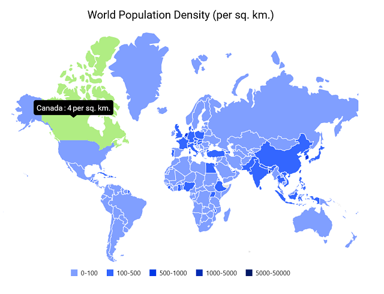

# .NET MAUI Maps (SfMaps) Overview

The [.NET MAUI Maps](https://www.syncfusion.com/maui-controls/maui-maps) control is a powerful data visualization component that displays statistical information for a geographical area. It has highly interactive and customizable features such as selection, tooltip, legends, markers, bubbles, and color mapping. Using the Maps control, you can generate maps for population density, sales, political boundaries, weather, elections, and routes.

### Features

* **[Shape layer](https://help.syncfusion.com/maui/maps/getting-started#add-shape-layer-maps-elements)** - Visualize the map area from GeoJSON or shapefile input data.

* **[Data labels](https://help.syncfusion.com/maui/maps/data-labels)** - Provide identification for shapes by displaying their names. If the labels exceed the shape bounds, they are trimmed or hidden.

* **[Markers](https://help.syncfusion.com/maui/maps/markers)** - Denote a location with built-in symbols or display custom content at a specific latitude and longitude on a map.

* **[Bubbles](https://help.syncfusion.com/maui/maps/bubble)** - Add information to shapes such as population density or number of users. Bubbles can be rendered in different colors and sizes based on the data values of their assigned shapes.

* **[Shape selection](https://help.syncfusion.com/maui/maps/selection)** - Choose a shape to highlight a region on a map. You can use the event for performing action during the shape selection.

* **[Legend](https://help.syncfusion.com/maui/maps/legend)** -  Use legends to provide clear information on the data plotted in a map.

* **[Colors](https://help.syncfusion.com/maui/maps/shape)** - Categorize the shapes on a map by assigning their colors based on their underlying values. It is possible to set the shape color for a specific value or for a range of values.

* **[Tooltip](https://help.syncfusion.com/maui/maps/tooltip)** - Display additional information about shapes, markers, and bubbles using a customizable tooltip on a map.

N> You can get the samples in the [GitHub](https://github.com/syncfusion/maui-demos) link