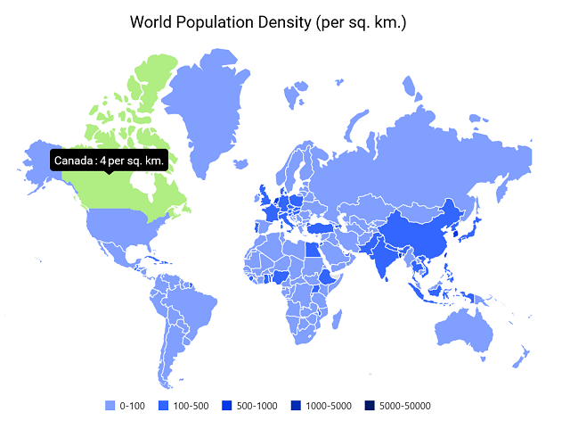

# .NET MAUI Maps (SfMaps) Overview

The [.NET MAUI Maps](https://www.syncfusion.com/maui-controls/maui-maps) control is a powerful data visualization component that displays statistical information for a geographical area. It has highly interactive and customizable features such as selection, tooltip, legends, markers, bubbles, and color mapping. Using the Maps control, you can generate maps for population density, sales, political boundaries, weather, elections, and routes.

## Business use cases

- Analytics applications that require visualizing geographical data such as population density, sales distribution, or regional performance.  
- Logistics and tracking systems that display locations, routes, and real-time movement on maps.  
- Business intelligence dashboards that use map-based visualization for better decision-making insights.  
- Applications that require location tagging and highlighting specific regions or points of interest. 

## Key features

- **[Shape layer](https://help.syncfusion.com/maui/maps/getting-started#add-shape-layer-maps-elements)** allows visualizing geographical regions using GeoJSON or shapefile data.
- **[Data labels](https://help.syncfusion.com/maui/maps/data-labels)** allows displaying names or information for map shapes with intelligent layout handling.
- **[Markers](https://help.syncfusion.com/maui/maps/markers)** allows placing symbols or custom UI elements at specific latitude and longitude locations.
- **[Bubbles](https://help.syncfusion.com/maui/maps/bubble)** allows representing data values using varying sizes and colors of bubbles.
- **[Shape selection](https://help.syncfusion.com/maui/maps/selection)** allows highlighting specific regions and handling selection interactions.
- **[Legend](https://help.syncfusion.com/maui/maps/legend)** allows explaining the data representation used in the map for better understanding.
- **[Colors](https://help.syncfusion.com/maui/maps/shape)** allows categorizing and styling regions based on underlying data values or ranges.
- **[Tooltip](https://help.syncfusion.com/maui/maps/tooltip)** allows displaying additional information for shapes, markers, and bubbles interactively.

## Related controls

- [Treemap](https://help.syncfusion.com/maui/treemap/overview) for displaying hierarchical and comparative data visualization.
- [DataGrid](https://help.syncfusion.com/maui/datagrid/overview) for managing and presenting location-based data in tabular format.
- [Cartesian Chart](https://help.syncfusion.com/maui/cartesian-charts/overview) for visualizing geographical or statistical data trends using interactive charts.

## See Also

Explore further resources:

- [Getting Started](https://help.syncfusion.com/maui/maps/getting-started) shows a step‑by‑step guide to begin using the Maps control.  
- [Vector Layers](https://help.syncfusion.com/maui/maps/vector-layers/line-layer) lets you add line, polygon, or point layers to visualize geographic data clearly.  
- [Markers](https://help.syncfusion.com/maui/maps/markers) explains how to add markers and customize location visualization.  
- [UI Kit](https://www.syncfusion.com/demos/maui#maui-ui-control) provides interactive demos and ready‑made UI examples.

## Resources

<!-- Card 1 -->
<a href="https://www.syncfusion.com/maui-controls/maui-maps" class="form-card" target="_blank">
  

    <h3 class="form-title">Feature Tour</h3>
    

      Walk through highlights and core capabilities.
    

  

</a>
<!-- Card 2 -->
<a href="https://github.com/syncfusion/maui-demos/tree/master/MAUI/Maps" class="form-card" target="_blank">
  

    <h3 class="form-title">Showcase Samples</h3>
    

      Explore sample scenarios for real apps.
    

  

</a>
<!-- Card 3 -->
<a href="https://www.syncfusion.com/tutorial-videos/maui/maps" class="form-card" target="_blank">
  

    <h3 class="form-title">Tutorial Videos</h3>
    

      Step‑by‑step guidance through video tutorials.
    

  

</a>
<!-- Card 4 -->
<a href="https://support.syncfusion.com/kb/cross-platforms/category/76" class="form-card" target="_blank">
  

    <h3 class="form-title">Explore KB's</h3>
    

      Find quick solutions and step‑by‑step guidance.
    

  

</a>
<!-- Card 5 -->
<a href="https://www.syncfusion.com/blogs/category/net-maui" class="form-card" target="_blank">
  

    <h3 class="form-title">Explore Blogs</h3>
    

      Read insights, tutorials, and developer journeys.
    

  

</a>
