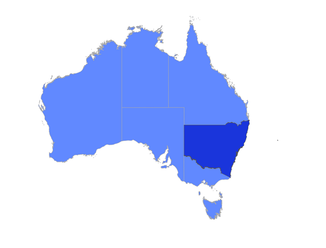

# Shape Selection in .NET MAUI Maps (SfMaps)

You can select a shape to highlight that area on a map. You can use the event for performing any action during shape selection.

## Enable shape selection

You can enable shape selection on a map using the [`EnableSelection`](https://help.syncfusion.com/cr/maui/Syncfusion.Maui.Maps.MapShapeLayer.html#Syncfusion_Maui_Maps_MapShapeLayer_EnableSelection) property. The Selection allows you to select only one shape at a time. You can select a shape by tapping it. By default, the selection is disabled.

The [`ShapeSelected`](https://help.syncfusion.com/cr/maui/Syncfusion.Maui.Maps.MapShapeLayer.html#Syncfusion_Maui_Maps_MapShapeLayer_ShapeSelected) event is used to perform any action on shape selected when the user is selects it by tapping or clicking or by programmatically.





<map:SfMaps>
   <map:SfMaps.Layer>
      <map:MapShapeLayer x:Name="layer"
                         ShapesSource="https://cdn.syncfusion.com/maps/map-data/australia.json"
                         SelectedShapeFill="#6189ff"
                         ShapeSelected="layer_ShapeSelected" 
                         ShapeStrokeThickness="0"
                         EnableSelection="True">
		
       </map:MapShapeLayer>
   </map:SfMaps.Layer>
</map:SfMaps>





public class MainPage()
{
	public MainPage()
	{
		InitializeComponent();
		layer.ShapesSource = MapSource.FromUri(new Uri("https://cdn.syncfusion.com/maps/map-data/australia.json"));
	}
}

private void layer_ShapeSelected(object sender, ShapeSelectedEventArgs e)
{
    
}





## Appearance customization

You can customize the below appearance of the selected shape as below.

* **SelectedShapeFill** - Change the background color of the selected shape using the [`SelectedShapeFill`](https://help.syncfusion.com/cr/maui/Syncfusion.Maui.Maps.MapShapeLayer.html#Syncfusion_Maui_Maps_MapShapeLayer_SelectedShapeFill) property. If the [`SelectedShapeFill`](https://help.syncfusion.com/cr/maui/Syncfusion.Maui.Maps.MapShapeLayer.html#Syncfusion_Maui_Maps_MapShapeLayer_SelectedShapeFill) is null, then the saturated color of the shape will be applied. If the [`SelectedShapeFill`](https://help.syncfusion.com/cr/maui/Syncfusion.Maui.Maps.MapShapeLayer.html#Syncfusion_Maui_Maps_MapShapeLayer_SelectedShapeFill) is Transparent, then the UI changes will not occur.
* **SelectedShapeStrokeThickness** - Change the stroke width of the selected shape using the [`SelectedShapeStrokeThickness`](https://help.syncfusion.com/cr/maui/Syncfusion.Maui.Maps.MapShapeLayer.html#Syncfusion_Maui_Maps_MapShapeLayer_SelectedShapeStrokeThickness) property.
* **SelectedShapeStroke** - Change the stroke color of the selected shape using the [`SelectedShapeStroke`](https://help.syncfusion.com/cr/maui/Syncfusion.Maui.Maps.MapShapeLayer.html#Syncfusion_Maui_Maps_MapShapeLayer_SelectedShapeStroke) property.





<map:SfMaps>
   <map:SfMaps.Layer>
      <map:MapShapeLayer ShapesSource="https://cdn.syncfusion.com/maps/map-data/australia.json"
                         DataSource="{Binding Data}" 
                         PrimaryValuePath="Country"
                         ShapeDataField="STATE_NAME" 
                         ShapeColorValuePath = "Color" 
                         SelectedShapeFill="#1a35db"
                         SelectedShapeStroke="DarkGrey" 
                         SelectedShapeStrokeThickness="1" 
                         EnableSelection="True">

       </map:MapShapeLayer>
   </map:SfMaps.Layer>
</map:SfMaps>





	public MainPage()
    {
        InitializeComponent();
		
        ViewModel viewModel = new ViewModel();
        this.BindingContext = viewModel;

        MapShapeLayer layer = new MapShapeLayer();
        layer.ShapesSource = MapSource.FromUri(new Uri("https://cdn.syncfusion.com/maps/map-data/australia.json"));
        layer.DataSource = viewModel.Data;
        layer.PrimaryValuePath = "Country";
        layer.ShapeDataField = "STATE_NAME";
        layer.SelectedShapeFill = Color.FromRgb(26, 53, 219);
        layer.SelectedShapeStroke = Colors.DarkGray;
        layer.SelectedShapeStrokeThickness = 1;
        layer.EnableSelection = true;
        layer.ShapeColorValuePath = "Color";

        SfMaps maps = new SfMaps();
        maps.Layer = layer;
        this.Content = maps;
    }
	
	public class ViewModel
	{
		public ObservableCollection<Model> Data { get; set; }
		
		public ViewModel()
		{
			Data = new ObservableCollection<Model>();
			Data.Add(new Model(
               "New South Wales",
               Color.FromRgb(97, 137, 255)));
            Data.Add(new Model(
                "Northern Territory",
                Color.FromRgb(97, 137, 255)));
            Data.Add(new Model(
                "Victoria",
                Color.FromRgb(97, 137, 255)));
            Data.Add(new Model(
                "Tasmania",
                Color.FromRgb(97, 137, 255)));
            Data.Add(new Model(
                "Queensland",
                Color.FromRgb(97, 137, 255)));
            Data.Add(new Model(
                "Western Australia",
                Color.FromRgb(97, 137, 255)));
            Data.Add(new Model(
                "South Australia",
                Color.FromRgb(97, 137, 255)));
        }
	}
    
	public class Model
	{
		public String Country { get; set; }
		public Color Color { get; set; }
		
		public Model(string country, Color color)
		{
			Country = country;
			Color = color;
		}
	}





>Note: You can refer to our [.NET MAUI Maps](https://www.syncfusion.com/maui-controls/maui-maps) feature tour page for its groundbreaking feature representations. You can also explore our [.NET MAUI Maps Selection example](https://github.com/syncfusion/maui-demos/) that shows how to configure a Maps in .NET MAUI.