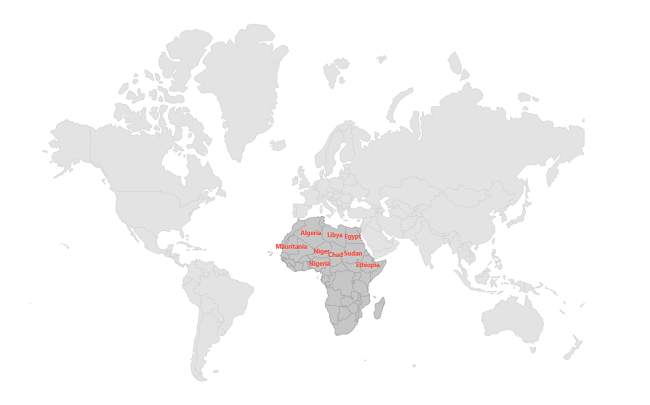

# Shape Sublayer in .NET MAUI Maps (SfMaps)

The shape sublayer is where geographical rendering will happen for the sublayer. This is similar to the main [`MapShapeLayer`](https://help.syncfusion.com/cr/maui/Syncfusion.Maui.Maps.MapShapeLayer.html) rendering. This section explains adding a shape sublayer on the shape layer.

To learn more about the .NET MAUI Maps shape sub layer, you can check the following video.

 <iframe id='MAUIMapsVideoTutorial' src="https://www.youtube.com/embed/CuI9bkGhBu8?start=52"></iframe>

## Shape sublayer on tile layer

The [`Sublayers`](https://help.syncfusion.com/cr/maui/Syncfusion.Maui.Maps.MapLayer.html#Syncfusion_Maui_Maps_MapLayer_Sublayers) in `MapTileLayer` contains collection of [`MapSublayer`](https://help.syncfusion.com/cr/maui/Syncfusion.Maui.Maps.MapSublayer.html).The actual geographical rendering is done in the each [`MapShapeSublayer`](https://help.syncfusion.com/cr/maui/Syncfusion.Maui.Maps.MapShapeSublayer.html). The [`ShapesSource`](https://help.syncfusion.com/cr/maui/Syncfusion.Maui.Maps.MapShapeSublayer.html#Syncfusion_Maui_Maps_MapShapeSublayer_ShapesSource) property of the [`MapShapeSublayer`](https://help.syncfusion.com/cr/maui/Syncfusion.Maui.Maps.MapShapeSublayer.html) is of type [`MapSource`](https://help.syncfusion.com/cr/maui/Syncfusion.Maui.Maps.MapSource.html). The path of the .json file which contains the GeoJSON data has to be set to the [`ShapesSource`](https://help.syncfusion.com/cr/maui/Syncfusion.Maui.Maps.MapShapeSublayer.html#Syncfusion_Maui_Maps_MapShapeSublayer_ShapesSource).

The [`ShapeDataField`](https://help.syncfusion.com/cr/maui/Syncfusion.Maui.Maps.MapShapeSublayer.html#Syncfusion_Maui_Maps_MapShapeSublayer_ShapeDataField) property of the [`ShapesSource`](https://help.syncfusion.com/cr/maui/Syncfusion.Maui.Maps.MapShapeSublayer.html#Syncfusion_Maui_Maps_MapShapeSublayer_ShapesSource) is used to refer the unique field name in the .json file to identify each shapes.





<maps:SfMaps>
    <maps:SfMaps.Layer>
        <maps:MapTileLayer UrlTemplate="https://tile.openstreetmap.org/{z}/{x}/{y}.png">
            <maps:MapTileLayer.Sublayers>
                <maps:MapShapeSublayer ShapesSource="https://cdn.syncfusion.com/maps/map-data/africa.json"
                                       ShapeStroke="DarkGrey"
                                       ShapeFill="#c6c6c6">
                </maps:MapShapeSublayer>
            </maps:MapTileLayer.Sublayers>
        </maps:MapTileLayer>
    </maps:SfMaps.Layer>
</maps:SfMaps>





SfMaps map = new SfMaps();
MapTileLayer tileLayer = new MapTileLayer();
tileLayer.UrlTemplate = "https://tile.openstreetmap.org/{z}/{x}/{y}.png";
MapShapeSublayer sublayer = new MapShapeSublayer();
sublayer.ShapesSource = MapSource.FromUri(new Uri("https://cdn.syncfusion.com/maps/map-data/africa.json"));
sublayer.ShapeFill = Color.FromRgb(198, 198, 198);
sublayer.ShapeStroke = Colors.DarkGrey;
tileLayer.Sublayers.Add(sublayer);
map.Layer = tileLayer;
this.Content = map;





N>
* Refer the `MapTileLayer`, for adding tile layer in [`SfMaps`](https://help.syncfusion.com/cr/maui/Syncfusion.Maui.Maps.SfMaps.html).

## Shape sublayer on shape layer

The [`Sublayers`](https://help.syncfusion.com/cr/maui/Syncfusion.Maui.Maps.MapLayer.html#Syncfusion_Maui_Maps_MapLayer_Sublayers) in [`MapShapeLayer`](https://help.syncfusion.com/cr/maui/Syncfusion.Maui.Maps.MapShapeLayer.html) contains collection of [`MapSublayer`](https://help.syncfusion.com/cr/maui/Syncfusion.Maui.Maps.MapSublayer.html).The actual geographical rendering is done in the each [`MapShapeSublayer`](https://help.syncfusion.com/cr/maui/Syncfusion.Maui.Maps.MapShapeSublayer.html). The [`ShapesSource`](https://help.syncfusion.com/cr/maui/Syncfusion.Maui.Maps.MapShapeSublayer.html#Syncfusion_Maui_Maps_MapShapeSublayer_ShapesSource) property of the [`MapShapeSublayer`](https://help.syncfusion.com/cr/maui/Syncfusion.Maui.Maps.MapShapeSublayer.html) is of type [`MapSource`](https://help.syncfusion.com/cr/maui/Syncfusion.Maui.Maps.MapSource.html). The path of the .json file which contains the GeoJSON data has to be set to the [`ShapesSource`](https://help.syncfusion.com/cr/maui/Syncfusion.Maui.Maps.MapShapeSublayer.html#Syncfusion_Maui_Maps_MapShapeSublayer_ShapesSource).

The [`ShapeDataField`](https://help.syncfusion.com/cr/maui/Syncfusion.Maui.Maps.MapShapeSublayer.html#Syncfusion_Maui_Maps_MapShapeSublayer_ShapeDataField) property of the [`ShapesSource`](https://help.syncfusion.com/cr/maui/Syncfusion.Maui.Maps.MapShapeSublayer.html#Syncfusion_Maui_Maps_MapShapeSublayer_ShapesSource) is used to refer the unique field name in the .json file to identify each shapes.





 <map:SfMaps>
     <map:SfMaps.Layer>
         <map:MapShapeLayer ShapesSource="https://cdn.syncfusion.com/maps/map-data/world-map.json">
             <map:MapShapeLayer.Sublayers>
                 <map:MapShapeSublayer ShapesSource="https://cdn.syncfusion.com/maps/map-data/africa.json" />
             </map:MapShapeLayer.Sublayers>
         </map:MapShapeLayer>
     </map:SfMaps.Layer>
 </map:SfMaps>





SfMaps maps = new SfMaps();
MapShapeLayer layer = new MapShapeLayer();
layer.ShapesSource = MapSource.FromUri(new Uri("https://cdn.syncfusion.com/maps/map-data/world-map.json"));
MapShapeSublayer sublayer = new MapShapeSublayer();
sublayer.ShapesSource = MapSource.FromUri(new Uri("https://cdn.syncfusion.com/maps/map-data/africa.json"));
sublayer.ShapeFill = Color.FromRgb(198, 198, 198);
sublayer.ShapeStroke = Colors.DarkGrey;
layer.Sublayers.Add(sublayer);
maps.Layer = layer;
this.Content = maps;





N> Refer the [`MapShapeLayer`](https://help.syncfusion.com/cr/maui/Syncfusion.Maui.Maps.MapShapeLayer.html), for adding shape layer in [`SfMaps`](https://help.syncfusion.com/cr/maui/Syncfusion.Maui.Maps.SfMaps.html).

## Color and stroke color

You can change the color, stroke color and stroke thickness of the shape sublayer using the [`ShapeFill`](https://help.syncfusion.com/cr/maui/Syncfusion.Maui.Maps.MapShapeSublayer.html#Syncfusion_Maui_Maps_MapShapeSublayer_ShapeFill), [`ShapeStroke`](https://help.syncfusion.com/cr/maui/Syncfusion.Maui.Maps.MapShapeSublayer.html#Syncfusion_Maui_Maps_MapShapeSublayer_ShapeStroke) and [`ShapeStrokeThickness`](https://help.syncfusion.com/cr/maui/Syncfusion.Maui.Maps.MapShapeSublayer.html#Syncfusion_Maui_Maps_MapShapeSublayer_ShapeStrokeThickness) properties.





<map:SfMaps>
    <map:SfMaps.Layer>
        <map:MapShapeLayer ShapesSource="https://cdn.syncfusion.com/maps/map-data/world-map.json">
            <map:MapShapeLayer.Sublayers>
                <map:MapShapeSublayer ShapeStroke="#226ac1"
                                      ShapeFill="#bbdefa"
                                      ShapesSource="https://cdn.syncfusion.com/maps/map-data/africa.json" />
            </map:MapShapeLayer.Sublayers>
        </map:MapShapeLayer>
    </map:SfMaps.Layer>
</map:SfMaps>





SfMaps maps = new SfMaps();
MapShapeLayer layer = new MapShapeLayer();
layer.ShapesSource = MapSource.FromUri(new Uri("https://cdn.syncfusion.com/maps/map-data/world-map.json"));
MapShapeSublayer sublayer = new MapShapeSublayer();
sublayer.ShapesSource = MapSource.FromUri(new Uri("https://cdn.syncfusion.com/maps/map-data/africa.json"));
sublayer.ShapeFill = Color.FromRgb(187, 222, 250);
sublayer.ShapeStroke = Color.FromRgb(34, 106, 193);
layer.Sublayers.Add(sublayer);
maps.Layer = layer;
this.Content = maps;





## Equal color mapping

You can apply color to the sublayer shape by comparing a value from the [`ColorMappings`](https://help.syncfusion.com/cr/maui/Syncfusion.Maui.Maps.ColorMapping.html) with the [`EqualColorMapping.Value`](https://help.syncfusion.com/cr/maui/Syncfusion.Maui.Maps.EqualColorMapping.html#Syncfusion_Maui_Maps_EqualColorMapping_Value). For the matched values, the [`EqualColorMapping.color`](https://help.syncfusion.com/cr/maui/Syncfusion.Maui.Maps.ColorMapping.html#Syncfusion_Maui_Maps_ColorMapping_Color) will be applied to the respective shapes.





<map:SfMaps>
    <map:SfMaps.Layer>
        <map:MapShapeLayer ShapesSource="https://cdn.syncfusion.com/maps/map-data/world-map.json">
            <map:MapShapeLayer.Sublayers>
                <map:MapShapeSublayer ShapesSource="https://cdn.syncfusion.com/maps/map-data/africa.json"
                                      ShapeStroke="DarkGrey"
                                      ShapeFill="#c6c6c6"
                                      ShapeDataField="name"
                                      PrimaryValuePath="State"
                                      ShapeColorValuePath="Storage">
                    <map:MapShapeSublayer.ColorMappings>
                        <map:EqualColorMapping Color="Red"
                                               Value="Low" />
                        <map:EqualColorMapping Color="Green"
                                               Value="High" />
                    </map:MapShapeSublayer.ColorMappings>
                </map:MapShapeSublayer>
            </map:MapShapeLayer.Sublayers>
        </map:MapShapeLayer>
    </map:SfMaps.Layer>
</map:SfMaps>





public MainPage()
{
	InitializeComponent();
    ViewModel viewModel = new ViewModel();
    this.BindingContext = viewModel;
    SfMaps maps = new SfMaps();
    MapShapeLayer layer = new MapShapeLayer();
    layer.ShapesSource = MapSource.FromUri(new Uri("https://cdn.syncfusion.com/maps/map-data/world-map.json"));
    MapShapeSublayer sublayer = new MapShapeSublayer();
    sublayer.ShapesSource = MapSource.FromUri(new Uri("https://cdn.syncfusion.com/maps/map-data/africa.json"));
    sublayer.ShapeFill = Color.FromRgb(198, 198, 198);
    sublayer.ShapeStroke = Colors.DarkGrey;
    sublayer.DataSource = viewModel.Data;
    sublayer.PrimaryValuePath = "State";
    sublayer.ShapeDataField = "name";
    sublayer.ShapeColorValuePath = "Storage";

    EqualColorMapping colorMapping = new EqualColorMapping();
    colorMapping.Color = Colors.Red;
    colorMapping.Value = "Low";

    EqualColorMapping colorMapping1 = new EqualColorMapping();
    colorMapping1.Color = Colors.Green;
    colorMapping1.Value = "High";

    sublayer.ColorMappings.Add(colorMapping);
    sublayer.ColorMappings.Add(colorMapping1);

    layer.Sublayers.Add(sublayer);
    maps.Layer = layer;
    this.Content = maps;
}

public class ViewModel
{
    public ObservableCollection<Model> Data { get; set; }

    public ViewModel()
    {
        Data = new ObservableCollection<Model>();
        Data.Add(new Model("Algeria", "Low"));
        Data.Add(new Model("Nigeria", "High"));
        Data.Add(new Model("Libya", "High")); ;
    }
}

public class Model
{
    public String State { get; set; }
    public String Storage { get; set; }

    public Model(string state, string storage)
    {
        State = state;
        Storage = storage;
    }
}





## Range color mapping

You can apply color to the sublayer shapes based on whether the value from [`ColorMappings`](https://help.syncfusion.com/cr/maui/Syncfusion.Maui.Maps.ColorMapping.html) falls within the [`RangeColorMapping.From`](https://help.syncfusion.com/cr/maui/Syncfusion.Maui.Maps.RangeColorMapping.html#Syncfusion_Maui_Maps_RangeColorMapping_From) and [`RangeColorMapping.To`](https://help.syncfusion.com/cr/maui/Syncfusion.Maui.Maps.RangeColorMapping.html#Syncfusion_Maui_Maps_RangeColorMapping_To). Then, the [`RangeColorMapping.Color`](https://help.syncfusion.com/cr/maui/Syncfusion.Maui.Maps.ColorMapping.html#Syncfusion_Maui_Maps_ColorMapping_Color) will be applied to the respective shapes.





<map:SfMaps>
    <map:SfMaps.Layer>
        <map:MapShapeLayer ShapesSource="https://cdn.syncfusion.com/maps/map-data/world-map.json">
            <map:MapShapeLayer.Sublayers>
                <map:MapShapeSublayer ShapesSource="https://cdn.syncfusion.com/maps/map-data/africa.json"
                                      ShapeStroke="DarkGrey"
                                      ShapeFill="#c6c6c6"
                                      ShapeDataField="name"
                                      PrimaryValuePath="State"
                                      ShapeColorValuePath="Count">
                    <map:MapShapeSublayer.ColorMappings>
                        <map:RangeColorMapping Color="Red"
                                               From="0" To="100" />
                        <map:RangeColorMapping Color="Green"
                                               From="101" To="300" />
                    </map:MapShapeSublayer.ColorMappings>
                </map:MapShapeSublayer>
            </map:MapShapeLayer.Sublayers>
        </map:MapShapeLayer>
    </map:SfMaps.Layer>
</map:SfMaps>





public MainPage()
{
	InitializeComponent();
    ViewModel viewModel = new ViewModel();
    this.BindingContext = viewModel;
    SfMaps maps = new SfMaps();
    MapShapeLayer layer = new MapShapeLayer();
    layer.ShapesSource = MapSource.FromUri(new Uri("https://cdn.syncfusion.com/maps/map-data/world-map.json"));
    MapShapeSublayer sublayer = new MapShapeSublayer();
    sublayer.ShapesSource = MapSource.FromUri(new Uri("https://cdn.syncfusion.com/maps/map-data/africa.json"));
    sublayer.ShapeFill = Color.FromRgb(198, 198, 198);
    sublayer.ShapeStroke = Colors.DarkGrey;
    sublayer.DataSource = viewModel.Data;
    sublayer.PrimaryValuePath = "State";
    sublayer.ShapeDataField = "name";
    sublayer.ShapeColorValuePath = "Count";

    RangeColorMapping colorMapping = new RangeColorMapping();
    colorMapping.Color = Colors.Red;
    colorMapping.From = 0;
    colorMapping.To = 100;

    RangeColorMapping colorMapping1 = new RangeColorMapping();
    colorMapping.Color = Colors.Green;
    colorMapping.From = 101;
    colorMapping.To = 300;

    sublayer.ColorMappings.Add(colorMapping);
    sublayer.ColorMappings.Add(colorMapping1);

    layer.Sublayers.Add(sublayer);
    maps.Layer = layer;
    this.Content = maps;
}

public class ViewModel
{
    public ObservableCollection<Model> Data { get; set; }

    public ViewModel()
    {
        Data = new ObservableCollection<Model>();
        Data.Add(new Model("Algeria", 196));
        Data.Add(new Model("Nigeria", 280));
        Data.Add(new Model("Libya", 45)); 
    }
}

public class Model
{
    public String State { get; set; }
    public double Count { get; set; }

    public Model(string state, double count)
    {
        State = state;
        Count = count;
    }
}





## Enable data labels and its customization

You can enable data labels to the shape sublayer using the [`ShowDataLabels`](https://help.syncfusion.com/cr/maui/Syncfusion.Maui.Maps.MapShapeLayer.html#Syncfusion_Maui_Maps_MapShapeLayer_ShowDataLabels) and [`DataLabelPath`](https://help.syncfusion.com/cr/maui/Syncfusion.Maui.Maps.MapDataLabelSettings.html#Syncfusion_Maui_Maps_MapDataLabelSettings_DataLabelPath) properties. The [`ShowDataLabels`](https://help.syncfusion.com/cr/maui/Syncfusion.Maui.Maps.MapShapeLayer.html#Syncfusion_Maui_Maps_MapShapeLayer_ShowDataLabels) is used to control the visibility of data labels, the [`DataLabelPath`](https://help.syncfusion.com/cr/maui/Syncfusion.Maui.Maps.MapDataLabelSettings.html#Syncfusion_Maui_Maps_MapDataLabelSettings_DataLabelPath) is used to decide which underline property has to be displayed as data labels. The default value of [`ShowDataLabels`](https://help.syncfusion.com/cr/maui/Syncfusion.Maui.Maps.MapShapeLayer.html#Syncfusion_Maui_Maps_MapShapeLayer_ShowDataLabels) is `false`. 





<map:SfMaps>
    <map:SfMaps.Layer>
        <map:MapShapeLayer ShapesSource="https://cdn.syncfusion.com/maps/map-data/world-map.json">
            <map:MapShapeLayer.Sublayers>
                <map:MapShapeSublayer ShapesSource="https://cdn.syncfusion.com/maps/map-data/africa.json"
                                      ShapeStroke="DarkGrey"
                                      ShapeFill="#c6c6c6"
                                      ShapeDataField="name"
                                      PrimaryValuePath="State"
                                      ShowDataLabels="True">
                    <map:MapShapeSublayer.DataLabelSettings>
                        <map:MapDataLabelSettings DataLabelPath="State" >
                        <map:MapDataLabelSettings.DataLabelStyle>
                            <map:MapLabelStyle FontSize="6"
                                               TextColor="#ff4e41"
                                               FontAttributes="Bold" />
                        </map:MapDataLabelSettings.DataLabelStyle>
                            </map:MapDataLabelSettings>
                    </map:MapShapeSublayer.DataLabelSettings>
                </map:MapShapeSublayer>
            </map:MapShapeLayer.Sublayers>
        </map:MapShapeLayer>
    </map:SfMaps.Layer>
</map:SfMaps>





public SublayerDataLabels()
{
	InitializeComponent();
    ViewModel viewModel = new ViewModel();
    this.BindingContext = viewModel;
    SfMaps maps = new SfMaps();
    MapShapeLayer layer = new MapShapeLayer();
    layer.ShapesSource = MapSource.FromUri(new Uri("https://cdn.syncfusion.com/maps/map-data/world-map.json"));
    MapShapeSublayer sublayer = new MapShapeSublayer();
    sublayer.ShapesSource = MapSource.FromUri(new Uri("https://cdn.syncfusion.com/maps/map-data/africa.json"));
    sublayer.ShapeFill = Color.FromRgb(198, 198, 198);
    sublayer.ShapeStroke = Colors.DarkGray;
    sublayer.DataSource = viewModel.Data;
    sublayer.PrimaryValuePath = "State";
    sublayer.ShapeDataField = "name";
    sublayer.ShowDataLabels = true;

    sublayer.DataLabelSettings = new MapDataLabelSettings()
    {
        DataLabelPath = "State",
        DataLabelStyle = new MapLabelStyle()
        {
            FontSize = 6,
            FontAttributes = FontAttributes.Bold,
            TextColor = Color.FromRgb(255, 78, 65)
        },
    };

    layer.Sublayers.Add(sublayer);
    maps.Layer = layer;
    this.Content = maps;
}

public class ViewModel
{
    public ObservableCollection<Model> Data { get; set; }

    public ViewModel()
    {
        Data = new ObservableCollection<Model>();
        Data.Add(new Model("Algeria", Colors.Green));
        Data.Add(new Model("Libya", Colors.Teal));
        Data.Add(new Model("Egypt", Colors.Blue));
        Data.Add(new Model("Niger", Colors.Indigo));
        Data.Add(new Model("Nigeria", Colors.MediumPurple));
        Data.Add(new Model("Chad", Colors.LightGreen));
        Data.Add(new Model("Sudan", Colors.IndianRed));
        Data.Add(new Model("Mauritania", Colors.Orange));
        Data.Add(new Model("South Sudan", Colors.Lime));
        Data.Add(new Model("Ethiopia", Colors.GreenYellow));
    }
}

public class Model
{
    public String State { get; set; }
    public Color Color { get; set; }

    public Model(string state, Color color)
    {
        State = state;
        Color = color;
    }
}





## Add bubbles to the sublayer

You can enable bubbles to the shape sublayer using the [`ShowBubbles`](https://help.syncfusion.com/cr/maui/Syncfusion.Maui.Maps.MapShapeSublayer.html#Syncfusion_Maui_Maps_MapShapeSublayer_ShowBubbles). You can customize bubbles appearance using the [`BubbleSettings`](https://help.syncfusion.com/cr/maui/Syncfusion.Maui.Maps.MapShapeSublayer.html#Syncfusion_Maui_Maps_MapShapeSublayer_BubbleSettings). This property is used to specify the value based on which the bubble's size has to be rendered.

N> Refer the [`Bubbles`](https://help.syncfusion.com/maui/maps/bubble) section, to know more about the bubbles customization.





<map:SfMaps>
    <map:SfMaps.Layer>
        <map:MapShapeLayer ShapesSource="https://cdn.syncfusion.com/maps/map-data/world-map.json">
            <map:MapShapeLayer.Sublayers>
                <map:MapShapeSublayer ShapesSource="https://cdn.syncfusion.com/maps/map-data/africa.json"
                                      ShapeStroke="DarkGrey"
                                      ShapeFill="#c6c6c6"
                                      ShapeDataField="name"
                                      DataSource="{Binding Data}"
                                      PrimaryValuePath="State"
                                      ShowBubbles="True">
                    <map:MapShapeSublayer.BubbleSettings>
                        <map:MapBubbleSettings ColorValuePath="Color"
                                               SizeValuePath="Size"
                                               MinSize="10"
                                               MaxSize="20">
                        </map:MapBubbleSettings>
                    </map:MapShapeSublayer.BubbleSettings>
                </map:MapShapeSublayer>
            </map:MapShapeLayer.Sublayers>
        </map:MapShapeLayer>
    </map:SfMaps.Layer>
</map:SfMaps>





public BubblesSubUG()
{
    InitializeComponent();
    ViewModel viewModel = new ViewModel();
    this.BindingContext = viewModel;
    SfMaps maps = new SfMaps();
    MapShapeLayer layer = new MapShapeLayer();
    layer.ShapesSource = MapSource.FromUri(new Uri("https://cdn.syncfusion.com/maps/map-data/world-map.json"));
    MapShapeSublayer sublayer = new MapShapeSublayer();
    sublayer.ShapesSource = MapSource.FromUri(new Uri("https://cdn.syncfusion.com/maps/map-data/africa.json"));
    sublayer.ShapeFill = Color.FromRgb(198, 198, 198);
    sublayer.ShapeStroke = Colors.DarkGray;
    sublayer.DataSource = viewModel.Data;
    sublayer.PrimaryValuePath = "State";
    sublayer.ShapeDataField = "name";
    sublayer.ShowBubbles = true;

    MapBubbleSettings bubbleSetting = new MapBubbleSettings()
    {
        ColorValuePath = "Color",
        SizeValuePath = "Size",
        MinSize = 10,
        MaxSize = 20
    };

    sublayer.BubbleSettings = bubbleSetting;
    layer.Sublayers.Add(sublayer);
    maps.Layer = layer;
    this.Content = maps;
}

public class ViewModel
{
    public ObservableCollection<Model> Data { get; set; }

    public ViewModel()
    {
        Data = new ObservableCollection<Model>();
        Data.Add(new Model("Algeria", Color.FromRgb(80, 175, 80), 36232));
        Data.Add(new Model("Libya", Color.FromRgb(64, 150, 137), 34121));
        Data.Add(new Model("Egypt", Color.FromRgb(48, 150, 243), 43453));
        Data.Add(new Model("Mali", Color.FromRgb(157, 59, 176), 28123));
        Data.Add(new Model("Niger", Color.FromRgb(63, 81, 181), 40111));
        Data.Add(new Model("Nigeria", Color.FromRgb(225, 87, 249), 30232));
        Data.Add(new Model("Chad", Color.FromRgb(139, 194, 74), 48132));
        Data.Add(new Model("Sudan", Color.FromRgb(238, 79, 79), 52654));
        Data.Add(new Model("Mauritania", Color.FromRgb(243, 151, 62), 42231));
        Data.Add(new Model("South Sudan", Color.FromRgb(198, 198, 198), 40421));
        Data.Add(new Model("Ethiopia", Color.FromRgb(109, 240, 174), 27198));
    }
}

public class Model
{
    public String State { get; set; }
    public Color Color { get; set; }
    public double Size { get; set; }

    public Model(string state, Color color, double size)
    {
        State = state;
        Color = color;
        Size = size;
    }
}





## Enable tooltip for shape sublayer

You can enable tooltip for the shape sublayer using the [`ShowShapeTooltip`](https://help.syncfusion.com/cr/maui/Syncfusion.Maui.Maps.MapShapeSublayer.html#Syncfusion_Maui_Maps_MapShapeSublayer_ShowShapeTooltip) property.

N> It is applicable for shape layer.

N> Refer the [`Tooltip`](https://help.syncfusion.com/maui/maps/tooltip) section to know more about the tooltip customization.





<map:SfMaps>
    <map:SfMaps.Layer>
        <map:MapShapeLayer ShapesSource="https://cdn.syncfusion.com/maps/map-data/world-map.json">
            <map:MapShapeLayer.Sublayers>
                <map:MapShapeSublayer ShapesSource="https://cdn.syncfusion.com/maps/map-data/africa.json"
                                      ShapeStroke="DarkGrey"
                                      ShapeFill="#c6c6c6"
                                      ShapeDataField="name"
                                      DataSource="{Binding Data}"
                                      PrimaryValuePath="State"
                                      ShapeColorValuePath="Color"
                                      ShowShapeTooltip="True">
                    <map:MapShapeSublayer.ShapeTooltipTemplate>
                        <DataTemplate>
                            <Grid>
                                <Grid.RowDefinitions>
                                    <RowDefinition />
                                    <RowDefinition />
                                </Grid.RowDefinitions>
                                <Grid.ColumnDefinitions>
                                    <ColumnDefinition />
                                    <ColumnDefinition />
                                </Grid.ColumnDefinitions>
                                <Label Text="State:"
                                       TextColor="White"
                                       Grid.Row="0" />
                                <Label Grid.Row="0"
                                       Grid.Column="1"
                                       Padding="5,0,0,0"
                                       Text="{Binding DataItem.State}"
                                       TextColor="White" />
                                <Label Text="Population :"
                                       TextColor="White"
                                       Grid.Column="0"
                                       Grid.Row="1" />
                                <Label Grid.Row="1"
                                       Grid.Column="1"
                                       Padding="5,0,0,0"
                                       Text="{Binding DataItem.Size}"
                                       TextColor="White" />
                            </Grid>
                        </DataTemplate>
                    </map:MapShapeSublayer.ShapeTooltipTemplate>
                </map:MapShapeSublayer>
            </map:MapShapeLayer.Sublayers>
            <map:MapShapeLayer.ZoomPanBehavior>
                <map:MapZoomPanBehavior ZoomLevel="2" />
            </map:MapShapeLayer.ZoomPanBehavior>
        </map:MapShapeLayer>
    </map:SfMaps.Layer>
</map:SfMaps>





public SelectionUG()
{
	InitializeComponent();
    ViewModel viewModel = new ViewModel();
    this.BindingContext = viewModel;
    SfMaps maps = new SfMaps();
    MapShapeLayer layer = new MapShapeLayer();
    layer.ShapesSource = MapSource.FromUri(new Uri("https://cdn.syncfusion.com/maps/map-data/world-map.json"));
    MapZoomPanBehavior zoomPanBehavior = new MapZoomPanBehavior();
    zoomPanBehavior.ZoomLevel = 2;
    layer.ZoomPanBehavior = zoomPanBehavior;
    MapShapeSublayer sublayer = new MapShapeSublayer();
    sublayer.ShapesSource = MapSource.FromUri(new Uri("https://cdn.syncfusion.com/maps/map-data/africa.json"));
    sublayer.ShapeFill = Color.FromRgb(198, 198, 198);
    sublayer.ShapeStroke = Colors.DarkGray;
    sublayer.DataSource = viewModel.Data;
    sublayer.PrimaryValuePath = "State";
    sublayer.ShapeDataField = "name";
    sublayer.ShapeColorValuePath = "Color";
    sublayer.ShowShapeTooltip = true;
    sublayer.ShapeTooltipTemplate = CreateDataTemplate();
    layer.Sublayers.Add(sublayer);
    maps.Layer = layer;
    this.Content = maps;
}

private DataTemplate CreateDataTemplate()
{
    return new DataTemplate(() =>
    {
        var grid = new Grid()
        {
            RowDefinitions =
            {
              new RowDefinition (),
              new RowDefinition(),
            },
            ColumnDefinitions =
            {
                new ColumnDefinition(),
                new ColumnDefinition(),
            }
        };
        var stateLabel = new Label
        {
            TextColor = Colors.White,
            Text = "State",
            Padding = 5
        };
        grid.SetRow(stateLabel, 0); grid.SetColumn(stateLabel, 0);
        var stateValue = new Label
        {
            TextColor = Colors.White,
            Padding = 5
        };
        Binding binding = new Binding();
        binding.Source = grid.BindingContext;
        binding.Path = nameof(MapTooltipInfo.DataItem) + "." + nameof(Model.State);
        stateValue.SetBinding(Label.TextProperty, binding);
        grid.SetRow(stateValue, 0); grid.SetColumn(stateValue, 1);
        
        var populationLabel = new Label
        {
            TextColor = Colors.White,
            Text = "Population",
            Padding = 5
        };
    grid.SetRow(populationLabel, 1);
    grid.SetColumn(populationLabel, 0);
    var populationValue = new Label
    {
        TextColor = Colors.White,
        Padding = 5
    };
    grid.SetRow(populationValue, 2);
    grid.SetColumn(populationValue, 2);
    Binding binding1 = new Binding();
    binding1.Source = grid.BindingContext;
    binding1.Path = nameof(MapTooltipInfo.DataItem) + "." + nameof(Model.Size);
    populationValue.SetBinding(Label.TextProperty, binding1);
    grid.Children.Add(stateLabel);
    grid.Children.Add(stateValue);
    grid.Children.Add(populationLabel);
    grid.Children.Add(populationValue);
    return new ViewCell { View = grid };
});

public class ViewModel
{
    public ObservableCollection<Model> Data { get; set; }

    public ViewModel()
    {
        Data = new ObservableCollection<Model>();
        Data.Add(new Model("Algeria", Color.FromRgb(80, 175, 80), 36232));
        Data.Add(new Model("Libya", Color.FromRgb(64, 150, 137), 34121));
        Data.Add(new Model("Egypt", Color.FromRgb(48, 150, 243), 43453));
        Data.Add(new Model("Mali", Color.FromRgb(157, 59, 176), 28123));
        Data.Add(new Model("Niger", Color.FromRgb(63, 81, 181), 40111));
        Data.Add(new Model("Nigeria", Color.FromRgb(225, 87, 249), 30232));
        Data.Add(new Model("Chad", Color.FromRgb(139, 194, 74), 48132));
        Data.Add(new Model("Sudan", Color.FromRgb(238, 79, 79), 52654));
        Data.Add(new Model("Mauritania", Color.FromRgb(243, 151, 62), 42231));
        Data.Add(new Model("South Sudan", Color.FromRgb(198, 198, 198), 40421));
        Data.Add(new Model("Ethiopia", Color.FromRgb(109, 240, 174), 27198));
    }
}

public class Model
{
    public String State { get; set; }
    public Color Color { get; set; }
    public double Size { get; set; }

    public Model(string state, Color color, double size)
    {
        State = state;
        Color = color;
        Size = size;
    }
}





## Selection

You can enable shape selection on a map using the [`EnableSelection`](https://help.syncfusion.com/cr/maui/Syncfusion.Maui.Maps.MapShapeSublayer.html#Syncfusion_Maui_Maps_MapShapeSublayer_EnableSelection) property. The Selection allows you to select only one shape at a time. You can select a shape by tapping it. By default, the selection is disabled.

The [`ShapeSelected`](https://help.syncfusion.com/cr/maui/Syncfusion.Maui.Maps.MapShapeSublayer.html#Syncfusion_Maui_Maps_MapShapeSublayer_ShapeSelected) event is used to perform any action on shape selected when the user is selects it by tapping or clicking or by programmatically.

N> It is applicable for shape layer.

N> Refer the [`Shape selection`](https://help.syncfusion.com/maui/maps/selection) section to know more about the selection feature.





<map:SfMaps>
    <map:SfMaps.Layer>
        <map:MapShapeLayer ShapesSource="https://cdn.syncfusion.com/maps/map-data/world-map.json">
            <map:MapShapeLayer.Sublayers>
                <map:MapShapeSublayer ShapesSource="https://cdn.syncfusion.com/maps/map-data/africa.json"
                                      ShapeStroke="DarkGrey"
                                      ShapeFill="#c6c6c6"
                                      ShapeDataField="name"
                                      DataSource="{Binding Data}"
                                      PrimaryValuePath="State"
                                      ShapeColorValuePath="Color"
                                      EnableSelection="True"
                                      SelectedShapeFill="#cddc44"
                                      SelectedShapeStroke="black"
                                      SelectedShapeStrokeThickness="3">
                </map:MapShapeSublayer>
            </map:MapShapeLayer.Sublayers>
            <map:MapShapeLayer.ZoomPanBehavior>
                <map:MapZoomPanBehavior ZoomLevel="2" />
            </map:MapShapeLayer.ZoomPanBehavior>
        </map:MapShapeLayer>
    </map:SfMaps.Layer>
</map:SfMaps>





public SelectionUG()
{
    InitializeComponent();
    ViewModel viewModel = new ViewModel();
    this.BindingContext = viewModel;
    SfMaps maps = new SfMaps();
    MapShapeLayer layer = new MapShapeLayer();
    layer.ShapesSource = MapSource.FromUri(new Uri("https://cdn.syncfusion.com/maps/map-data/world-map.json"));
    MapZoomPanBehavior zoomPanBehavior = new MapZoomPanBehavior();
    zoomPanBehavior.ZoomLevel = 2;
    layer.ZoomPanBehavior = zoomPanBehavior;
    MapShapeSublayer sublayer = new MapShapeSublayer();
    sublayer.ShapesSource = MapSource.FromUri(new Uri("https://cdn.syncfusion.com/maps/map-data/africa.json"));
    sublayer.ShapeFill = Color.FromRgb(198, 198, 198);
    sublayer.ShapeStroke = Colors.DarkGray;
    sublayer.DataSource = viewModel.Data;
    sublayer.PrimaryValuePath = "State";
    sublayer.ShapeDataField = "name";
    sublayer.ShapeColorValuePath = "Color";
    sublayer.EnableSelection = true;
    sublayer.SelectedShapeFill = Color.FromRgb(205, 220, 68);
    sublayer.SelectedShapeStroke = Colors.Black;
    sublayer.SelectedShapeStrokeThickness = 2;
    layer.Sublayers.Add(sublayer);
    maps.Layer = layer;
    this.Content = maps;
}

public class ViewModel
{
    public ObservableCollection<Model> Data { get; set; }

    public ViewModel()
    {
        Data = new ObservableCollection<Model>();
        Data.Add(new Model("Algeria", Color.FromRgb(80, 175, 80), 36232));
        Data.Add(new Model("Libya", Color.FromRgb(64, 150, 137), 34121));
        Data.Add(new Model("Egypt", Color.FromRgb(48, 150, 243), 43453));
        Data.Add(new Model("Mali", Color.FromRgb(157, 59, 176), 28123));
        Data.Add(new Model("Niger", Color.FromRgb(63, 81, 181), 40111));
        Data.Add(new Model("Nigeria", Color.FromRgb(225, 87, 249), 30232));
        Data.Add(new Model("Chad", Color.FromRgb(139, 194, 74), 48132));
        Data.Add(new Model("Sudan", Color.FromRgb(238, 79, 79), 52654));
        Data.Add(new Model("Mauritania", Color.FromRgb(243, 151, 62), 42231));
        Data.Add(new Model("South Sudan", Color.FromRgb(198, 198, 198), 40421));
        Data.Add(new Model("Ethiopia", Color.FromRgb(109, 240, 174), 27198));
    }
}

public class Model
{
    public String State { get; set; }
    public Color Color { get; set; }
    public double Size { get; set; }

    public Model(string state, Color color, double size)
    {
        State = state;
        Color = color;
        Size = size;
    }
}





## Marker

You can show markers at any position on the map by providing latitude and longitude position to the [`MapMarker`](https://help.syncfusion.com/cr/maui/Syncfusion.Maui.Maps.MapMarker.html), which is from the [`Markers`](https://help.syncfusion.com/cr/maui/Syncfusion.Maui.Maps.MapLayer.html#Syncfusion_Maui_Maps_MapLayer_Markers) collection.

N> It is applicable for both tile layer and shape layer.

N>
* Refer the [`Markers`](https://help.syncfusion.com/maui/maps/markers) section to know more about the marker feature.
* Refer the [`Tooltip`](https://help.syncfusion.com/maui/maps/tooltip) section to know more about the tooltip feature.

N> You can refer to our [.NET MAUI Maps](https://www.syncfusion.com/maui-controls/maui-maps) feature tour page for its groundbreaking feature representations. You can also explore our [.NET MAUI Maps Sublayer example](https://github.com/syncfusion/maui-demos/) that shows how to configure a Maps in .NET MAUI.