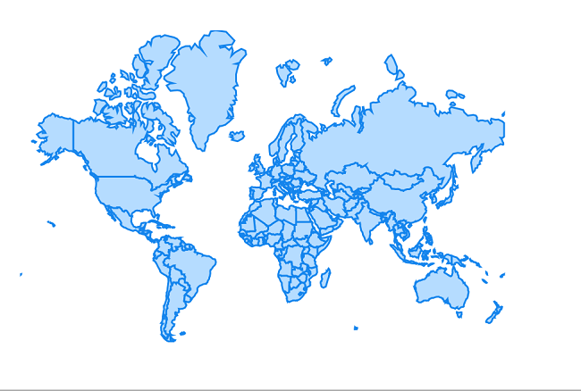
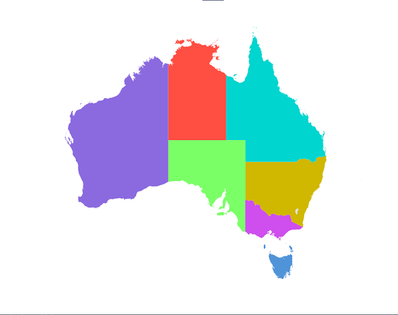
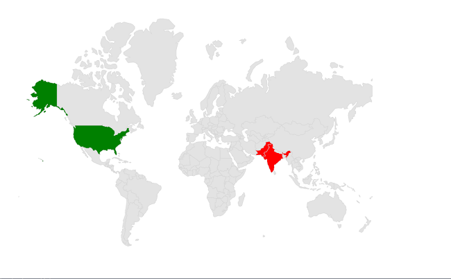
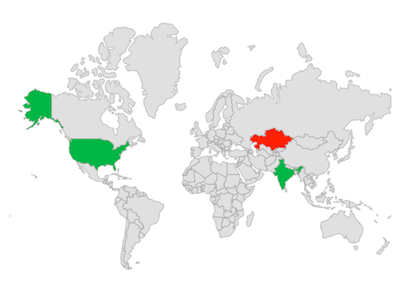

# Shapes in .NET MAUI Maps (SfMaps)

This section explains about shapes and how to apply colors to them based on specific values in the .NET MAUI maps.

To learn more about the .NET MAUI Maps shape layer, you can check the following video.

 <iframe id='MAUIMapsVideoTutorial' src="https://www.youtube.com/embed/3z07lWrQy5I?start=48"></iframe>

## Shape color

You can apply color, stroke color and thickness to the shapes using the [`ShapeFill`](https://help.syncfusion.com/cr/maui/Syncfusion.Maui.Maps.MapShapeLayer.html#Syncfusion_Maui_Maps_MapShapeLayer_ShapeFill), [`ShapeStroke`](https://help.syncfusion.com/cr/maui/Syncfusion.Maui.Maps.MapShapeLayer.html#Syncfusion_Maui_Maps_MapShapeLayer_ShapeStroke) and [`ShapeStrokeThickness`](https://help.syncfusion.com/cr/maui/Syncfusion.Maui.Maps.MapShapeLayer.html#Syncfusion_Maui_Maps_MapShapeLayer_ShapeStrokeThickness) properties respectively.





<map:SfMaps>
    <map:SfMaps.Layer>
        <map:MapShapeLayer ShapesSource="https://cdn.syncfusion.com/maps/map-data/world-map.json"
                           ShapeStroke="#1585ed"
                           ShapeFill="#b5dcff"  
                           ShapeStrokeThickness="2">
        </map:MapShapeLayer>
    </maps:SfMaps.Layer>
</maps:SfMaps>





	public MainPage()
    {
        InitializeComponent();
		
        MapShapeLayer layer = new MapShapeLayer();
        layer.ShapesSource = MapSource.FromUri(new Uri("https://cdn.syncfusion.com/maps/map-data/world-map.json"));
        layer.ShapeFill = Color.FromRgb(181, 220, 255);
        layer.ShapeStroke = Color.FromRgb(21, 133, 237);
        layer.ShapeStrokeThickness = 2;
		
        SfMaps maps = new SfMaps();
        maps.Layer = layer;
		
        this.Content = maps;
    }





## Hover color

You can apply hover color, hover stoke color and hover stroke thickness to the shapes using the [`ShapeHoverFill`](https://help.syncfusion.com/cr/maui/Syncfusion.Maui.Maps.MapShapeLayer.html#Syncfusion_Maui_Maps_MapShapeLayer_ShapeHoverFill), [`ShapeHoverStroke`](https://help.syncfusion.com/cr/maui/Syncfusion.Maui.Maps.MapShapeLayer.html#Syncfusion_Maui_Maps_MapShapeLayer_ShapeHoverStroke) and [`ShapeHoverStrokeThickness`](https://help.syncfusion.com/cr/maui/Syncfusion.Maui.Maps.MapShapeLayer.html#Syncfusion_Maui_Maps_MapShapeLayer_ShapeHoverStrokeThickness) properties respectively.





<map:SfMaps>
    <map:SfMaps.Layer>
        <map:MapShapeLayer ShapesSource="https://cdn.syncfusion.com/maps/map-data/world-map.json"
                           ShapeHoverStroke="Blue"
                           ShapeHoverFill="LightBlue"  
                           ShapeHoverStrokeThickness="2">
        </map:MapShapeLayer>
    </map:SfMaps.Layer>
</map:SfMaps>





	public MainPage()
    {
        InitializeComponent();
		
        MapShapeLayer layer = new MapShapeLayer();
        layer.ShapesSource = MapSource.FromUri(new Uri("https://cdn.syncfusion.com/maps/map-data/world-map.json"));
        layer.ShapeHoverFill = Brush.LightBlue;
        layer.ShapeHoverStroke = Brush.Blue;
        layer.ShapeHoverStrokeThickness = 2;
		
        SfMaps maps = new SfMaps();
        maps.Layer = layer;
		
        this.Content = maps;
    }
    




## Applying colors based on the data

The [`ShapeColorValuePath`](https://help.syncfusion.com/cr/maui/Syncfusion.Maui.Maps.MapShapeLayer.html#Syncfusion_Maui_Maps_MapShapeLayer_ShapeColorValuePath) provides a color directly. The color will then be applied to the respective shape. Otherwise, you must provide [`ColorMapping`](https://help.syncfusion.com/cr/maui/Syncfusion.Maui.Maps.MapShapeLayer.html#Syncfusion_Maui_Maps_MapShapeLayer_ColorMappings).

>Note: You can show legend using the [`Legend`](https://help.syncfusion.com/cr/maui/Syncfusion.Maui.Maps.MapShapeLayer.html#Syncfusion_Maui_Maps_MapShapeLayer_Legend) property.The icon's color of the legend is applied based on the colors from [`ShapeColorValuePath`](https://help.syncfusion.com/cr/maui/Syncfusion.Maui.Maps.MapShapeLayer.html#Syncfusion_Maui_Maps_MapShapeLayer_ShapeColorValuePath) property and has to provide text for the legend from the [`ColorMapping.Text`](https://help.syncfusion.com/cr/maui/Syncfusion.Maui.Maps.ColorMapping.html#Syncfusion_Maui_Maps_ColorMapping_Text) property. 





<map:SfMaps>
    <map:SfMaps.Layer>
        <map:MapShapeLayer ShapesSource="https://cdn.syncfusion.com/maps/map-data/australia.json"
                           DataSource="{Binding Data}"       
                           PrimaryValuePath="State" 
                           ShapeDataField="STATE_NAME"
                           ShapeStrokeThickness="0" 
                           ShapeColorValuePath="Color">
        </map:MapShapeLayer>
    </map:SfMaps.Layer>
</map:SfMaps>





public MainPage()
{
    InitializeComponent();
	
    ViewModel viewModel = new ViewModel();
    this.BindingContext = viewModel;
	
    MapShapeLayer layer = new MapShapeLayer();
    layer.ShapesSource = MapSource.FromUri(new Uri("https://cdn.syncfusion.com/maps/map-data/australia.json"));
    layer.DataSource = viewModel.Data;
    layer.PrimaryValuePath = "State";
    layer.ShapeDataField = "STATE_NAME";
    layer.ShapeColorValuePath = "Color";
    layer.ShapeStrokeThickness = 0;

    SfMaps maps = new SfMaps();
    maps.Layer = layer;
    this.Content = maps;
}

public class ViewModel
{
    public ObservableCollection<Model> Data { get; set; }
	
    public ViewModel()
    {
        Data = new ObservableCollection<Model>();
        Data.Add(new Model("New South Wales", Color.FromRgb(208,183,0)));
        Data.Add(new Model("Northern Territory",  Color.FromRgb(255,78,66)));
        Data.Add(new Model("Victoria",  Color.FromRgb(207,78,238)));
        Data.Add(new Model("Tasmania", Color.FromRgb(79,147,216)));
        Data.Add(new Model("Queensland",  Color.FromRgb(0,213,207)));
        Data.Add(new Model("Western Australia", Color.FromRgb(139,106,223)));
        Data.Add(new Model("South Australia", Color.FromRgb(123,255,103)));
    }
}

public class Model
{
    public String State { get; set; }
    public Color Color { get; set; }
	
    public Model(string state, Color color)
    {
        State = state;
        Color = color;
    }
}





## Equal color mapping

You can apply color to the shape by comparing a value from the [`ColorMappings`](https://help.syncfusion.com/cr/maui/Syncfusion.Maui.Maps.MapShapeLayer.html#Syncfusion_Maui_Maps_MapShapeLayer_ColorMappings) with the [`EqualColorMapping.Value`](https://help.syncfusion.com/cr/maui/Syncfusion.Maui.Maps.MapBubbleSettings.html#Syncfusion_Maui_Maps_MapBubbleSettings_ColorValuePath). For the matched values, the [`EqualColorMapping.color`](https://help.syncfusion.com/cr/maui/Syncfusion.Maui.Maps.ColorMapping.html#Syncfusion_Maui_Maps_ColorMapping_Color) will be applied to the respective shapes.





<map:SfMaps>
    <map:SfMaps.Layer>
        <map:MapShapeLayer ShapesSource="https://cdn.syncfusion.com/maps/map-data/world-map.json"
                           DataSource="{Binding Data}" 
                           PrimaryValuePath="Country" 
                           ShapeDataField="name" 
                           ShapeColorValuePath="Count">
        
            <map:MapShapeLayer.ColorMappings>
                <map:EqualColorMapping Color="Red" Value="Low" />
                    <map:EqualColorMapping Color="Green" Value="High" />
            </map:MapShapeLayer.ColorMappings>

        </map:MapShapeLayer>
    </map:SfMaps.Layer>
</map:SfMaps>





public MainPage()
{
    InitializeComponent();
	
    ViewModel viewModel = new ViewModel();
    this.BindingContext = viewModel;
	
    MapShapeLayer layer = new MapShapeLayer();
    layer.ShapesSource = MapSource.FromUri(new Uri("https://cdn.syncfusion.com/maps/map-data/world-map.json"));
    layer.DataSource = viewModel.Data;
    layer.PrimaryValuePath = "Country";
    layer.ShapeDataField = "name";
    layer.ShapeColorValuePath = "Count";

    EqualColorMapping colorMapping = new EqualColorMapping();
    colorMapping.Color = Colors.Red;
    colorMapping.Value = "Low";

    EqualColorMapping colorMapping1 = new EqualColorMapping();
    colorMapping1.Color = Colors.Green;
    colorMapping1.Value = "High";

    layer.ColorMappings.Add(colorMapping);
    layer.ColorMappings.Add(colorMapping1);
        
    SfMaps maps = new SfMaps();
    maps.Layer = layer;
	
    this.Content = maps;
}

public class ViewModel
{
    public ObservableCollection<Model> Data { get; set; }
	
    public ViewModel()
    {
        Data = new ObservableCollection<Model>();
        Data.Add(new Model("India", "Low"));
        Data.Add(new Model("United States", "High"));
        Data.Add(new Model("Pakistan", "Low"));;
    }
}

public class Model
{
    public String Country { get; set; }
    public String Count { get; set; }
	
    public Model(string country, string count)
    {
        Country = country;
        Count = count;
    }
}





## Range color mapping

You can apply color to the shapes based on whether the value from [`ColorMappings`](https://help.syncfusion.com/cr/maui/Syncfusion.Maui.Maps.MapShapeLayer.html#Syncfusion_Maui_Maps_MapShapeLayer_ColorMappings) falls within the [`RangeColorMapping.From`](https://help.syncfusion.com/cr/maui/Syncfusion.Maui.Maps.RangeColorMapping.html#Syncfusion_Maui_Maps_RangeColorMapping_From) and [`RangeColorMapping.To`](https://help.syncfusion.com/cr/maui/Syncfusion.Maui.Maps.RangeColorMapping.html#Syncfusion_Maui_Maps_RangeColorMapping_To). Then, the [`RangeColorMapping.Color`](https://help.syncfusion.com/cr/maui/Syncfusion.Maui.Maps.ColorMapping.html#Syncfusion_Maui_Maps_ColorMapping_Color) will be applied to the respective shapes.





<map:SfMaps>
    <map:SfMaps.Layer>
        <map:MapShapeLayer ShapesSource="https://cdn.syncfusion.com/maps/map-data/world-map.json"
                           DataSource="{Binding Data}" 
                           PrimaryValuePath="Country" 
                           ShapeDataField="name" 
                           ShapeColorValuePath="Count">
        
            <map:MapShapeLayer.ColorMappings>
                <map:RangeColorMapping Color="Green" From="0" To="90" />
                <map:RangeColorMapping Color="Red" From="100" To="150" />
            </map:MapShapeLayer.ColorMappings>

        </map:MapShapeLayer>
    </map:SfMaps.Layer>
</map:SfMaps>





public MainPage()
{
    InitializeComponent();
	
    ViewModel viewModel = new ViewModel();
    this.BindingContext = viewModel;
	
    MapShapeLayer layer = new MapShapeLayer();
    layer.ShapesSource = MapSource.FromUri(new Uri("https://cdn.syncfusion.com/maps/map-data/world-map.json"));
    layer.DataSource = viewModel.Data;
    layer.PrimaryValuePath = "Country";
    layer.ShapeDataField = "name";
    layer.ShapeColorValuePath = "Count";

    RangeColorMapping colorMapping = new RangeColorMapping();
    colorMapping.Color = Colors.Green;
    colorMapping.From = 0;
    colorMapping.To = 90;

    RangeColorMapping colorMapping1 = new RangeColorMapping();
    colorMapping.Color = Colors.Red;
    colorMapping.From =100;
    colorMapping.To = 150;

    layer.ColorMappings.Add(colorMapping);
    layer.ColorMappings.Add(colorMapping1);
        
    SfMaps maps = new SfMaps();
    maps.Layer = layer;
	
    this.Content = maps;
}

public class ViewModel
{
    public ObservableCollection<Model> Data { get; set; }
	
    public ViewModel()
    {
        Data = new ObservableCollection<Model>();
        Data.Add(new Model("India", 80));
        Data.Add(new Model("United States",30 ));
        Data.Add(new Model("Kazakhstan", 105 ));
    }
}

public class Model
{
    public String Country { get; set; }
    public String Count { get; set; }
	
    public Model(string country, int count)
    {
        Country = country;
        Count = count;
    }
}





>Note:
* Refer to the [`BubbleSettings`](https://help.syncfusion.com/cr/maui/Syncfusion.Maui.Maps.MapShapeLayer.html#Syncfusion_Maui_Maps_MapShapeLayer_BubbleSettings), for setting the bubble colors based on the specific value. You can also refer to our [.NET MAUI Maps](https://www.syncfusion.com/maui-controls/maui-maps) feature tour page for its groundbreaking feature representations. You can also explore our [.NET MAUI Maps Shapes example](https://github.com/syncfusion/maui-demos/) that shows how to configure a Maps in .NET MAUI.