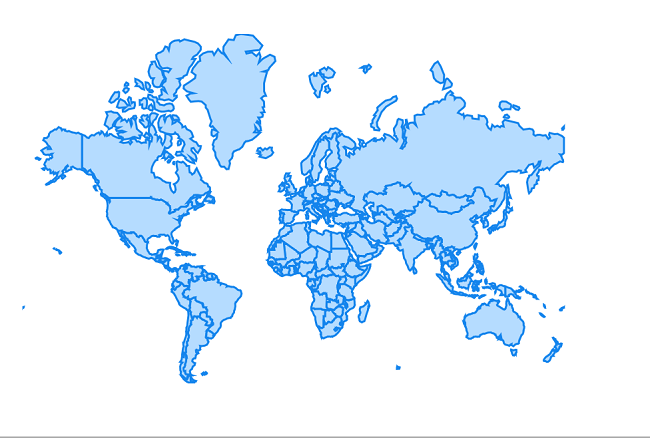
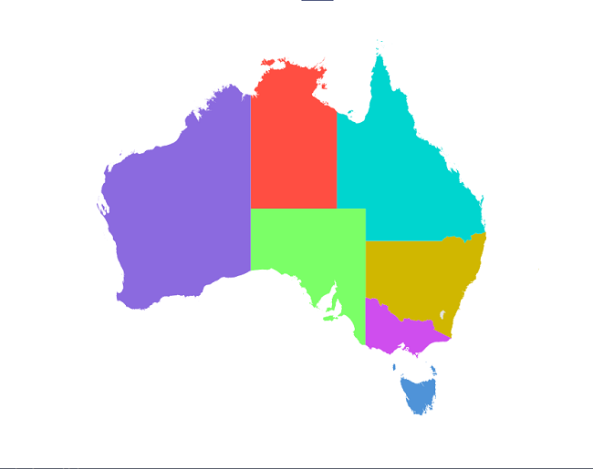
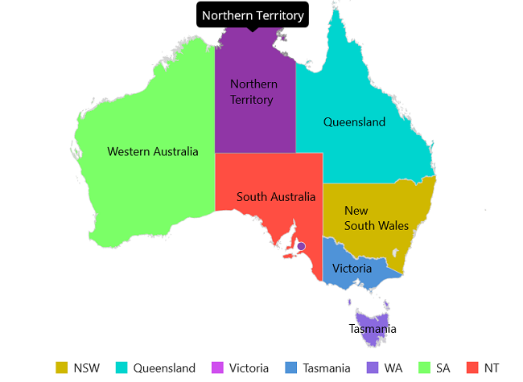
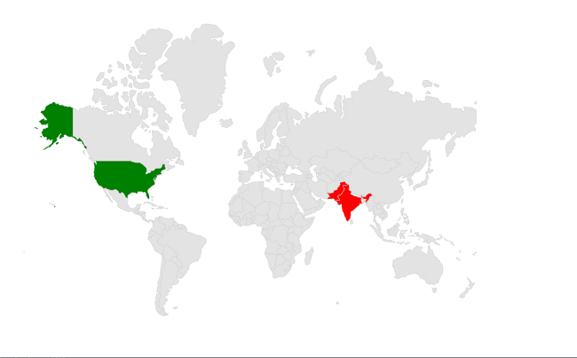
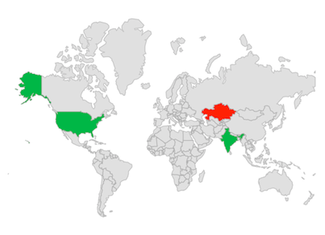

# Shapes in .NET MAUI Maps

This section explains shapes, how to map the data source, add shape layer map elements, and apply colors to them based on specific values in the .NET MAUI Maps.

N> **Prerequisite:** Ensure that the required NuGet package is installed, the necessary namespaces are imported, and the **SfMaps** control is properly configured in your application. For detailed setup and configuration instructions, refer to the **[Getting Started](https://help.syncfusion.com/maui/maps/getting-started)** guide.

To learn more about the .NET MAUI Maps shape layer, you can check the following video.

 <iframe id='MAUIMapsVideoTutorial' src="https://www.youtube.com/embed/3z07lWrQy5I?start=48"></iframe>

## Mapping the data source for shape layer

The [`DataSource`](https://help.syncfusion.com/cr/maui/Syncfusion.Maui.Maps.MapShapeLayer.html#Syncfusion_Maui_Maps_MapShapeLayer_DataSource) property accepts the collection values as input. The [`PrimaryValuePath`](https://help.syncfusion.com/cr/maui/Syncfusion.Maui.Maps.MapShapeLayer.html#Syncfusion_Maui_Maps_MapShapeLayer_PrimaryValuePath) property refers to the data ID in [`DataSource`](https://help.syncfusion.com/cr/maui/Syncfusion.Maui.Maps.MapShapeLayer.html#Syncfusion_Maui_Maps_MapShapeLayer_DataSource).

The [`ShapeDataField`](https://help.syncfusion.com/cr/maui/Syncfusion.Maui.Maps.MapShapeLayer.html#Syncfusion_Maui_Maps_MapShapeLayer_ShapeDataField) property is similar to the [`PrimaryValuePath`](https://help.syncfusion.com/cr/maui/Syncfusion.Maui.Maps.MapShapeLayer.html#Syncfusion_Maui_Maps_MapShapeLayer_PrimaryValuePath) property. It refers to the column name in the data property of shape layers to identify the shape. When the values of the [`PrimaryValuePath`](https://help.syncfusion.com/cr/maui/Syncfusion.Maui.Maps.MapShapeLayer.html#Syncfusion_Maui_Maps_MapShapeLayer_PrimaryValuePath) property in the [`DataSource`](https://help.syncfusion.com/cr/maui/Syncfusion.Maui.Maps.MapShapeLayer.html#Syncfusion_Maui_Maps_MapShapeLayer_DataSource) property and the values of [`ShapeDataField`](https://help.syncfusion.com/cr/maui/Syncfusion.Maui.Maps.MapShapeLayer.html#Syncfusion_Maui_Maps_MapShapeLayer_ShapeDataField) in the data property match, the associated object from the dataSource will be bound to the corresponding shape.





<map:SfMaps>
    <map:SfMaps.Layer>
        <map:MapShapeLayer x:Name = "layer"
                           ShapesSource = "https://cdn.syncfusion.com/maps/map-data/australia.json"
                           ShapeDataField = "STATE_NAME"
                           DataSource = "{Binding Data}"        
                           PrimaryValuePath = "State"  />
    </map:SfMaps.Layer>
</map:SfMaps>





public MainPage()
{
    InitializeComponent();
    layer.ShapesSource = MapSource.FromUri(new Uri("https://cdn.syncfusion.com/maps/map-data/australia.json"));
}

public class ViewModel
{
    public ObservableCollection<Model> Data { get; set; }
    public ViewModel()
    {
        Data = new ObservableCollection<Model>();
        Data.Add(new Model("New South Wales", "New\nSouth Wales", 1));
        Data.Add(new Model("Queensland", "Queensland",2));
        Data.Add(new Model("Northern Territory", "Northern\nTerritory",3));
        Data.Add(new Model("Victoria", "Victoria",4));
        Data.Add(new Model("Tasmania", "Tasmania",5));
        Data.Add(new Model("Western Australia", "Western Australia",6));
        Data.Add(new Model("South Australia", "South Australia",7));
    }

    public class Model
    {
        public string State { get; set; }
        public string StateCode { get; set; }
        public int ID { get; set; }
        public Model(string state, string stateCode, int id)
        {
            State = state;
            StateCode = stateCode;
            ID = id;
        }
    }
}





N>
* Refer to the [`PrimaryValuePath`](https://help.syncfusion.com/cr/maui/Syncfusion.Maui.Maps.MapShapeLayer.html#Syncfusion_Maui_Maps_MapShapeLayer_PrimaryValuePath), for mapping the data of the data source collection with the respective [`ShapeDataField`](https://help.syncfusion.com/cr/maui/Syncfusion.Maui.Maps.MapShapeLayer.html#Syncfusion_Maui_Maps_MapShapeLayer_ShapeDataField) in .json source.
* Refer to the [`BubbleSettings`](https://help.syncfusion.com/cr/maui/Syncfusion.Maui.Maps.MapShapeLayer.html#Syncfusion_Maui_Maps_MapShapeLayer_BubbleSettings), for customizing the bubble.
* Refer to the [`DataLabelSettings`](https://help.syncfusion.com/cr/maui/Syncfusion.Maui.Maps.MapShapeLayer.html#Syncfusion_Maui_Maps_MapShapeLayer_DataLabelSettings), for customizing the data label.
* Refer to the [`ColorMappings`](https://help.syncfusion.com/cr/maui/Syncfusion.Maui.Maps.MapShapeLayer.html#Syncfusion_Maui_Maps_MapShapeLayer_ColorMappings), for customizing the shape colors.

N> When publishing in AOT mode on iOS, ensure [Preserve(AllMembers = true)] is added to the model class to maintain [`PrimaryValuePath`](https://help.syncfusion.com/cr/maui/Syncfusion.Maui.Maps.MapShapeLayer.html#Syncfusion_Maui_Maps_MapShapeLayer_PrimaryValuePath) binding.

## Shape color

You can apply color, stroke color and thickness to the shapes using the [`ShapeFill`](https://help.syncfusion.com/cr/maui/Syncfusion.Maui.Maps.MapShapeLayer.html#Syncfusion_Maui_Maps_MapShapeLayer_ShapeFill), [`ShapeStroke`](https://help.syncfusion.com/cr/maui/Syncfusion.Maui.Maps.MapShapeLayer.html#Syncfusion_Maui_Maps_MapShapeLayer_ShapeStroke) and [`ShapeStrokeThickness`](https://help.syncfusion.com/cr/maui/Syncfusion.Maui.Maps.MapShapeLayer.html#Syncfusion_Maui_Maps_MapShapeLayer_ShapeStrokeThickness) properties respectively.





<map:SfMaps>
    <map:SfMaps.Layer>
        <map:MapShapeLayer ShapesSource = "https://cdn.syncfusion.com/maps/map-data/world-map.json"
                           ShapeStroke = "#1585ed"
                           ShapeFill = "#b5dcff"  
                           ShapeStrokeThickness = "2">
        </map:MapShapeLayer>
    </map:SfMaps.Layer>
</map:SfMaps>





	public MainPage()
    {
        InitializeComponent();
		
        MapShapeLayer layer = new MapShapeLayer();
        layer.ShapesSource = MapSource.FromUri(new Uri("https://cdn.syncfusion.com/maps/map-data/world-map.json"));
        layer.ShapeFill = new SolidColorBrush(Color.FromRgb(181, 220, 255));
        layer.ShapeStroke = new SolidColorBrush(Color.FromRgb(21, 133, 237));
        layer.ShapeStrokeThickness = 2;
		
        SfMaps maps = new SfMaps();
        maps.Layer = layer;
		
        this.Content = maps;
    }





## Hover color

You can apply hover color, hover stroke color and hover stroke thickness to the shapes using the [`ShapeHoverFill`](https://help.syncfusion.com/cr/maui/Syncfusion.Maui.Maps.MapShapeLayer.html#Syncfusion_Maui_Maps_MapShapeLayer_ShapeHoverFill), [`ShapeHoverStroke`](https://help.syncfusion.com/cr/maui/Syncfusion.Maui.Maps.MapShapeLayer.html#Syncfusion_Maui_Maps_MapShapeLayer_ShapeHoverStroke) and [`ShapeHoverStrokeThickness`](https://help.syncfusion.com/cr/maui/Syncfusion.Maui.Maps.MapShapeLayer.html#Syncfusion_Maui_Maps_MapShapeLayer_ShapeHoverStrokeThickness) properties respectively.





<map:SfMaps>
    <map:SfMaps.Layer>
        <map:MapShapeLayer ShapesSource = "https://cdn.syncfusion.com/maps/map-data/world-map.json"
                           ShapeHoverStroke = "Blue"
                           ShapeHoverFill = "LightBlue"  
                           ShapeHoverStrokeThickness = "2">
        </map:MapShapeLayer>
    </map:SfMaps.Layer>
</map:SfMaps>





	public MainPage()
    {
        InitializeComponent();
		
        MapShapeLayer layer = new MapShapeLayer();
        layer.ShapesSource = MapSource.FromUri(new Uri("https://cdn.syncfusion.com/maps/map-data/world-map.json"));
        layer.ShapeHoverFill = new SolidColorBrush(Colors.LightBlue);
        layer.ShapeHoverStroke = new SolidColorBrush(Colors.Blue);
        layer.ShapeHoverStrokeThickness = 2;
		
        SfMaps maps = new SfMaps();
        maps.Layer = layer;
		
        this.Content = maps;
    }
    




## Applying colors based on the data

You can apply colors to the shapes based on a specific value from the data source. The [`ShapeColorValuePath`](https://help.syncfusion.com/cr/maui/Syncfusion.Maui.Maps.MapShapeLayer.html#Syncfusion_Maui_Maps_MapShapeLayer_ShapeColorValuePath) property provides a color directly. The color will then be applied to the respective shape. Otherwise, you must provide [`ColorMapping`](https://help.syncfusion.com/cr/maui/Syncfusion.Maui.Maps.MapShapeLayer.html#Syncfusion_Maui_Maps_MapShapeLayer_ColorMappings).

N> You can show legend using the [`Legend`](https://help.syncfusion.com/cr/maui/Syncfusion.Maui.Maps.MapShapeLayer.html#Syncfusion_Maui_Maps_MapShapeLayer_Legend) property. The icon's color of the legend is applied based on the colors from [`ShapeColorValuePath`](https://help.syncfusion.com/cr/maui/Syncfusion.Maui.Maps.MapShapeLayer.html#Syncfusion_Maui_Maps_MapShapeLayer_ShapeColorValuePath) property and has to provide text for the legend from the [`ColorMapping.Text`](https://help.syncfusion.com/cr/maui/Syncfusion.Maui.Maps.ColorMapping.html#Syncfusion_Maui_Maps_ColorMapping_Text) property. 





<map:SfMaps>
    <map:SfMaps.Layer>
        <map:MapShapeLayer ShapesSource = "https://cdn.syncfusion.com/maps/map-data/australia.json"
                           DataSource = "{Binding Data}"       
                           PrimaryValuePath = "State" 
                           ShapeDataField = "STATE_NAME"
                           ShapeStrokeThickness = "0" 
                           ShapeColorValuePath = "Color">
        </map:MapShapeLayer>
    </map:SfMaps.Layer>
</map:SfMaps>





public MainPage()
{
    InitializeComponent();
	
    ViewModel viewModel = new ViewModel();
    this.BindingContext = viewModel;
	
    MapShapeLayer layer = new MapShapeLayer();
    layer.ShapesSource = MapSource.FromUri(new Uri("https://cdn.syncfusion.com/maps/map-data/australia.json"));
    layer.DataSource = viewModel.Data;
    layer.PrimaryValuePath = "State";
    layer.ShapeDataField = "STATE_NAME";
    layer.ShapeColorValuePath = "Color";
    layer.ShapeStrokeThickness = 0;

    SfMaps maps = new SfMaps();
    maps.Layer = layer;
    this.Content = maps;
}

public class ViewModel
{
    public ObservableCollection<Model> Data { get; set; }
	
    public ViewModel()
    {
        Data = new ObservableCollection<Model>();
        Data.Add(new Model("New South Wales", Color.FromRgb(208,183,0)));
        Data.Add(new Model("Northern Territory",  Color.FromRgb(255,78,66)));
        Data.Add(new Model("Victoria",  Color.FromRgb(207,78,238)));
        Data.Add(new Model("Tasmania", Color.FromRgb(79,147,216)));
        Data.Add(new Model("Queensland",  Color.FromRgb(0,213,207)));
        Data.Add(new Model("Western Australia", Color.FromRgb(139,106,223)));
        Data.Add(new Model("South Australia", Color.FromRgb(123,255,103)));
    }
}

public class Model
{
    public String State { get; set; }
    public Color Color { get; set; }
	
    public Model(string state, Color color)
    {
        State = state;
        Color = color;
    }
}





## Add shape layer maps elements

Add the basic maps elements such as data labels, legend, and tooltip as shown in the below code snippet.

* **[Data labels](https://help.syncfusion.com/maui/maps/data-labels)** - You can show data labels using the [`ShowDataLabels`](https://help.syncfusion.com/cr/maui/Syncfusion.Maui.Maps.MapShapeLayer.html#Syncfusion_Maui_Maps_MapShapeLayer_ShowDataLabels) property and also, customize it using the [`DataLabelSettings`](https://help.syncfusion.com/cr/maui/Syncfusion.Maui.Maps.MapShapeLayer.html#Syncfusion_Maui_Maps_MapShapeLayer_DataLabelSettings) property.

* **[Markers](https://help.syncfusion.com/maui/maps/markers)** - You can show markers at any position on the map by providing latitude and longitude position to the [`MapMarker`](https://help.syncfusion.com/cr/maui/Syncfusion.Maui.Maps.MapMarker.html), which is from the [`Markers`](https://help.syncfusion.com/cr/maui/Syncfusion.Maui.Maps.MapLayer.html#Syncfusion_Maui_Maps_MapLayer_Markers) collection.

* **[Legend](https://help.syncfusion.com/maui/maps/legend)** - You can enable legend using the [`Legend`](https://help.syncfusion.com/cr/maui/Syncfusion.Maui.Maps.MapShapeLayer.html#Syncfusion_Maui_Maps_MapShapeLayer_Legend) property. The legend's text is displayed based on the [`ColorMapping.Text`](https://help.syncfusion.com/cr/maui/Syncfusion.Maui.Maps.ColorMapping.html#Syncfusion_Maui_Maps_ColorMapping_Text) property. It is possible to customize the legend text using the [`TextStyle`](https://help.syncfusion.com/cr/maui/Syncfusion.Maui.Maps.MapLegend.html#Syncfusion_Maui_Maps_MapLegend_TextStyle) property.

* **[Tooltip](https://help.syncfusion.com/maui/maps/tooltip)** - You can enable tooltip for the shapes using the [`ShowShapeTooltip`](https://help.syncfusion.com/cr/maui/Syncfusion.Maui.Maps.MapShapeLayer.html#Syncfusion_Maui_Maps_MapShapeLayer_ShowShapeTooltip) property. It will be displayed when you interact with the shapes, i.e., while tapping on touch devices and hovering on mouse-enabled devices.





<Grid>
    <Grid.BindingContext>
        <local:ViewModel />
    </Grid.BindingContext>

    <map:SfMaps>
        <map:SfMaps.Layer>
            <map:MapShapeLayer x:Name = "layer"
                               ShapesSource = "https://cdn.syncfusion.com/maps/map-data/australia.json"
                               ShapeDataField = "STATE_NAME"
                               DataSource = "{Binding Data}"
                               PrimaryValuePath = "State" 
                               ShowDataLabels = "True"
                               ShowShapeTooltip = "True"
                               ShapeColorValuePath = "ID">

                <!--Set Data Label-->
                <map:MapShapeLayer.DataLabelSettings>
                    <map:MapDataLabelSettings DataLabelPath = "StateCode" />
                </map:MapShapeLayer.DataLabelSettings>
                
                <!--Set Color mapping-->
                <map:MapShapeLayer.ColorMappings>
                    <map:EqualColorMapping Color = "#d0b800"
                                           Value = "1"
                                           Text = "NSW" />
                    <map:EqualColorMapping Color = "#00d5cf"
                                           Value = "2"
                                           Text = "Queensland" />
                    <map:EqualColorMapping Color = "#cf4eee"
                                           Value = "3"
                                           Text = "Victoria" />
                    <map:EqualColorMapping Color = "#4f93d8"
                                           Value = "4"
                                           Text = "Tasmania" />
                    <map:EqualColorMapping Color = "#8b6adf"
                                           Value = "5"
                                           Text = "WA" />
                    <map:EqualColorMapping Color = "#7bff67"
                                           Value = "6"
                                           Text = "SA" />
                    <map:EqualColorMapping Color = "#ff4e42"
                                           Value = "7"
                                           Text = "NT" />
                </map:MapShapeLayer.ColorMappings>

                <!--Set Markers-->
                <map:MapShapeLayer.Markers>
                    <map:MapMarkerCollection>
                        <map:MapMarker x:Name = "Adelaide"
                                       Latitude = "-34.928497"
                                       Longitude = "138.600739" />
                    </map:MapMarkerCollection>
                </map:MapShapeLayer.Markers>
                
                <!--Set Legend-->
                <map:MapShapeLayer.Legend>
                    <map:MapLegend SourceType = "Shape"
                                   Placement = "Bottom" />
                </map:MapShapeLayer.Legend>
            </map:MapShapeLayer>
        </map:SfMaps.Layer>
    </map:SfMaps>
</Grid>





public MainPage()
{
    InitializeComponent();
    ViewModel viewModel = new ViewModel();
    this.BindingContext = viewModel;
    SfMaps maps = new SfMaps();
    MapShapeLayer layer = new MapShapeLayer();
    layer.ShapesSource = MapSource.FromUri(new Uri("https://cdn.syncfusion.com/maps/map-data/australia.json"));
    layer.DataSource = viewModel.Data;
    layer.PrimaryValuePath = "State";
    layer.ShapeDataField = "STATE_NAME";
    layer.ShapeColorValuePath = "ID";
    layer.ShowDataLabels = true;
    layer.ShowShapeTooltip = true;

    layer.DataLabelSettings = new MapDataLabelSettings()
    {
        DataLabelPath = "StateCode"
    };

    layer.ColorMappings = new ObservableCollection<ColorMapping>()
    {
        new EqualColorMapping
           {
              Color = Color.FromRgb(208,183,0),
              Value = "1",
              Text="NSW"
           },
        new EqualColorMapping
           { 
              Color = Color.FromRgb(0,213,207),
              Value = "2" ,
              Text="Queensland"
           },
        new EqualColorMapping
           {
              Color = Color.FromRgb(207,78,238),
              Value = "3",
              Text="Victoria"
           },
        new EqualColorMapping
           {
              Color = Color.FromRgb(79,147,216),
              Value = "4",
              Text="Tasmania"
           },
        new EqualColorMapping
           {
              Color = Color.FromRgb(139,106,223),
              Value = "5",
              Text="WA"
           },
        new EqualColorMapping
           {
              Color = Color.FromRgb(123,255,103),
              Value = "6",
              Text="SA"
           },
        new EqualColorMapping
           {
              Color = Color.FromRgb(255,78,66),
              Value = "7",
              Text="NT"
           },
    };

    MapMarker mapMarker = new MapMarker();
    mapMarker.Latitude = -34.928497;
    mapMarker.Longitude = 138.600739;
    MapMarkerCollection mapMarkers =new MapMarkerCollection
    {
       mapMarker
    };
    layer.Markers = mapMarkers;

    MapLegend legendSet = new MapLegend();
    legendSet.SourceType = LegendSourceType.Shape;
    legendSet.Placement = LegendPlacement.Bottom;
    layer.Legend = legendSet;

    maps.Layer = layer;
    this.Content = maps;
}

public class ViewModel
{
    public ObservableCollection<Model> Data { get; set; }
    public ViewModel()
    {
        Data = new ObservableCollection<Model>();
        Data.Add(new Model("New South Wales", "New\nSouth Wales", 1));
        Data.Add(new Model("Queensland", "Queensland",2));
        Data.Add(new Model("Northern Territory", "Northern\nTerritory",3));
        Data.Add(new Model("Victoria", "Victoria",4));
        Data.Add(new Model("Tasmania", "Tasmania",5));
        Data.Add(new Model("Western Australia", "Western Australia",6));
        Data.Add(new Model("South Australia", "South Australia",7));
    }
    
    public class Model
    {
        public string State { get; set; }
        public string StateCode { get; set; }
        public int ID { get; set; }
        public Model(string state, string stateCode, int id)
        {
            State = state;
            StateCode = stateCode;
            ID = id;
        }
    }
}





## Equal color mapping

You can apply color to the shape by comparing a value from the [`ShapeColorValuePath`](https://help.syncfusion.com/cr/maui/Syncfusion.Maui.Maps.MapShapeLayer.html#Syncfusion_Maui_Maps_MapShapeLayer_ShapeColorValuePath) with the [`EqualColorMapping.Value`](https://help.syncfusion.com/cr/maui/Syncfusion.Maui.Maps.ColorMapping.html#Syncfusion_Maui_Maps_ColorMapping_Value). For the matched values, the [`EqualColorMapping.Color`](https://help.syncfusion.com/cr/maui/Syncfusion.Maui.Maps.ColorMapping.html#Syncfusion_Maui_Maps_ColorMapping_Color) will be applied to the respective shapes.





<map:SfMaps>
    <map:SfMaps.Layer>
        <map:MapShapeLayer ShapesSource = "https://cdn.syncfusion.com/maps/map-data/world-map.json"
                           DataSource = "{Binding Data}" 
                           PrimaryValuePath = "Country" 
                           ShapeDataField = "name" 
                           ShapeColorValuePath = "Count">
        
            <map:MapShapeLayer.ColorMappings>
                <map:EqualColorMapping Color = "Red" Value = "Low" />
                <map:EqualColorMapping Color = "Green" Value = "High" />
            </map:MapShapeLayer.ColorMappings>

        </map:MapShapeLayer>
    </map:SfMaps.Layer>
</map:SfMaps>





public MainPage()
{
    InitializeComponent();
	
    ViewModel viewModel = new ViewModel();
    this.BindingContext = viewModel;
	
    MapShapeLayer layer = new MapShapeLayer();
    layer.ShapesSource = MapSource.FromUri(new Uri("https://cdn.syncfusion.com/maps/map-data/world-map.json"));
    layer.DataSource = viewModel.Data;
    layer.PrimaryValuePath = "Country";
    layer.ShapeDataField = "name";
    layer.ShapeColorValuePath = "Count";

    EqualColorMapping colorMapping = new EqualColorMapping();
    colorMapping.Color = Colors.Red;
    colorMapping.Value = "Low";

    EqualColorMapping colorMapping1 = new EqualColorMapping();
    colorMapping1.Color = Colors.Green;
    colorMapping1.Value = "High";

    layer.ColorMappings.Add(colorMapping);
    layer.ColorMappings.Add(colorMapping1);
        
    SfMaps maps = new SfMaps();
    maps.Layer = layer;
	
    this.Content = maps;
}

public class ViewModel
{
    public ObservableCollection<Model> Data { get; set; }
	
    public ViewModel()
    {
        Data = new ObservableCollection<Model>();
        Data.Add(new Model("India", "Low"));
        Data.Add(new Model("United States", "High"));
        Data.Add(new Model("Pakistan", "Low"));
    }
}

public class Model
{
    public String Country { get; set; }
    public String Count { get; set; }
	
    public Model(string country, string count)
    {
        Country = country;
        Count = count;
    }
}





## Range color mapping

You can apply color to the shapes based on whether the value from [`ColorMappings`](https://help.syncfusion.com/cr/maui/Syncfusion.Maui.Maps.MapShapeLayer.html#Syncfusion_Maui_Maps_MapShapeLayer_ColorMappings) falls within the [`RangeColorMapping.From`](https://help.syncfusion.com/cr/maui/Syncfusion.Maui.Maps.RangeColorMapping.html#Syncfusion_Maui_Maps_RangeColorMapping_From) and [`RangeColorMapping.To`](https://help.syncfusion.com/cr/maui/Syncfusion.Maui.Maps.RangeColorMapping.html#Syncfusion_Maui_Maps_RangeColorMapping_To). Then, the [`RangeColorMapping.Color`](https://help.syncfusion.com/cr/maui/Syncfusion.Maui.Maps.ColorMapping.html#Syncfusion_Maui_Maps_ColorMapping_Color) will be applied to the respective shapes.





<map:SfMaps>
    <map:SfMaps.Layer>
        <map:MapShapeLayer ShapesSource = "https://cdn.syncfusion.com/maps/map-data/world-map.json"
                           DataSource = "{Binding Data}" 
                           PrimaryValuePath = "Country" 
                           ShapeDataField = "name" 
                           ShapeColorValuePath = "Count">
        
            <map:MapShapeLayer.ColorMappings>
                <map:RangeColorMapping Color = "Green" From = "0" To = "90" />
                <map:RangeColorMapping Color = "Red" From = "100" To = "150" />
            </map:MapShapeLayer.ColorMappings>

        </map:MapShapeLayer>
    </map:SfMaps.Layer>
</map:SfMaps>





public MainPage()
{
    InitializeComponent();
	
    ViewModel viewModel = new ViewModel();
    this.BindingContext = viewModel;
	
    MapShapeLayer layer = new MapShapeLayer();
    layer.ShapesSource = MapSource.FromUri(new Uri("https://cdn.syncfusion.com/maps/map-data/world-map.json"));
    layer.DataSource = viewModel.Data;
    layer.PrimaryValuePath = "Country";
    layer.ShapeDataField = "name";
    layer.ShapeColorValuePath = "Count";

    RangeColorMapping colorMapping = new RangeColorMapping();
    colorMapping.Color = Colors.Green;
    colorMapping.From = 0;
    colorMapping.To = 90;

    RangeColorMapping colorMapping1 = new RangeColorMapping();
    colorMapping1.Color = Colors.Red;
    colorMapping1.From = 100;
    colorMapping1.To = 150;

    layer.ColorMappings.Add(colorMapping);
    layer.ColorMappings.Add(colorMapping1);
        
    SfMaps maps = new SfMaps();
    maps.Layer = layer;
	
    this.Content = maps;
}

public class ViewModel
{
    public ObservableCollection<Model> Data { get; set; }
	
    public ViewModel()
    {
        Data = new ObservableCollection<Model>();
        Data.Add(new Model("India", 80));
        Data.Add(new Model("United States", 30));
        Data.Add(new Model("Kazakhstan", 105));
    }
}

public class Model
{
    public string Country { get; set; }
    public int Count { get; set; }
	
    public Model(string country, int count)
    {
        Country = country;
        Count = count;
    }
}





N>
* Refer to the [`BubbleSettings`](https://help.syncfusion.com/cr/maui/Syncfusion.Maui.Maps.MapShapeLayer.html#Syncfusion_Maui_Maps_MapShapeLayer_BubbleSettings), for setting the bubble colors based on the specific value.
* You can refer to our [.NET MAUI Maps](https://www.syncfusion.com/maui-controls/maui-maps) feature tour page for its groundbreaking feature representations. You can also explore our [.NET MAUI Maps Shapes example](https://github.com/syncfusion/maui-demos/tree/master/MAUI/Maps) that shows how to configure a Maps in .NET MAUI.