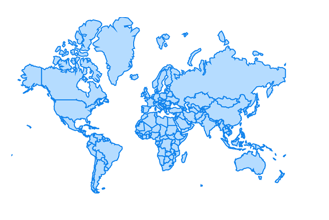

# Shapes in MAUI Maps (SfMaps)

This section explains about shapes and how to apply colors to the shapes based on specific values in the MAUI maps.

## Shape color

You can apply color, stroke color and stroke thickness to the shapes using the [`ShapeFill`](), [`ShapeStroke`]() and [`ShapeStrokeThickness`]() properties respectively.





     <map:SfMaps>
        <map:SfMaps.Layer>
            <map:MapShapeLayer ShapesSource="https://cdn.syncfusion.com/maps/map-data/world-map.json" 
							   ShapeStroke="Green"
							   ShapeFill="LightGreen"  
							   ShapeStrokeThickness="2">
            </map:MapShapeLayer>
        </maps:SfMaps.Layer>
    </maps:SfMaps>





	public MainPage()
    {
        InitializeComponent();
		
        MapShapeLayer layer = new MapShapeLayer();
        layer.ShapesSource = MapSource.FromUri(new Uri("https://cdn.syncfusion.com/maps/map-data/world-map.json"));
        layer.ShapeFill = Brush.LightGreen;
        layer.ShapeStroke = Brush.Green;
        layer.ShapeStrokeThickness = 2;
		
        SfMaps maps = new SfMaps();
        maps.Layer = layer;
		
        this.Content = maps;
    }





## Hover color

You can apply hover color, hover stoke color and hover stroke thickness to the shapes using the [`ShapeHoverFill`](), [`ShapeHoverStroke`]() and [`ShapeHoverStrokeThickness`]() properties respectively.





     <map:SfMaps>
        <map:SfMaps.Layer>
            <map:MapShapeLayer ShapesSource="https://cdn.syncfusion.com/maps/map-data/world-map.json"
							   ShapeHoverStroke="Blue"
							   ShapeHoverFill="LightBlue"  
							   ShapeHoverStrokeThickness="2">
            </map:MapShapeLayer>
        </map:SfMaps.Layer>
    </map:SfMaps>





	public MainPage()
    {
        InitializeComponent();
		
        MapShapeLayer layer = new MapShapeLayer();
        layer.ShapesSource = MapSource.FromUri(new Uri("https://cdn.syncfusion.com/maps/map-data/world-map.json"));
        layer.ShapeHoverFill = Brush.LightBlue;
        layer.ShapeHoverStroke = Brush.Blue;
        layer.ShapeHoverStrokeThickness = 2;
		
        SfMaps maps = new SfMaps();
        maps.Layer = layer;
		
        this.Content = maps;
    }
    




## Applying colors based on the data

The [`ShapeColorValuePath`]() is provides a color directly, then the color will be applied to the respective shape straightaway. Otherwise, you have to provide `ColorMapping`.

N> You can show legend using the [`Legend`]() property.The icons color of the legend is applied based on the colors from `ShapeColorValuePath` property and have to provide text for the legend from `ColorMapping.Text` property. 





     <map:SfMaps>
        <map:SfMaps.Layer>
            <map:MapShapeLayer ShapesSource="https://cdn.syncfusion.com/maps/map-data/australia.json" 
							   DataSource="{Binding Data}"       
							   PrimaryValuePath="State" 
							   ShapeDataField="STATE_NAME" 
							   ShapeColorValuePath="Color">
            </map:MapShapeLayer>
        </map:SfMaps.Layer>
    </map:SfMaps>





public MainPage()
{
    InitializeComponent();
	
    ViewModel viewModel = new ViewModel();
    this.BindingContext = viewModel;
	
    MapShapeLayer layer = new MapShapeLayer();
    layer.ShapesSource = MapSource.FromUri(new Uri("https://cdn.syncfusion.com/maps/map-data/australia.json"));
    layer.DataSource = viewModel.Data;
    layer.PrimaryValuePath = "State";
    layer.ShapeDataField = "STATE_NAME";
    layer.ShapeColorValuePath = "Color";

    SfMaps maps = new SfMaps();
    maps.Layer = layer;
    this.Content = maps;
}

public class ViewModel
{
    public ObservableCollection<Model> Data { get; set; }
	
    public ViewModel()
    {
        Data = new ObservableCollection<Model>();
        ObservableCollection<Model> Data = new ObservableCollection<Model>();
        Data.Add(new Model("New South Wales", Colors.Green));
        Data.Add(new Model("Northern Territory", Colors.Blue));
        Data.Add(new Model("Victoria", Colors.LightGreen));
        Data.Add(new Model("Tasmania", Colors.Orange));
        Data.Add(new Model("Queensland", Colors.Red));
        Data.Add(new Model("Western Australia", Colors.Yellow));
        Data.Add(new Model("South Australia", Colors.Violet));
    }
}

public class Model
{
    public String State { get; set; }
    public Color Color { get; set; }
	
    public Model(string state, Color color)
    {
        State = state;
        Color = color;
    }
}





## Equal color mapping

You can apply color to the shape by comparing a value from the [`ColorMappings`]() with the [`EqualColorMapping.Value`](). For the matched values, the [`EqualColorMapping.color`]() will be applied to the respective shapes.





     <map:SfMaps>
        <map:SfMaps.Layer>
            <map:MapShapeLayer ShapesSource="https://cdn.syncfusion.com/maps/map-data/world-map.json" 
							   DataSource="{Binding Data}" 
							   PrimaryValuePath="Country" 
							   ShapeDataField="name" 
							   ShapeColorValuePath="Count">
            
                <map:MapShapeLayer.ColorMappings>
                    <map:EqualColorMapping Color="Red" Value="Low" />
                     <map:EqualColorMapping Color="Green" Value="High" />
                </map:MapShapeLayer.ColorMappings>

            </map:MapShapeLayer>
        </map:SfMaps.Layer>
    </map:SfMaps>





public MainPage()
{
    InitializeComponent();
	
    ViewModel viewModel = new ViewModel();
    this.BindingContext = viewModel;
	
    MapShapeLayer layer = new MapShapeLayer();
    layer.ShapesSource = MapSource.FromUri(new Uri("https://cdn.syncfusion.com/maps/map-data/world-map.json"));
    layer.DataSource = viewModel.Data;
    layer.PrimaryValuePath = "Country";
    layer.ShapeDataField = "name";
    layer.ShapeColorValuePath = "Count";

    EqualColorMapping colorMapping = new EqualColorMapping();
    colorMapping.Color = Colors.Red;
    colorMapping.Value = "Low";

    EqualColorMapping colorMapping1 = new EqualColorMapping();
    colorMapping1.Color = Colors.Green;
    colorMapping1.Value = "High";

    layer.ColorMappings.Add(colorMapping);
    layer.ColorMappings.Add(colorMapping1);
        
    SfMaps maps = new SfMaps();
    maps.Layer = layer;
	
    this.Content = maps;
}

public class ViewModel
{
    public ObservableCollection<Model> Data { get; set; }
	
    public ViewModel()
    {
        Data = new ObservableCollection<Model>();
        Data.Add(new Model("India", "Low"));
        Data.Add(new Model("United States", "High"));
        Data.Add(new Model("Pakistan", "Low"));;
    }
}

public class Model
{
    public String Country { get; set; }
    public String Count { get; set; }
	
    public Model(string country, string count)
    {
        Country = country;
        Count = count;
    }
}





## Range color mapping

You can apply color to the shape based on whether the value from [`ColorMappings`]() falls within the [`RangeColorMapping.From`]() and [`RangeColorMapping.To`](). Then, the [`RangeColorMapping.Color`]() will be applied to the respective shapes.





     <map:SfMaps>
        <map:SfMaps.Layer>
            <map:MapShapeLayer ShapesSource="https://cdn.syncfusion.com/maps/map-data/world-map.json" 
							   DataSource="{Binding Data}" 
							   PrimaryValuePath="Country" 
							   ShapeDataField="name" 
							   ShapeColorValuePath="Count">
            
                <map:MapShapeLayer.ColorMappings>
                    <map:RangeColorMapping Color="Green" From="0" To="90" />
                    <map:RangeColorMapping Color="Red" From="100" To="150" />
                </map:MapShapeLayer.ColorMappings>

            </map:MapShapeLayer>
        </map:SfMaps.Layer>
    </map:SfMaps>





public MainPage()
{
    InitializeComponent();
	
    ViewModel viewModel = new ViewModel();
    this.BindingContext = viewModel;
	
    MapShapeLayer layer = new MapShapeLayer();
    layer.ShapesSource = MapSource.FromUri(new Uri("https://cdn.syncfusion.com/maps/map-data/world-map.json"));
    layer.DataSource = viewModel.Data;
    layer.PrimaryValuePath = "Country";
    layer.ShapeDataField = "name";
    layer.ShapeColorValuePath = "Count";

    RangeColorMapping colorMapping = new RangeColorMapping();
    colorMapping.Color = Colors.Green;
    colorMapping.From = 0;
    colorMapping.To = 90;

    RangeColorMapping colorMapping1 = new RangeColorMapping();
    colorMapping.Color = Colors.Red;
    colorMapping.From =100;
    colorMapping.To = 150;

    layer.ColorMappings.Add(colorMapping);
    layer.ColorMappings.Add(colorMapping1);
        
    SfMaps maps = new SfMaps();
    maps.Layer = layer;
	
    this.Content = maps;
}

public class ViewModel
{
    public ObservableCollection<Model> Data { get; set; }
	
    public ViewModel()
    {
        Data = new ObservableCollection<Model>();
        Data.Add(new Model("India", 80));
        Data.Add(new Model("United States",30 ));
        Data.Add(new Model("Kazakhstan", 105 ));
    }
}

public class Model
{
    public String Country { get; set; }
    public String Count { get; set; }
	
    public Model(string country, int count)
    {
        Country = country;
        Count = count;
    }
}





N>
* Refer the [`BubbleSettings`](), for setting the bubble colors based on the specific value. You can refer to our [MAUI Maps]() feature tour page for its groundbreaking feature representations. You can also explore our [MAUI Maps Shapes example]() that shows how to configure a Maps in MAUI.