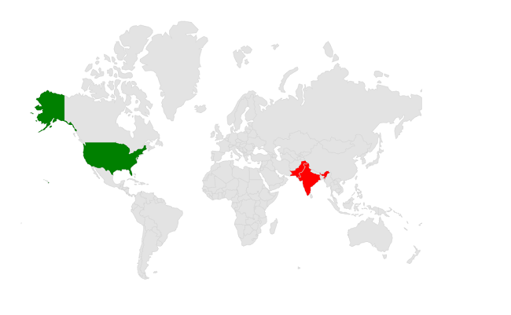

# Shapes in MAUI Maps (SfMaps)

This section explains about shapes and how to apply colors to the shapes based on specific values in the Flutter maps.

## Shape color

You can apply color, stroke color and stroke thickness to the shapes using the [`MapShapeLayer.ShapeFill`](https://pub.dev/documentation/syncfusion_flutter_maps/latest/maps/MapShapeLayer/color.html), [`MapShapeLayer.ShapeStroke`](https://pub.dev/documentation/syncfusion_flutter_maps/latest/maps/MapShapeLayer/strokeColor.html) and [`MapShapeLayer.ShapeStrokeThickness`](https://pub.dev/documentation/syncfusion_flutter_maps/latest/maps/MapShapeLayer/strokeWidth.html) properties respectively.





     <maps:SfMaps x:Name="sfmap" >
        
        <maps:SfMaps.Layer>

            <maps:MapShapeLayer ShapesSource="https://cdn.syncfusion.com/maps/map-data/world-map.json" ShapeStroke="Green"
                                  ShapeFill="LightGreen"  ShapeStrokeThickness="2" >
            </maps:MapShapeLayer>
            
        </maps:SfMaps.Layer>
        
    </maps:SfMaps>





 public MainPage()
    {
        InitializeComponent();
        SfMaps maps = new SfMaps();
        MapShapeLayer layer = new MapShapeLayer();
        layer.ShapesSource = MapSource.FromResource("world-map.json");
        layer.ShapeFill = Brush.LightGreen;
        layer.ShapeStroke = Brush.Green;
        layer.ShapeStrokeThickness = 2;
        maps.Layer = layer;
        this.Content = maps;
    }





## Hover color

You can apply hover color, stroke color and stroke thickness to the shapes using the [`MapShapeLayer.ShapeHoverFill`](https://pub.dev/documentation/syncfusion_flutter_maps/latest/maps/MapShapeLayer/color.html), [`MapShapeLayer.ShapeHoverStroke`](https://pub.dev/documentation/syncfusion_flutter_maps/latest/maps/MapShapeLayer/strokeColor.html) and [`MapShapeLayer.ShapeHoverStrokeThickness`](https://pub.dev/documentation/syncfusion_flutter_maps/latest/maps/MapShapeLayer/strokeWidth.html) properties respectively.





     <maps:SfMaps x:Name="sfmap" >
        
        <maps:SfMaps.Layer>

            <maps:MapShapeLayer ShapesSource="https://cdn.syncfusion.com/maps/map-data/world-map.json" ShapeHoverStroke="Blue"
                                  ShapeHoverFill="LightBlue"  ShapeHoverStrokeThickness="2" >
            </maps:MapShapeLayer>
            
        </maps:SfMaps.Layer>
        
    </maps:SfMaps>





 public MainPage()
    {
        InitializeComponent();
        SfMaps maps = new SfMaps();
        MapShapeLayer layer = new MapShapeLayer();
        layer.ShapesSource = MapSource.FromResource("world-map.json");
        layer.ShapeHoverFill = Brush.LightBlue;
        layer.ShapeHoverStroke = Brush.Blue;
        layer.ShapeHoverStrokeThickness = 2;
        maps.Layer = layer;
        this.Content = maps;
    }
    




## Applying colors based on the data

If you return a color from the [`shapeColorValueMapper`](https://pub.dev/documentation/syncfusion_flutter_maps/latest/maps/MapShapeSource/shapeColorValueMapper.html), then the color will be applied to the respective shape straightaway.

If you return a value of different type other than the color from the [`shapeColorValueMapper`](https://pub.dev/documentation/syncfusion_flutter_maps/latest/maps/MapShapeSource/shapeColorValueMapper.html), then you must set the [`MapShapeSource.shapeColorMappers`](https://pub.dev/documentation/syncfusion_flutter_maps/latest/maps/MapShapeSource/shapeColorMappers.html) property which is a collection of [`MapColorMapper`](https://pub.dev/documentation/syncfusion_flutter_maps/latest/maps/MapColorMapper-class.html) to apply colors for the respective shapes.

N> You can show legend using the [`MapShapeLayer.legend`](https://pub.dev/documentation/syncfusion_flutter_maps/latest/maps/MapShapeLayer/legend.html) property. The icons color of the legend is applied based on the colors returned in the [`MapShapeSource.shapeColorValueMapper`](https://pub.dev/documentation/syncfusion_flutter_maps/latest/maps/MapShapeSource/shapeColorValueMapper.html) property and the text will be taken from the [`primaryValueMapper`](https://pub.dev/documentation/syncfusion_flutter_maps/latest/maps/MapShapeSource/primaryValueMapper.html). It is possible to customize the legend icons color and text using the [`MapShapeSource.shapeColorMappers`](https://pub.dev/documentation/syncfusion_flutter_maps/latest/maps/MapShapeSource/shapeColorMappers.html) property.





     <maps:SfMaps x:Name="sfmap" >
        
        <maps:SfMaps.Layer>

            <maps:MapShapeLayer ShapesSource="https://cdn.syncfusion.com/maps/map-data/australia.json" DataSource="{Binding Data}" PrimaryValuePath="Country" ShapeDataField="STATE_NAME" ShapeColorValuePath = "Color" >
            
            </maps:MapShapeLayer>
            
        </maps:SfMaps.Layer>
        
    </maps:SfMaps>





public MainPage()
    {
        InitializeComponent();
        ObservableCollection<Model> Data = new ObservableCollection<Model>();
        Data.Add(new Model("New South Wales", Colors.Green));
        Data.Add(new Model("Northern Territory", Colors.Blue));
        Data.Add(new Model("Victoria", Colors.LightGreen));
        Data.Add(new Model("Tasmania", Colors.Orange));
        Data.Add(new Model("Queensland", Colors.Red));
        Data.Add(new Model("Western Australia", Colors.Yellow));
        Data.Add(new Model("South Australia", Colors.Violet));

        SfMaps maps = new SfMaps();
        MapShapeLayer layer = new MapShapeLayer();
        

        layer.ShapesSource = MapSource.FromUri(new Uri("https://cdn.syncfusion.com/maps/map-data/australia.json"));
        layer.DataSource = Data;
        layer.PrimaryValuePath = "Country";
        layer.ShapeDataField = "STATE_NAME";
        layer.ShapeColorValuePath = "Color";

        maps.Layer = layer;
        this.Content = maps;
    }
    class Model
    {
        public Model(string country, Color color)
        {
            Country = country;
            Color = color;
        }
        public String Country { get; set; }
        public Color Color { get; set; }
    }





## Equal color mapping

You can apply color to the shape by comparing a value that returns from the [`ColorMappings`](https://pub.dev/documentation/syncfusion_flutter_maps/latest/maps/MapShapeSource/shapeColorValueMapper.html) with the [`EqualColorMapping.Value`](https://pub.dev/documentation/syncfusion_flutter_maps/latest/maps/MapColorMapper/value.html). For the matched values, the [`EqualColorMapping.color`](https://pub.dev/documentation/syncfusion_flutter_maps/latest/maps/MapColorMapper/color.html) will be applied to the respective shapes.





     <maps:SfMaps x:Name="sfmap" >
        
        <maps:SfMaps.Layer>

            <maps:MapShapeLayer ShapesSource="https://cdn.syncfusion.com/maps/map-data/world-map.json" DataSource="{Binding Data}" PrimaryValuePath="Country" ShapeDataField="name" ShapeColorValuePath = "Storage" >
            
                <map:MapShapeLayer.ColorMappings>

                    <map:EqualColorMapping Color="Red" Value = "Low" />
                     <map:EqualColorMapping Color="Blue" Value = "High" />

                </map:MapShapeLayer.ColorMappings>

            </maps:MapShapeLayer>
            
        </maps:SfMaps.Layer>
        
    </maps:SfMaps>





public MainPage()
{
    InitializeComponent();
    ObservableCollection<Model> Data = new ObservableCollection<Model>();
    Data.Add(new Model("India", "Low"));
    Data.Add(new Model("Greenland", "High"));
    Data.Add(new Model("Pakistan", "Low"));

    SfMaps maps = new SfMaps();
    MapShapeLayer layer = new MapShapeLayer();
    layer.ShapesSource = MapSource.FromResource("world-map.json");
    layer.DataSource = Data;
    layer.PrimaryValuePath = "Country";
    layer.ShapeDataField = "name";
    layer.ShapeColorValuePath = "Storage";

    EqualColorMapping colorMapping = new EqualColorMapping();
    colorMapping.Color = Colors.Red;
    colorMapping.Value = "Low";

    EqualColorMapping colorMapping1 = new EqualColorMapping();
    colorMapping1.Color = Colors.Blue;
    colorMapping1.Value = "High";

    layer.ColorMappings.Add(colorMapping);
    layer.ColorMappings.Add(colorMapping1);
        
    maps.Layer = layer;
    this.Content = maps;
}
class Model
{
    public Model(string country, string storage)
    {
         Country = country;
        Storage = storage;
    }
    public String Country { get; set; }
    public String Storage { get; set; }
}




## Range color mapping

You can apply color to the shape based on whether the value returned from [`ColorMappings`](https://pub.dev/documentation/syncfusion_flutter_maps/latest/maps/MapShapeSource/shapeColorValueMapper.html) falls within the [`RangeColorMapping.From`](https://pub.dev/documentation/syncfusion_flutter_maps/latest/maps/MapColorMapper/from.html) and [`RangeColorMapping.To`](https://pub.dev/documentation/syncfusion_flutter_maps/latest/maps/MapColorMapper/to.html). Then, the [`RangeColorMapping.Color`](https://pub.dev/documentation/syncfusion_flutter_maps/latest/maps/MapColorMapper/color.html) will be applied to the respective shapes.





     <maps:SfMaps x:Name="sfmap" >
        
        <maps:SfMaps.Layer>

            <maps:MapShapeLayer ShapesSource="https://cdn.syncfusion.com/maps/map-data/world-map.json" DataSource="{Binding Data}" PrimaryValuePath="Country" ShapeDataField="name" ShapeColorValuePath = "Storage" >
            
                <map:MapShapeLayer.ColorMappings>

                    <map:RangeColorMapping Color="Red" From="0" To="90"/>
                    <map:RangeColorMapping Color="Blue" From="100" To="150"/>
                     
                </map:MapShapeLayer.ColorMappings>

            </maps:MapShapeLayer>
            
        </maps:SfMaps.Layer>
        
    </maps:SfMaps>





public MainPage()
{
    InitializeComponent();
    ObservableCollection<Model> Data = new ObservableCollection<Model>();
    Data.Add(new Model("India", 80));
    Data.Add(new Model("Greenland",30 ));
    Data.Add(new Model("Kazakhstan", 105 ));

    SfMaps maps = new SfMaps();
    MapShapeLayer layer = new MapShapeLayer();
    layer.DataSource = Data;
    layer.PrimaryValuePath = "Country";
    layer.ShapeDataField = "name";
    layer.ShapeColorValuePath = "Count";

    RangeColorMapping colorMapping = new RangeColorMapping();
    colorMapping.Color = Colors.Red;
    colorMapping.From = 0;
    colorMapping.To = 90;

    RangeColorMapping colorMapping1 = new RangeColorMapping();
    colorMapping.Color = Colors.Blue;
    colorMapping.From =100;
    colorMapping.To = 150;

    layer.ColorMappings.Add(colorMapping);
    layer.ColorMappings.Add(colorMapping1);
        
    maps.Layer = layer;
    this.Content = maps;
}
class Model
{
    public Model(string country, int count)
    {
         Country = country;
        Count = count;
    }
    public String Country { get; set; }
    public String Count { get; set; }
}




N>
* Refer the [`MapShapeLayer.BubbleSettings`](https://pub.dev/documentation/syncfusion_flutter_maps/latest/maps/MapShapeSource/bubbleColorMappers.html), for setting the bubble colors based on the specific value. You can refer to our [MAUI Maps](https://www.syncfusion.com/flutter-widgets/flutter-maps) feature tour page for its groundbreaking feature representations. You can also explore our [MAUI Maps Shapes example](https://flutter.syncfusion.com/#/maps/shape-layer/range-color-mapping) that shows how to configure a Maps in Flutter.
