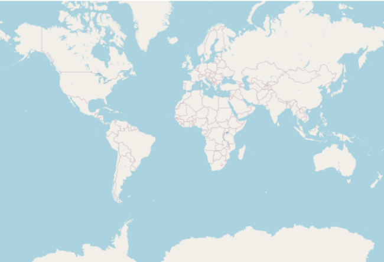
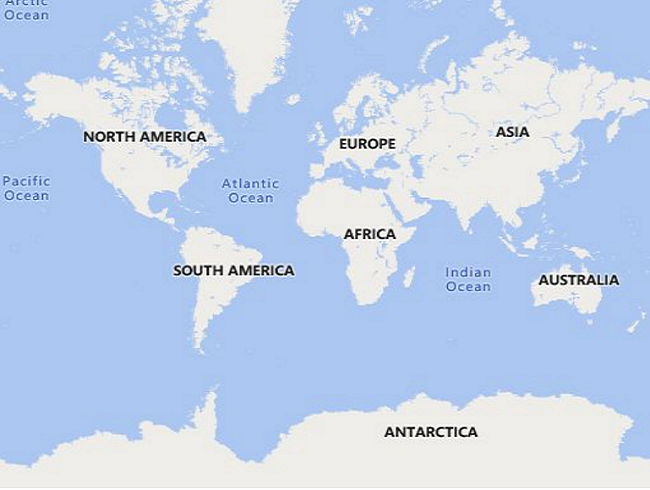
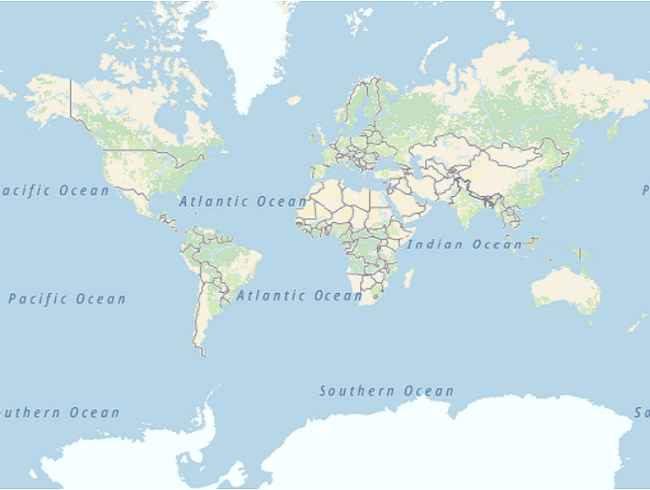
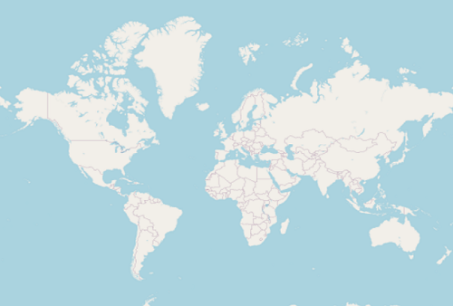

# Tile Layer in .NET MAUI Maps (SfMaps)

The tile layer renders the tiles returned from web map tile services such as Bing Maps, OpenStreetMaps, Google Maps, TomTom, etc.

## Setting URL template

The [`MapTileLayer`](https://help.syncfusion.com/cr/maui/Syncfusion.Maui.Maps.MapTileLayer.html?tabs=tabid-1) needs to be added to the [`Layer`](https://help.syncfusion.com/cr/maui/Syncfusion.Maui.Maps.SfMaps.html?tabs=tabid-1#Syncfusion_Maui_Maps_SfMaps_Layer) in [`SfMaps`](https://help.syncfusion.com/cr/maui/Syncfusion.Maui.Maps.SfMaps.html?tabs=tabid-1). The URL of the providers must be set in the [`MapTileLayer.UrlTemplate`](https://help.syncfusion.com/cr/maui/Syncfusion.Maui.Maps.MapTileLayer.html#Syncfusion_Maui_Maps_MapTileLayer_UrlTemplate) property.

The [`UrlTemplate`](https://help.syncfusion.com/cr/maui/Syncfusion.Maui.Maps.MapTileLayer.html#Syncfusion_Maui_Maps_MapTileLayer_UrlTemplate) property accepts the URL in [`WMTS`](https://en.wikipedia.org/wiki/Web_Map_Tile_Service) format i.e. {z} — zoom level, {x} and {y} — tile coordinates. This URL might vary slightly depending on the providers. The formats can be,
    https://example_provider/{z}/{x}/{y}.png,
    https://example_provider/z={z}/x={x}/y={y}.png,
    https://example_provider/z={z}/x={x}/y={y}.png?key=subscription_key, etc.

We will replace the {z}, {x}, and {y} internally based on the current [`Center`](https://help.syncfusion.com/cr/maui/Syncfusion.Maui.Maps.MapTileLayer.html#Syncfusion_Maui_Maps_MapTileLayer_Center) and the zoom level.

N> Some of the providers may need a subscription key. Please include them in the [`UrlTemplate`](https://help.syncfusion.com/cr/maui/Syncfusion.Maui.Maps.MapTileLayer.html#Syncfusion_Maui_Maps_MapTileLayer_UrlTemplate) itself, as mentioned in the above example. Please note that the format may vary between each map provider. You can check the exact URL format needed for the providers on their official websites.

## Adding OSM/OpenStreetMap

The OpenStreetMap is one of the tile/image providers which can be used free of cost. It returns map tiles for the requested coordinates for every request. The URL format of the OSM map provider is shown in the below code sample.

N> Though the OpenStreetMap is free of cost, we recommend you check the licensing terms and conditions once before using it.





 <maps:SfMaps>
    <maps:SfMaps.Layer>
        <maps:MapTileLayer UrlTemplate="https://tile.openstreetmap.org/{z}/{x}/{y}.png" />
    </maps:SfMaps.Layer>
</maps:SfMaps>





SfMaps map = new SfMaps();
MapTileLayer tileLayer = new MapTileLayer();
tileLayer.UrlTemplate = "https://tile.openstreetmap.org/{z}/{x}/{y}.png";
map.Layer = tileLayer;
this.Content = map;





## Adding Bing maps

An additional step is required for the Bing maps. The format of the required URL varies from the other tile services. Hence, we have added a top-level [`GetBingUrl`](https://help.syncfusion.com/cr/maui/Syncfusion.Maui.Maps.MapTileLayer.html#Syncfusion_Maui_Maps_MapTileLayer_GetBingUrl_System_String_) method which returns the URL in the required format. The subscription key is needed for bing maps. You can create an API key by following the steps mentioned in this [`link`](https://learn.microsoft.com/en-us/bingmaps/getting-started/bing-maps-dev-center-help/getting-a-bing-maps-key) and append this key to the bing map URL before passing it to the [`GetBingUrl`](https://help.syncfusion.com/cr/maui/Syncfusion.Maui.Maps.MapTileLayer.html#Syncfusion_Maui_Maps_MapTileLayer_GetBingUrl_System_String_) method. You can use the URL returned from this method to pass it to the [`UrlTemplate`](https://help.syncfusion.com/cr/maui/Syncfusion.Maui.Maps.MapTileLayer.html#Syncfusion_Maui_Maps_MapTileLayer_UrlTemplate) property.

Some of the providers provide different map types. For example, Bing Maps provide map types like Road, Aerial, AerialWithLabels etc. These types too can be passed in the [`UrlTemplate`](https://help.syncfusion.com/cr/maui/Syncfusion.Maui.Maps.MapTileLayer.html#Syncfusion_Maui_Maps_MapTileLayer_UrlTemplate) itself, as shown in the following example. You can check the official websites of the tile providers to know about the available types and the code for them.



public MainPage()
{
	InitializeComponent();
    SfMaps map = new SfMaps();
    MapTileLayer tileLayer = new MapTileLayer();
    this.GenerateBing(tileLayer);
    map.Layer = tileLayer;
    this.Content = map;
}

private async Task GenerateBing(MapTileLayer tileLayer)
{
    tileLayer.UrlTemplate = await MapTileLayer.GetBingUrl("https://dev.virtualearth.net/REST/V1/Imagery/Metadata/RoadOnDemand?output=json&uriScheme=https&include=ImageryProviders&key=subscription_key") + "?name=bingName";
}



## Other map tile providers

Our tile layer is not limited or specific to any tile providers mentioned here. It supports requesting tiles from any tile providers using the unique URL for respective tile providers and renders them.

For other map providers like TomTom, MapBox, etc., you can check the respective official websites and provide the URL in the format mentioned in the [`Setting URL template`](https://help.syncfusion.com/maui/maps/tile-layer#setting-url-template) section.

Below is the example of adding TomTom map. You can get the TomTom API key from this [`link`](https://developer.tomtom.com/map-display-api/documentation/product-information/introduction).



SfMaps map = new SfMaps();
MapTileLayer tileLayer = new MapTileLayer();
tileLayer.UrlTemplate = "https://api.tomtom.com/map/1/tile/basic/main/{z}/{x}/{y}.png?key=subscription_key";
map.Layer = tileLayer;
this.Content = map;



## Changing the center latitude and longitude

You can set the center position by setting the [`MapTileLayer.Center`](https://help.syncfusion.com/cr/maui/Syncfusion.Maui.Maps.MapTileLayer.html?tabs=tabid-1#Syncfusion_Maui_Maps_MapTileLayer_Center) property. It represents the center position of the map layer.

Based on the size of the [`SfMaps`](https://help.syncfusion.com/cr/maui/Syncfusion.Maui.Maps.html) control, [`Center`](https://help.syncfusion.com/cr/maui/Syncfusion.Maui.Maps.MapTileLayer.html?tabs=tabid-1#Syncfusion_Maui_Maps_MapTileLayer_Center) and [`ZoomLevel`](https://help.syncfusion.com/cr/maui/Syncfusion.Maui.Maps.MapZoomPanBehavior.html#Syncfusion_Maui_Maps_MapZoomPanBehavior_ZoomLevel), the number of initial tiles needed in the viewport alone will be rendered. Refer this section for enabling [`zooming and panning`](https://help.syncfusion.com/maui/maps/zoom-pan).

Defaults to `MapLatLng(0.0, 0.0)`.





 <map:SfMaps>
    <map:SfMaps.Layer>
        <map:MapTileLayer UrlTemplate="https://tile.openstreetmap.org/{z}/{x}/{y}.png">
            <map:MapTileLayer.Center>
                <map:MapLatLng Latitude="27.175014"
                               Longitude="78.042152">
                </map:MapLatLng>
            </map:MapTileLayer.Center>
        </map:MapTileLayer>
    </map:SfMaps.Layer>
</map:SfMaps>





SfMaps map = new SfMaps();
MapTileLayer tileLayer = new MapTileLayer();
tileLayer.UrlTemplate = "https://tile.openstreetmap.org/{z}/{x}/{y}.png";
tileLayer.Center = new MapLatLng(27.175014, 78.042152);
map.Layer = tileLayer;
this.Content = map;





## Cache a tile images in application memory

The [`CanCacheTiles`](https://help.syncfusion.com/cr/maui/Syncfusion.Maui.Maps.MapTileLayer.html#Syncfusion_Maui_Maps_MapTileLayer_CanCacheTiles) property is used to decide whether the tile images should be cached in application memory or not. The default value of the [`CanCacheTiles`](https://help.syncfusion.com/cr/maui/Syncfusion.Maui.Maps.MapTileLayer.html#Syncfusion_Maui_Maps_MapTileLayer_CanCacheTiles) is `false`.

While enabling the [`CanCacheTiles`](https://help.syncfusion.com/cr/maui/Syncfusion.Maui.Maps.MapTileLayer.html#Syncfusion_Maui_Maps_MapTileLayer_CanCacheTiles), we need to set the tile server name to maintain the folder to store cache tiles in the [`MapTileLayer.UrlTemplate`](https://help.syncfusion.com/cr/maui/Syncfusion.Maui.Maps.MapTileLayer.html#Syncfusion_Maui_Maps_MapTileLayer_UrlTemplate) property. The default tile server name to store the tile cache is OSM. If you want to change the server name, you can use the following URL format.

https://example_provider/{z}/{x}/{y}.png?name=serverName

Here, you can replace the serverName as per your wish.





<map:SfMaps>
    <map:SfMaps.Layer>
        <map:MapTileLayer UrlTemplate = "http://api.tomtom.com/map/1/tile/basic/main/{z}/{x}/{y}.png?key=subscription_key?name=tomtom"
                          CanCacheTiles= "True">
        </map:MapTileLayer>
    </map:SfMaps.Layer>
</map:SfMaps>





SfMaps map = new SfMaps();
MapTileLayer tileLayer = new MapTileLayer();
tileLayer.UrlTemplate = "http://api.tomtom.com/map/1/tile/basic/main/{z}/{x}/{y}.png?key=subscription_key?name=tomtom";
tileLayer.CanCacheTiles = true;
map.Layer = tileLayer;
this.Content = map;





## Clear a cached tile images from application memory

The [`DeleteTilesFromCache`](https://help.syncfusion.com/cr/maui/Syncfusion.Maui.Maps.MapTileLayer.html#Syncfusion_Maui_Maps_MapTileLayer_DeleteTilesFromCache) method is used to clear the cached tile images from the application cache memory.





<maps:SfMaps>
    <maps:SfMaps.Layer>
        <maps:MapTileLayer x:Name="tileLayer" UrlTemplate="https://tile.openstreetmap.org/{z}/{x}/{y}.png" />
    </maps:SfMaps.Layer>
</maps:SfMaps>





tileLayer.DeleteTilesFromCache();





## Markers

You can add markers in the tile layer. The procedure is very similar to the shape layer. Kindly refer to the [markers](https://help.syncfusion.com/maui/maps/markers) section.

N> You can refer to our [.NET MAUI Maps](https://www.syncfusion.com/maui-controls/maui-maps) feature tour page for its groundbreaking feature representations. You can also explore our [`.NET MAUI Maps Tile layer example`](https://github.com/syncfusion/maui-demos/) which shows how to configure a Maps in .NET MAUI.