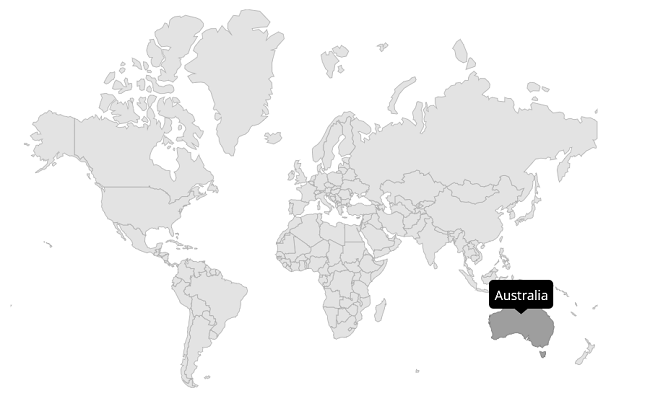

# Tooltip in MAUI Maps (SfMaps)

Tooltip is used to indicate the shape, bubble, marker information during the tap, or click interaction. This section helps to learn about
 how to show tooltip for the shapes, bubbles, and markers in the maps and customize them.

## Tooltip for the shapes

The [`MapShapeLayer.ShowShapeTooltip`](https://pub.dev/documentation/syncfusion_flutter_maps/latest/maps/MapShapeLayer/
shapeTooltipBuilder.html) is used to clearly indicate the shape information every time when you interacts with the shapes i.e., 
while tapping in touch devices and hover enter in the mouse enabled devices.





     <map:SfMaps>
            <map:SfMaps.Layer>
               <map:MapShapeLayer 
                    ShapesSource="https://cdn.syncfusion.com/maps/map-data/world-map.json"  DataSource="{Binding Data}" ShapeDataField="continent"
                         PrimaryValuePath="Continent"  ShapeStroke="DarkGray" ShowShapeTooltip="True">
                </map:MapShapeLayer>
           </map:SfMaps.Layer>
    </map:SfMaps>





public MainPage()
    {
        InitializeComponent();
        ObservableCollection<Model> Data = new ObservableCollection<Model>()
        {
               new Model("Asia", "44,579,000 sq. km."),
               new Model("Africa", "30,370,000 sq. km."),
               new Model("Europe", "10,180,000 sq. km."),
               new Model("North America", "24,709,000 sq. km."),
               new Model("South America", "17,840,000 sq. km."),
               new Model("Australia", "8,600,000 sq. km."),
        };
        SfMaps maps = new SfMaps();
        MapShapeLayer layer = new MapShapeLayer();

        layer.ShapesSource = MapSource.FromUri(new Uri("https://cdn.syncfusion.com/maps/map-data/world-map.json"));
        layer.DataSource = Data;
        layer.PrimaryValuePath = "Continent";
        layer.ShapeDataField = "continent";
        layer.ShapeStroke = Colors.DarkGray;
        layer.ShowShapeTooltip = true;

        maps.Layer = layer;
        this.Content = maps;
    }
   public class Model
   {
        public string Continent { get; set; }
        public string Area { get; set; }
        public Model(string continent, string area)
        {
            this.Continent = continent;
            this.Area = area;
        }
   }





N>
* Refer the [`MapTooltipSettings`](https://pub.dev/documentation/syncfusion_flutter_maps/latest/maps/MapTooltipSettings-class.html), for customizing the tooltip.

## Tooltip for the bubbles

The [`MapShapeLayer.ShowBubbleTooltip`](https://pub.dev/documentation/syncfusion_flutter_maps/latest/maps/MapShapeLayer/
shapeTooltipBuilder.html) is used to clearly indicate the bubble information every time when you interacts with the bubbles i.e., 
while tapping in touch devices and hover enter in the mouse enabled devices.





     <map:SfMaps>
            <map:SfMaps.Layer>
                <map:MapShapeLayer 
                        ShapesSource="https://cdn.syncfusion.com/maps/map-data/world-map.json" DataSource="{Binding Data}"  ShapeDataField="continent"
                            PrimaryValuePath="Continent"  ShowBubbles="True" ShapeStroke="DarkGrey" ShowBubbleTooltip="True">

                    <map:MapShapeLayer.BubbleSettings>
                        <map:MapBubbleSettings ColorValuePath="Population" 
                                              SizeValuePath="Population" 
                                              Opacity="1"
                                              MinSize="35"
                                              MaxSize="80">

                            <map:MapBubbleSettings.ColorMappings>
                                <map:RangeColorMapping Color="#9340ff"  From="0"  To="100"/>
                            </map:MapBubbleSettings.ColorMappings>

                        </map:MapBubbleSettings>
                    </map:MapShapeLayer.BubbleSettings>
                </map:MapShapeLayer>
           </map:SfMaps.Layer>
    </map:SfMaps>





public MainPage()
	{
		InitializeComponent();
        ObservableCollection<DataModel> Data = new ObservableCollection<DataModel>()
            {
               new DataModel("Asia", 51),
               new DataModel("Africa", 58),
               new DataModel("Europe", 48),
               new DataModel("North America", 41),
               new DataModel("South America", 14),
               new DataModel("Australia", 23),
            };
        SfMaps maps = new SfMaps();
        MapShapeLayer layer = new MapShapeLayer();

        layer.ShapesSource = MapSource.FromUri(new Uri("https://cdn.syncfusion.com/maps/map-data/world-map.json"));
        layer.DataSource = Data;
        layer.PrimaryValuePath = "Continent";
        layer.ShapeDataField = "continent";
        layer.ShapeStroke = Colors.DarkGray;
        layer.ShowBubbles = true;
        layer.ShowBubbleTooltip = true;

        MapBubbleSettings bubbleSetting = new MapBubbleSettings()
        {
            ColorValuePath = "Population",
            SizeValuePath = "Population",
            Opacity = 1,
            MinSize = 30,
            MaxSize = 80,
        };

        bubbleSetting.ColorMappings.Add(new RangeColorMapping() { Color = Color.FromRgb(147, 64, 255), From = 0, To=100 });
        layer.BubbleSettings = bubbleSetting;
      
        layer.BubbleSettings = bubbleSetting;
        maps.Layer = layer;
        this.Content = maps;
    }
public class DataModel
{
    public string Continent { get; set; }
    public int Population { get; set; }
    public DataModel(string continent, int population)
    {
        this.Continent = continent;
        this.Population = population;
    }
}





## Tooltip for the markers

The [`MapShapeLayer.ShowMarkerTooltip`](https://pub.dev/documentation/syncfusion_flutter_maps/latest/maps/MapShapeLayer/
shapeTooltipBuilder.html) is used to clearly indicate the marker information every time when you interacts with the markers i.e., 
while tapping in touch devices and hover enter in the mouse enabled devices.





     <map:SfMaps>
            <map:SfMaps.Layer>
                <map:MapShapeLayer 
                        ShapesSource="https://cdn.syncfusion.com/maps/map-data/world-map.json"  ShapeStroke="DarkGrey" ShowMarkerTooltip="True">

                    <map:MapShapeLayer.Markers>
                        <map:MapMarkerCollection>
                            <map:MapMarker
                              Latitude="1454.6" IconWidth="20" IconHeight="20" IconType="Diamond" 
                                 Longitude="36.0"  />
                            <map:MapMarker
                              Latitude="34.0479" IconWidth="20" IconHeight="20" IconType="Circle" 
                                 Longitude="100.6124" />

                        </map:MapMarkerCollection>
                    </map:MapShapeLayer.Markers>
           </map:SfMaps.Layer>
    </map:SfMaps>





public MainPage()
	{
		InitializeComponent();
        SfMaps maps = new SfMaps();
        MapShapeLayer layer = new MapShapeLayer();

        layer.ShapesSource = MapSource.FromUri(new Uri("https://cdn.syncfusion.com/maps/map-data/world-map.json"));
        layer.ShowMarkerTooltip = true;
        MapMarker diamondMarker = new MapMarker();
        diamondMarker.Longitude = 36.0;
        diamondMarker.Latitude = 1454.6;
        diamondMarker.IconHeight = 20;
        diamondMarker.IconWidth = 20;
        diamondMarker.IconType = MapIconType.Diamond;

        MapMarker circleMarker = new MapMarker();
        circleMarker.Longitude = 100.6124;
        circleMarker.Latitude = 34.0479;
        circleMarker.IconHeight = 20;
        circleMarker.IconWidth = 20;
        circleMarker.IconType = MapIconType.Circle;

        MapMarkerCollection mapMarkers = new MapMarkerCollection();
        mapMarkers.Add(diamondMarker);
        mapMarkers.Add(circleMarker);

        layer.Markers = mapMarkers;
        maps.Layer = layer;
        this.Content = maps;
    }





N>
* Refer the [`MapTooltipSettings`](https://pub.dev/documentation/syncfusion_flutter_maps/latest/maps/MapTooltipSettings-class.html), for customizing the tooltip.

## Appearance customization

## Customizing Data Templates in ToolTip

Data template can be customized for items and headers of the control. The following code example shows the usage of DataTemplate.





 <map:SfMaps>
                <map:SfMaps.Layer>
                    <map:MapShapeLayer 
                                   ShapesSource="https://cdn.syncfusion.com/maps/map-data/world-map.json"
                                   DataSource="{Binding Data}"
                                   ShapeDataField="continent"
                                   PrimaryValuePath="Continent"
                                   ShowShapeTooltip="True"
                                   >
                        <map:MapShapeLayer.ShapeTooltipTemplate>
                            <DataTemplate>
                                <Grid Padding="10" WidthRequest="150">
                                    <Grid.RowDefinitions>
                                        <RowDefinition Height="Auto" />
                                        <RowDefinition Height="Auto" />
                                        <RowDefinition Height="Auto" />
                                    </Grid.RowDefinitions>
                                    <Grid.ColumnDefinitions>
                                        <ColumnDefinition Width="10"/>
                                        <ColumnDefinition Width="Auto"/>
                                    </Grid.ColumnDefinitions>
                                    <Image Source="flag.png" Grid.Column="0" Grid.Row="0" WidthRequest="20" HeightRequest="20"></Image>
                                    <Label Text="{Binding Continent}" TextColor="White"  Grid.Column="1" Grid.Row="0" Padding="10"/>
                                    <BoxView Grid.Row="1" Grid.ColumnSpan="2" HeightRequest="2" />
                                    <Label Grid.Row="2" Grid.ColumnSpan="2"  Text="{Binding Area}" TextColor="White" />
                                </Grid>
                            </DataTemplate>
                        </map:MapShapeLayer.ShapeTooltipTemplate>
                    </map:MapShapeLayer>
                </map:SfMaps.Layer>
    </map:SfMaps>





 public ToolTip()
	{
        InitializeComponent();
        ObservableCollection<Model> Data = new ObservableCollection<Model>()
            {
               new Model("Asia", 130,"30,370,000 sq. km."),
               new Model("Africa", 120,"24,709,000 sq. km."),
               new Model("Europe", 586, "17,840,000 sq. km."),
               new Model("North America", 472,"8,600,000 sq. km."),
               new Model("South America", 363,"10,180,000 sq. km."),
               new Model("Australia", 348,"59,180,000 sq. km."),
          };

        SfMaps maps = new SfMaps();
        MapShapeLayer layer = new MapShapeLayer();
        layer.ShapesSource = MapSource.FromUri(new Uri("https://cdn.syncfusion.com/maps/map-data/world-map.json"));
        layer.PrimaryValuePath = "Continent";
        layer.ShapeDataField = "continent";
        layer.DataSource = Data;
        layer.ShowShapeTooltip = true;
        layer.ShapeTooltipTemplate = CreateDataTemplate();

        maps.Layer = layer;
        this.Content = maps;
    }
    private DataTemplate CreateDataTemplate()
    {
        return new DataTemplate(() =>
        {
            var grid = new Grid()
            {
                RowDefinitions =
                {
                  new RowDefinition { Height = GridLength.Auto },
                  new RowDefinition{ Height = GridLength.Auto },
                  new RowDefinition { Height = GridLength.Auto }
                },
                ColumnDefinitions =
                {
                    new ColumnDefinition{ Width = 10},
                    new ColumnDefinition{ Width = GridLength.Auto},
                }
            };
            grid.WidthRequest = 120;
            var image = new Image { Source = "flag.png", WidthRequest = 20, HeightRequest = 20 };
            grid.SetRow(image, 0); grid.SetColumn(image, 0);
            var label = new Label { FontAttributes = FontAttributes.Bold, TextColor = Colors.White, Padding = 5, Text ="sdfg" , };
            grid.SetRow(label, 0); grid.SetColumn(label, 1);
            var boxView = new BoxView { BackgroundColor = Colors.Red, HeightRequest = 1, };
            grid.SetRow(boxView, 1); grid.SetColumnSpan(boxView, 2);
            var areaLabel = new Label { FontAttributes = FontAttributes.Bold, Text = "10,180,000 sq. km.", TextColor = Colors.White, };
            grid.SetRow(areaLabel, 2); grid.SetColumnSpan(areaLabel, 2);
            grid.Children.Add(image);
            grid.Children.Add(label);
            grid.Children.Add(boxView);
            grid.Children.Add(areaLabel);
            return new ViewCell { View = grid };
        });
    }

public class Model
{
    public string Continent { get; set; }
    public string Area { get; set; }
    public int Population1 { get; set; }
    public Model(string continent, int population, string area)
    {
        this.Continent = continent;
        this.Population1 = population;
        this.Area = area;
    }
}





N>
* The tooltip displays the binding context value for shapes and bubbles.
* Marker tooltip displays a Latitude and Longitude value.

N>
* Refer the [MapShapeLayer.ShapeTooltipTemplate](https://pub.dev/documentation/syncfusion_flutter_maps/latest/maps/MapShapeLayer/shapeTooltipBuilder.html), for customize tooltip for the shapes.
* Refer the [MapShapeLayer.BubbleTooltipTemplate](https://pub.dev/documentation/syncfusion_flutter_maps/latest/maps/MapShapeLayer/bubbleTooltipBuilder.html), for customize tooltip for the bubbles.
* Refer the [MapLayer.MarkerTooltipTemplate](https://pub.dev/documentation/syncfusion_flutter_maps/latest/maps/MapLayer/markerTooltipBuilder.html), for customize tooltip for the markers.

## Customizing Data Templates selector in ToolTip

Data template selector can be customized for template of the control. You can change the template dynamically. The following code example shows the usage of DataTemplate selector.





<ContentPage.Resources>
        <ResourceDictionary>
            <DataTemplate x:Key="HighPopulationTemplate">
                <StackLayout IsClippedToBounds="false"
                         HorizontalOptions="StartAndExpand"
                         VerticalOptions="Center"
                         HeightRequest="30">
                    <Label Text="Hi"
                           Scale="1"
                           TextColor="White"
                           BackgroundColor="Red"
                           HorizontalOptions="StartAndExpand"
                       VerticalOptions="Center"
                       HeightRequest="15"
                       WidthRequest="23" />
                </StackLayout>
            </DataTemplate>
            <DataTemplate x:Key="LowPopulationTemplate">
                <StackLayout IsClippedToBounds="false"
                         HorizontalOptions="StartAndExpand"
                         VerticalOptions="Center"
                         HeightRequest="30">
                    <Label Text="Hi"
                           Scale="1"
                           TextColor="Yellow"
                           HorizontalOptions="StartAndExpand"
                       VerticalOptions="Center"
                       HeightRequest="15"
                       WidthRequest="23" />
                </StackLayout>
            </DataTemplate>
        </ResourceDictionary>
    </ContentPage.Resources>
       <map:SfMaps>
                <map:SfMaps.Layer>
                    <map:MapShapeLayer x:Name="layer"
                                   ShapesSource="https://cdn.syncfusion.com/maps/map-data/world-map.json"
                                   ShapeStroke="DarkGrey" >
                        <map:MapShapeLayer.Markers>
                         <map:MapMarkerCollection>
                             <map:MapMarker Latitude="20.5595" Longitude="22.9375"  />
                            <map:MapMarker Latitude="21.7679" Longitude="78.8718"  />
                            <map:MapMarker Latitude="133.7751"  Longitude="25.2744"  />
                            <map:MapMarker Latitude="60.2551" Longitude="84.5260" />
                            <map:MapMarker Latitude="195.4915"  Longitude="-50.7832"  />
                         </map:MapMarkerCollection>
                       </map:MapShapeLayer.Markers>
                    </map:MapShapeLayer>
             </map:SfMaps.Layer>
       </map:SfMaps>
        <Button Text="Change marker Template" Clicked="Button_Clicked" />





private void Button_Clicked(object sender, EventArgs e)
    {
        if (layer.MarkerTooltipTemplate != null && layer.MarkerTooltipTemplate.Equals(Resources["LowPopulationTemplate"] as DataTemplate))
        {
            layer.MarkerTooltipTemplate = Resources["HighPopulationTemplate"] as DataTemplate;
        }
        else
        {
            layer.MarkerTooltipTemplate = Resources["LowPopulationTemplate"] as DataTemplate;
        }
    }    





N>
* Data Templates and Data Templates selector are also applicable with bubbles and markers.

N> You can refer to our [MAUI Maps](https://www.syncfusion.com/flutter-widgets/flutter-maps) feature tour page for its groundbreaking feature representations. You can also explore our [MAUI Maps Tooltip example](https://flutter.syncfusion.com/#/maps/shape-layer/tooltip) that shows how to configure a Maps in MAUI.