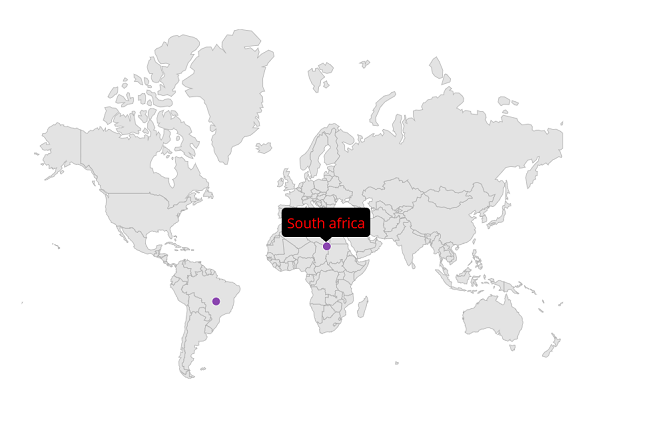

# Tooltip in .NET MAUI Maps (SfMaps)

Tooltip is used to indicate the shape, bubble, marker information during the tap, or hover interactions. This section helps to learn about
 how to show tooltip for the shapes, bubbles, and markers in the maps and customize them.

## Tooltip for the shapes

The [`ShowShapeTooltip`](https://help.syncfusion.com/cr/maui/Syncfusion.Maui.Maps.MapShapeLayer.html#Syncfusion_Maui_Maps_MapShapeLayer_ShowShapeTooltip) is used to clearly indicate the shape information every time when you interacts with the shapes i.e., while tapping in touch devices and hover enter in the mouse enabled devices.





<map:SfMaps>
    <map:SfMaps.Layer>
        <map:MapShapeLayer DataSource="{Binding Data}"
                           PrimaryValuePath="State" 
                           ShapeDataField="name" 
                           ShowShapeToolTip="True">
        </map:MapShapeLayer>
    </map:SfMaps.Layer>
</map:SfMaps>





public MainPage()
{
   InitializeComponent();
   
   ViewModel viewModel = new ViewModel();
   this.BindingContext = viewModel;
   
   MapShapeLayer layer = new MapShapeLayer();
   layer.ShapesSource = MapSource.FromResource("MyProject.world1.shp");
   layer.DataSource = viewModel.Data;
   layer.PrimaryValuePath = "State";
   layer.ShapeDataField = "name";
   layer.ShowShapeToolTip = true;

   SfMaps maps = new SfMaps();
   maps.Layer = layer;
   this.Content = maps;
}

public class ViewModel
{
    public ObservableCollection<Model> Data { get; set; }
	
    public ViewModel()
    {
        Data = new ObservableCollection<Model>();
        Data.Add(new Model("India", 21));
        Data.Add(new Model("United States", 58));
        Data.Add(new Model("Kazakhstan", 41));
        Data.Add(new Model("Italy", 48));
        Data.Add(new Model("Korea", 14));
        Data.Add(new Model("China", 23));
    }
}

public class Model
{
    public String State { get; set; }
    public int Population { get; set; }
	
    public Model(string state, int population)
    {
        State = state;
        Population = population;
    }
}





## Tooltip for the bubbles

The [`ShowBubbleTooltip`](https://help.syncfusion.com/cr/maui/Syncfusion.Maui.Maps.MapShapeLayer.html#Syncfusion_Maui_Maps_MapShapeLayer_ShowBubbleTooltip) is used to clearly indicate the bubble information every time when you interacts with the bubbles i.e., while tapping in touch devices and hover enter in the mouse enabled devices.





<map:SfMaps>
    <map:SfMaps.Layer>
        <map:MapShapeLayer DataSource="{Binding Data}"
                           PrimaryValuePath="State" 
                           ShapeDataField="name" 
                           ShapeHoverFill = "Transparent" 
                           ShapeHoverStroke="Transparent"
                           ShowBubbles="True"
                           ShowBubbleTooltip="True">

            <map:MapShapeLayer.BubbleSettings>
                <map:MapBubbleSettings ColorValuePath="Population" 
                                       SizeValuePath="Population" 
                                       Fill="DarkViolet"
                                       MinSize="30"
                                       MaxSize="80">
                </map:MapBubbleSettings>
            </map:MapShapeLayer.BubbleSettings>
            
        </map:MapShapeLayer>
    </map:SfMaps.Layer>
</map:SfMaps>





	public MainPage()
	{
		InitializeComponent();
		
        ViewModel viewModel = new ViewModel();
        this.BindingContext = viewModel;
		
        MapShapeLayer layer = new MapShapeLayer();
        layer.ShapesSource = MapSource.FromResource("MyProject.world1.shp");
        layer.DataSource = viewModel.Data;
        layer.PrimaryValuePath = "State";
        layer.ShapeDataField = "name";
        layer.ShapeHoverFill = Colors.Transparent;
        layer.ShapeHoverStroke = Colors.Transparent;
        layer.ShowBubbles = true;
        layer.ShowBubbleTooltip = true;

        MapBubbleSettings bubbleSetting = new MapBubbleSettings()
        {
            ColorValuePath = "Population",
            SizeValuePath = "Population",
            Fill = Colors.DarkViolet,
            MinSize = 30,
            MaxSize = 80
        };

        layer.BubbleSettings = bubbleSetting;
		
        SfMaps maps = new SfMaps();
        maps.Layer = layer;
        this.Content = maps;
    }
	
	public class ViewModel
	{
		public ObservableCollection<Model> Data { get; set; }
		
		public ViewModel()
		{
			Data = new ObservableCollection<Model>();
			Data.Add(new Model("India", 21));
			Data.Add(new Model("United States", 58));
			Data.Add(new Model("Kazakhstan", 41));
			Data.Add(new Model("Italy", 48));
			Data.Add(new Model("Korea", 14));
			Data.Add(new Model("China", 23));
		}
	}
	
	public class Model
	{
		public String State { get; set; }
		public int Population { get; set; }
		
		public Model(string state, int population)
		{
			State = state;
			Population = population;
		}
	}





## Tooltip for the markers

The [`ShowMarkerTooltip`](https://help.syncfusion.com/cr/maui/Syncfusion.Maui.Maps.MapLayer.html#Syncfusion_Maui_Maps_MapLayer_ShowMarkerTooltip) is used to clearly indicate the marker information every time when you interacts with the markers i.e., while tapping in touch devices and hover enter in the mouse enabled devices.





<map:SfMaps>
    <map:SfMaps.Layer>
            <map:MapShapeLayer ShapeStroke="DarkGrey"
                               ShapeHoverFill = "Transparent" 
                               ShapeHoverStroke="Transparent" 
                               ShowMarkerTooltip="True">

                <map:MapShapeLayer.Markers>
                    <map:MapMarkerCollection>
                        <map:MapMarker Latitude="1454.6" 
                                       IconWidth="20" 
                                       IconHeight="20" 
                                       IconType="Diamond" 
                                       Longitude="36.0" />
                        <map:MapMarker Latitude="34.0479"
                                       IconWidth="20" 
                                       IconHeight="20" 
                                       IconType="Circle" 
                                       Longitude="100.6124" />

                    </map:MapMarkerCollection>
                </map:MapShapeLayer.Markers>
            </map:MapShapeLayer>
    </map:SfMaps.Layer>
</map:SfMaps>





	public MainPage()
	{
		InitializeComponent();
		
        MapShapeLayer layer = new MapShapeLayer();
        layer.ShapesSource = MapSource.FromResource("MyProject.world1.shp");
        layer.ShapeHoverFill = Colors.Transparent;
        layer.ShapeHoverStroke = Colors.Transparent;
        layer.ShowMarkerTooltip = true;

        MapMarker diamondMarker = new MapMarker();
        diamondMarker.Longitude = 36.0;
        diamondMarker.Latitude = 1454.6;
        diamondMarker.IconHeight = 20;
        diamondMarker.IconWidth = 20;
        diamondMarker.IconType = MapIconType.Diamond;

        MapMarker circleMarker = new MapMarker();
        circleMarker.Longitude = 100.6124;
        circleMarker.Latitude = 34.0479;
        circleMarker.IconHeight = 20;
        circleMarker.IconWidth = 20;
        circleMarker.IconType = MapIconType.Circle;

        MapMarkerCollection mapMarkers = new MapMarkerCollection();
        mapMarkers.Add(diamondMarker);
        mapMarkers.Add(circleMarker);

        layer.Markers = mapMarkers;
		
        SfMaps maps = new SfMaps();
        maps.Layer = layer;
        this.Content = maps;
    }





## Appearance customization

### Apply data template for tooltip

Data template can be used customize the tooltip view using [`ShapeTooltipTemplate`](https://help.syncfusion.com/cr/maui/Syncfusion.Maui.Maps.MapShapeLayer.html#Syncfusion_Maui_Maps_MapShapeLayer_ShapeTooltipTemplate) property. The following code example shows the usage of `DataTemplate`.





<map:SfMaps>
    <map:SfMaps.Layer>
       <map:MapShapeLayer ShapesSource = "{local:ImageResource MyProject.world1.shp}"
						  DataSource="{Binding Data}"
						  ShapeDataField="continent"
						  PrimaryValuePath="Continent"
						  ShapeHoverFill="Transparent"
						  ShapeHoverStroke="transparent"
						  ShowShapeTooltip="True">
						  
            <map:MapShapeLayer.ShapeTooltipTemplate>
                <DataTemplate>
                    <Grid>
                        <Grid.RowDefinitions>
                            <RowDefinition />
                            <RowDefinition />
                            <RowDefinition />
                        </Grid.RowDefinitions>
                        <Grid.ColumnDefinitions>
                             <ColumnDefinition />
                             <ColumnDefinition />
                        </Grid.ColumnDefinitions>
                        <Image Source="flag.png" Grid.Column="0" Grid.Row="0" WidthRequest="20" HeightRequest="20"></Image>
                        <Label Text="{Binding Continent}" TextColor="White"  Grid.Column="1" Grid.Row="0" Padding="10"/>
                         <Label Grid.Row="2" Grid.ColumnSpan="2"  Text="{Binding Area}" TextColor="White" />
                    </Grid>
                </DataTemplate>
             </map:MapShapeLayer.ShapeTooltipTemplate>
        </map:MapShapeLayer>
    </map:SfMaps.Layer>
</map:SfMaps>





    public ToolTip()
	{
        InitializeComponent();
		
        ViewModel viewModel = new ViewModel();
        this.BindingContext = viewModel;  
		
        MapShapeLayer layer = new MapShapeLayer();
        layer.ShapesSource = MapSource.FromResource("MyProject.world1.shp");
        layer.PrimaryValuePath = "Continent";
        layer.ShapeDataField = "continent";
        layer.DataSource = viewModel.Data;
        layer.ShapeHoverFill = Colors.Transparent;
        layer.ShapeHoverStroke = Colors.Transparent;
        layer.ShowShapeTooltip = true;
        layer.ShapeTooltipTemplate = CreateDataTemplate();

        SfMaps maps = new SfMaps();
        maps.Layer = layer;
        this.Content = maps;
    }
	
    private DataTemplate CreateDataTemplate()
    {
        return new DataTemplate(() =>
        {
            var grid = new Grid()
            {
                RowDefinitions =
                {
                  new RowDefinition (),
                  new RowDefinition(),
                  new RowDefinition()
                },
                ColumnDefinitions =
                {
                    new ColumnDefinition(),
                    new ColumnDefinition(),
                }
            };
			
            var image = new Image { Source = "flag.png", WidthRequest = 20, HeightRequest = 20 };
            grid.SetRow(image, 0); grid.SetColumn(image, 0);
            var label = new Label { FontAttributes = FontAttributes.Bold, TextColor = Colors.White, Padding = 5 };
            Binding binding = new Binding();
            binding.Source = grid.BindingContext;
            binding.Path = nameof(Model1.Continent);
            label.SetBinding(Label.TextProperty, binding);
            grid.SetRow(label, 0); grid.SetColumn(label, 1);
            var areaLabel = new Label { FontAttributes = FontAttributes.Bold, TextColor = Colors.White, };
            grid.SetRow(areaLabel, 2); grid.SetColumnSpan(areaLabel, 2);
            Binding binding1 = new Binding();
            binding1.Source = grid.BindingContext;
            binding1.Path = nameof(Model1.Area);
            areaLabel.SetBinding(Label.TextProperty, binding1);

            grid.Children.Add(image);
            grid.Children.Add(label);
           
            grid.Children.Add(areaLabel);
            return new ViewCell { View = grid };
        });
    }
	
	public class ViewModel
	{
		public ObservableCollection<Model> Data { get; set; }
		
		public ViewModel()
		{
			Data = new ObservableCollection<Model>();
			Data.Add( new Model("Asia", 130,"30,370,000 sq. km."));
			Data.Add(new Model("Africa", 120,"24,709,000 sq. km."));
			Data.Add( new Model("Europe", 586, "17,840,000 sq. km."));
			Data.Add(new Model("North America", 472,"8,600,000 sq. km."));
			Data.Add( new Model("South America", 363,"10,180,000 sq. km."));
			Data.Add(new Model("Australia", 348,"59,180,000 sq. km."));
		}
	}

	public class Model
	{
		public string Continent { get; set; }
		public string Area { get; set; }
		public int Population1 { get; set; }
		
		public Model(string continent, int population, string area)
		{
			this.Continent = continent;
			this.Population1 = population;
			this.Area = area;
		}
	}





N>
* The BindingContext of the Shape and Bubble will be the corresponding underline object.
* The BindingContext of the Marker will be the corresponding MapMarker.

N>
* Refer the [`ShapeTooltipTemplate`](https://help.syncfusion.com/cr/maui/Syncfusion.Maui.Maps.MapShapeLayer.html#Syncfusion_Maui_Maps_MapShapeLayer_ShapeTooltipTemplate), for customize tooltip for the shapes.
* Refer the [`BubbleTooltipTemplate`](https://help.syncfusion.com/cr/maui/Syncfusion.Maui.Maps.MapShapeLayer.html#Syncfusion_Maui_Maps_MapShapeLayer_BubbleTooltipTemplate), for customize tooltip for the bubbles.
* Refer the [`MarkerTooltipTemplate`](https://help.syncfusion.com/cr/maui/Syncfusion.Maui.Maps.MapLayer.html#Syncfusion_Maui_Maps_MapLayer_MarkerTooltipTemplate), for customize tooltip for the markers.

### Apply data template selector for tooltip

Data template selector can be customized the appearance of each item with different templates based on specific constraints. You can choose a DataTemplate for each item at runtime based on the value of data-bound property using DataTemplateSelector in [`ShapeTooltipTemplate`](https://help.syncfusion.com/cr/maui/Syncfusion.Maui.Maps.MapShapeLayer.html#Syncfusion_Maui_Maps_MapShapeLayer_ShapeTooltipTemplate).





<ContentPage.Resources>
    <ResourceDictionary>
        <DataTemplate x:Key="SouthAfricaTemplate">
            <StackLayout IsClippedToBounds="false"
                         HorizontalOptions="StartAndExpand"
                         VerticalOptions="Center">
                <Label Text="{Binding Name}"
                       Scale="1"
                       TextColor="Red"
                       HorizontalOptions="StartAndExpand"
                       VerticalOptions="Center" />
            </StackLayout>
        </DataTemplate>

        <DataTemplate x:Key="SouthAmericaTemplate">
            <StackLayout IsClippedToBounds="false"
                         HorizontalOptions="StartAndExpand"
                         VerticalOptions="Center">
                <Label Text="{Binding Name}"
                       Scale="1"
                       TextColor="White"
                       HorizontalOptions="StartAndExpand"
                       VerticalOptions="Center" />
            </StackLayout>
        </DataTemplate>

        <local:MarkerTemplateSelector x:Key="MarkerTemplateSelector"
                                      Template1="{StaticResource SouthAfricaTemplate}"
                                      Template2="{StaticResource SouthAmericaTemplate}" />
    </ResourceDictionary>
</ContentPage.Resources>

<map:SfMaps>
    <map:SfMaps.Layer>
        <map:MapShapeLayer x:Name="layer"
                           ShapeStroke="DarkGrey"
                           ShowMarkerTooltip="True"
                           ShapeHoverFill="Transparent"
                           ShapeHoverStroke="Transparent"
                           MarkerTooltipTemplate="{StaticResource MarkerTemplateSelector}">

            <map:MapShapeLayer.Markers>
                <map:MapMarkerCollection>
                    <local:CustomMarker Name="South africa"
                                        Latitude="20.5595"
                                        Longitude="22.9375" />
                    <local:CustomMarker Name="South America"
                                        Latitude="195.4915"
                                        Longitude="-50.7832" />
                </map:MapMarkerCollection>
            </map:MapShapeLayer.Markers>

        </map:MapShapeLayer>
    </map:SfMaps.Layer>
</map:SfMaps>





public class MainPage()
{
	public MainPage()
	{
		InitializeComponent();
		layer.ShapesSource = MapSource.FromResource("MyProject.World1.shp");
	}
}

public class CustomMarker : MapMarker
{
   public string Name { get; set; } 
}

public class MarkerTemplateSelector : DataTemplateSelector
{
    public DataTemplate Template1 { get; set; }
    public DataTemplate Template2 { get; set; }

    protected override DataTemplate OnSelectTemplate(object item, BindableObject container)
    {
        return ((CustomMarker)item).Name == "South africa" ? Template1 : Template2;
    }
}





N>
* Data Template and Data Template selector are also applicable for bubbles and markers.

N> You can refer to our [.NET MAUI Maps](https://www.syncfusion.com/maui-controls/maui-maps) feature tour page for its groundbreaking feature representations. You can also explore our [.NET MAUI Maps Tooltip example](https://github.com/syncfusion/maui-demos/) that shows how to configure a Maps in .NET MAUI.