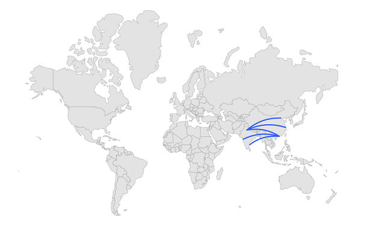
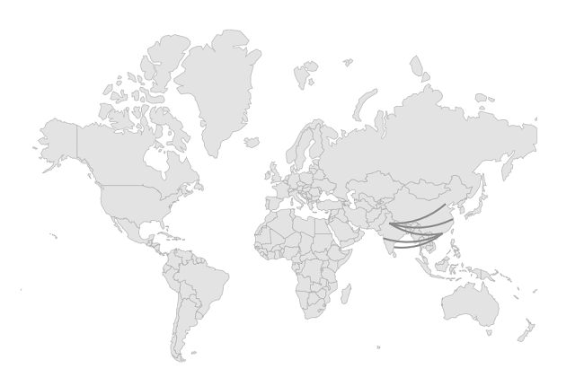
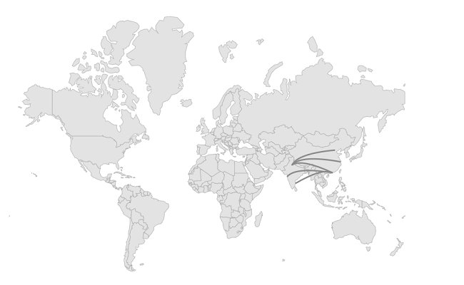
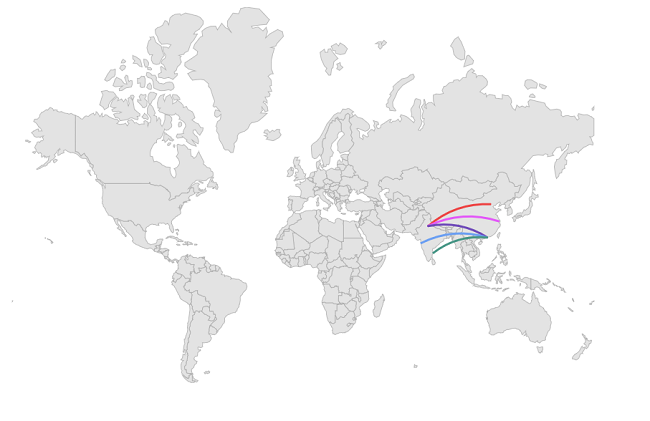
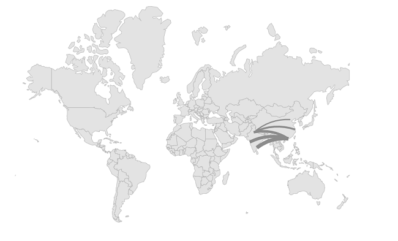
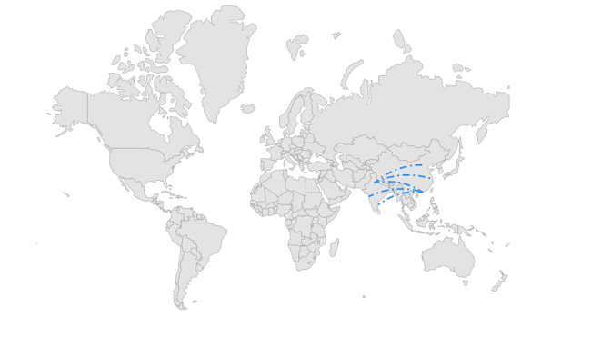

# Arc Layer in .NET MAUI Maps (SfMaps)

N> **Prerequisite:** Ensure that the required NuGet package is installed, the necessary namespaces are imported, and the **Maps** control is properly configured in your application. For detailed setup and configuration instructions, refer to the **[Getting Started](https://help.syncfusion.com/maui/maps/getting-started)** guide.

The arc layer is a sublayer that renders a group of [`MapArc`](https://help.syncfusion.com/cr/maui/Syncfusion.Maui.Maps.MapArc.html) on a [`MapArcLayer`](https://help.syncfusion.com/cr/maui/Syncfusion.Maui.Maps.MapArcLayer.html), which can be added as a sublayer of [`MapShapeLayer`](https://help.syncfusion.com/cr/maui/Syncfusion.Maui.Maps.MapShapeLayer.html). This section explains how to add and customize arcs.

## Adding arcs

The [`Arcs`](https://help.syncfusion.com/cr/maui/Syncfusion.Maui.Maps.MapArcLayer.html#Syncfusion_Maui_Maps_MapArcLayer_Arcs) is a collection of [`MapArc`](https://help.syncfusion.com/cr/maui/Syncfusion.Maui.Maps.MapArc.html). Each [`MapArc`](https://help.syncfusion.com/cr/maui/Syncfusion.Maui.Maps.MapArc.html) connects two location coordinates with a curved line. The start coordinate is set to the [`MapArc.From`](https://help.syncfusion.com/cr/maui/Syncfusion.Maui.Maps.MapArc.html#Syncfusion_Maui_Maps_MapArc_From) property and the end coordinate is set to the [`MapArc.To`](https://help.syncfusion.com/cr/maui/Syncfusion.Maui.Maps.MapArc.html#Syncfusion_Maui_Maps_MapArc_To) property. When the [`MapArc.Stroke`](https://help.syncfusion.com/cr/maui/Syncfusion.Maui.Maps.MapArc.html#Syncfusion_Maui_Maps_MapArc_Stroke) property is not set, the default stroke color is applied.





<map:SfMaps>
    <map:SfMaps.Layer>
        <map:MapShapeLayer ShapesSource="https://cdn.syncfusion.com/maps/map-data/world-map.json"
                           ShapeStroke="DarkGray">
            <map:MapShapeLayer.Sublayers>
                <map:MapArcLayer>
                    <map:MapArcLayer.Arcs>
                        <map:MapArc>
                            <map:MapArc.From>
                                <map:MapLatLng Latitude="28.6139"
                                               Longitude="77.2090" />
                            </map:MapArc.From>
                            <map:MapArc.To>
                                <map:MapLatLng Latitude="39.9042"
                                               Longitude="116.4074" />
                            </map:MapArc.To>
                        </map:MapArc>
                        <map:MapArc>
                            <map:MapArc.From>
                                <map:MapLatLng Latitude="28.7041"
                                               Longitude="77.1025" />
                            </map:MapArc.From>
                            <map:MapArc.To>
                                <map:MapLatLng Latitude="31.2304"
                                               Longitude="121.4737" />
                            </map:MapArc.To>
                        </map:MapArc>
                        <map:MapArc>
                            <map:MapArc.From>
                                <map:MapLatLng Latitude="28.7041"
                                               Longitude="77.1025" />
                            </map:MapArc.From>
                            <map:MapArc.To>
                                <map:MapLatLng Latitude="22.3193"
                                               Longitude="114.1694" />
                            </map:MapArc.To>
                        </map:MapArc>
                        <map:MapArc>
                            <map:MapArc.From>
                                <map:MapLatLng Latitude="19.0760"
                                               Longitude="72.8777" />
                            </map:MapArc.From>
                            <map:MapArc.To>
                                <map:MapLatLng Latitude="22.3193"
                                               Longitude="114.1694" />
                            </map:MapArc.To>
                        </map:MapArc>
                        <map:MapArc>
                            <map:MapArc.From>
                                <map:MapLatLng Latitude="22.3193"
                                               Longitude="114.1694" />
                            </map:MapArc.From>
                            <map:MapArc.To>
                                <map:MapLatLng Latitude="13.0827"
                                               Longitude="80.2707" />
                            </map:MapArc.To>
                        </map:MapArc>
                    </map:MapArcLayer.Arcs>
                </map:MapArcLayer>
            </map:MapShapeLayer.Sublayers>
        </map:MapShapeLayer>
    </map:SfMaps.Layer>
</map:SfMaps>





SfMaps maps = new SfMaps();
var layer = new MapShapeLayer();
layer.ShapesSource = MapSource.FromUri(new Uri("https://cdn.syncfusion.com/maps/map-data/world-map.json"));
layer.ShapeStroke = Brush.DarkGray;
var arcLayer = new MapArcLayer();
var arc1 = new MapArc();
arc1.From = new MapLatLng(28.6139, 77.2090);
arc1.To = new MapLatLng(39.9042, 116.4074);
var arc2 = new MapArc();
arc2.From = new MapLatLng(28.7041, 77.1025);
arc2.To = new MapLatLng(31.2304, 121.4737);
var arc3 = new MapArc();
arc3.From = new MapLatLng(28.7041, 77.1025);
arc3.To = new MapLatLng(22.3193, 114.1694);
var arc4 = new MapArc();
arc4.From = new MapLatLng(19.0760, 72.8777);
arc4.To = new MapLatLng(22.3193, 114.1694);
var arc5 = new MapArc();
arc5.From = new MapLatLng(22.3193, 114.1694);
arc5.To = new MapLatLng(13.0827, 80.2707);
arcLayer.Arcs.Add(arc1);
arcLayer.Arcs.Add(arc2);
arcLayer.Arcs.Add(arc3);
arcLayer.Arcs.Add(arc4);
arcLayer.Arcs.Add(arc5);
layer.Sublayers.Add(arcLayer);
maps.Layer = layer;
this.Content = maps;





## Height factor

The [`HeightFactor`](https://help.syncfusion.com/cr/maui/Syncfusion.Maui.Maps.MapArc.html#Syncfusion_Maui_Maps_MapArc_HeightFactor) is the distance from the line connecting two points to the arc bend point. The default value of the [`HeightFactor`](https://help.syncfusion.com/cr/maui/Syncfusion.Maui.Maps.MapArc.html#Syncfusion_Maui_Maps_MapArc_HeightFactor) property is `0.2`, and the value ranges from `-1` to `1`.

By default, the arc always renders above the [`MapArc.From`](https://help.syncfusion.com/cr/maui/Syncfusion.Maui.Maps.MapArc.html#Syncfusion_Maui_Maps_MapArc_From) and [`MapArc.To`](https://help.syncfusion.com/cr/maui/Syncfusion.Maui.Maps.MapArc.html#Syncfusion_Maui_Maps_MapArc_To) points. To render the arc below the points, set a value between `-1` and `0`. Values outside the range are clamped to the nearest boundary.

The example below applies the [`HeightFactor`](https://help.syncfusion.com/cr/maui/Syncfusion.Maui.Maps.MapArc.html#Syncfusion_Maui_Maps_MapArc_HeightFactor) property. The [`Stroke`](https://help.syncfusion.com/cr/maui/Syncfusion.Maui.Maps.MapArc.html#Syncfusion_Maui_Maps_MapArc_Stroke) property is also set for visibility and is documented in the [Stroke color](#stroke-color) section.





<map:SfMaps>
    <map:SfMaps.Layer>
        <map:MapShapeLayer ShapesSource="https://cdn.syncfusion.com/maps/map-data/world-map.json"
                           ShapeStroke="DarkGray">
            <map:MapShapeLayer.Sublayers>
                <map:MapArcLayer>
                    <map:MapArcLayer.Arcs>
                        <map:MapArc Stroke="#959595"
                                    HeightFactor="-0.2">
                            <map:MapArc.From>
                                <map:MapLatLng Latitude="28.6139"
                                               Longitude="77.2090" />
                            </map:MapArc.From>
                            <map:MapArc.To>
                                <map:MapLatLng Latitude="39.9042"
                                               Longitude="116.4074" />
                            </map:MapArc.To>
                        </map:MapArc>
                        <map:MapArc Stroke="#959595"
                                    HeightFactor="-0.2">
                            <map:MapArc.From>
                                <map:MapLatLng Latitude="28.7041"
                                               Longitude="77.1025" />
                            </map:MapArc.From>
                            <map:MapArc.To>
                                <map:MapLatLng Latitude="31.2304"
                                               Longitude="121.4737" />
                            </map:MapArc.To>
                        </map:MapArc>
                        <map:MapArc Stroke="#959595"
                                    HeightFactor="-0.2">
                            <map:MapArc.From>
                                <map:MapLatLng Latitude="28.7041"
                                               Longitude="77.1025" />
                            </map:MapArc.From>
                            <map:MapArc.To>
                                <map:MapLatLng Latitude="22.3193"
                                               Longitude="114.1694" />
                            </map:MapArc.To>
                        </map:MapArc>
                        <map:MapArc Stroke="#959595"
                                    HeightFactor="-0.2">
                            <map:MapArc.From>
                                <map:MapLatLng Latitude="19.0760"
                                               Longitude="72.8777" />
                            </map:MapArc.From>
                            <map:MapArc.To>
                                <map:MapLatLng Latitude="22.3193"
                                               Longitude="114.1694" />
                            </map:MapArc.To>
                        </map:MapArc>
                        <map:MapArc Stroke="#959595"
                                    HeightFactor="-0.2">
                            <map:MapArc.From>
                                <map:MapLatLng Latitude="22.3193"
                                               Longitude="114.1694" />
                            </map:MapArc.From>
                            <map:MapArc.To>
                                <map:MapLatLng Latitude="13.0827"
                                               Longitude="80.2707" />
                            </map:MapArc.To>
                        </map:MapArc>
                    </map:MapArcLayer.Arcs>
                </map:MapArcLayer>
            </map:MapShapeLayer.Sublayers>
        </map:MapShapeLayer>
    </map:SfMaps.Layer>
</map:SfMaps>





SfMaps maps = new SfMaps();
var layer = new MapShapeLayer();
layer.ShapesSource = MapSource.FromUri(new Uri("https://cdn.syncfusion.com/maps/map-data/world-map.json"));
layer.ShapeStroke = Brush.DarkGray;
var arcLayer = new MapArcLayer();

var arc1 = new MapArc();
arc1.From = new MapLatLng(28.6139, 77.2090);
arc1.To = new MapLatLng(39.9042, 116.4074);
arc1.Stroke = Color.FromRgb(149, 149, 149);
arc1.HeightFactor = -0.2;

var arc2 = new MapArc();
arc2.From = new MapLatLng(28.7041, 77.1025);
arc2.To = new MapLatLng(31.2304, 121.4737);
arc2.Stroke = Color.FromRgb(149, 149, 149);
arc2.HeightFactor = -0.2;

var arc3 = new MapArc();
arc3.From = new MapLatLng(28.7041, 77.1025);
arc3.To = new MapLatLng(22.3193, 114.1694);
arc3.Stroke = Color.FromRgb(149, 149, 149);
arc3.HeightFactor = -0.2;

var arc4 = new MapArc();
arc4.From = new MapLatLng(19.0760, 72.8777);
arc4.To = new MapLatLng(22.3193, 114.1694);
arc4.Stroke = Color.FromRgb(149, 149, 149);
arc4.HeightFactor = -0.2;

var arc5 = new MapArc();
arc5.From = new MapLatLng(22.3193, 114.1694);
arc5.To = new MapLatLng(13.0827, 80.2707);
arc5.Stroke = Color.FromRgb(149, 149, 149);
arc5.HeightFactor = -0.2;

arcLayer.Arcs.Add(arc1);
arcLayer.Arcs.Add(arc2);
arcLayer.Arcs.Add(arc3);
arcLayer.Arcs.Add(arc4);
arcLayer.Arcs.Add(arc5);
layer.Sublayers.Add(arcLayer);
maps.Layer = layer;
this.Content = maps;





## Control point factor

The [`MapArc.ControlPointFactor`](https://help.syncfusion.com/cr/maui/Syncfusion.Maui.Maps.MapArc.html#Syncfusion_Maui_Maps_MapArc_ControlPointFactor) is the arc bending position. The default value of the [`MapArc.ControlPointFactor`](https://help.syncfusion.com/cr/maui/Syncfusion.Maui.Maps.MapArc.html#Syncfusion_Maui_Maps_MapArc_ControlPointFactor) property is `0.5`, and the value ranges from `0` to `1`. Values outside the range are clamped to the nearest boundary. A value of `0` bends the arc near the [`MapArc.From`](https://help.syncfusion.com/cr/maui/Syncfusion.Maui.Maps.MapArc.html#Syncfusion_Maui_Maps_MapArc_From) point, and a value of `1` bends it near the [`MapArc.To`](https://help.syncfusion.com/cr/maui/Syncfusion.Maui.Maps.MapArc.html#Syncfusion_Maui_Maps_MapArc_To) point.

By default, the arc bends at the center between the [`MapArc.From`](https://help.syncfusion.com/cr/maui/Syncfusion.Maui.Maps.MapArc.html#Syncfusion_Maui_Maps_MapArc_From) and [`MapArc.To`](https://help.syncfusion.com/cr/maui/Syncfusion.Maui.Maps.MapArc.html#Syncfusion_Maui_Maps_MapArc_To) points.

The example below applies the [`MapArc.ControlPointFactor`](https://help.syncfusion.com/cr/maui/Syncfusion.Maui.Maps.MapArc.html#Syncfusion_Maui_Maps_MapArc_ControlPointFactor) property. The [`Stroke`](https://help.syncfusion.com/cr/maui/Syncfusion.Maui.Maps.MapArc.html#Syncfusion_Maui_Maps_MapArc_Stroke) property is also set for visibility and is documented in the [Stroke color](#stroke-color) section.





<map:SfMaps>
    <map:SfMaps.Layer>
        <map:MapShapeLayer ShapesSource="https://cdn.syncfusion.com/maps/map-data/world-map.json"
                           ShapeStroke="DarkGray">
            <map:MapShapeLayer.Sublayers>
                <map:MapArcLayer>
                    <map:MapArcLayer.Arcs>
                        <map:MapArc Stroke="#959595"
                                    ControlPointFactor="0.2">
                            <map:MapArc.From>
                                <map:MapLatLng Latitude="28.6139"
                                               Longitude="77.2090" />
                            </map:MapArc.From>
                            <map:MapArc.To>
                                <map:MapLatLng Latitude="39.9042"
                                               Longitude="116.4074" />
                            </map:MapArc.To>
                        </map:MapArc>
                        <map:MapArc Stroke="#959595"
                                    ControlPointFactor="0.2">
                            <map:MapArc.From>
                                <map:MapLatLng Latitude="28.7041"
                                               Longitude="77.1025" />
                            </map:MapArc.From>
                            <map:MapArc.To>
                                <map:MapLatLng Latitude="31.2304"
                                               Longitude="121.4737" />
                            </map:MapArc.To>
                        </map:MapArc>
                        <map:MapArc Stroke="#959595"
                                    ControlPointFactor="0.2">
                            <map:MapArc.From>
                                <map:MapLatLng Latitude="28.7041"
                                               Longitude="77.1025" />
                            </map:MapArc.From>
                            <map:MapArc.To>
                                <map:MapLatLng Latitude="22.3193"
                                               Longitude="114.1694" />
                            </map:MapArc.To>
                        </map:MapArc>
                        <map:MapArc Stroke="#959595"
                                    ControlPointFactor="0.2">
                            <map:MapArc.From>
                                <map:MapLatLng Latitude="19.0760"
                                               Longitude="72.8777" />
                            </map:MapArc.From>
                            <map:MapArc.To>
                                <map:MapLatLng Latitude="22.3193"
                                               Longitude="114.1694" />
                            </map:MapArc.To>
                        </map:MapArc>
                        <map:MapArc Stroke="#959595"
                                    ControlPointFactor="0.2">
                            <map:MapArc.From>
                                <map:MapLatLng Latitude="22.3193"
                                               Longitude="114.1694" />
                            </map:MapArc.From>
                            <map:MapArc.To>
                                <map:MapLatLng Latitude="13.0827"
                                               Longitude="80.2707" />
                            </map:MapArc.To>
                        </map:MapArc>
                    </map:MapArcLayer.Arcs>
                </map:MapArcLayer>
            </map:MapShapeLayer.Sublayers>
        </map:MapShapeLayer>
    </map:SfMaps.Layer>
</map:SfMaps>





SfMaps maps = new SfMaps();
var layer = new MapShapeLayer();
layer.ShapesSource = MapSource.FromUri(new Uri("https://cdn.syncfusion.com/maps/map-data/world-map.json"));
layer.ShapeStroke = Brush.DarkGray;
var arcLayer = new MapArcLayer();

var arc1 = new MapArc();
arc1.From = new MapLatLng(28.6139, 77.2090);
arc1.To = new MapLatLng(39.9042, 116.4074);
arc1.Stroke = Color.FromRgb(149, 149, 149);
arc1.ControlPointFactor = 0.2;

var arc2 = new MapArc();
arc2.From = new MapLatLng(28.7041, 77.1025);
arc2.To = new MapLatLng(31.2304, 121.4737);
arc2.Stroke = Color.FromRgb(149, 149, 149);
arc2.ControlPointFactor = 0.2;

var arc3 = new MapArc();
arc3.From = new MapLatLng(28.7041, 77.1025);
arc3.To = new MapLatLng(22.3193, 114.1694);
arc3.Stroke = Color.FromRgb(149, 149, 149);
arc3.ControlPointFactor = 0.2;

var arc4 = new MapArc();
arc4.From = new MapLatLng(19.0760, 72.8777);
arc4.To = new MapLatLng(22.3193, 114.1694);
arc4.Stroke = Color.FromRgb(149, 149, 149);
arc4.ControlPointFactor = 0.2;

var arc5 = new MapArc();
arc5.From = new MapLatLng(22.3193, 114.1694);
arc5.To = new MapLatLng(13.0827, 80.2707);
arc5.Stroke = Color.FromRgb(149, 149, 149);
arc5.ControlPointFactor = 0.2;

arcLayer.Arcs.Add(arc1);
arcLayer.Arcs.Add(arc2);
arcLayer.Arcs.Add(arc3);
arcLayer.Arcs.Add(arc4);
arcLayer.Arcs.Add(arc5);
layer.Sublayers.Add(arcLayer);
maps.Layer = layer;
this.Content = maps;





## Stroke color

You can apply color to each [`MapArc`](https://help.syncfusion.com/cr/maui/Syncfusion.Maui.Maps.MapArc.html) in the [`Arcs`](https://help.syncfusion.com/cr/maui/Syncfusion.Maui.Maps.MapArcLayer.html#Syncfusion_Maui_Maps_MapArcLayer_Arcs) collection using the individual [`MapArc.Stroke`](https://help.syncfusion.com/cr/maui/Syncfusion.Maui.Maps.MapArc.html#Syncfusion_Maui_Maps_MapArc_Stroke) property.





<map:SfMaps>
    <map:SfMaps.Layer>
        <map:MapShapeLayer ShapesSource="https://cdn.syncfusion.com/maps/map-data/world-map.json"
                           ShapeStroke="DarkGray">
            <map:MapShapeLayer.Sublayers>
                <map:MapArcLayer>
                    <map:MapArcLayer.Arcs>
                        <map:MapArc Stroke="#ed4545">
                            <map:MapArc.From>
                                <map:MapLatLng Latitude="28.6139"
                                               Longitude="77.2090" />
                            </map:MapArc.From>
                            <map:MapArc.To>
                                <map:MapLatLng Latitude="39.9042"
                                               Longitude="116.4074" />
                            </map:MapArc.To>
                        </map:MapArc>
                        <map:MapArc Stroke="#e35bf8">
                            <map:MapArc.From>
                                <map:MapLatLng Latitude="28.7041"
                                               Longitude="77.1025" />
                            </map:MapArc.From>
                            <map:MapArc.To>
                                <map:MapLatLng Latitude="31.2304"
                                               Longitude="121.4737" />
                            </map:MapArc.To>
                        </map:MapArc>
                        <map:MapArc Stroke="#704cb9">
                            <map:MapArc.From>
                                <map:MapLatLng Latitude="28.7041"
                                               Longitude="77.1025" />
                            </map:MapArc.From>
                            <map:MapArc.To>
                                <map:MapLatLng Latitude="22.3193"
                                               Longitude="114.1694" />
                            </map:MapArc.To>
                        </map:MapArc>
                        <map:MapArc Stroke="#6da0f2">
                            <map:MapArc.From>
                                <map:MapLatLng Latitude="19.0760"
                                               Longitude="72.8777" />
                            </map:MapArc.From>
                            <map:MapArc.To>
                                <map:MapLatLng Latitude="22.3193"
                                               Longitude="114.1694" />
                            </map:MapArc.To>
                        </map:MapArc>
                        <map:MapArc Stroke="#499787">
                            <map:MapArc.From>
                                <map:MapLatLng Latitude="22.3193"
                                               Longitude="114.1694" />
                            </map:MapArc.From>
                            <map:MapArc.To>
                                <map:MapLatLng Latitude="13.0827"
                                               Longitude="80.2707" />
                            </map:MapArc.To>
                        </map:MapArc>
                    </map:MapArcLayer.Arcs>
                </map:MapArcLayer>
            </map:MapShapeLayer.Sublayers>
        </map:MapShapeLayer>
    </map:SfMaps.Layer>
</map:SfMaps>





SfMaps maps = new SfMaps();
var layer = new MapShapeLayer();
layer.ShapesSource = MapSource.FromUri(new Uri("https://cdn.syncfusion.com/maps/map-data/world-map.json"));
layer.ShapeStroke = Brush.DarkGray;
var arcLayer = new MapArcLayer();

var arc1 = new MapArc();
arc1.From = new MapLatLng(28.6139, 77.2090);
arc1.To = new MapLatLng(39.9042, 116.4074);
arc1.Stroke = Color.FromRgb(237, 69, 69);

var arc2 = new MapArc();
arc2.From = new MapLatLng(28.7041, 77.1025);
arc2.To = new MapLatLng(31.2304, 121.4737);
arc2.Stroke = Color.FromRgb(227, 91, 248);

var arc3 = new MapArc();
arc3.From = new MapLatLng(28.7041, 77.1025);
arc3.To = new MapLatLng(22.3193, 114.1694);
arc3.Stroke = Color.FromRgb(112, 76, 185);

var arc4 = new MapArc();
arc4.From = new MapLatLng(19.0760, 72.8777);
arc4.To = new MapLatLng(22.3193, 114.1694);
arc4.Stroke = Color.FromRgb(109, 160, 242);

var arc5 = new MapArc();
arc5.From = new MapLatLng(22.3193, 114.1694);
arc5.To = new MapLatLng(13.0827, 80.2707);
arc5.Stroke = Color.FromRgb(73, 151, 135);

arcLayer.Arcs.Add(arc1);
arcLayer.Arcs.Add(arc2);
arcLayer.Arcs.Add(arc3);
arcLayer.Arcs.Add(arc4);
arcLayer.Arcs.Add(arc5);
layer.Sublayers.Add(arcLayer);
maps.Layer = layer;
this.Content = maps;





## Stroke thickness

You can apply stroke thickness to each [`MapArc`](https://help.syncfusion.com/cr/maui/Syncfusion.Maui.Maps.MapArc.html) in the [`Arcs`](https://help.syncfusion.com/cr/maui/Syncfusion.Maui.Maps.MapArcLayer.html#Syncfusion_Maui_Maps_MapArcLayer_Arcs) collection using the individual [`MapArc.StrokeThickness`](https://help.syncfusion.com/cr/maui/Syncfusion.Maui.Maps.MapArc.html#Syncfusion_Maui_Maps_MapArc_StrokeThickness) property. The default value of the [`MapArc.StrokeThickness`](https://help.syncfusion.com/cr/maui/Syncfusion.Maui.Maps.MapArc.html#Syncfusion_Maui_Maps_MapArc_StrokeThickness) property is `2`.





<map:SfMaps>
    <map:SfMaps.Layer>
        <map:MapShapeLayer ShapesSource="https://cdn.syncfusion.com/maps/map-data/world-map.json"
                           ShapeStroke="DarkGray">
            <map:MapShapeLayer.Sublayers>
                <map:MapArcLayer>
                    <map:MapArcLayer.Arcs>
                        <map:MapArc Stroke="#959595"
                                    StrokeThickness="2">
                            <map:MapArc.From>
                                <map:MapLatLng Latitude="28.6139"
                                               Longitude="77.2090" />
                            </map:MapArc.From>
                            <map:MapArc.To>
                                <map:MapLatLng Latitude="39.9042"
                                               Longitude="116.4074" />
                            </map:MapArc.To>
                        </map:MapArc>
                        <map:MapArc Stroke="#959595"
                                    StrokeThickness="3">
                            <map:MapArc.From>
                                <map:MapLatLng Latitude="28.7041"
                                               Longitude="77.1025" />
                            </map:MapArc.From>
                            <map:MapArc.To>
                                <map:MapLatLng Latitude="31.2304"
                                               Longitude="121.4737" />
                            </map:MapArc.To>
                        </map:MapArc>
                        <map:MapArc Stroke="#959595"
                                    StrokeThickness="4">
                            <map:MapArc.From>
                                <map:MapLatLng Latitude="28.7041"
                                               Longitude="77.1025" />
                            </map:MapArc.From>
                            <map:MapArc.To>
                                <map:MapLatLng Latitude="22.3193"
                                               Longitude="114.1694" />
                            </map:MapArc.To>
                        </map:MapArc>
                        <map:MapArc Stroke="#959595"
                                    StrokeThickness="5">
                            <map:MapArc.From>
                                <map:MapLatLng Latitude="19.0760"
                                               Longitude="72.8777" />
                            </map:MapArc.From>
                            <map:MapArc.To>
                                <map:MapLatLng Latitude="22.3193"
                                               Longitude="114.1694" />
                            </map:MapArc.To>
                        </map:MapArc>
                        <map:MapArc Stroke="#959595"
                                    StrokeThickness="6">
                            <map:MapArc.From>
                                <map:MapLatLng Latitude="22.3193"
                                               Longitude="114.1694" />
                            </map:MapArc.From>
                            <map:MapArc.To>
                                <map:MapLatLng Latitude="13.0827"
                                               Longitude="80.2707" />
                            </map:MapArc.To>
                        </map:MapArc>
                    </map:MapArcLayer.Arcs>
                </map:MapArcLayer>
            </map:MapShapeLayer.Sublayers>
        </map:MapShapeLayer>
    </map:SfMaps.Layer>
</map:SfMaps>





SfMaps maps = new SfMaps();
var layer = new MapShapeLayer();
layer.ShapesSource = MapSource.FromUri(new Uri("https://cdn.syncfusion.com/maps/map-data/world-map.json"));
layer.ShapeStroke = Brush.DarkGray;
var arcLayer = new MapArcLayer();

var arc1 = new MapArc();
arc1.From = new MapLatLng(28.6139, 77.2090);
arc1.To = new MapLatLng(39.9042, 116.4074);
arc1.Stroke = Color.FromRgb(149, 149, 149);
arc1.StrokeThickness = 2;

var arc2 = new MapArc();
arc2.From = new MapLatLng(28.7041, 77.1025);
arc2.To = new MapLatLng(31.2304, 121.4737);
arc2.Stroke = Color.FromRgb(149, 149, 149);
arc2.StrokeThickness = 3;

var arc3 = new MapArc();
arc3.From = new MapLatLng(28.7041, 77.1025);
arc3.To = new MapLatLng(22.3193, 114.1694);
arc3.Stroke = Color.FromRgb(149, 149, 149);
arc3.StrokeThickness = 4;

var arc4 = new MapArc();
arc4.From = new MapLatLng(19.0760, 72.8777);
arc4.To = new MapLatLng(22.3193, 114.1694);
arc4.Stroke = Color.FromRgb(149, 149, 149);
arc4.StrokeThickness = 5;

var arc5 = new MapArc();
arc5.From = new MapLatLng(22.3193, 114.1694);
arc5.To = new MapLatLng(13.0827, 80.2707);
arc5.Stroke = Color.FromRgb(149, 149, 149);
arc5.StrokeThickness = 6;

arcLayer.Arcs.Add(arc1);
arcLayer.Arcs.Add(arc2);
arcLayer.Arcs.Add(arc3);
arcLayer.Arcs.Add(arc4);
arcLayer.Arcs.Add(arc5);
layer.Sublayers.Add(arcLayer);
maps.Layer = layer;
this.Content = maps;





## Dash array

You can apply dash support for an arc using the [`MapArc.StrokeDashArray`](https://help.syncfusion.com/cr/maui/Syncfusion.Maui.Maps.MapArc.html#Syncfusion_Maui_Maps_MapArc_StrokeDashArray) property.

A sequence of dashes and gaps is rendered based on the values in this list. Once all the values in the list are rendered, the sequence repeats until the end of the arc. When the [`MapArc.StrokeDashArray`](https://help.syncfusion.com/cr/maui/Syncfusion.Maui.Maps.MapArc.html#Syncfusion_Maui_Maps_MapArc_StrokeDashArray) property is not set, a solid line is rendered. The values are specified in device-independent units that match the [`StrokeThickness`](https://help.syncfusion.com/cr/maui/Syncfusion.Maui.Maps.MapArc.html#Syncfusion_Maui_Maps_MapArc_StrokeThickness) coordinate space.





<map:SfMaps>
    <map:SfMaps.Layer>
        <map:MapShapeLayer ShapesSource="https://cdn.syncfusion.com/maps/map-data/world-map.json"
                           ShapeStroke="DarkGray">
            <map:MapShapeLayer.Sublayers>
                <map:MapArcLayer>
                    <map:MapArcLayer.Arcs>
                        <map:MapArc Stroke="#3d9bf2">
                            <map:MapArc.From>
                                <map:MapLatLng Latitude="28.7041"
                                               Longitude="77.1025" />
                            </map:MapArc.From>
                            <map:MapArc.To>
                                <map:MapLatLng Latitude="39.9042"
                                               Longitude="116.4074" />
                            </map:MapArc.To>
                            <map:MapArc.StrokeDashArray>
                                <DoubleCollection>
                                    <x:Double>4</x:Double>
                                    <x:Double>2</x:Double>
                                    <x:Double>1</x:Double>
                                    <x:Double>2</x:Double>
                                </DoubleCollection>
                            </map:MapArc.StrokeDashArray>
                        </map:MapArc>
                        <map:MapArc Stroke="#3d9bf2">
                            <map:MapArc.From>
                                <map:MapLatLng Latitude="28.7041"
                                               Longitude="77.1025" />
                            </map:MapArc.From>
                            <map:MapArc.To>
                                <map:MapLatLng Latitude="23.1291"
                                               Longitude="113.2644" />
                            </map:MapArc.To>
                            <map:MapArc.StrokeDashArray>
                                <DoubleCollection>
                                    <x:Double>4</x:Double>
                                    <x:Double>2</x:Double>
                                    <x:Double>1</x:Double>
                                    <x:Double>2</x:Double>
                                </DoubleCollection>
                            </map:MapArc.StrokeDashArray>
                        </map:MapArc>
                        <map:MapArc Stroke="#3d9bf2">
                            <map:MapArc.From>
                                <map:MapLatLng Latitude="28.7041"
                                               Longitude="77.1025" />
                            </map:MapArc.From>
                            <map:MapArc.To>
                                <map:MapLatLng Latitude="22.3193"
                                               Longitude="114.1694" />
                            </map:MapArc.To>
                            <map:MapArc.StrokeDashArray>
                                <DoubleCollection>
                                    <x:Double>4</x:Double>
                                    <x:Double>2</x:Double>
                                    <x:Double>1</x:Double>
                                    <x:Double>2</x:Double>
                                </DoubleCollection>
                            </map:MapArc.StrokeDashArray>
                        </map:MapArc>
                        <map:MapArc Stroke="#3d9bf2">
                            <map:MapArc.From>
                                <map:MapLatLng Latitude="19.0760"
                                               Longitude="72.8777" />
                            </map:MapArc.From>
                            <map:MapArc.To>
                                <map:MapLatLng Latitude="22.3193"
                                               Longitude="114.1694" />
                            </map:MapArc.To>
                            <map:MapArc.StrokeDashArray>
                                <DoubleCollection>
                                    <x:Double>4</x:Double>
                                    <x:Double>2</x:Double>
                                    <x:Double>1</x:Double>
                                    <x:Double>2</x:Double>
                                </DoubleCollection>
                            </map:MapArc.StrokeDashArray>
                        </map:MapArc>
                        <map:MapArc Stroke="#3d9bf2">
                            <map:MapArc.From>
                                <map:MapLatLng Latitude="22.3193"
                                               Longitude="114.1694" />
                            </map:MapArc.From>
                            <map:MapArc.To>
                                <map:MapLatLng Latitude="13.0827"
                                               Longitude="80.2707" />
                            </map:MapArc.To>
                            <map:MapArc.StrokeDashArray>
                                <DoubleCollection>
                                    <x:Double>4</x:Double>
                                    <x:Double>2</x:Double>
                                    <x:Double>1</x:Double>
                                    <x:Double>2</x:Double>
                                </DoubleCollection>
                            </map:MapArc.StrokeDashArray>
                        </map:MapArc>
                    </map:MapArcLayer.Arcs>
                </map:MapArcLayer>
            </map:MapShapeLayer.Sublayers>
        </map:MapShapeLayer>
    </map:SfMaps.Layer>
</map:SfMaps>





SfMaps maps = new SfMaps();
var layer = new MapShapeLayer();
layer.ShapesSource = MapSource.FromUri(new Uri("https://cdn.syncfusion.com/maps/map-data/world-map.json"));
layer.ShapeStroke = Brush.DarkGray;
var arcLayer = new MapArcLayer();

var arc1 = new MapArc();
arc1.From = new MapLatLng(28.6139, 77.2090);
arc1.To = new MapLatLng(39.9042, 116.4074);
arc1.Stroke = Color.FromRgb(61, 155, 242);
arc1.StrokeDashArray = new double[] { 4, 2, 1, 2 };

var arc2 = new MapArc();
arc2.From = new MapLatLng(28.7041, 77.1025);
arc2.To = new MapLatLng(31.2304, 121.4737);
arc2.Stroke = Color.FromRgb(61, 155, 242);
arc2.StrokeDashArray = new double[] { 4, 2, 1, 2 };

var arc3 = new MapArc();
arc3.From = new MapLatLng(28.7041, 77.1025);
arc3.To = new MapLatLng(22.3193, 114.1694);
arc3.Stroke = Color.FromRgb(61, 155, 242);
arc3.StrokeDashArray = new double[] { 4, 2, 1, 2 };

var arc4 = new MapArc();
arc4.From = new MapLatLng(19.0760, 72.8777);
arc4.To = new MapLatLng(22.3193, 114.1694);
arc4.Stroke = Color.FromRgb(61, 155, 242);
arc4.StrokeDashArray = new double[] { 4, 2, 1, 2 };

var arc5 = new MapArc();
arc5.From = new MapLatLng(22.3193, 114.1694);
arc5.To = new MapLatLng(13.0827, 80.2707);
arc5.Stroke = Color.FromRgb(61, 155, 242);
arc5.StrokeDashArray = new double[] { 4, 2, 1, 2 };

arcLayer.Arcs.Add(arc1);
arcLayer.Arcs.Add(arc2);
arcLayer.Arcs.Add(arc3);
arcLayer.Arcs.Add(arc4);
arcLayer.Arcs.Add(arc5);
layer.Sublayers.Add(arcLayer);
maps.Layer = layer;
this.Content = maps;





