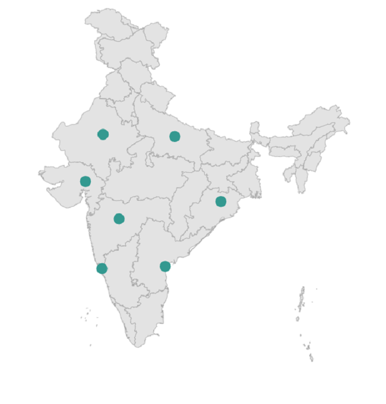
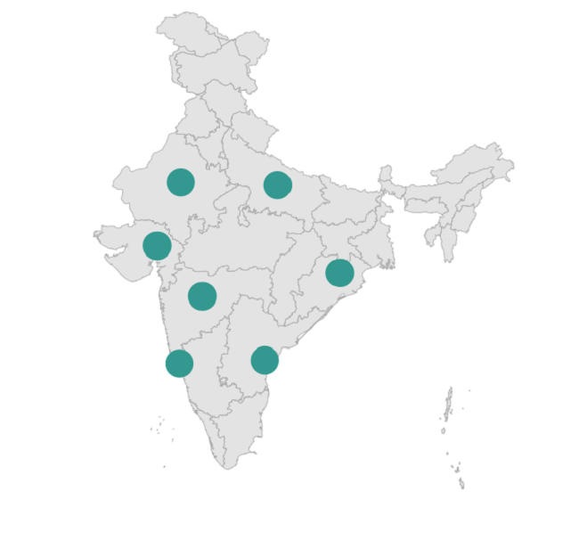
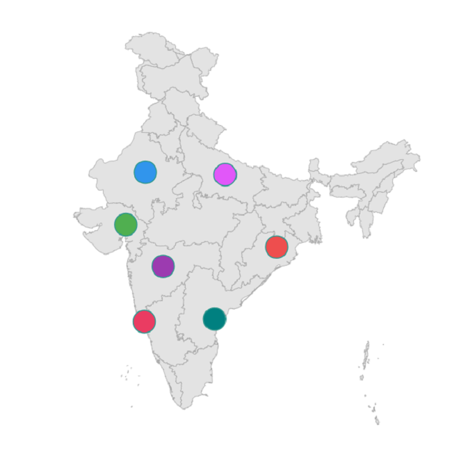
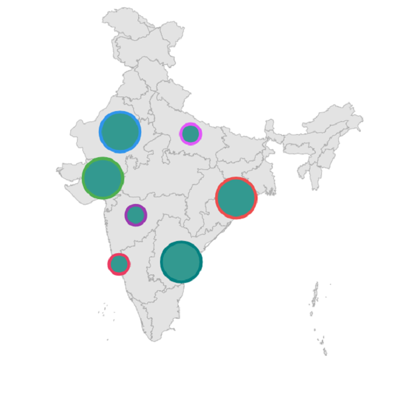
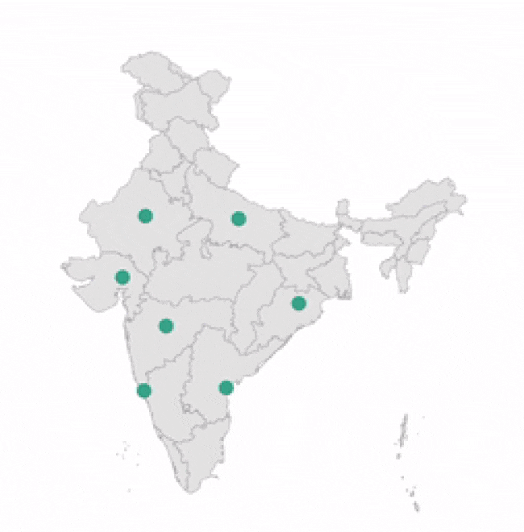

# Circle Layer in .NET MAUI Maps (SfMaps)

N> **Prerequisite:** Ensure that the required NuGet package is installed, the necessary namespaces are imported, and the **Maps** control is properly configured in your application. For detailed setup and configuration instructions, refer to the **[Getting Started](https://help.syncfusion.com/maui/maps/getting-started)** guide.

The circle layer is a sublayer that renders a group of [`MapCircle`](https://help.syncfusion.com/cr/maui/Syncfusion.Maui.Maps.MapCircle.html) on a [`MapCircleLayer`](https://help.syncfusion.com/cr/maui/Syncfusion.Maui.Maps.MapCircleLayer.html), which can be added as a sublayer of [`MapShapeLayer`](https://help.syncfusion.com/cr/maui/Syncfusion.Maui.Maps.MapShapeLayer.html). This section explains how to add and customize circles.

## Adding circles

The [`Circles`](https://help.syncfusion.com/cr/maui/Syncfusion.Maui.Maps.MapCircleLayer.html#Syncfusion_Maui_Maps_MapCircleLayer_Circles) is a collection of [`MapCircle`](https://help.syncfusion.com/cr/maui/Syncfusion.Maui.Maps.MapCircle.html). Each [`MapCircle`](https://help.syncfusion.com/cr/maui/Syncfusion.Maui.Maps.MapCircle.html) renders a circle using the [`MapCircle.Center`](https://help.syncfusion.com/cr/maui/Syncfusion.Maui.Maps.MapCircle.html#Syncfusion_Maui_Maps_MapCircle_Center) and [`MapCircle.Radius`](https://help.syncfusion.com/cr/maui/Syncfusion.Maui.Maps.MapCircle.html#Syncfusion_Maui_Maps_MapCircle_Radius) properties. When the [`MapCircle.Radius`](https://help.syncfusion.com/cr/maui/Syncfusion.Maui.Maps.MapCircle.html#Syncfusion_Maui_Maps_MapCircle_Radius), [`MapCircle.Fill`](https://help.syncfusion.com/cr/maui/Syncfusion.Maui.Maps.MapCircle.html#Syncfusion_Maui_Maps_MapCircle_Fill), and [`MapCircle.Stroke`](https://help.syncfusion.com/cr/maui/Syncfusion.Maui.Maps.MapCircle.html#Syncfusion_Maui_Maps_MapCircle_Stroke) properties are not set, the defaults (radius of `5`, and default `Fill`/`Stroke` colors) are applied. The [`MapCircle.Radius`](https://help.syncfusion.com/cr/maui/Syncfusion.Maui.Maps.MapCircle.html#Syncfusion_Maui_Maps_MapCircle_Radius) value is measured in device-independent units.





<map:SfMaps>
    <map:SfMaps.Layer>
        <map:MapShapeLayer ShapesSource="https://cdn.syncfusion.com/maps/map-data/india.json"
                           ShapeStroke="DarkGray">
            <map:MapShapeLayer.Sublayers>
                <map:MapCircleLayer>
                    <map:MapCircleLayer.Circles>
                        <map:MapCircle>
                            <map:MapCircle.Center>
                                <map:MapLatLng Latitude="15.2993"
                                               Longitude="74.1240" />
                            </map:MapCircle.Center>
                        </map:MapCircle>
                        <map:MapCircle>
                            <map:MapCircle.Center>
                                <map:MapLatLng Latitude="15.5057"
                                               Longitude="80.0499" />
                            </map:MapCircle.Center>
                        </map:MapCircle>
                        <map:MapCircle>
                            <map:MapCircle.Center>
                                <map:MapLatLng Latitude="19.7515"
                                               Longitude="75.7139" />
                            </map:MapCircle.Center>
                        </map:MapCircle>
                        <map:MapCircle>
                            <map:MapCircle.Center>
                                <map:MapLatLng Latitude="23.0225"
                                               Longitude="72.5714" />
                            </map:MapCircle.Center>
                        </map:MapCircle>
                        <map:MapCircle>
                            <map:MapCircle.Center>
                                <map:MapLatLng Latitude="27.0238"
                                               Longitude="74.2179" />
                            </map:MapCircle.Center>
                        </map:MapCircle>
                        <map:MapCircle>
                            <map:MapCircle.Center>
                                <map:MapLatLng Latitude="26.8467"
                                               Longitude="80.9462" />
                            </map:MapCircle.Center>
                        </map:MapCircle>
                        <map:MapCircle>
                            <map:MapCircle.Center>
                                <map:MapLatLng Latitude="21.2787"
                                               Longitude="85.2799" />
                            </map:MapCircle.Center>
                        </map:MapCircle>
                    </map:MapCircleLayer.Circles>
                </map:MapCircleLayer>
            </map:MapShapeLayer.Sublayers>
        </map:MapShapeLayer>
    </map:SfMaps.Layer>
</map:SfMaps>





SfMaps maps = new SfMaps();
var layer = new MapShapeLayer();
layer.ShapesSource = MapSource.FromUri(new Uri("https://cdn.syncfusion.com/maps/map-data/india.json"));
layer.ShapeStroke = Brush.DarkGray;
var circleLayer = new MapCircleLayer();

var circle1 = new MapCircle();
circle1.Center = new MapLatLng(15.2993, 74.1240);

var circle2 = new MapCircle();
circle2.Center = new MapLatLng(15.5057, 80.0499);

var circle3 = new MapCircle();
circle3.Center = new MapLatLng(19.7515, 75.7139);

var circle4 = new MapCircle();
circle4.Center = new MapLatLng(23.0225, 72.5714);

var circle5 = new MapCircle();
circle5.Center = new MapLatLng(27.0238, 74.2179);

var circle6 = new MapCircle();
circle6.Center = new MapLatLng(26.8467, 80.9462);

var circle7 = new MapCircle();
circle7.Center = new MapLatLng(21.2787, 85.2799);

circleLayer.Circles.Add(circle1);
circleLayer.Circles.Add(circle2);
circleLayer.Circles.Add(circle3);
circleLayer.Circles.Add(circle4);
circleLayer.Circles.Add(circle5);
circleLayer.Circles.Add(circle6);
circleLayer.Circles.Add(circle7);
layer.Sublayers.Add(circleLayer);
maps.Layer = layer;
this.Content = maps;





## Radius

You can change the size of the circles using the [`MapCircle.Radius`](https://help.syncfusion.com/cr/maui/Syncfusion.Maui.Maps.MapCircle.html#Syncfusion_Maui_Maps_MapCircle_Radius) property. The default value of the [`MapCircle.Radius`](https://help.syncfusion.com/cr/maui/Syncfusion.Maui.Maps.MapCircle.html#Syncfusion_Maui_Maps_MapCircle_Radius) property is `5`, measured in device-independent units.

The example below applies the [`MapCircle.Radius`](https://help.syncfusion.com/cr/maui/Syncfusion.Maui.Maps.MapCircle.html#Syncfusion_Maui_Maps_MapCircle_Radius) property. The [`Stroke`](https://help.syncfusion.com/cr/maui/Syncfusion.Maui.Maps.MapCircle.html#Syncfusion_Maui_Maps_MapCircle_Stroke) and [`Fill`](https://help.syncfusion.com/cr/maui/Syncfusion.Maui.Maps.MapCircle.html#Syncfusion_Maui_Maps_MapCircle_Fill) properties are also set for visibility and are documented in the [Stroke color](#stroke-color) and [Fill color](#fill-color) sections.





<map:SfMaps>
    <map:SfMaps.Layer>
        <map:MapShapeLayer ShapesSource="https://cdn.syncfusion.com/maps/map-data/india.json"
                           ShapeStroke="DarkGray">
            <map:MapShapeLayer.Sublayers>
                <map:MapCircleLayer>
                    <map:MapCircleLayer.Circles>
                        <map:MapCircle Radius="10"
                                       Stroke="#309989"
                                       Fill="#309989">
                            <map:MapCircle.Center>
                                <map:MapLatLng Latitude="15.2993"
                                               Longitude="74.1240" />
                            </map:MapCircle.Center>
                        </map:MapCircle>
                        <map:MapCircle Radius="10"
                                       Stroke="#309989"
                                       Fill="#309989">
                            <map:MapCircle.Center>
                                <map:MapLatLng Latitude="15.5057"
                                               Longitude="80.0499" />
                            </map:MapCircle.Center>
                        </map:MapCircle>
                        <map:MapCircle Radius="10"
                                       Stroke="#309989"
                                       Fill="#309989">
                            <map:MapCircle.Center>
                                <map:MapLatLng Latitude="19.7515"
                                               Longitude="75.7139" />
                            </map:MapCircle.Center>
                        </map:MapCircle>
                        <map:MapCircle Radius="10"
                                       Stroke="#309989"
                                       Fill="#309989">
                            <map:MapCircle.Center>
                                <map:MapLatLng Latitude="23.0225"
                                               Longitude="72.5714" />
                            </map:MapCircle.Center>
                        </map:MapCircle>
                        <map:MapCircle Radius="10"
                                       Stroke="#309989"
                                       Fill="#309989">
                            <map:MapCircle.Center>
                                <map:MapLatLng Latitude="27.0238"
                                               Longitude="74.2179" />
                            </map:MapCircle.Center>
                        </map:MapCircle>
                        <map:MapCircle Radius="10"
                                       Stroke="#309989"
                                       Fill="#309989">
                            <map:MapCircle.Center>
                                <map:MapLatLng Latitude="26.8467"
                                               Longitude="80.9462" />
                            </map:MapCircle.Center>
                        </map:MapCircle>
                        <map:MapCircle Radius="10"
                                       Stroke="#309989"
                                       Fill="#309989">
                            <map:MapCircle.Center>
                                <map:MapLatLng Latitude="21.2787"
                                               Longitude="85.2799" />
                            </map:MapCircle.Center>
                        </map:MapCircle>
                    </map:MapCircleLayer.Circles>
                </map:MapCircleLayer>
            </map:MapShapeLayer.Sublayers>
        </map:MapShapeLayer>
    </map:SfMaps.Layer>
</map:SfMaps>





SfMaps maps = new SfMaps();
var layer = new MapShapeLayer();
layer.ShapesSource = MapSource.FromUri(new Uri("https://cdn.syncfusion.com/maps/map-data/india.json"));
layer.ShapeStroke = Brush.DarkGray;
var circleLayer = new MapCircleLayer();

var circle1 = new MapCircle();
circle1.Center = new MapLatLng(15.2993, 74.1240);
circle1.Radius = 10;
circle1.Stroke = Color.FromRgb(48, 153, 137);
circle1.Fill = Color.FromRgb(48, 153, 137);

var circle2 = new MapCircle();
circle2.Center = new MapLatLng(15.5057, 80.0499);
circle2.Radius = 10;
circle2.Stroke = Color.FromRgb(48, 153, 137);
circle2.Fill = Color.FromRgb(48, 153, 137);

var circle3 = new MapCircle();
circle3.Center = new MapLatLng(19.7515, 75.7139);
circle3.Radius = 10;
circle3.Stroke = Color.FromRgb(48, 153, 137);
circle3.Fill = Color.FromRgb(48, 153, 137);

var circle4 = new MapCircle();
circle4.Center = new MapLatLng(23.0225, 72.5714);
circle4.Radius = 10;
circle4.Stroke = Color.FromRgb(48, 153, 137);
circle4.Fill = Color.FromRgb(48, 153, 137);

var circle5 = new MapCircle();
circle5.Center = new MapLatLng(27.0238, 74.2179);
circle5.Radius = 10;
circle5.Stroke = Color.FromRgb(48, 153, 137);
circle5.Fill = Color.FromRgb(48, 153, 137);

var circle6 = new MapCircle();
circle6.Center = new MapLatLng(26.8467, 80.9462);
circle6.Radius = 10;
circle6.Stroke = Color.FromRgb(48, 153, 137);
circle6.Fill = Color.FromRgb(48, 153, 137);

var circle7 = new MapCircle();
circle7.Center = new MapLatLng(21.2787, 85.2799);
circle7.Radius = 10;
circle7.Stroke = Color.FromRgb(48, 153, 137);
circle7.Fill = Color.FromRgb(48, 153, 137);

circleLayer.Circles.Add(circle1);
circleLayer.Circles.Add(circle2);
circleLayer.Circles.Add(circle3);
circleLayer.Circles.Add(circle4);
circleLayer.Circles.Add(circle5);
circleLayer.Circles.Add(circle6);
circleLayer.Circles.Add(circle7);
layer.Sublayers.Add(circleLayer);
maps.Layer = layer;
this.Content = maps;





## Fill color

You can apply color to each [`MapCircle`](https://help.syncfusion.com/cr/maui/Syncfusion.Maui.Maps.MapCircle.html) in the [`Circles`](https://help.syncfusion.com/cr/maui/Syncfusion.Maui.Maps.MapCircleLayer.html#Syncfusion_Maui_Maps_MapCircleLayer_Circles) collection using the individual [`MapCircle.Fill`](https://help.syncfusion.com/cr/maui/Syncfusion.Maui.Maps.MapCircle.html#Syncfusion_Maui_Maps_MapCircle_Fill) property. When the [`MapCircle.Fill`](https://help.syncfusion.com/cr/maui/Syncfusion.Maui.Maps.MapCircle.html#Syncfusion_Maui_Maps_MapCircle_Fill) property is not set, the default fill color is applied. A color can be set using a hex value (e.g., `#ea3c62`) or a named color token (e.g., `Colors.Teal` in C# / `Teal` in XAML).





<map:SfMaps>
    <map:SfMaps.Layer>
        <map:MapShapeLayer ShapesSource="https://cdn.syncfusion.com/maps/map-data/india.json"
                           ShapeStroke="DarkGray">
            <map:MapShapeLayer.Sublayers>
                <map:MapCircleLayer>
                    <map:MapCircleLayer.Circles>
                        <map:MapCircle Radius="10"
                                       Fill="#ea3c62">
                            <map:MapCircle.Center>
                                <map:MapLatLng Latitude="15.2993"
                                               Longitude="74.1240" />
                            </map:MapCircle.Center>
                        </map:MapCircle>
                        <map:MapCircle Radius="10"
                                       Fill="Teal">
                            <map:MapCircle.Center>
                                <map:MapLatLng Latitude="15.5057"
                                               Longitude="80.0499" />
                            </map:MapCircle.Center>
                        </map:MapCircle>
                        <map:MapCircle Radius="10"
                                       Fill="#9c3bb0">
                            <map:MapCircle.Center>
                                <map:MapLatLng Latitude="19.7515"
                                               Longitude="75.7139" />
                            </map:MapCircle.Center>
                        </map:MapCircle>
                        <map:MapCircle Radius="10"
                                       Fill="#50af50">
                            <map:MapCircle.Center>
                                <map:MapLatLng Latitude="23.0225"
                                               Longitude="72.5714" />
                            </map:MapCircle.Center>
                        </map:MapCircle>
                        <map:MapCircle Radius="10"
                                       Fill="#3195ec">
                            <map:MapCircle.Center>
                                <map:MapLatLng Latitude="27.0238"
                                               Longitude="74.2179" />
                            </map:MapCircle.Center>
                        </map:MapCircle>
                        <map:MapCircle Radius="10"
                                       Fill="#e157f9">
                            <map:MapCircle.Center>
                                <map:MapLatLng Latitude="26.8467"
                                               Longitude="80.9462" />
                            </map:MapCircle.Center>
                        </map:MapCircle>
                        <map:MapCircle Radius="10"
                                       Fill="#ee4e4e">
                            <map:MapCircle.Center>
                                <map:MapLatLng Latitude="21.2787"
                                               Longitude="85.2799" />
                            </map:MapCircle.Center>
                        </map:MapCircle>
                    </map:MapCircleLayer.Circles>
                </map:MapCircleLayer>
            </map:MapShapeLayer.Sublayers>
        </map:MapShapeLayer>
    </map:SfMaps.Layer>
</map:SfMaps>





SfMaps maps = new SfMaps();
var layer = new MapShapeLayer();
layer.ShapesSource = MapSource.FromUri(new Uri("https://cdn.syncfusion.com/maps/map-data/india.json"));
layer.ShapeStroke = Brush.DarkGray;
var circleLayer = new MapCircleLayer();

var circle1 = new MapCircle();
circle1.Center = new MapLatLng(15.2993, 74.1240);
circle1.Radius = 10;
circle1.Fill = Color.FromRgb(234, 60, 98);

var circle2 = new MapCircle();
circle2.Center = new MapLatLng(15.5057, 80.0499);
circle2.Radius = 10;
circle2.Fill = Colors.Teal;

var circle3 = new MapCircle();
circle3.Center = new MapLatLng(19.7515, 75.7139);
circle3.Radius = 10;
circle3.Fill = Color.FromRgb(156, 59, 176);

var circle4 = new MapCircle();
circle4.Center = new MapLatLng(23.0225, 72.5714);
circle4.Radius = 10;
circle4.Fill = Color.FromRgb(80, 175, 80);

var circle5 = new MapCircle();
circle5.Center = new MapLatLng(27.0238, 74.2179);
circle5.Radius = 10;
circle5.Fill = Color.FromRgb(49, 149, 236);

var circle6 = new MapCircle();
circle6.Center = new MapLatLng(26.8467, 80.9462);
circle6.Radius = 10;
circle6.Fill = Color.FromRgb(225, 87, 249);

var circle7 = new MapCircle();
circle7.Center = new MapLatLng(21.2787, 85.2799);
circle7.Radius = 10;
circle7.Fill = Color.FromRgb(238, 78, 78);

circleLayer.Circles.Add(circle1);
circleLayer.Circles.Add(circle2);
circleLayer.Circles.Add(circle3);
circleLayer.Circles.Add(circle4);
circleLayer.Circles.Add(circle5);
circleLayer.Circles.Add(circle6);
circleLayer.Circles.Add(circle7);
layer.Sublayers.Add(circleLayer);
maps.Layer = layer;
this.Content = maps;





## Stroke color

You can apply stroke color to each [`MapCircle`](https://help.syncfusion.com/cr/maui/Syncfusion.Maui.Maps.MapCircle.html) in the [`Circles`](https://help.syncfusion.com/cr/maui/Syncfusion.Maui.Maps.MapCircleLayer.html#Syncfusion_Maui_Maps_MapCircleLayer_Circles) collection using the individual [`MapCircle.Stroke`](https://help.syncfusion.com/cr/maui/Syncfusion.Maui.Maps.MapCircle.html#Syncfusion_Maui_Maps_MapCircle_Stroke) property. When the [`MapCircle.Stroke`](https://help.syncfusion.com/cr/maui/Syncfusion.Maui.Maps.MapCircle.html#Syncfusion_Maui_Maps_MapCircle_Stroke) property is not set, the default stroke color is applied.

## Stroke thickness

You can apply stroke thickness to each [`MapCircle`](https://help.syncfusion.com/cr/maui/Syncfusion.Maui.Maps.MapCircle.html) in the [`Circles`](https://help.syncfusion.com/cr/maui/Syncfusion.Maui.Maps.MapCircleLayer.html#Syncfusion_Maui_Maps_MapCircleLayer_Circles) collection using the individual [`MapCircle.StrokeThickness`](https://help.syncfusion.com/cr/maui/Syncfusion.Maui.Maps.MapCircle.html#Syncfusion_Maui_Maps_MapCircle_StrokeThickness) property. The default value of the [`MapCircle.StrokeThickness`](https://help.syncfusion.com/cr/maui/Syncfusion.Maui.Maps.MapCircle.html#Syncfusion_Maui_Maps_MapCircle_StrokeThickness) property is `2`.

The example below applies both [`MapCircle.Stroke`](https://help.syncfusion.com/cr/maui/Syncfusion.Maui.Maps.MapCircle.html#Syncfusion_Maui_Maps_MapCircle_Stroke) and [`MapCircle.StrokeThickness`](https://help.syncfusion.com/cr/maui/Syncfusion.Maui.Maps.MapCircle.html#Syncfusion_Maui_Maps_MapCircle_StrokeThickness). Circle 2 uses `Stroke="Teal"` matching its `Fill`, so its stroke blends with the fill; use a contrasting color to make the stroke visible.





<map:SfMaps>
    <map:SfMaps.Layer>
        <map:MapShapeLayer ShapesSource="https://cdn.syncfusion.com/maps/map-data/india.json"
                           ShapeStroke="DarkGray">
            <map:MapShapeLayer.Sublayers>
                <map:MapCircleLayer>
                    <map:MapCircleLayer.Circles>
                        <map:MapCircle Radius="10"
                                       Fill="Teal"
                                       Stroke="#ea3c62"
                                       StrokeThickness="3">
                            <map:MapCircle.Center>
                                <map:MapLatLng Latitude="15.2993"
                                               Longitude="74.1240" />
                            </map:MapCircle.Center>
                        </map:MapCircle>
                        <map:MapCircle Radius="20"
                                       Fill="Teal"
                                       Stroke="Teal"
                                       StrokeThickness="3">
                            <map:MapCircle.Center>
                                <map:MapLatLng Latitude="15.5057"
                                               Longitude="80.0499" />
                            </map:MapCircle.Center>
                        </map:MapCircle>
                        <map:MapCircle Radius="10"
                                       Fill="Teal"
                                       Stroke="#9c3bb0"
                                       StrokeThickness="3">
                            <map:MapCircle.Center>
                                <map:MapLatLng Latitude="19.7515"
                                               Longitude="75.7139" />
                            </map:MapCircle.Center>
                        </map:MapCircle>
                        <map:MapCircle Radius="20"
                                       Fill="Teal"
                                       Stroke="#50af50"
                                       StrokeThickness="3">
                            <map:MapCircle.Center>
                                <map:MapLatLng Latitude="23.0225"
                                               Longitude="72.5714" />
                            </map:MapCircle.Center>
                        </map:MapCircle>
                        <map:MapCircle Radius="20"
                                       Fill="Teal"
                                       Stroke="#3195ec"
                                       StrokeThickness="3">
                            <map:MapCircle.Center>
                                <map:MapLatLng Latitude="27.0238"
                                               Longitude="74.2179" />
                            </map:MapCircle.Center>
                        </map:MapCircle>
                        <map:MapCircle Radius="10"
                                       Fill="Teal"
                                       Stroke="#e157f9"
                                       StrokeThickness="3">
                            <map:MapCircle.Center>
                                <map:MapLatLng Latitude="26.8467"
                                               Longitude="80.9462" />
                            </map:MapCircle.Center>
                        </map:MapCircle>
                        <map:MapCircle Radius="20"
                                       Fill="Teal"
                                       Stroke="#ee4e4e"
                                       StrokeThickness="3">
                            <map:MapCircle.Center>
                                <map:MapLatLng Latitude="21.2787"
                                               Longitude="85.2799" />
                            </map:MapCircle.Center>
                        </map:MapCircle>
                    </map:MapCircleLayer.Circles>
                </map:MapCircleLayer>
            </map:MapShapeLayer.Sublayers>
        </map:MapShapeLayer>
    </map:SfMaps.Layer>
</map:SfMaps>





var maps = new SfMaps();
var layer = new MapShapeLayer();
layer.ShapesSource = MapSource.FromUri(new Uri("https://cdn.syncfusion.com/maps/map-data/india.json"));
layer.ShapeStroke = Brush.DarkGray;
var circleLayer = new MapCircleLayer();

var circle1 = new MapCircle();
circle1.Center = new MapLatLng(15.2993, 74.1240);
circle1.Radius = 10;
circle1.Stroke = Color.FromRgb(234, 60, 98);
circle1.StrokeThickness = 3;
circle1.Fill = Colors.Teal;

var circle2 = new MapCircle();
circle2.Center = new MapLatLng(15.5057, 80.0499);
circle2.Radius = 20;
circle2.Stroke = Colors.Teal;
circle2.StrokeThickness = 3;
circle2.Fill = Colors.Teal;

var circle3 = new MapCircle();
circle3.Center = new MapLatLng(19.7515, 75.7139);
circle3.Radius = 10;
circle3.Stroke = Color.FromRgb(156, 59, 176);
circle3.StrokeThickness = 3;
circle3.Fill = Colors.Teal;

var circle4 = new MapCircle();
circle4.Center = new MapLatLng(23.0225, 72.5714);
circle4.Radius = 20;
circle4.Stroke = Color.FromRgb(80, 175, 80);
circle4.StrokeThickness = 3;
circle4.Fill = Colors.Teal;

var circle5 = new MapCircle();
circle5.Center = new MapLatLng(27.0238, 74.2179);
circle5.Radius = 20;
circle5.Stroke = Color.FromRgb(49, 149, 236);
circle5.StrokeThickness = 3;
circle5.Fill = Colors.Teal;

var circle6 = new MapCircle();
circle6.Center = new MapLatLng(26.8467, 80.9462);
circle6.Radius = 10;
circle6.Stroke = Color.FromRgb(225, 87, 249);
circle6.StrokeThickness = 3;
circle6.Fill = Colors.Teal;

var circle7 = new MapCircle();
circle7.Center = new MapLatLng(21.2787, 85.2799);
circle7.Radius = 20;
circle7.Stroke = Color.FromRgb(238, 78, 78);
circle7.StrokeThickness = 3;
circle7.Fill = Colors.Teal;

circleLayer.Circles.Add(circle1);
circleLayer.Circles.Add(circle2);
circleLayer.Circles.Add(circle3);
circleLayer.Circles.Add(circle4);
circleLayer.Circles.Add(circle5);
circleLayer.Circles.Add(circle6);
circleLayer.Circles.Add(circle7);
layer.Sublayers.Add(circleLayer);
maps.Layer = layer;
this.Content = maps;





## Animation

You can apply animation to the [`MapCircle`](https://help.syncfusion.com/cr/maui/Syncfusion.Maui.Maps.MapCircle.html) using the [`MapCircleLayer.AnimationDuration`](https://help.syncfusion.com/cr/maui/Syncfusion.Maui.Maps.MapCircleLayer.html#Syncfusion_Maui_Maps_MapCircleLayer_AnimationDuration) and [`MapCircleLayer.AnimationEasing`](https://help.syncfusion.com/cr/maui/Syncfusion.Maui.Maps.MapCircleLayer.html#Syncfusion_Maui_Maps_MapCircleLayer_AnimationEasing) properties.

The [`MapCircleLayer.AnimationDuration`](https://help.syncfusion.com/cr/maui/Syncfusion.Maui.Maps.MapCircleLayer.html#Syncfusion_Maui_Maps_MapCircleLayer_AnimationDuration) value is specified in milliseconds, and the [`MapCircleLayer.AnimationEasing`](https://help.syncfusion.com/cr/maui/Syncfusion.Maui.Maps.MapCircleLayer.html#Syncfusion_Maui_Maps_MapCircleLayer_AnimationEasing) accepts standard .NET MAUI `Easing` values (for example, `Easing.Linear`, `Easing.SinIn`, `Easing.CubicInOut`). By default, animation is disabled.

N> Animation is only applied at load time.





<map:SfMaps>
    <map:SfMaps.Layer>
        <map:MapShapeLayer ShapesSource="https://cdn.syncfusion.com/maps/map-data/india.json"
                           ShapeStroke="DarkGray">
            <map:MapShapeLayer.Sublayers>
                <map:MapCircleLayer AnimationDuration="3000"
                                    AnimationEasing="{x:Static Easing.Linear}">
                    <map:MapCircleLayer.Circles>
                        <map:MapCircle Radius="10"
                                       Stroke="#309989"
                                       Fill="#309989">
                            <map:MapCircle.Center>
                                <map:MapLatLng Latitude="15.2993"
                                               Longitude="74.1240" />
                            </map:MapCircle.Center>
                        </map:MapCircle>
                        <map:MapCircle Radius="10"
                                       Stroke="#309989"
                                       Fill="#309989">
                            <map:MapCircle.Center>
                                <map:MapLatLng Latitude="15.5057"
                                               Longitude="80.0499" />
                            </map:MapCircle.Center>
                        </map:MapCircle>
                        <map:MapCircle Radius="10"
                                       Stroke="#309989"
                                       Fill="#309989">
                            <map:MapCircle.Center>
                                <map:MapLatLng Latitude="19.7515"
                                               Longitude="75.7139" />
                            </map:MapCircle.Center>
                        </map:MapCircle>
                        <map:MapCircle Radius="10"
                                       Stroke="#309989"
                                       Fill="#309989">
                            <map:MapCircle.Center>
                                <map:MapLatLng Latitude="23.0225"
                                               Longitude="72.5714" />
                            </map:MapCircle.Center>
                        </map:MapCircle>
                        <map:MapCircle Radius="10"
                                       Stroke="#309989"
                                       Fill="#309989">
                            <map:MapCircle.Center>
                                <map:MapLatLng Latitude="27.0238"
                                               Longitude="74.2179" />
                            </map:MapCircle.Center>
                        </map:MapCircle>
                        <map:MapCircle Radius="10"
                                       Stroke="#309989"
                                       Fill="#309989">
                            <map:MapCircle.Center>
                                <map:MapLatLng Latitude="26.8467"
                                               Longitude="80.9462" />
                            </map:MapCircle.Center>
                        </map:MapCircle>
                        <map:MapCircle Radius="10"
                                       Stroke="#309989"
                                       Fill="#309989">
                            <map:MapCircle.Center>
                                <map:MapLatLng Latitude="21.2787"
                                               Longitude="85.2799" />
                            </map:MapCircle.Center>
                        </map:MapCircle>
                    </map:MapCircleLayer.Circles>
                </map:MapCircleLayer>
            </map:MapShapeLayer.Sublayers>
        </map:MapShapeLayer>
    </map:SfMaps.Layer>
</map:SfMaps>





var maps = new SfMaps();
var layer = new MapShapeLayer();
layer.ShapesSource = MapSource.FromUri(new Uri("https://cdn.syncfusion.com/maps/map-data/india.json"));
layer.ShapeStroke = Brush.DarkGray;
var circleLayer = new MapCircleLayer();
circleLayer.AnimationDuration = 3000;
circleLayer.AnimationEasing = Easing.Linear;

var circle1 = new MapCircle();
circle1.Center = new MapLatLng(15.2993, 74.1240);
circle1.Radius = 10;
circle1.Stroke = Color.FromRgb(48, 153, 137);
circle1.Fill = Color.FromRgb(48, 153, 137);

var circle2 = new MapCircle();
circle2.Center = new MapLatLng(15.5057, 80.0499);
circle2.Radius = 10;
circle2.Stroke = Color.FromRgb(48, 153, 137);
circle2.Fill = Color.FromRgb(48, 153, 137);

var circle3 = new MapCircle();
circle3.Center = new MapLatLng(19.7515, 75.7139);
circle3.Radius = 10;
circle3.Stroke = Color.FromRgb(48, 153, 137);
circle3.Fill = Color.FromRgb(48, 153, 137);

var circle4 = new MapCircle();
circle4.Center = new MapLatLng(23.0225, 72.5714);
circle4.Radius = 10;
circle4.Stroke = Color.FromRgb(48, 153, 137);
circle4.Fill = Color.FromRgb(48, 153, 137);

var circle5 = new MapCircle();
circle5.Center = new MapLatLng(27.0238, 74.2179);
circle5.Radius = 10;
circle5.Stroke = Color.FromRgb(48, 153, 137);
circle5.Fill = Color.FromRgb(48, 153, 137);

var circle6 = new MapCircle();
circle6.Center = new MapLatLng(26.8467, 80.9462);
circle6.Radius = 10;
circle6.Stroke = Color.FromRgb(48, 153, 137);
circle6.Fill = Color.FromRgb(48, 153, 137);

var circle7 = new MapCircle();
circle7.Center = new MapLatLng(21.2787, 85.2799);
circle7.Radius = 10;
circle7.Stroke = Color.FromRgb(48, 153, 137);
circle7.Fill = Color.FromRgb(48, 153, 137);

circleLayer.Circles.Add(circle1);
circleLayer.Circles.Add(circle2);
circleLayer.Circles.Add(circle3);
circleLayer.Circles.Add(circle4);
circleLayer.Circles.Add(circle5);
circleLayer.Circles.Add(circle6);
circleLayer.Circles.Add(circle7);
layer.Sublayers.Add(circleLayer);
maps.Layer = layer;
this.Content = maps;





