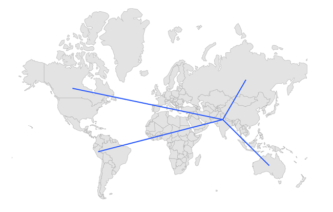
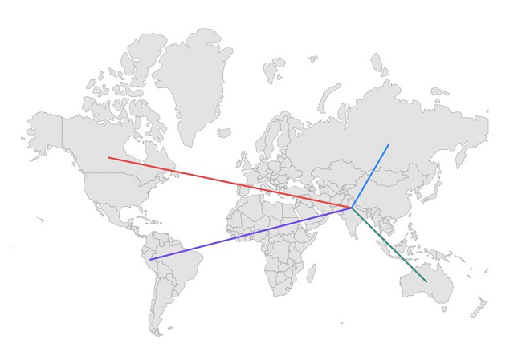
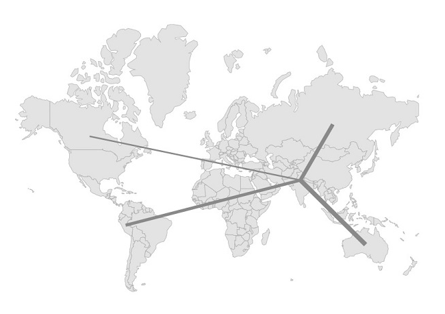
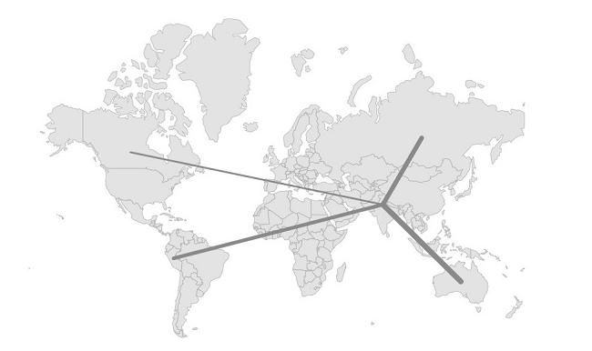
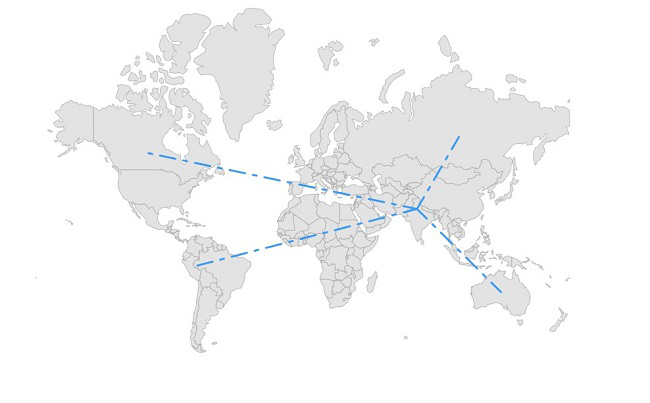
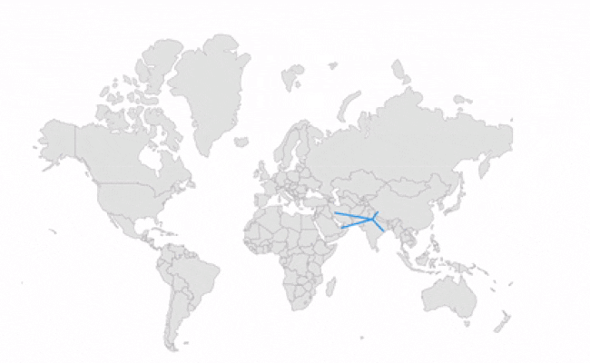

# Lines in .NET MAUI Maps (SfMaps)

Line layer is a sublayer that renders a group of [`MapLine`](https://help.syncfusion.com/cr/maui/Syncfusion.Maui.Maps.MapLine.html) on [`MapShapeLayer`](https://help.syncfusion.com/cr/maui/Syncfusion.Maui.Maps.MapShapeLayer.html). This section helps to learn about how to add the lines and customize them.

To learn more about the .NET MAUI Maps line layer, you can check the following video.


 <iframe id='MAUIMapsVideoTutorial' src="https://www.youtube.com/embed/CuI9bkGhBu8?start=483"></iframe>

## Adding lines

The [`Lines`](https://help.syncfusion.com/cr/maui/Syncfusion.Maui.Maps.MapLineLayer.html#Syncfusion_Maui_Maps_MapLineLayer_LinesProperty) is a collection of [`MapLine`](https://help.syncfusion.com/cr/maui/Syncfusion.Maui.Maps.MapLine.html). Every single [`MapLine`](https://help.syncfusion.com/cr/maui/Syncfusion.Maui.Maps.MapLine.html) connects two location coordinates through a straight line. The start coordinate is set to [`MapLine.From`](https://help.syncfusion.com/cr/maui/Syncfusion.Maui.Maps.MapLine.html#Syncfusion_Maui_Maps_MapLine_From) property and the end coordinate is set to [`MapLine.To`](https://help.syncfusion.com/cr/maui/Syncfusion.Maui.Maps.MapLine.html#Syncfusion_Maui_Maps_MapLine_To) property.





<map:SfMaps>
    <map:SfMaps.Layer>
        <map:MapShapeLayer ShapesSource="https://cdn.syncfusion.com/maps/map-data/world-map.json"
                           ShapeStroke="DarkGrey">
            <map:MapShapeLayer.Sublayers>
                <map:MapLineLayer>
                    <map:MapLineLayer.Lines>
                        <map:MapLine>
                            <map:MapLine.From>
                                <map:MapLatLng Latitude="28.7041"
                                               Longitude="77.1025" />
                            </map:MapLine.From>
                            <map:MapLine.To>
                                <map:MapLatLng Latitude="56.1304"
                                               Longitude="-106.3468" />
                            </map:MapLine.To>
                        </map:MapLine>
                        <map:MapLine>
                            <map:MapLine.From>
                                <map:MapLatLng Latitude="28.7041"
                                               Longitude="77.1025" />
                            </map:MapLine.From>
                            <map:MapLine.To>
                                <map:MapLatLng Latitude="-9.1900"
                                               Longitude="-75.0152" />
                            </map:MapLine.To>
                        </map:MapLine>
                        <map:MapLine>
                            <map:MapLine.From>
                                <map:MapLatLng Latitude="28.7041"
                                               Longitude="77.1025" />
                            </map:MapLine.From>
                            <map:MapLine.To>
                                <map:MapLatLng Latitude="61.5240"
                                               Longitude="105.3188" />
                            </map:MapLine.To>
                        </map:MapLine>
                        <map:MapLine>
                            <map:MapLine.From>
                                <map:MapLatLng Latitude="28.7041"
                                               Longitude="77.1025" />
                            </map:MapLine.From>
                            <map:MapLine.To>
                                <map:MapLatLng Latitude="-25.2744"
                                               Longitude="133.7751" />
                            </map:MapLine.To>
                        </map:MapLine>
                    </map:MapLineLayer.Lines>
                </map:MapLineLayer>
            </map:MapShapeLayer.Sublayers>
        </map:MapShapeLayer>
    </map:SfMaps.Layer>
</map:SfMaps>





SfMaps maps = new SfMaps();
MapShapeLayer layer = new MapShapeLayer();
layer.ShapesSource = MapSource.FromUri(new Uri("https://cdn.syncfusion.com/maps/map-data/
layer.ShapeStroke = Brush.DarkGray;
MapLineLayer mapLineLayer = new MapLineLayer();
MapLine line1 = new MapLine();
line1.From = new MapLatLng(28.7041, 77.1025);
line1.To = new MapLatLng(56.1304, -106.3468);
MapLine line2 = new MapLine();
line2.From = new MapLatLng(28.7041, 77.1025);
line2.To = new MapLatLng(-9.1900, -75.0152);
MapLine line3 = new MapLine();
line3.From = new MapLatLng(28.7041, 77.1025);
line3.To = new MapLatLng(61.5240, 105.3188);
MapLine line4 = new MapLine();
line4.From = new MapLatLng(28.7041, 77.1025);
line4.To = new MapLatLng(-25.2744, 133.7751);
mapLineLayer.Lines.Add(line1);
mapLineLayer.Lines.Add(line2);
mapLineLayer.Lines.Add(line3);
mapLineLayer.Lines.Add(line4);
layer.Sublayers.Add(mapLineLayer);
maps.Layer = layer;
this.Content = maps;





## Stroke

You can apply stroke colors to each [`MapLine`](https://help.syncfusion.com/cr/maui/Syncfusion.Maui.Maps.MapLine.html) in the [`Lines`](https://help.syncfusion.com/cr/maui/Syncfusion.Maui.Maps.MapLineLayer.html#Syncfusion_Maui_Maps_MapLineLayer_LinesProperty) collection using the individual [`MapLine.Stroke`](https://help.syncfusion.com/cr/maui/Syncfusion.Maui.Maps.MapLine.html#Syncfusion_Maui_Maps_MapLine_Stroke) property.





<map:SfMaps>
    <map:SfMaps.Layer>
        <map:MapShapeLayer ShapesSource="https://cdn.syncfusion.com/maps/map-data/world-map.json"
                           ShapeStroke="DarkGrey">
            <map:MapShapeLayer.Sublayers>
                <map:MapLineLayer>
                    <map:MapLineLayer.Lines>
                        <map:MapLine Stroke="#ed4a47">
                            <map:MapLine.From>
                                <map:MapLatLng Latitude="28.7041"
                                               Longitude="77.1025" />
                            </map:MapLine.From>
                            <map:MapLine.To>
                                <map:MapLatLng Latitude="56.1304"
                                               Longitude="-106.3468" />
                            </map:MapLine.To>
                        </map:MapLine>
                        <map:MapLine Stroke="#724df6">
                            <map:MapLine.From>
                                <map:MapLatLng Latitude="28.7041"
                                               Longitude="77.1025" />
                            </map:MapLine.From>
                            <map:MapLine.To>
                                <map:MapLatLng Latitude="-9.1900"
                                               Longitude="-75.0152" />
                            </map:MapLine.To>
                        </map:MapLine>
                        <map:MapLine Stroke="#3e8af5">
                            <map:MapLine.From>
                                <map:MapLatLng Latitude="28.7041"
                                               Longitude="77.1025" />
                            </map:MapLine.From>
                            <map:MapLine.To>
                                <map:MapLatLng Latitude="61.5240"
                                               Longitude="105.3188" />
                            </map:MapLine.To>
                        </map:MapLine>
                        <map:MapLine Stroke="#439386">
                            <map:MapLine.From>
                                <map:MapLatLng Latitude="28.7041"
                                               Longitude="77.1025" />
                            </map:MapLine.From>
                            <map:MapLine.To>
                                <map:MapLatLng Latitude="-25.2744"
                                               Longitude="133.7751" />
                            </map:MapLine.To>
                        </map:MapLine>
                    </map:MapLineLayer.Lines>
                </map:MapLineLayer>
            </map:MapShapeLayer.Sublayers>
        </map:MapShapeLayer>
    </map:SfMaps.Layer>
</map:SfMaps>





SfMaps maps = new SfMaps();
MapShapeLayer layer = new MapShapeLayer();
layer.ShapesSource = MapSource.FromUri(new Uri("https://cdn.syncfusion.com/maps/map-data/world-map.json"));
layer.ShapeStroke = Brush.DarkGrey;
MapLineLayer mapLineLayer = new MapLineLayer();
MapLine line1 = new MapLine();
line1.From = new MapLatLng(28.7041, 77.1025);
line1.To = new MapLatLng(56.1304, -106.3468);
line1.Stroke = Color.FromRgb(237, 74, 71);
MapLine line2 = new MapLine();
line2.From = new MapLatLng(28.7041, 77.1025);
line2.To = new MapLatLng(-9.1900, -75.0152);
line2.Stroke = Color.FromRgb(114, 77, 246);
MapLine line3 = new MapLine();
line3.From = new MapLatLng(28.7041, 77.1025);
line3.To = new MapLatLng(61.5240, 105.3188);
line3.Stroke = Color.FromRgb(62, 138, 245);
MapLine line4 = new MapLine();
line4.From = new MapLatLng(28.7041, 77.1025);
line4.To = new MapLatLng(-25.2744, 133.7751);
line4.Stroke = Color.FromRgb(67, 147, 134);
mapLineLayer.Lines.Add(line1);
mapLineLayer.Lines.Add(line2);
mapLineLayer.Lines.Add(line3);
mapLineLayer.Lines.Add(line4);
layer.Sublayers.Add(mapLineLayer);
maps.Layer = layer;
this.Content = maps;





## Thickness

You can apply thickness to each [`MapLine`](https://help.syncfusion.com/cr/maui/Syncfusion.Maui.Maps.MapLine.html) in the [`Lines`](https://help.syncfusion.com/cr/maui/Syncfusion.Maui.Maps.MapLineLayer.html#Syncfusion_Maui_Maps_MapLineLayer_LinesProperty) collection using the individual [`MapLine.StrokeThickness`](https://help.syncfusion.com/cr/maui/Syncfusion.Maui.Maps.MapLine.html#Syncfusion_Maui_Maps_MapLine_StrokeThickness) property. The default value of the [`MapLine.StrokeThickness`](https://help.syncfusion.com/cr/maui/Syncfusion.Maui.Maps.MapLine.html#Syncfusion_Maui_Maps_MapLine_StrokeThickness) property is `2`.





<map:SfMaps>
    <map:SfMaps.Layer>
        <map:MapShapeLayer ShapesSource="https://cdn.syncfusion.com/maps/map-data/world-map.json"
                           ShapeStroke="DarkGrey">
            <map:MapShapeLayer.Sublayers>
                <map:MapLineLayer>
                    <map:MapLineLayer.Lines>
                        <map:MapLine StrokeThickness="2"
                                     Stroke="#8a8a8a">
                            <map:MapLine.From>
                                <map:MapLatLng Latitude="28.7041"
                                               Longitude="77.1025" />
                            </map:MapLine.From>
                            <map:MapLine.To>
                                <map:MapLatLng Latitude="56.1304"
                                               Longitude="-106.3468" />
                            </map:MapLine.To>
                        </map:MapLine>
                        <map:MapLine StrokeThickness="4"
                                     Stroke="#8a8a8a">
                            <map:MapLine.From>
                                <map:MapLatLng Latitude="28.7041"
                                               Longitude="77.1025" />
                            </map:MapLine.From>
                            <map:MapLine.To>
                                <map:MapLatLng Latitude="-9.1900"
                                               Longitude="-75.0152" />
                            </map:MapLine.To>
                        </map:MapLine>
                        <map:MapLine StrokeThickness="5"
                                     Stroke="#8a8a8a">
                            <map:MapLine.From>
                                <map:MapLatLng Latitude="28.7041"
                                               Longitude="77.1025" />
                            </map:MapLine.From>
                            <map:MapLine.To>
                                <map:MapLatLng Latitude="61.5240"
                                               Longitude="105.3188" />
                            </map:MapLine.To>
                        </map:MapLine>
                        <map:MapLine StrokeThickness="6"
                                     Stroke="#8a8a8a">
                            <map:MapLine.From>
                                <map:MapLatLng Latitude="28.7041"
                                               Longitude="77.1025" />
                            </map:MapLine.From>
                            <map:MapLine.To>
                                <map:MapLatLng Latitude="-25.2744"
                                               Longitude="133.7751" />
                            </map:MapLine.To>
                        </map:MapLine>
                    </map:MapLineLayer.Lines>
                </map:MapLineLayer>
            </map:MapShapeLayer.Sublayers>
        </map:MapShapeLayer>
    </map:SfMaps.Layer>
</map:SfMaps>





SfMaps maps = new SfMaps();
MapShapeLayer layer = new MapShapeLayer();
layer.ShapesSource = MapSource.FromUri(new Uri("https://cdn.syncfusion.com/maps/map-data/world-map.json"));
layer.ShapeStroke = Brush.DarkGrey;
MapLineLayer mapLineLayer = new MapLineLayer();
MapLine line1 = new MapLine();
line1.From = new MapLatLng(28.7041, 77.1025);
line1.To = new MapLatLng(56.1304, -106.3468);
line1.Stroke = Color.FromRgb(138, 138, 138);
line1.StrokeThickness = 2;
MapLine line2 = new MapLine();
line2.From = new MapLatLng(28.7041, 77.1025);
line2.To = new MapLatLng(-9.1900, -75.0152);
line2.Stroke = Color.FromRgb(138, 138, 138);
line2.StrokeThickness = 4;
MapLine line3 = new MapLine();
line3.From = new MapLatLng(28.7041, 77.1025);
line3.To = new MapLatLng(61.5240, 105.3188);
line3.Stroke = Color.FromRgb(138, 138, 138);
line3.StrokeThickness = 5;
MapLine line4 = new MapLine();
line4.From = new MapLatLng(28.7041, 77.1025);
line4.To = new MapLatLng(-25.2744, 133.7751);
line4.Stroke = Color.FromRgb(138, 138, 138);
line4.StrokeThickness = 6;
mapLineLayer.Lines.Add(line1);
mapLineLayer.Lines.Add(line2);
mapLineLayer.Lines.Add(line3);
mapLineLayer.Lines.Add(line4);
layer.Sublayers.Add(mapLineLayer);
maps.Layer = layer;
this.Content = maps;





## Stroke cap

You can apply stroke cap to each [`MapLine`](https://help.syncfusion.com/cr/maui/Syncfusion.Maui.Maps.MapLine.html) in the [`Lines`](https://help.syncfusion.com/cr/maui/Syncfusion.Maui.Maps.MapLineLayer.html#Syncfusion_Maui_Maps_MapLineLayer_LinesProperty) collection using the individual [`MapLine.StrokeLineCap`](https://help.syncfusion.com/cr/maui/Syncfusion.Maui.Maps.MapLine.html#Syncfusion_Maui_Maps_MapLine_StrokeLineCap) property. The default value of the [`MapLine.StrokeLineCap`](https://help.syncfusion.com/cr/maui/Syncfusion.Maui.Maps.MapLine.html#Syncfusion_Maui_Maps_MapLine_StrokeLineCap) property is `LineCap.Butt`. The available values are `Butt`, `Round`, and `Square`.




 
<map:SfMaps>
   <map:SfMaps.Layer>
        <map:MapShapeLayer ShapesSource="https://cdn.syncfusion.com/maps/map-data/world-map.json"
                           ShapeStroke="DarkGrey">
            <map:MapShapeLayer.Sublayers>
                <map:MapLineLayer>
                    <map:MapLineLayer.Lines>
                        <map:MapLine StrokeThickness="2"
                                     Stroke="#8a8a8a"
                                     StrokeLineCap="Round">
                            <map:MapLine.From>
                                <map:MapLatLng Latitude="28.7041"
                                               Longitude="77.1025" />
                            </map:MapLine.From>
                            <map:MapLine.To>
                                <map:MapLatLng Latitude="56.1304"
                                               Longitude="-106.3468" />
                            </map:MapLine.To>
                        </map:MapLine>
                        <map:MapLine StrokeThickness="4"
                                     Stroke="#8a8a8a"
                                     StrokeLineCap="Round">
                            <map:MapLine.From>
                                <map:MapLatLng Latitude="28.7041"
                                               Longitude="77.1025" />
                            </map:MapLine.From>
                            <map:MapLine.To>
                                <map:MapLatLng Latitude="-9.1900"
                                               Longitude="-75.0152" />
                            </map:MapLine.To>
                        </map:MapLine>
                        <map:MapLine StrokeThickness="5"
                                     Stroke="#8a8a8a"
                                     StrokeLineCap="Round">
                            <map:MapLine.From>
                                <map:MapLatLng Latitude="28.7041"
                                               Longitude="77.1025" />
                            </map:MapLine.From>
                            <map:MapLine.To>
                                <map:MapLatLng Latitude="61.5240"
                                               Longitude="105.3188" />
                            </map:MapLine.To>
                        </map:MapLine>
                        <map:MapLine StrokeThickness="6"
                                     Stroke="#8a8a8a"
                                     StrokeLineCap="Round">
                            <map:MapLine.From>
                                <map:MapLatLng Latitude="28.7041"
                                               Longitude="77.1025" />
                            </map:MapLine.From>
                            <map:MapLine.To>
                                <map:MapLatLng Latitude="-25.2744"
                                               Longitude="133.7751" />
                            </map:MapLine.To>
                        </map:MapLine>
                    </map:MapLineLayer.Lines>
                </map:MapLineLayer>
            </map:MapShapeLayer.Sublayers>
        </map:MapShapeLayer>
    </map:SfMaps.Layer>
</map:SfMaps>





SfMaps maps = new SfMaps();
MapShapeLayer layer = new MapShapeLayer();
layer.ShapesSource = MapSource.FromUri(new Uri("https://cdn.syncfusion.com/maps/map-data/world-map.json"));
layer.ShapeStroke = Brush.DarkGrey;
MapLineLayer mapLineLayer = new MapLineLayer();
MapLine line1 = new MapLine();
line1.From = new MapLatLng(28.7041, 77.1025);
line1.To = new MapLatLng(56.1304, -106.3468);
line1.Stroke = Color.FromRgb(138, 138, 138);
line1.StrokeThickness = 2;
line1.StrokeLineCap = LineCap.Round;
MapLine line2 = new MapLine();
line2.From = new MapLatLng(28.7041, 77.1025);
line2.To = new MapLatLng(-9.1900, -75.0152);
line2.Stroke = Color.FromRgb(138, 138, 138);
line2.StrokeThickness = 4;
line2.StrokeLineCap = LineCap.Round;
MapLine line3 = new MapLine();
line3.From = new MapLatLng(28.7041, 77.1025);
line3.To = new MapLatLng(61.5240, 105.3188);
line3.Stroke = Color.FromRgb(138, 138, 138);
line3.StrokeThickness = 5;
line3.StrokeLineCap = LineCap.Round;
MapLine line4 = new MapLine();
line4.From = new MapLatLng(28.7041, 77.1025);
line4.To = new MapLatLng(-25.2744, 133.7751);
line4.Stroke = Color.FromRgb(138, 138, 138);
line4.StrokeThickness = 6;
line4.StrokeLineCap = LineCap.Round;
mapLineLayer.Lines.Add(line1);
mapLineLayer.Lines.Add(line2);
mapLineLayer.Lines.Add(line3);
mapLineLayer.Lines.Add(line4);
layer.Sublayers.Add(mapLineLayer);
maps.Layer = layer;
this.Content = maps;





## Dash array

You can apply dash support for the line using the [`MapLine.dashArray`](https://help.syncfusion.com/cr/maui/Syncfusion.Maui.Maps.MapLine.html#Syncfusion_Maui_Maps_MapLine_StrokeDashArray) property.

A sequence of dash and gap will be rendered based on the values in this list. Once all values of the list is rendered, it will be repeated again till the end of the line.





<map:SfMaps>
    <map:SfMaps.Layer>
        <map:MapShapeLayer ShapesSource="https://cdn.syncfusion.com/maps/map-data/world-map.json"
                           ShapeStroke="DarkGrey" >
            <map:MapShapeLayer.Sublayers>
                <map:MapLineLayer>
                    <map:MapLineLayer.Lines>
                        <map:MapLine Stroke="#3d9bf2">
                            <map:MapLine.From>
                                <map:MapLatLng Latitude="28.7041"
                                               Longitude="77.1025" />
                            </map:MapLine.From>
                            <map:MapLine.To>
                                <map:MapLatLng Latitude="56.1304"
                                               Longitude="-106.3468" />
                            </map:MapLine.To>
                            <map:MapLine.StrokeDashArray>
                                <DoubleCollection>
                                    <x:Double>8</x:Double>
                                    <x:Double>4</x:Double>
                                    <x:Double>2</x:Double>
                                    <x:Double>4</x:Double>
                                </DoubleCollection>
                            </map:MapLine.StrokeDashArray>
                        </map:MapLine>
                        <map:MapLine Stroke="#3d9bf2">
                            <map:MapLine.From>
                                <map:MapLatLng Latitude="28.7041"
                                               Longitude="77.1025" />
                            </map:MapLine.From>
                            <map:MapLine.To>
                                <map:MapLatLng Latitude="-9.1900"
                                               Longitude="-75.0152" />
                            </map:MapLine.To>
                            <map:MapLine.StrokeDashArray>
                                <DoubleCollection>
                                    <x:Double>8</x:Double>
                                    <x:Double>4</x:Double>
                                    <x:Double>2</x:Double>
                                    <x:Double>4</x:Double>
                                </DoubleCollection>
                            </map:MapLine.StrokeDashArray>
                        </map:MapLine>
                        <map:MapLine Stroke="#3d9bf2">
                            <map:MapLine.From>
                                <map:MapLatLng Latitude="28.7041"
                                               Longitude="77.1025" />
                            </map:MapLine.From>
                            <map:MapLine.To>
                                <map:MapLatLng Latitude="61.5240"
                                               Longitude="105.3188" />
                            </map:MapLine.To>
                            <map:MapLine.StrokeDashArray>
                                <DoubleCollection>
                                    <x:Double>8</x:Double>
                                    <x:Double>4</x:Double>
                                    <x:Double>2</x:Double>
                                    <x:Double>4</x:Double>
                                </DoubleCollection>
                            </map:MapLine.StrokeDashArray>
                        </map:MapLine>
                        <map:MapLine Stroke="#3d9bf2">
                            <map:MapLine.From>
                                <map:MapLatLng Latitude="28.7041"
                                               Longitude="77.1025" />
                            </map:MapLine.From>
                            <map:MapLine.To>
                                <map:MapLatLng Latitude="-25.2744"
                                               Longitude="133.7751" />
                            </map:MapLine.To>
                            <map:MapLine.StrokeDashArray>
                                <DoubleCollection>
                                    <x:Double>8</x:Double>
                                    <x:Double>4</x:Double>
                                    <x:Double>2</x:Double>
                                    <x:Double>4</x:Double>
                                </DoubleCollection>
                            </map:MapLine.StrokeDashArray>
                        </map:MapLine>
                    </map:MapLineLayer.Lines>
                </map:MapLineLayer>
            </map:MapShapeLayer.Sublayers>
        </map:MapShapeLayer>
    </map:SfMaps.Layer>
</map:SfMaps>





SfMaps maps = new SfMaps();
MapShapeLayer layer = new MapShapeLayer();
layer.ShapesSource = MapSource.FromUri(new Uri("https://cdn.syncfusion.com/maps/map-data/world-map.json"));
layer.ShapeStroke = Brush.DarkGrey;
MapLineLayer mapLineLayer = new MapLineLayer();
MapLine line1 = new MapLine();
line1.From = new MapLatLng(28.7041, 77.1025);
line1.To = new MapLatLng(56.1304, -106.3468);
line1.Stroke = Color.FromRgb(61, 155, 242);
line1.StrokeDashArray = new double[] { 8, 4, 2, 4 };
MapLine line2 = new MapLine();
line2.From = new MapLatLng(28.7041, 77.1025);
line2.To = new MapLatLng(-9.1900, -75.0152);
line2.Stroke = Color.FromRgb(61, 155, 242);
line2.StrokeDashArray = new double[] { 8, 4, 2, 4 };
MapLine line3 = new MapLine();
line3.From = new MapLatLng(28.7041, 77.1025);
line3.To = new MapLatLng(61.5240, 105.3188);
line3.Stroke = Color.FromRgb(61, 155, 242);
line3.StrokeDashArray = new double[] { 8, 4, 2, 4 };
MapLine line4 = new MapLine();
line4.From = new MapLatLng(28.7041, 77.1025);
line4.To = new MapLatLng(-25.2744, 133.7751);
line4.Stroke = Color.FromRgb(61, 155, 242);
line4.StrokeDashArray = new double[] { 8, 4, 2, 4 };
mapLineLayer.Lines.Add(line1);
mapLineLayer.Lines.Add(line2);
mapLineLayer.Lines.Add(line3);
mapLineLayer.Lines.Add(line4);
layer.Sublayers.Add(mapLineLayer);
maps.Layer = layer;
this.Content = maps;





## Animation

You can apply animation for the [`MapLine`](https://help.syncfusion.com/cr/maui/Syncfusion.Maui.Maps.MapLine.html) using the [`MapLineLayer.AnimationDuration`](https://help.syncfusion.com/cr/maui/Syncfusion.Maui.Maps.MapLineLayer.html#Syncfusion_Maui_Maps_MapLineLayer_AnimationDuration) and [`MapLineLayer.AnimationEasing`](https://help.syncfusion.com/cr/maui/Syncfusion.Maui.Maps.MapLineLayer.html#Syncfusion_Maui_Maps_MapLineLayer_AnimationEasing) properties.

By default, there will be no animation.

>Note: Animation is only applicable for the load time.





<map:SfMaps>
    <map:SfMaps.Layer>
        <map:MapShapeLayer ShapesSource="https://cdn.syncfusion.com/maps/map-data/world-map.json"
                           ShapeStroke="DarkGrey">
            <map:MapShapeLayer.Sublayers>
                <map:MapLineLayer AnimationDuration="3000"
                                  AnimationEasing="{x:Static Easing.Linear}">
                    <map:MapLineLayer.Lines>
                        <map:MapLine>
                            <map:MapLine.From>
                                <map:MapLatLng Latitude="28.7041"
                                               Longitude="77.1025" />
                            </map:MapLine.From>
                            <map:MapLine.To>
                                <map:MapLatLng Latitude="56.1304"
                                               Longitude="-106.3468" />
                            </map:MapLine.To>
                        </map:MapLine>
                        <map:MapLine>
                            <map:MapLine.From>
                                <map:MapLatLng Latitude="28.7041"
                                               Longitude="77.1025" />
                            </map:MapLine.From>
                            <map:MapLine.To>
                                <map:MapLatLng Latitude="-9.1900"
                                               Longitude="-75.0152" />
                            </map:MapLine.To>
                        </map:MapLine>
                        <map:MapLine>
                            <map:MapLine.From>
                                <map:MapLatLng Latitude="28.7041"
                                               Longitude="77.1025" />
                            </map:MapLine.From>
                            <map:MapLine.To>
                                <map:MapLatLng Latitude="61.5240"
                                               Longitude="105.3188" />
                            </map:MapLine.To>
                        </map:MapLine>
                        <map:MapLine>
                            <map:MapLine.From>
                                <map:MapLatLng Latitude="28.7041"
                                               Longitude="77.1025" />
                            </map:MapLine.From>
                            <map:MapLine.To>
                                <map:MapLatLng Latitude="-25.2744"
                                               Longitude="133.7751" />
                            </map:MapLine.To>
                        </map:MapLine>
                    </map:MapLineLayer.Lines>
                </map:MapLineLayer>
            </map:MapShapeLayer.Sublayers>
        </map:MapShapeLayer>
    </map:SfMaps.Layer>
</map:SfMaps>





SfMaps maps = new SfMaps();
MapShapeLayer layer = new MapShapeLayer();
layer.ShapesSource = MapSource.FromUri(new Uri("https://cdn.syncfusion.com/maps/map-data/
layer.ShapeStroke = Brush.DarkGray;
MapLineLayer mapLineLayer = new MapLineLayer();
mapLineLayer.AnimationDuration = 3000;
mapLineLayer.AnimationEasing = Easing.Linear;
MapLine line1 = new MapLine();
line1.From = new MapLatLng(28.7041, 77.1025);
line1.To = new MapLatLng(56.1304, -106.3468);
MapLine line2 = new MapLine();
line2.From = new MapLatLng(28.7041, 77.1025);
line2.To = new MapLatLng(-9.1900, -75.0152);
MapLine line3 = new MapLine();
line3.From = new MapLatLng(28.7041, 77.1025);
line3.To = new MapLatLng(61.5240, 105.3188);
MapLine line4 = new MapLine();
line4.From = new MapLatLng(28.7041, 77.1025);
line4.To = new MapLatLng(-25.2744, 133.7751);
mapLineLayer.Lines.Add(line1);
mapLineLayer.Lines.Add(line2);
mapLineLayer.Lines.Add(line3);
mapLineLayer.Lines.Add(line4);
layer.Sublayers.Add(mapLineLayer);
maps.Layer = layer;
this.Content = maps;





