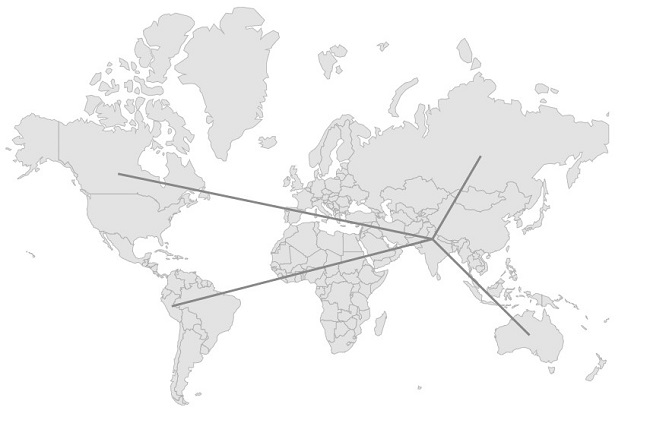
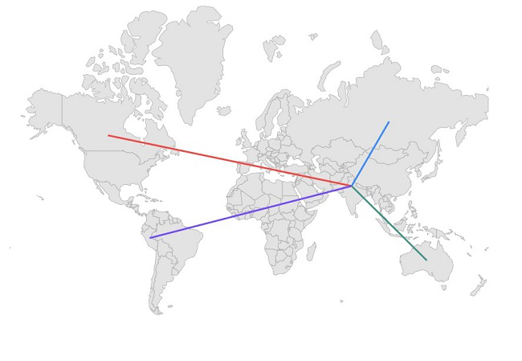
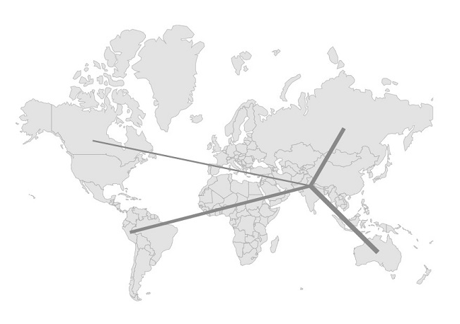
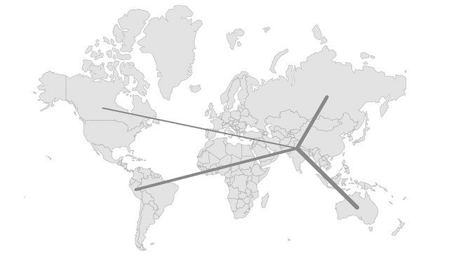
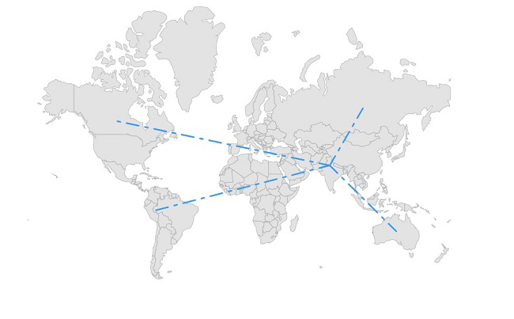
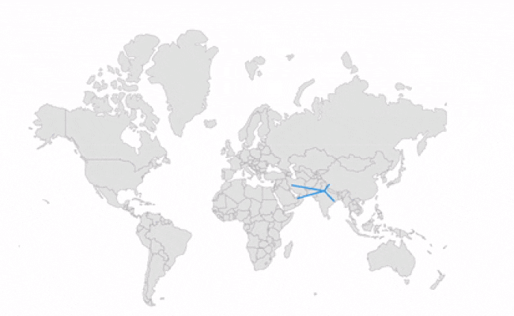

# Lines in .NET MAUI Maps (SfMaps)

N> **Prerequisite:** Ensure that the required NuGet package is installed, the necessary namespaces are imported, and the **Maps** control is properly configured in your application. For detailed setup and configuration instructions, refer to the **[Getting Started](https://help.syncfusion.com/maui/maps/getting-started)** guide.

The line layer is a sublayer that renders a group of [`MapLine`](https://help.syncfusion.com/cr/maui/Syncfusion.Maui.Maps.MapLine.html) on a [`MapLineLayer`](https://help.syncfusion.com/cr/maui/Syncfusion.Maui.Maps.MapLineLayer.html), which can be added as a sublayer of [`MapShapeLayer`](https://help.syncfusion.com/cr/maui/Syncfusion.Maui.Maps.MapShapeLayer.html). This section explains how to add and customize lines.

To learn more about the .NET MAUI Maps line layer, you can check the following video.



## Adding lines

The [`Lines`](https://help.syncfusion.com/cr/maui/Syncfusion.Maui.Maps.MapLineLayer.html#Syncfusion_Maui_Maps_MapLineLayer_LinesProperty) is a collection of [`MapLine`](https://help.syncfusion.com/cr/maui/Syncfusion.Maui.Maps.MapLine.html). Each [`MapLine`](https://help.syncfusion.com/cr/maui/Syncfusion.Maui.Maps.MapLine.html) connects two location coordinates with a straight line. The start coordinate is set to the [`MapLine.From`](https://help.syncfusion.com/cr/maui/Syncfusion.Maui.Maps.MapLine.html#Syncfusion_Maui_Maps_MapLine_From) property, and the end coordinate is set to the [`MapLine.To`](https://help.syncfusion.com/cr/maui/Syncfusion.Maui.Maps.MapLine.html#Syncfusion_Maui_Maps_MapLine_To) property. When the [`MapLine.Stroke`](https://help.syncfusion.com/cr/maui/Syncfusion.Maui.Maps.MapLine.html#Syncfusion_Maui_Maps_MapLine_Stroke) and [`MapLine.StrokeThickness`](https://help.syncfusion.com/cr/maui/Syncfusion.Maui.Maps.MapLine.html#Syncfusion_Maui_Maps_MapLine_StrokeThickness) properties are not set, the defaults (default stroke color and stroke thickness of `2`, measured in device-independent units) are applied.





<map:SfMaps>
    <map:SfMaps.Layer>
        <map:MapShapeLayer ShapesSource="https://cdn.syncfusion.com/maps/map-data/world-map.json"
                           ShapeStroke="DarkGray">
            <map:MapShapeLayer.Sublayers>
                <map:MapLineLayer>
                    <map:MapLineLayer.Lines>
                        <map:MapLine>
                            <map:MapLine.From>
                                <map:MapLatLng Latitude="28.7041"
                                               Longitude="77.1025" />
                            </map:MapLine.From>
                            <map:MapLine.To>
                                <map:MapLatLng Latitude="56.1304"
                                               Longitude="-106.3468" />
                            </map:MapLine.To>
                        </map:MapLine>
                        <map:MapLine>
                            <map:MapLine.From>
                                <map:MapLatLng Latitude="28.7041"
                                               Longitude="77.1025" />
                            </map:MapLine.From>
                            <map:MapLine.To>
                                <map:MapLatLng Latitude="-9.1900"
                                               Longitude="-75.0152" />
                            </map:MapLine.To>
                        </map:MapLine>
                        <map:MapLine>
                            <map:MapLine.From>
                                <map:MapLatLng Latitude="28.7041"
                                               Longitude="77.1025" />
                            </map:MapLine.From>
                            <map:MapLine.To>
                                <map:MapLatLng Latitude="61.5240"
                                               Longitude="105.3188" />
                            </map:MapLine.To>
                        </map:MapLine>
                        <map:MapLine>
                            <map:MapLine.From>
                                <map:MapLatLng Latitude="28.7041"
                                               Longitude="77.1025" />
                            </map:MapLine.From>
                            <map:MapLine.To>
                                <map:MapLatLng Latitude="-25.2744"
                                               Longitude="133.7751" />
                            </map:MapLine.To>
                        </map:MapLine>
                    </map:MapLineLayer.Lines>
                </map:MapLineLayer>
            </map:MapShapeLayer.Sublayers>
        </map:MapShapeLayer>
    </map:SfMaps.Layer>
</map:SfMaps>





var maps = new SfMaps();
var layer = new MapShapeLayer();
layer.ShapesSource = MapSource.FromUri(new Uri("https://cdn.syncfusion.com/maps/map-data/world-map.json"));
layer.ShapeStroke = Brush.DarkGray;
var mapLineLayer = new MapLineLayer();

var line1 = new MapLine();
line1.From = new MapLatLng(28.7041, 77.1025);
line1.To = new MapLatLng(56.1304, -106.3468);

var line2 = new MapLine();
line2.From = new MapLatLng(28.7041, 77.1025);
line2.To = new MapLatLng(-9.1900, -75.0152);

var line3 = new MapLine();
line3.From = new MapLatLng(28.7041, 77.1025);
line3.To = new MapLatLng(61.5240, 105.3188);

var line4 = new MapLine();
line4.From = new MapLatLng(28.7041, 77.1025);
line4.To = new MapLatLng(-25.2744, 133.7751);

mapLineLayer.Lines.Add(line1);
mapLineLayer.Lines.Add(line2);
mapLineLayer.Lines.Add(line3);
mapLineLayer.Lines.Add(line4);
layer.Sublayers.Add(mapLineLayer);
maps.Layer = layer;
this.Content = maps;





## Stroke color

You can apply a stroke color to each [`MapLine`](https://help.syncfusion.com/cr/maui/Syncfusion.Maui.Maps.MapLine.html) in the [`Lines`](https://help.syncfusion.com/cr/maui/Syncfusion.Maui.Maps.MapLineLayer.html#Syncfusion_Maui_Maps_MapLineLayer_LinesProperty) collection using the individual [`MapLine.Stroke`](https://help.syncfusion.com/cr/maui/Syncfusion.Maui.Maps.MapLine.html#Syncfusion_Maui_Maps_MapLine_Stroke) property. When the [`MapLine.Stroke`](https://help.syncfusion.com/cr/maui/Syncfusion.Maui.Maps.MapLine.html#Syncfusion_Maui_Maps_MapLine_Stroke) property is not set, the default stroke color is applied.





<map:SfMaps>
    <map:SfMaps.Layer>
        <map:MapShapeLayer ShapesSource="https://cdn.syncfusion.com/maps/map-data/world-map.json"
                           ShapeStroke="DarkGray">
            <map:MapShapeLayer.Sublayers>
                <map:MapLineLayer>
                    <map:MapLineLayer.Lines>
                        <map:MapLine Stroke="#ed4a47">
                            <map:MapLine.From>
                                <map:MapLatLng Latitude="28.7041"
                                               Longitude="77.1025" />
                            </map:MapLine.From>
                            <map:MapLine.To>
                                <map:MapLatLng Latitude="56.1304"
                                               Longitude="-106.3468" />
                            </map:MapLine.To>
                        </map:MapLine>
                        <map:MapLine Stroke="#724df6">
                            <map:MapLine.From>
                                <map:MapLatLng Latitude="28.7041"
                                               Longitude="77.1025" />
                            </map:MapLine.From>
                            <map:MapLine.To>
                                <map:MapLatLng Latitude="-9.1900"
                                               Longitude="-75.0152" />
                            </map:MapLine.To>
                        </map:MapLine>
                        <map:MapLine Stroke="#3e8af5">
                            <map:MapLine.From>
                                <map:MapLatLng Latitude="28.7041"
                                               Longitude="77.1025" />
                            </map:MapLine.From>
                            <map:MapLine.To>
                                <map:MapLatLng Latitude="61.5240"
                                               Longitude="105.3188" />
                            </map:MapLine.To>
                        </map:MapLine>
                        <map:MapLine Stroke="#439386">
                            <map:MapLine.From>
                                <map:MapLatLng Latitude="28.7041"
                                               Longitude="77.1025" />
                            </map:MapLine.From>
                            <map:MapLine.To>
                                <map:MapLatLng Latitude="-25.2744"
                                               Longitude="133.7751" />
                            </map:MapLine.To>
                        </map:MapLine>
                    </map:MapLineLayer.Lines>
                </map:MapLineLayer>
            </map:MapShapeLayer.Sublayers>
        </map:MapShapeLayer>
    </map:SfMaps.Layer>
</map:SfMaps>





var maps = new SfMaps();
var layer = new MapShapeLayer();
layer.ShapesSource = MapSource.FromUri(new Uri("https://cdn.syncfusion.com/maps/map-data/world-map.json"));
layer.ShapeStroke = Brush.DarkGray;
var mapLineLayer = new MapLineLayer();

var line1 = new MapLine();
line1.From = new MapLatLng(28.7041, 77.1025);
line1.To = new MapLatLng(56.1304, -106.3468);
line1.Stroke = Color.FromRgb(237, 74, 71);

var line2 = new MapLine();
line2.From = new MapLatLng(28.7041, 77.1025);
line2.To = new MapLatLng(-9.1900, -75.0152);
line2.Stroke = Color.FromRgb(114, 77, 246);

var line3 = new MapLine();
line3.From = new MapLatLng(28.7041, 77.1025);
line3.To = new MapLatLng(61.5240, 105.3188);
line3.Stroke = Color.FromRgb(62, 138, 245);

var line4 = new MapLine();
line4.From = new MapLatLng(28.7041, 77.1025);
line4.To = new MapLatLng(-25.2744, 133.7751);
line4.Stroke = Color.FromRgb(67, 147, 134);

mapLineLayer.Lines.Add(line1);
mapLineLayer.Lines.Add(line2);
mapLineLayer.Lines.Add(line3);
mapLineLayer.Lines.Add(line4);
layer.Sublayers.Add(mapLineLayer);
maps.Layer = layer;
this.Content = maps;





## Stroke thickness

You can apply thickness to each [`MapLine`](https://help.syncfusion.com/cr/maui/Syncfusion.Maui.Maps.MapLine.html) in the [`Lines`](https://help.syncfusion.com/cr/maui/Syncfusion.Maui.Maps.MapLineLayer.html#Syncfusion_Maui_Maps_MapLineLayer_LinesProperty) collection using the individual [`MapLine.StrokeThickness`](https://help.syncfusion.com/cr/maui/Syncfusion.Maui.Maps.MapLine.html#Syncfusion_Maui_Maps_MapLine_StrokeThickness) property. The default value of the [`MapLine.StrokeThickness`](https://help.syncfusion.com/cr/maui/Syncfusion.Maui.Maps.MapLine.html#Syncfusion_Maui_Maps_MapLine_StrokeThickness) property is `2`, measured in device-independent units.





<map:SfMaps>
    <map:SfMaps.Layer>
        <map:MapShapeLayer ShapesSource="https://cdn.syncfusion.com/maps/map-data/world-map.json"
                           ShapeStroke="DarkGray">
            <map:MapShapeLayer.Sublayers>
                <map:MapLineLayer>
                    <map:MapLineLayer.Lines>
                        <map:MapLine StrokeThickness="2"
                                     Stroke="#8a8a8a">
                            <map:MapLine.From>
                                <map:MapLatLng Latitude="28.7041"
                                               Longitude="77.1025" />
                            </map:MapLine.From>
                            <map:MapLine.To>
                                <map:MapLatLng Latitude="56.1304"
                                               Longitude="-106.3468" />
                            </map:MapLine.To>
                        </map:MapLine>
                        <map:MapLine StrokeThickness="4"
                                     Stroke="#8a8a8a">
                            <map:MapLine.From>
                                <map:MapLatLng Latitude="28.7041"
                                               Longitude="77.1025" />
                            </map:MapLine.From>
                            <map:MapLine.To>
                                <map:MapLatLng Latitude="-9.1900"
                                               Longitude="-75.0152" />
                            </map:MapLine.To>
                        </map:MapLine>
                        <map:MapLine StrokeThickness="5"
                                     Stroke="#8a8a8a">
                            <map:MapLine.From>
                                <map:MapLatLng Latitude="28.7041"
                                               Longitude="77.1025" />
                            </map:MapLine.From>
                            <map:MapLine.To>
                                <map:MapLatLng Latitude="61.5240"
                                               Longitude="105.3188" />
                            </map:MapLine.To>
                        </map:MapLine>
                        <map:MapLine StrokeThickness="6"
                                     Stroke="#8a8a8a">
                            <map:MapLine.From>
                                <map:MapLatLng Latitude="28.7041"
                                               Longitude="77.1025" />
                            </map:MapLine.From>
                            <map:MapLine.To>
                                <map:MapLatLng Latitude="-25.2744"
                                               Longitude="133.7751" />
                            </map:MapLine.To>
                        </map:MapLine>
                    </map:MapLineLayer.Lines>
                </map:MapLineLayer>
            </map:MapShapeLayer.Sublayers>
        </map:MapShapeLayer>
    </map:SfMaps.Layer>
</map:SfMaps>





var maps = new SfMaps();
var layer = new MapShapeLayer();
layer.ShapesSource = MapSource.FromUri(new Uri("https://cdn.syncfusion.com/maps/map-data/world-map.json"));
layer.ShapeStroke = Brush.DarkGray;
var mapLineLayer = new MapLineLayer();

var line1 = new MapLine();
line1.From = new MapLatLng(28.7041, 77.1025);
line1.To = new MapLatLng(56.1304, -106.3468);
line1.Stroke = Color.FromRgb(138, 138, 138);
line1.StrokeThickness = 2;

var line2 = new MapLine();
line2.From = new MapLatLng(28.7041, 77.1025);
line2.To = new MapLatLng(-9.1900, -75.0152);
line2.Stroke = Color.FromRgb(138, 138, 138);
line2.StrokeThickness = 4;

var line3 = new MapLine();
line3.From = new MapLatLng(28.7041, 77.1025);
line3.To = new MapLatLng(61.5240, 105.3188);
line3.Stroke = Color.FromRgb(138, 138, 138);
line3.StrokeThickness = 5;

var line4 = new MapLine();
line4.From = new MapLatLng(28.7041, 77.1025);
line4.To = new MapLatLng(-25.2744, 133.7751);
line4.Stroke = Color.FromRgb(138, 138, 138);
line4.StrokeThickness = 6;

mapLineLayer.Lines.Add(line1);
mapLineLayer.Lines.Add(line2);
mapLineLayer.Lines.Add(line3);
mapLineLayer.Lines.Add(line4);
layer.Sublayers.Add(mapLineLayer);
maps.Layer = layer;
this.Content = maps;





## Stroke cap

You can apply a stroke cap to each [`MapLine`](https://help.syncfusion.com/cr/maui/Syncfusion.Maui.Maps.MapLine.html) in the [`Lines`](https://help.syncfusion.com/cr/maui/Syncfusion.Maui.Maps.MapLineLayer.html#Syncfusion_Maui_Maps_MapLineLayer_LinesProperty) collection using the individual [`MapLine.StrokeLineCap`](https://help.syncfusion.com/cr/maui/Syncfusion.Maui.Maps.MapLine.html#Syncfusion_Maui_Maps_MapLine_StrokeLineCap) property. The default value of the [`MapLine.StrokeLineCap`](https://help.syncfusion.com/cr/maui/Syncfusion.Maui.Maps.MapLine.html#Syncfusion_Maui_Maps_MapLine_StrokeLineCap) property is `LineCap.Butt`. The available values are `Butt`, `Round`, and `Square`, from the `Microsoft.Maui.Graphics.LineCap` enum. In XAML, the enum member name is set as a string (for example, `StrokeLineCap="Round"`), and in C#, the `LineCap` enum value is used (for example, `line1.StrokeLineCap = LineCap.Round;`).





<map:SfMaps>
    <map:SfMaps.Layer>
        <map:MapShapeLayer ShapesSource="https://cdn.syncfusion.com/maps/map-data/world-map.json"
                           ShapeStroke="DarkGray">
            <map:MapShapeLayer.Sublayers>
                <map:MapLineLayer>
                    <map:MapLineLayer.Lines>
                        <map:MapLine StrokeThickness="2"
                                     Stroke="#8a8a8a"
                                     StrokeLineCap="Round">
                            <map:MapLine.From>
                                <map:MapLatLng Latitude="28.7041"
                                               Longitude="77.1025" />
                            </map:MapLine.From>
                            <map:MapLine.To>
                                <map:MapLatLng Latitude="56.1304"
                                               Longitude="-106.3468" />
                            </map:MapLine.To>
                        </map:MapLine>
                        <map:MapLine StrokeThickness="4"
                                     Stroke="#8a8a8a"
                                     StrokeLineCap="Round">
                            <map:MapLine.From>
                                <map:MapLatLng Latitude="28.7041"
                                               Longitude="77.1025" />
                            </map:MapLine.From>
                            <map:MapLine.To>
                                <map:MapLatLng Latitude="-9.1900"
                                               Longitude="-75.0152" />
                            </map:MapLine.To>
                        </map:MapLine>
                        <map:MapLine StrokeThickness="5"
                                     Stroke="#8a8a8a"
                                     StrokeLineCap="Round">
                            <map:MapLine.From>
                                <map:MapLatLng Latitude="28.7041"
                                               Longitude="77.1025" />
                            </map:MapLine.From>
                            <map:MapLine.To>
                                <map:MapLatLng Latitude="61.5240"
                                               Longitude="105.3188" />
                            </map:MapLine.To>
                        </map:MapLine>
                        <map:MapLine StrokeThickness="6"
                                     Stroke="#8a8a8a"
                                     StrokeLineCap="Round">
                            <map:MapLine.From>
                                <map:MapLatLng Latitude="28.7041"
                                               Longitude="77.1025" />
                            </map:MapLine.From>
                            <map:MapLine.To>
                                <map:MapLatLng Latitude="-25.2744"
                                               Longitude="133.7751" />
                            </map:MapLine.To>
                        </map:MapLine>
                    </map:MapLineLayer.Lines>
                </map:MapLineLayer>
            </map:MapShapeLayer.Sublayers>
        </map:MapShapeLayer>
    </map:SfMaps.Layer>
</map:SfMaps>





var maps = new SfMaps();
var layer = new MapShapeLayer();
layer.ShapesSource = MapSource.FromUri(new Uri("https://cdn.syncfusion.com/maps/map-data/world-map.json"));
layer.ShapeStroke = Brush.DarkGray;
var mapLineLayer = new MapLineLayer();

var line1 = new MapLine();
line1.From = new MapLatLng(28.7041, 77.1025);
line1.To = new MapLatLng(56.1304, -106.3468);
line1.Stroke = Color.FromRgb(138, 138, 138);
line1.StrokeThickness = 2;
line1.StrokeLineCap = LineCap.Round;

var line2 = new MapLine();
line2.From = new MapLatLng(28.7041, 77.1025);
line2.To = new MapLatLng(-9.1900, -75.0152);
line2.Stroke = Color.FromRgb(138, 138, 138);
line2.StrokeThickness = 4;
line2.StrokeLineCap = LineCap.Round;

var line3 = new MapLine();
line3.From = new MapLatLng(28.7041, 77.1025);
line3.To = new MapLatLng(61.5240, 105.3188);
line3.Stroke = Color.FromRgb(138, 138, 138);
line3.StrokeThickness = 5;
line3.StrokeLineCap = LineCap.Round;

var line4 = new MapLine();
line4.From = new MapLatLng(28.7041, 77.1025);
line4.To = new MapLatLng(-25.2744, 133.7751);
line4.Stroke = Color.FromRgb(138, 138, 138);
line4.StrokeThickness = 6;
line4.StrokeLineCap = LineCap.Round;

mapLineLayer.Lines.Add(line1);
mapLineLayer.Lines.Add(line2);
mapLineLayer.Lines.Add(line3);
mapLineLayer.Lines.Add(line4);
layer.Sublayers.Add(mapLineLayer);
maps.Layer = layer;
this.Content = maps;





## Dash array

You can apply dash support to a line using the [`MapLine.StrokeDashArray`](https://help.syncfusion.com/cr/maui/Syncfusion.Maui.Maps.MapLine.html#Syncfusion_Maui_Maps_MapLine_StrokeDashArray) property.

A sequence of dashes and gaps is rendered based on the values in this list. Once all the values in the list are rendered, the sequence repeats until the end of the line. When the [`MapLine.StrokeDashArray`](https://help.syncfusion.com/cr/maui/Syncfusion.Maui.Maps.MapLine.html#Syncfusion_Maui_Maps_MapLine_StrokeDashArray) property is not set, a solid line is rendered. The values are specified in device-independent units that match the [`StrokeThickness`](https://help.syncfusion.com/cr/maui/Syncfusion.Maui.Maps.MapLine.html#Syncfusion_Maui_Maps_MapLine_StrokeThickness) coordinate space.





<map:SfMaps>
    <map:SfMaps.Layer>
        <map:MapShapeLayer ShapesSource="https://cdn.syncfusion.com/maps/map-data/world-map.json"
                           ShapeStroke="DarkGray">
            <map:MapShapeLayer.Sublayers>
                <map:MapLineLayer>
                    <map:MapLineLayer.Lines>
                        <map:MapLine Stroke="#3d9bf2">
                            <map:MapLine.From>
                                <map:MapLatLng Latitude="28.7041"
                                               Longitude="77.1025" />
                            </map:MapLine.From>
                            <map:MapLine.To>
                                <map:MapLatLng Latitude="56.1304"
                                               Longitude="-106.3468" />
                            </map:MapLine.To>
                            <map:MapLine.StrokeDashArray>
                                <DoubleCollection>
                                    <x:Double>8</x:Double>
                                    <x:Double>4</x:Double>
                                    <x:Double>2</x:Double>
                                    <x:Double>4</x:Double>
                                </DoubleCollection>
                            </map:MapLine.StrokeDashArray>
                        </map:MapLine>
                        <map:MapLine Stroke="#3d9bf2">
                            <map:MapLine.From>
                                <map:MapLatLng Latitude="28.7041"
                                               Longitude="77.1025" />
                            </map:MapLine.From>
                            <map:MapLine.To>
                                <map:MapLatLng Latitude="-9.1900"
                                               Longitude="-75.0152" />
                            </map:MapLine.To>
                            <map:MapLine.StrokeDashArray>
                                <DoubleCollection>
                                    <x:Double>8</x:Double>
                                    <x:Double>4</x:Double>
                                    <x:Double>2</x:Double>
                                    <x:Double>4</x:Double>
                                </DoubleCollection>
                            </map:MapLine.StrokeDashArray>
                        </map:MapLine>
                        <map:MapLine Stroke="#3d9bf2">
                            <map:MapLine.From>
                                <map:MapLatLng Latitude="28.7041"
                                               Longitude="77.1025" />
                            </map:MapLine.From>
                            <map:MapLine.To>
                                <map:MapLatLng Latitude="61.5240"
                                               Longitude="105.3188" />
                            </map:MapLine.To>
                            <map:MapLine.StrokeDashArray>
                                <DoubleCollection>
                                    <x:Double>8</x:Double>
                                    <x:Double>4</x:Double>
                                    <x:Double>2</x:Double>
                                    <x:Double>4</x:Double>
                                </DoubleCollection>
                            </map:MapLine.StrokeDashArray>
                        </map:MapLine>
                        <map:MapLine Stroke="#3d9bf2">
                            <map:MapLine.From>
                                <map:MapLatLng Latitude="28.7041"
                                               Longitude="77.1025" />
                            </map:MapLine.From>
                            <map:MapLine.To>
                                <map:MapLatLng Latitude="-25.2744"
                                               Longitude="133.7751" />
                            </map:MapLine.To>
                            <map:MapLine.StrokeDashArray>
                                <DoubleCollection>
                                    <x:Double>8</x:Double>
                                    <x:Double>4</x:Double>
                                    <x:Double>2</x:Double>
                                    <x:Double>4</x:Double>
                                </DoubleCollection>
                            </map:MapLine.StrokeDashArray>
                        </map:MapLine>
                    </map:MapLineLayer.Lines>
                </map:MapLineLayer>
            </map:MapShapeLayer.Sublayers>
        </map:MapShapeLayer>
    </map:SfMaps.Layer>
</map:SfMaps>





var maps = new SfMaps();
var layer = new MapShapeLayer();
layer.ShapesSource = MapSource.FromUri(new Uri("https://cdn.syncfusion.com/maps/map-data/world-map.json"));
layer.ShapeStroke = Brush.DarkGray;
var mapLineLayer = new MapLineLayer();

var line1 = new MapLine();
line1.From = new MapLatLng(28.7041, 77.1025);
line1.To = new MapLatLng(56.1304, -106.3468);
line1.Stroke = Color.FromRgb(61, 155, 242);
line1.StrokeDashArray = new double[] { 8, 4, 2, 4 };

var line2 = new MapLine();
line2.From = new MapLatLng(28.7041, 77.1025);
line2.To = new MapLatLng(-9.1900, -75.0152);
line2.Stroke = Color.FromRgb(61, 155, 242);
line2.StrokeDashArray = new double[] { 8, 4, 2, 4 };

var line3 = new MapLine();
line3.From = new MapLatLng(28.7041, 77.1025);
line3.To = new MapLatLng(61.5240, 105.3188);
line3.Stroke = Color.FromRgb(61, 155, 242);
line3.StrokeDashArray = new double[] { 8, 4, 2, 4 };

var line4 = new MapLine();
line4.From = new MapLatLng(28.7041, 77.1025);
line4.To = new MapLatLng(-25.2744, 133.7751);
line4.Stroke = Color.FromRgb(61, 155, 242);
line4.StrokeDashArray = new double[] { 8, 4, 2, 4 };

mapLineLayer.Lines.Add(line1);
mapLineLayer.Lines.Add(line2);
mapLineLayer.Lines.Add(line3);
mapLineLayer.Lines.Add(line4);
layer.Sublayers.Add(mapLineLayer);
maps.Layer = layer;
this.Content = maps;





## Animation

You can apply animation to the [`MapLine`](https://help.syncfusion.com/cr/maui/Syncfusion.Maui.Maps.MapLine.html) using the [`MapLineLayer.AnimationDuration`](https://help.syncfusion.com/cr/maui/Syncfusion.Maui.Maps.MapLineLayer.html#Syncfusion_Maui_Maps_MapLineLayer_AnimationDuration) and [`MapLineLayer.AnimationEasing`](https://help.syncfusion.com/cr/maui/Syncfusion.Maui.Maps.MapLineLayer.html#Syncfusion_Maui_Maps_MapLineLayer_AnimationEasing) properties.

The [`MapLineLayer.AnimationDuration`](https://help.syncfusion.com/cr/maui/Syncfusion.Maui.Maps.MapLineLayer.html#Syncfusion_Maui_Maps_MapLineLayer_AnimationDuration) value is specified in milliseconds, and the [`MapLineLayer.AnimationEasing`](https://help.syncfusion.com/cr/maui/Syncfusion.Maui.Maps.MapLineLayer.html#Syncfusion_Maui_Maps_MapLineLayer_AnimationEasing) accepts standard .NET MAUI `Easing` values (for example, `Easing.Linear`, `Easing.SinIn`, `Easing.CubicInOut`). By default, animation is disabled.

N> Animation is only applied at load time.





<map:SfMaps>
    <map:SfMaps.Layer>
        <map:MapShapeLayer ShapesSource="https://cdn.syncfusion.com/maps/map-data/world-map.json"
                           ShapeStroke="DarkGray">
            <map:MapShapeLayer.Sublayers>
                <map:MapLineLayer AnimationDuration="3000"
                                  AnimationEasing="{x:Static Easing.Linear}">
                    <map:MapLineLayer.Lines>
                        <map:MapLine>
                            <map:MapLine.From>
                                <map:MapLatLng Latitude="28.7041"
                                               Longitude="77.1025" />
                            </map:MapLine.From>
                            <map:MapLine.To>
                                <map:MapLatLng Latitude="56.1304"
                                               Longitude="-106.3468" />
                            </map:MapLine.To>
                        </map:MapLine>
                        <map:MapLine>
                            <map:MapLine.From>
                                <map:MapLatLng Latitude="28.7041"
                                               Longitude="77.1025" />
                            </map:MapLine.From>
                            <map:MapLine.To>
                                <map:MapLatLng Latitude="-9.1900"
                                               Longitude="-75.0152" />
                            </map:MapLine.To>
                        </map:MapLine>
                        <map:MapLine>
                            <map:MapLine.From>
                                <map:MapLatLng Latitude="28.7041"
                                               Longitude="77.1025" />
                            </map:MapLine.From>
                            <map:MapLine.To>
                                <map:MapLatLng Latitude="61.5240"
                                               Longitude="105.3188" />
                            </map:MapLine.To>
                        </map:MapLine>
                        <map:MapLine>
                            <map:MapLine.From>
                                <map:MapLatLng Latitude="28.7041"
                                               Longitude="77.1025" />
                            </map:MapLine.From>
                            <map:MapLine.To>
                                <map:MapLatLng Latitude="-25.2744"
                                               Longitude="133.7751" />
                            </map:MapLine.To>
                        </map:MapLine>
                    </map:MapLineLayer.Lines>
                </map:MapLineLayer>
            </map:MapShapeLayer.Sublayers>
        </map:MapShapeLayer>
    </map:SfMaps.Layer>
</map:SfMaps>





var maps = new SfMaps();
var layer = new MapShapeLayer();
layer.ShapesSource = MapSource.FromUri(new Uri("https://cdn.syncfusion.com/maps/map-data/world-map.json"));
layer.ShapeStroke = Brush.DarkGray;
var mapLineLayer = new MapLineLayer();
mapLineLayer.AnimationDuration = 3000;
mapLineLayer.AnimationEasing = Easing.Linear;

var line1 = new MapLine();
line1.From = new MapLatLng(28.7041, 77.1025);
line1.To = new MapLatLng(56.1304, -106.3468);

var line2 = new MapLine();
line2.From = new MapLatLng(28.7041, 77.1025);
line2.To = new MapLatLng(-9.1900, -75.0152);

var line3 = new MapLine();
line3.From = new MapLatLng(28.7041, 77.1025);
line3.To = new MapLatLng(61.5240, 105.3188);

var line4 = new MapLine();
line4.From = new MapLatLng(28.7041, 77.1025);
line4.To = new MapLatLng(-25.2744, 133.7751);

mapLineLayer.Lines.Add(line1);
mapLineLayer.Lines.Add(line2);
mapLineLayer.Lines.Add(line3);
mapLineLayer.Lines.Add(line4);
layer.Sublayers.Add(mapLineLayer);
maps.Layer = layer;
this.Content = maps;





