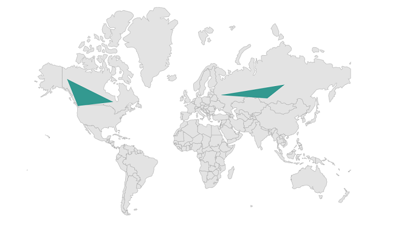
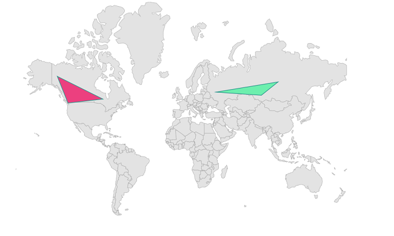
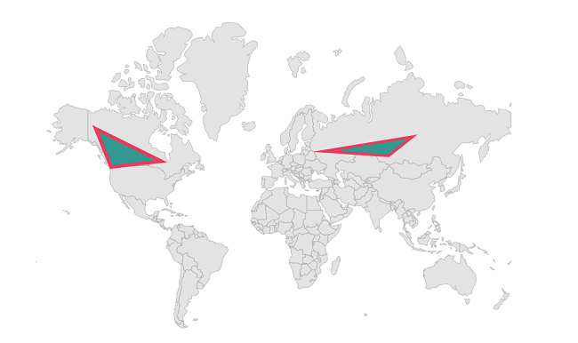

# Polygons in .NET MAUI Maps (SfMaps)

N> **Prerequisite:** Ensure that the required NuGet package is installed, the necessary namespaces are imported, and the **Maps** control is properly configured in your application. For detailed setup and configuration instructions, refer to the **[Getting Started](https://help.syncfusion.com/maui/maps/getting-started)** guide.

The polygon layer is a sublayer that renders a group of [`MapPolygon`](https://help.syncfusion.com/cr/maui/Syncfusion.Maui.Maps.MapPolygon.html) on a [`MapPolygonLayer`](https://help.syncfusion.com/cr/maui/Syncfusion.Maui.Maps.MapPolygonLayer.html), which can be added as a sublayer of [`MapShapeLayer`](https://help.syncfusion.com/cr/maui/Syncfusion.Maui.Maps.MapShapeLayer.html). This section explains how to add and customize polygons.

## Adding polygons

The [`Polygons`](https://help.syncfusion.com/cr/maui/Syncfusion.Maui.Maps.MapPolygonLayer.html#Syncfusion_Maui_Maps_MapPolygonLayer_Polygons) is a collection of [`MapPolygon`](https://help.syncfusion.com/cr/maui/Syncfusion.Maui.Maps.MapPolygon.html). Each [`MapPolygon`](https://help.syncfusion.com/cr/maui/Syncfusion.Maui.Maps.MapPolygon.html) is drawn from multiple coordinates specified by the [`Points`](https://help.syncfusion.com/cr/maui/Syncfusion.Maui.Maps.MapPolygon.html#Syncfusion_Maui_Maps_MapPolygon_Points) property. At least three points are required to render a polygon. In C#, set the [`Points`](https://help.syncfusion.com/cr/maui/Syncfusion.Maui.Maps.MapPolygon.html#Syncfusion_Maui_Maps_MapPolygon_Points) to an `ObservableCollection<MapLatLng>`. In XAML, add `MapLatLng` items directly as child elements of the `Points` property. When the [`MapPolygon.Fill`](https://help.syncfusion.com/cr/maui/Syncfusion.Maui.Maps.MapPolygon.html#Syncfusion_Maui_Maps_MapPolygon_Fill), [`MapPolygon.Stroke`](https://help.syncfusion.com/cr/maui/Syncfusion.Maui.Maps.MapPolygon.html#Syncfusion_Maui_Maps_MapPolygon_Stroke), and [`MapPolygon.StrokeThickness`](https://help.syncfusion.com/cr/maui/Syncfusion.Maui.Maps.MapPolygon.html#Syncfusion_Maui_Maps_MapPolygon_StrokeThickness) properties are not set, the default `Fill`/`Stroke` colors and a stroke thickness of `2` (measured in device-independent units) are applied.





<map:SfMaps>
    <map:SfMaps.Layer>
        <map:MapShapeLayer ShapesSource="https://cdn.syncfusion.com/maps/map-data/world-map.json"
                           ShapeStroke="DarkGray">
            <map:MapShapeLayer.Sublayers>
                <map:MapPolygonLayer>
                    <map:MapPolygonLayer.Polygons>
                        <map:MapPolygon>
                            <map:MapPolygon.Points>
                                <map:MapLatLng Latitude="55.7558"
                                               Longitude="37.6173" />
                                <map:MapLatLng Latitude="53.7596"
                                               Longitude="87.1216" />
                                <map:MapLatLng Latitude="61.5240"
                                               Longitude="105.3188" />
                            </map:MapPolygon.Points>
                        </map:MapPolygon>
                        <map:MapPolygon>
                            <map:MapPolygon.Points>
                                <map:MapLatLng Latitude="64.2823"
                                               Longitude="-135.0000" />
                                <map:MapLatLng Latitude="51.2538"
                                               Longitude="-85.3232" />
                                <map:MapLatLng Latitude="48.4284"
                                               Longitude="-123.3656" />
                            </map:MapPolygon.Points>
                        </map:MapPolygon>
                    </map:MapPolygonLayer.Polygons>
                </map:MapPolygonLayer>
            </map:MapShapeLayer.Sublayers>
        </map:MapShapeLayer>
    </map:SfMaps.Layer>
</map:SfMaps>





var maps = new SfMaps();
var layer = new MapShapeLayer();
layer.ShapesSource = MapSource.FromUri(new Uri("https://cdn.syncfusion.com/maps/map-data/world-map.json"));
layer.ShapeStroke = Brush.DarkGray;
var mapPolygonLayer = new MapPolygonLayer();

var polygon1 = new MapPolygon();
polygon1.Points = new ObservableCollection<MapLatLng>()
{
   new MapLatLng(55.7558, 37.6173),
   new MapLatLng(53.7596, 87.1216),
   new MapLatLng(61.5240, 105.3188)
};

var polygon2 = new MapPolygon();
polygon2.Points = new ObservableCollection<MapLatLng>()
{
   new MapLatLng(64.2823, -135.0000),
   new MapLatLng(51.2538, -85.3232),
   new MapLatLng(48.4284, -123.3656)
};

mapPolygonLayer.Polygons.Add(polygon1);
mapPolygonLayer.Polygons.Add(polygon2);
layer.Sublayers.Add(mapPolygonLayer);
maps.Layer = layer;
this.Content = maps;





## Fill color

You can apply a color to each [`MapPolygon`](https://help.syncfusion.com/cr/maui/Syncfusion.Maui.Maps.MapPolygon.html) in the [`Polygons`](https://help.syncfusion.com/cr/maui/Syncfusion.Maui.Maps.MapPolygonLayer.html#Syncfusion_Maui_Maps_MapPolygonLayer_Polygons) collection using the individual [`MapPolygon.Fill`](https://help.syncfusion.com/cr/maui/Syncfusion.Maui.Maps.MapPolygon.html#Syncfusion_Maui_Maps_MapPolygon_Fill) property. When the [`MapPolygon.Fill`](https://help.syncfusion.com/cr/maui/Syncfusion.Maui.Maps.MapPolygon.html#Syncfusion_Maui_Maps_MapPolygon_Fill) property is not set, the default fill color is applied.





<map:SfMaps>
    <map:SfMaps.Layer>
        <map:MapShapeLayer ShapesSource="https://cdn.syncfusion.com/maps/map-data/world-map.json"
                           ShapeStroke="DarkGray">
            <map:MapShapeLayer.Sublayers>
                <map:MapPolygonLayer>
                    <map:MapPolygonLayer.Polygons>
                        <map:MapPolygon Fill="#6defae">
                            <map:MapPolygon.Points>
                                <map:MapLatLng Latitude="55.7558"
                                               Longitude="37.6173" />
                                <map:MapLatLng Latitude="53.7596"
                                               Longitude="87.1216" />
                                <map:MapLatLng Latitude="61.5240"
                                               Longitude="105.3188" />
                            </map:MapPolygon.Points>
                        </map:MapPolygon>
                        <map:MapPolygon Fill="#ec407f">
                            <map:MapPolygon.Points>
                                <map:MapLatLng Latitude="64.2823"
                                               Longitude="-135.0000" />
                                <map:MapLatLng Latitude="51.2538"
                                               Longitude="-85.3232" />
                                <map:MapLatLng Latitude="48.4284"
                                               Longitude="-123.3656" />
                            </map:MapPolygon.Points>
                        </map:MapPolygon>
                    </map:MapPolygonLayer.Polygons>
                </map:MapPolygonLayer>
            </map:MapShapeLayer.Sublayers>
        </map:MapShapeLayer>
    </map:SfMaps.Layer>
</map:SfMaps>





var maps = new SfMaps();
var layer = new MapShapeLayer();
layer.ShapesSource = MapSource.FromUri(new Uri("https://cdn.syncfusion.com/maps/map-data/world-map.json"));
layer.ShapeStroke = Brush.DarkGray;
var mapPolygonLayer = new MapPolygonLayer();

var polygon1 = new MapPolygon();
polygon1.Points = new ObservableCollection<MapLatLng>()
{
   new MapLatLng(55.7558, 37.6173),
   new MapLatLng(53.7596, 87.1216),
   new MapLatLng(61.5240, 105.3188)
};
polygon1.Fill = Color.FromRgb(109, 239, 174);

var polygon2 = new MapPolygon();
polygon2.Points = new ObservableCollection<MapLatLng>()
{
   new MapLatLng(64.2823, -135.0000),
   new MapLatLng(51.2538, -85.3232),
   new MapLatLng(48.4284, -123.3656)
};
polygon2.Fill = Color.FromRgb(236, 64, 127);

mapPolygonLayer.Polygons.Add(polygon1);
mapPolygonLayer.Polygons.Add(polygon2);
layer.Sublayers.Add(mapPolygonLayer);
maps.Layer = layer;
this.Content = maps;





## Stroke color

You can apply a stroke color to each [`MapPolygon`](https://help.syncfusion.com/cr/maui/Syncfusion.Maui.Maps.MapPolygon.html) in the [`Polygons`](https://help.syncfusion.com/cr/maui/Syncfusion.Maui.Maps.MapPolygonLayer.html#Syncfusion_Maui_Maps_MapPolygonLayer_Polygons) collection using the individual [`MapPolygon.Stroke`](https://help.syncfusion.com/cr/maui/Syncfusion.Maui.Maps.MapPolygon.html#Syncfusion_Maui_Maps_MapPolygon_Stroke) property. When the [`MapPolygon.Stroke`](https://help.syncfusion.com/cr/maui/Syncfusion.Maui.Maps.MapPolygon.html#Syncfusion_Maui_Maps_MapPolygon_Stroke) property is not set, the default stroke color is applied.

## Stroke thickness

You can apply stroke thickness to each [`MapPolygon`](https://help.syncfusion.com/cr/maui/Syncfusion.Maui.Maps.MapPolygon.html) in the [`Polygons`](https://help.syncfusion.com/cr/maui/Syncfusion.Maui.Maps.MapPolygonLayer.html#Syncfusion_Maui_Maps_MapPolygonLayer_Polygons) collection using the individual [`MapPolygon.StrokeThickness`](https://help.syncfusion.com/cr/maui/Syncfusion.Maui.Maps.MapPolygon.html#Syncfusion_Maui_Maps_MapPolygon_StrokeThickness) property. The default value of the [`MapPolygon.StrokeThickness`](https://help.syncfusion.com/cr/maui/Syncfusion.Maui.Maps.MapPolygon.html#Syncfusion_Maui_Maps_MapPolygon_StrokeThickness) property is `2`, measured in device-independent units.

The example below applies both [`MapPolygon.Stroke`](https://help.syncfusion.com/cr/maui/Syncfusion.Maui.Maps.MapPolygon.html#Syncfusion_Maui_Maps_MapPolygon_Stroke) and [`MapPolygon.StrokeThickness`](https://help.syncfusion.com/cr/maui/Syncfusion.Maui.Maps.MapPolygon.html#Syncfusion_Maui_Maps_MapPolygon_StrokeThickness) using the color `#ea3b5e`.





<map:SfMaps>
    <map:SfMaps.Layer>
        <map:MapShapeLayer ShapesSource="https://cdn.syncfusion.com/maps/map-data/world-map.json"
                           ShapeStroke="DarkGray">
            <map:MapShapeLayer.Sublayers>
                <map:MapPolygonLayer>
                    <map:MapPolygonLayer.Polygons>
                        <map:MapPolygon Stroke="#ea3b5e"
                                        StrokeThickness="3">
                            <map:MapPolygon.Points>
                                <map:MapLatLng Latitude="55.7558"
                                               Longitude="37.6173" />
                                <map:MapLatLng Latitude="53.7596"
                                               Longitude="87.1216" />
                                <map:MapLatLng Latitude="61.5240"
                                               Longitude="105.3188" />
                            </map:MapPolygon.Points>
                        </map:MapPolygon>
                        <map:MapPolygon Stroke="#ea3b5e"
                                        StrokeThickness="4">
                            <map:MapPolygon.Points>
                                <map:MapLatLng Latitude="64.2823"
                                               Longitude="-135.0000" />
                                <map:MapLatLng Latitude="51.2538"
                                               Longitude="-85.3232" />
                                <map:MapLatLng Latitude="48.4284"
                                               Longitude="-123.3656" />
                            </map:MapPolygon.Points>
                        </map:MapPolygon>
                    </map:MapPolygonLayer.Polygons>
                </map:MapPolygonLayer>
            </map:MapShapeLayer.Sublayers>
        </map:MapShapeLayer>
    </map:SfMaps.Layer>
</map:SfMaps>





var maps = new SfMaps();
var layer = new MapShapeLayer();
layer.ShapesSource = MapSource.FromUri(new Uri("https://cdn.syncfusion.com/maps/map-data/world-map.json"));
layer.ShapeStroke = Brush.DarkGray;
var mapPolygonLayer = new MapPolygonLayer();

var polygon1 = new MapPolygon();
polygon1.Points = new ObservableCollection<MapLatLng>()
{
   new MapLatLng(55.7558, 37.6173),
   new MapLatLng(53.7596, 87.1216),
   new MapLatLng(61.5240, 105.3188)
};
polygon1.Stroke = Color.FromRgb(234, 59, 94);
polygon1.StrokeThickness = 3;

var polygon2 = new MapPolygon();
polygon2.Points = new ObservableCollection<MapLatLng>()
{
   new MapLatLng(64.2823, -135.0000),
   new MapLatLng(51.2538, -85.3232),
   new MapLatLng(48.4284, -123.3656)
};
polygon2.Stroke = Color.FromRgb(234, 59, 94);
polygon2.StrokeThickness = 4;

mapPolygonLayer.Polygons.Add(polygon1);
mapPolygonLayer.Polygons.Add(polygon2);
layer.Sublayers.Add(mapPolygonLayer);
maps.Layer = layer;
this.Content = maps;





