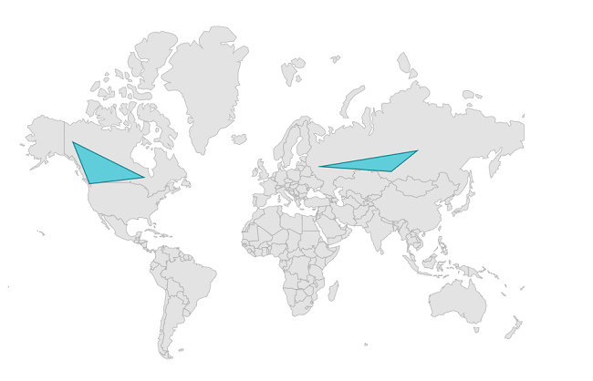

# Polygons in .NET MAUI Maps (SfMaps)

Polygon layer is a sublayer that renders a group of `MapPolygon` on the `MapShapeLayer`. This section helps to learn about how to add the polygons and customize them.

## Adding polygons

The `Polygons` is a collection of `MapPolygon`. Every single `MapPolygon` connects multiple coordinates through a `Points` property.





<map:SfMaps>
    <map:SfMaps.Layer>
        <map:MapShapeLayer ShapesSource="https://cdn.syncfusion.com/maps/map-data/world-map.json"
                           ShapeStroke="DarkGray">
            <map:MapShapeLayer.Sublayers>
                <map:MapPolygonLayer>
                    <map:MapPolygonLayer.Polygons>
                        <map:MapPolygon>
                            <map:MapPolygon.Points>
                                <map:MapLatLng Latitude="37.6173"
                                               Longitude="55.7558" />
                                <map:MapLatLng Latitude="87.1216"
                                               Longitude="53.7596" />
                                <map:MapLatLng Latitude="105.3188"
                                               Longitude="61.5240" />
                            </map:MapPolygon.Points>
                        </map:MapPolygon>
                        <map:MapPolygon>
                            <map:MapPolygon.Points>
                                <map:MapLatLng Latitude="-135.0000"
                                               Longitude="64.2823" />
                                <map:MapLatLng Latitude="-85.3232"
                                               Longitude="51.2538" />
                                <map:MapLatLng Latitude="-123.3656"
                                               Longitude="48.4284" />
                            </map:MapPolygon.Points>
                        </map:MapPolygon>
                    </map:MapPolygonLayer.Polygons>
                </map:MapPolygonLayer>
            </map:MapShapeLayer.Sublayers>
        </map:MapShapeLayer>
    </map:SfMaps.Layer>
</map:SfMaps>





SfMaps maps = new SfMaps();
MapShapeLayer layer = new MapShapeLayer();
layer.ShapesSource = MapSource.FromUri(new Uri("https://cdn.syncfusion.com/maps/map-data/world-map.json"));
layer.ShapeStroke = Brush.DarkGray;
MapPolygonLayer mapPolygonLayer = new MapPolygonLayer();
MapPolygon polygon1 = new MapPolygon();
polygon1.Points = new ObservableCollection<MapLatLng>()
{
new MapLatLng(37.6173, 55.7558),
new MapLatLng(87.1216, 53.7596),
new MapLatLng(105.3188, 61.5240)
};
MapPolygon polygon2 = new MapPolygon();
polygon2.Points = new ObservableCollection<MapLatLng>()
{
new MapLatLng(-135.0000, 64.2823),
new MapLatLng(-85.3232, 51.2538),
new MapLatLng(-123.3656, 48.4284)
};
mapPolygonLayer.Polygons.Add(polygon1);
mapPolygonLayer.Polygons.Add(polygon2);
layer.Sublayers.Add(mapPolygonLayer);
maps.Layer = layer;
this.Content = maps;





## Fill color

You can apply colors to each `MapPolygon` in the `Polygons` collection using the individual `MapPolygon.Fill` property.





<map:SfMaps>
    <map:SfMaps.Layer>
        <map:MapShapeLayer ShapesSource="https://cdn.syncfusion.com/maps/map-data/world-map.json"
                           ShapeStroke="DarkGray">
            <map:MapShapeLayer.Sublayers>
                <map:MapPolygonLayer>
                    <map:MapPolygonLayer.Polygons>
                        <map:MapPolygon Fill="#6defae">
                            <map:MapPolygon.Points>
                                <map:MapLatLng Latitude="37.6173"
                                               Longitude="55.7558" />
                                <map:MapLatLng Latitude="87.1216"
                                               Longitude="53.7596" />
                                <map:MapLatLng Latitude="105.3188"
                                               Longitude="61.5240" />
                            </map:MapPolygon.Points>
                        </map:MapPolygon>
                        <map:MapPolygon Fill="#ec407f">
                            <map:MapPolygon.Points>
                                <map:MapLatLng Latitude="-135.0000"
                                               Longitude="64.2823" />
                                <map:MapLatLng Latitude="-85.3232"
                                               Longitude="51.2538" />
                                <map:MapLatLng Latitude="-123.3656"
                                               Longitude="48.4284" />
                            </map:MapPolygon.Points>
                        </map:MapPolygon>
                    </map:MapPolygonLayer.Polygons>
                </map:MapPolygonLayer>
            </map:MapShapeLayer.Sublayers>
        </map:MapShapeLayer>
    </map:SfMaps.Layer>
</map:SfMaps>





SfMaps maps = new SfMaps();
MapShapeLayer layer = new MapShapeLayer();
layer.ShapesSource = MapSource.FromUri(new Uri("https://cdn.syncfusion.com/maps/map-data/world-map.json"));
layer.ShapeStroke = Brush.DarkGray;
MapPolygonLayer mapPolygonLayer = new MapPolygonLayer();
MapPolygon polygon1 = new MapPolygon();
polygon1.Points = new ObservableCollection<MapLatLng>()
{
new MapLatLng(37.6173, 55.7558),
new MapLatLng(87.1216, 53.7596),
new MapLatLng(105.3188, 61.5240)
};
polygon1.Fill = Color.FromRgb(109, 239, 174);
MapPolygon polygon2 = new MapPolygon();
polygon2.Points = new ObservableCollection<MapLatLng>()
{
new MapLatLng(-135.0000, 64.2823),
new MapLatLng(-85.3232, 51.2538),
new MapLatLng(-123.3656, 48.4284)
};
polygon2.Fill = Color.FromRgb(236, 64, 127);
mapPolygonLayer.Polygons.Add(polygon1);
mapPolygonLayer.Polygons.Add(polygon2);
layer.Sublayers.Add(mapPolygonLayer);
maps.Layer = layer;
this.Content = maps;





## Stroke and stroke thickness

You can apply stroke thickness to each `MapPolygon` in the `Polygons` collection using the individual `MapPolygon.StrokeThickness` property. The default value of the `MapPolygonLayer.StrokeThickness` property is `2`.

You can apply stroke color to each `MapPolygon` in the `Polygons` collection using the individual `MapPolygon.Stroke` property.





<map:SfMaps>
    <map:SfMaps.Layer>
        <map:MapShapeLayer ShapesSource="https://cdn.syncfusion.com/maps/map-data/world-map.json"
                           ShapeStroke="DarkGray">
            <map:MapShapeLayer.Sublayers>
                <map:MapPolygonLayer>
                    <map:MapPolygonLayer.Polygons>
                        <map:MapPolygon Stroke="#ea3b5e"
                                        StrokeThickness="3">
                            <map:MapPolygon.Points>
                                <map:MapLatLng Latitude="37.6173"
                                               Longitude="55.7558" />
                                <map:MapLatLng Latitude="87.1216"
                                               Longitude="53.7596" />
                                <map:MapLatLng Latitude="105.3188"
                                               Longitude="61.5240" />
                            </map:MapPolygon.Points>
                        </map:MapPolygon>
                        <map:MapPolygon Stroke="#ea3b5e"
                                        StrokeThickness="4">
                            <map:MapPolygon.Points>
                                <map:MapLatLng Latitude="-135.0000"
                                               Longitude="64.2823" />
                                <map:MapLatLng Latitude="-85.3232"
                                               Longitude="51.2538" />
                                <map:MapLatLng Latitude="-123.3656"
                                               Longitude="48.4284" />
                            </map:MapPolygon.Points>
                        </map:MapPolygon>
                    </map:MapPolygonLayer.Polygons>
                </map:MapPolygonLayer>
            </map:MapShapeLayer.Sublayers>
        </map:MapShapeLayer>
    </map:SfMaps.Layer>
</map:SfMaps>





SfMaps maps = new SfMaps();
MapShapeLayer layer = new MapShapeLayer();
layer.ShapesSource = MapSource.FromUri(new Uri("https://cdn.syncfusion.com/maps/map-data/world-map.json"));
layer.ShapeStroke = Brush.DarkGray;
MapPolygonLayer mapPolygonLayer = new MapPolygonLayer();
MapPolygon polygon1 = new MapPolygon();
polygon1.Points = new ObservableCollection<MapLatLng>()
{
new MapLatLng(37.6173, 55.7558),
new MapLatLng(87.1216, 53.7596),
new MapLatLng(105.3188, 61.5240)
};
polygon1.Fill = Color.FromRgb(234, 59, 94);
polygon1.StrokeThickness = 3;
MapPolygon polygon2 = new MapPolygon();
polygon2.Points = new ObservableCollection<MapLatLng>()
{
new MapLatLng(-135.0000, 64.2823),
new MapLatLng(-85.3232, 51.2538),
new MapLatLng(-123.3656, 48.4284)
};
polygon2.Fill = Color.FromRgb(234, 59, 94);
polygon2.StrokeThickness = 4;
mapPolygonLayer.Polygons.Add(polygon1);
mapPolygonLayer.Polygons.Add(polygon2);
layer.Sublayers.Add(mapPolygonLayer);
maps.Layer = layer;
this.Content = maps;





