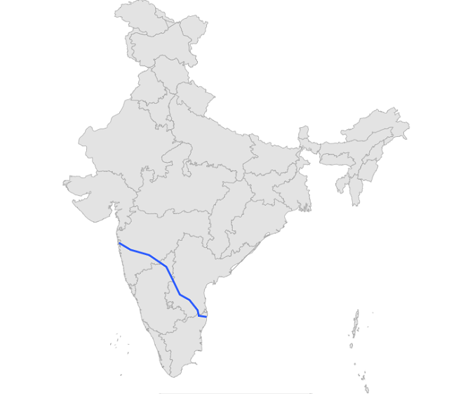
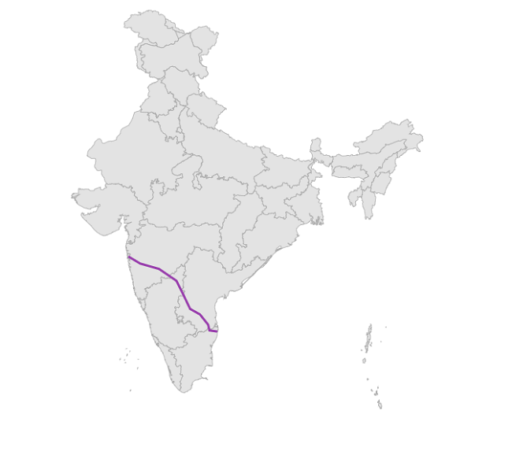
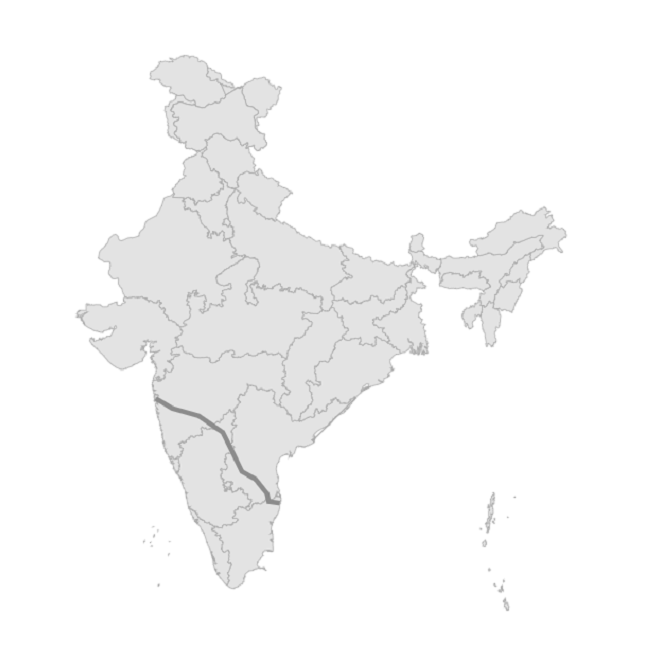
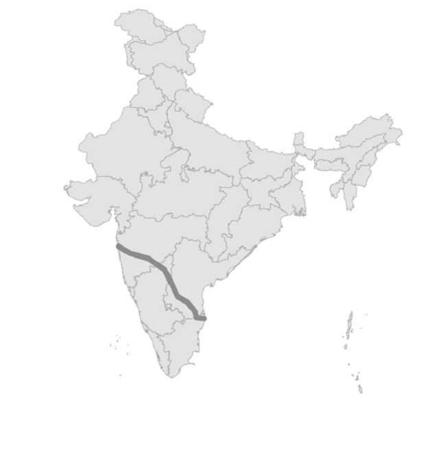
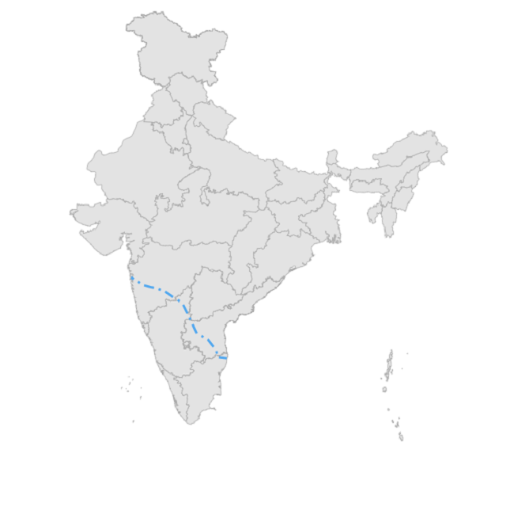
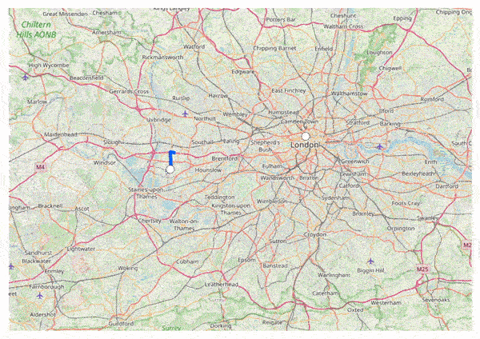

# Polylines in .NET MAUI Maps (SfMaps)

N> **Prerequisite:** Ensure that the required NuGet package is installed, the necessary namespaces are imported, and the **SfMaps** control is properly configured in your application. For detailed setup and configuration instructions, refer to the **[Getting Started](https://help.syncfusion.com/maui/maps/getting-started)** guide.

The polyline layer is a sublayer that renders a group of [`MapPolyline`](https://help.syncfusion.com/cr/maui/Syncfusion.Maui.Maps.MapPolyline.html) on [`MapShapeLayer`](https://help.syncfusion.com/cr/maui/Syncfusion.Maui.Maps.MapShapeLayer.html). This section explains how to add and customize polylines.

## Adding polylines

The [`Polylines`](https://help.syncfusion.com/cr/maui/Syncfusion.Maui.Maps.MapPolylineLayer.html#Syncfusion_Maui_Maps_MapPolylineLayer_Polylines) is a collection of [`MapPolyline`](https://help.syncfusion.com/cr/maui/Syncfusion.Maui.Maps.MapPolyline.html). Every single [`MapPolyline`](https://help.syncfusion.com/cr/maui/Syncfusion.Maui.Maps.MapPolyline.html) connects multiple coordinates through a [`Points`](https://help.syncfusion.com/cr/maui/Syncfusion.Maui.Maps.MapPolyline.html#Syncfusion_Maui_Maps_MapPolyline_Points) property.





<map:SfMaps>
    <map:SfMaps.Layer>
        <map:MapShapeLayer ShapesSource="https://cdn.syncfusion.com/maps/map-data/india.json"
                           ShapeStroke="DarkGray">
            <map:MapShapeLayer.Sublayers>
                <map:MapPolylineLayer>
                    <map:MapPolylineLayer.Polylines>
                        <map:MapPolyline>
                            <map:MapPolyline.Points>
                                <map:MapLatLng Latitude="13.0827"
                                               Longitude="80.2707" />
                                <map:MapLatLng Latitude="13.1746"
                                               Longitude="79.6117" />
                                <map:MapLatLng Latitude="13.6373"
                                               Longitude="79.5037" />
                                <map:MapLatLng Latitude="14.4673"
                                               Longitude="78.8242" />
                                <map:MapLatLng Latitude="14.9091"
                                               Longitude="78.0092" />
                                <map:MapLatLng Latitude="16.2160"
                                               Longitude="77.3566" />
                                <map:MapLatLng Latitude="17.1557"
                                               Longitude="76.8697" />
                                <map:MapLatLng Latitude="18.0975"
                                               Longitude="75.4249" />
                                <map:MapLatLng Latitude="18.5204"
                                               Longitude="73.8567" />
                                <map:MapLatLng Latitude="19.0760"
                                               Longitude="72.8777" />
                            </map:MapPolyline.Points>
                        </map:MapPolyline>
                    </map:MapPolylineLayer.Polylines>
                </map:MapPolylineLayer>
            </map:MapShapeLayer.Sublayers>
        </map:MapShapeLayer>
    </map:SfMaps.Layer>
</map:SfMaps>





SfMaps maps = new SfMaps();
MapShapeLayer layer = new MapShapeLayer();
layer.ShapesSource = MapSource.FromUri(new Uri("https://cdn.syncfusion.com/maps/map-data/india.json"));
layer.ShapeStroke = Brush.DarkGray;
MapPolylineLayer mapPolylineLayer = new MapPolylineLayer();
MapPolyline polyline = new MapPolyline();
polyline.Points = new ObservableCollection<MapLatLng>()
{
    new MapLatLng(13.0827, 80.2707),
    new MapLatLng(13.1746, 79.6117),
    new MapLatLng(13.6373, 79.5037),
    new MapLatLng(14.4673, 78.8242),
    new MapLatLng(14.9091, 78.0092),
    new MapLatLng(16.2160, 77.3566),
    new MapLatLng(17.1557, 76.8697),
    new MapLatLng(18.0975, 75.4249),
    new MapLatLng(18.5204, 73.8567),
    new MapLatLng(19.0760, 72.8777),
};
mapPolylineLayer.Polylines.Add(polyline);
layer.Sublayers.Add(mapPolylineLayer);
maps.Layer = layer;
this.Content = maps;





## Stroke

You can apply a color to each [`MapPolyline`](https://help.syncfusion.com/cr/maui/Syncfusion.Maui.Maps.MapPolyline.html) in the [`Polylines`](https://help.syncfusion.com/cr/maui/Syncfusion.Maui.Maps.MapPolylineLayer.html#Syncfusion_Maui_Maps_MapPolylineLayer_Polylines) collection using the individual [`MapPolyline.Stroke`](https://help.syncfusion.com/cr/maui/Syncfusion.Maui.Maps.MapPolyline.html#Syncfusion_Maui_Maps_MapPolyline_Stroke) property. When [`MapPolyline.Stroke`](https://help.syncfusion.com/cr/maui/Syncfusion.Maui.Maps.MapPolyline.html#Syncfusion_Maui_Maps_MapPolyline_Stroke) is not set, the default stroke color is applied.





<map:SfMaps>
    <map:SfMaps.Layer>
        <map:MapShapeLayer ShapesSource="https://cdn.syncfusion.com/maps/map-data/india.json"
                           ShapeStroke="DarkGray">
            <map:MapShapeLayer.Sublayers>
                <map:MapPolylineLayer>
                    <map:MapPolylineLayer.Polylines>
                        <map:MapPolyline Stroke="#993fad">
                            <map:MapPolyline.Points>
                                <map:MapLatLng Latitude="13.0827"
                                               Longitude="80.2707" />
                                <map:MapLatLng Latitude="13.1746"
                                               Longitude="79.6117" />
                                <map:MapLatLng Latitude="13.6373"
                                               Longitude="79.5037" />
                                <map:MapLatLng Latitude="14.4673"
                                               Longitude="78.8242" />
                                <map:MapLatLng Latitude="14.9091"
                                               Longitude="78.0092" />
                                <map:MapLatLng Latitude="16.2160"
                                               Longitude="77.3566" />
                                <map:MapLatLng Latitude="17.1557"
                                               Longitude="76.8697" />
                                <map:MapLatLng Latitude="18.0975"
                                               Longitude="75.4249" />
                                <map:MapLatLng Latitude="18.5204"
                                               Longitude="73.8567" />
                                <map:MapLatLng Latitude="19.0760"
                                               Longitude="72.8777" />
                            </map:MapPolyline.Points>
                        </map:MapPolyline>
                    </map:MapPolylineLayer.Polylines>
                </map:MapPolylineLayer>
            </map:MapShapeLayer.Sublayers>
        </map:MapShapeLayer>
    </map:SfMaps.Layer>
</map:SfMaps>





SfMaps maps = new SfMaps();
MapShapeLayer layer = new MapShapeLayer();
layer.ShapesSource = MapSource.FromUri(new Uri("https://cdn.syncfusion.com/maps/map-data/india.json"));
layer.ShapeStroke = Brush.DarkGray;
MapPolylineLayer mapPolylineLayer = new MapPolylineLayer();
MapPolyline polyline = new MapPolyline();
polyline.Points = new ObservableCollection<MapLatLng>()
{
    new MapLatLng(13.0827, 80.2707),
    new MapLatLng(13.1746, 79.6117),
    new MapLatLng(13.6373, 79.5037),
    new MapLatLng(14.4673, 78.8242),
    new MapLatLng(14.9091, 78.0092),
    new MapLatLng(16.2160, 77.3566),
    new MapLatLng(17.1557, 76.8697),
    new MapLatLng(18.0975, 75.4249),
    new MapLatLng(18.5204, 73.8567),
    new MapLatLng(19.0760, 72.8777),
};
polyline.Stroke = Color.FromRgb(153, 63, 173);
mapPolylineLayer.Polylines.Add(polyline);
layer.Sublayers.Add(mapPolylineLayer);
maps.Layer = layer;
this.Content = maps;





## Stroke thickness

You can apply different stroke thickness values to each [`MapPolyline`](https://help.syncfusion.com/cr/maui/Syncfusion.Maui.Maps.MapPolyline.html) in the [`Polylines`](https://help.syncfusion.com/cr/maui/Syncfusion.Maui.Maps.MapPolylineLayer.html#Syncfusion_Maui_Maps_MapPolylineLayer_Polylines) collection using the individual [`MapPolyline.StrokeThickness`](https://help.syncfusion.com/cr/maui/Syncfusion.Maui.Maps.MapPolyline.html#Syncfusion_Maui_Maps_MapPolyline_StrokeThickness) property. The default value of the [`MapPolyline.StrokeThickness`](https://help.syncfusion.com/cr/maui/Syncfusion.Maui.Maps.MapPolyline.html#Syncfusion_Maui_Maps_MapPolyline_StrokeThickness) property is `2`, measured in device-independent units.





<map:SfMaps>
    <map:SfMaps.Layer>
        <map:MapShapeLayer ShapesSource="https://cdn.syncfusion.com/maps/map-data/india.json"
                           ShapeStroke="DarkGray">
            <map:MapShapeLayer.Sublayers>
                <map:MapPolylineLayer>
                    <map:MapPolylineLayer.Polylines>
                        <map:MapPolyline Stroke="DarkGray"
                                         StrokeThickness="3" >
                            <map:MapPolyline.Points>
                                <map:MapLatLng Latitude="13.0827"
                                               Longitude="80.2707" />
                                <map:MapLatLng Latitude="13.1746"
                                               Longitude="79.6117" />
                                <map:MapLatLng Latitude="13.6373"
                                               Longitude="79.5037" />
                                <map:MapLatLng Latitude="14.4673"
                                               Longitude="78.8242" />
                                <map:MapLatLng Latitude="14.9091"
                                               Longitude="78.0092" />
                                <map:MapLatLng Latitude="16.2160"
                                               Longitude="77.3566" />
                                <map:MapLatLng Latitude="17.1557"
                                               Longitude="76.8697" />
                                <map:MapLatLng Latitude="18.0975"
                                               Longitude="75.4249" />
                                <map:MapLatLng Latitude="18.5204"
                                               Longitude="73.8567" />
                                <map:MapLatLng Latitude="19.0760"
                                               Longitude="72.8777" />
                            </map:MapPolyline.Points>
                        </map:MapPolyline>
                    </map:MapPolylineLayer.Polylines>
                </map:MapPolylineLayer>
            </map:MapShapeLayer.Sublayers>
        </map:MapShapeLayer>
    </map:SfMaps.Layer>
</map:SfMaps>





SfMaps maps = new SfMaps();
MapShapeLayer layer = new MapShapeLayer();
layer.ShapesSource = MapSource.FromUri(new Uri("https://cdn.syncfusion.com/maps/map-data/india.json"));
layer.ShapeStroke = Brush.DarkGray;
MapPolylineLayer mapPolylineLayer = new MapPolylineLayer();
MapPolyline polyline = new MapPolyline();
polyline.Points = new ObservableCollection<MapLatLng>()
{
    new MapLatLng(13.0827, 80.2707),
    new MapLatLng(13.1746, 79.6117),
    new MapLatLng(13.6373, 79.5037),
    new MapLatLng(14.4673, 78.8242),
    new MapLatLng(14.9091, 78.0092),
    new MapLatLng(16.2160, 77.3566),
    new MapLatLng(17.1557, 76.8697),
    new MapLatLng(18.0975, 75.4249),
    new MapLatLng(18.5204, 73.8567),
    new MapLatLng(19.0760, 72.8777),
};
polyline.Stroke = Brush.DarkGray;
polyline.StrokeThickness = 3;
mapPolylineLayer.Polylines.Add(polyline);
layer.Sublayers.Add(mapPolylineLayer);
maps.Layer = layer;
this.Content = maps;





## Stroke cap

You can apply different stroke cap styles to each [`MapPolyline`](https://help.syncfusion.com/cr/maui/Syncfusion.Maui.Maps.MapPolyline.html) in the [`Polylines`](https://help.syncfusion.com/cr/maui/Syncfusion.Maui.Maps.MapPolylineLayer.html#Syncfusion_Maui_Maps_MapPolylineLayer_Polylines) collection using the individual [`MapPolyline.StrokeLineCap`](https://help.syncfusion.com/cr/maui/Syncfusion.Maui.Maps.MapPolyline.html#Syncfusion_Maui_Maps_MapPolyline_StrokeLineCap) property. The default value of the [`MapPolyline.StrokeLineCap`](https://help.syncfusion.com/cr/maui/Syncfusion.Maui.Maps.MapPolyline.html#Syncfusion_Maui_Maps_MapPolyline_StrokeLineCap) property is `LineCap.Butt`. The available values are `Butt`, `Round`, and `Square`, from the `Microsoft.Maui.Graphics.LineCap` enum. In XAML, the enum member name is set as a string (for example, `StrokeLineCap="Round"`), and in C#, the `LineCap` enum value is used (for example, `polyline.StrokeLineCap = LineCap.Round;`).





<map:SfMaps>
    <map:SfMaps.Layer>
        <map:MapShapeLayer ShapesSource="https://cdn.syncfusion.com/maps/map-data/india.json"
                           ShapeStroke="DarkGray">
            <map:MapShapeLayer.Sublayers>
                <map:MapPolylineLayer>
                    <map:MapPolylineLayer.Polylines>
                        <map:MapPolyline Stroke="DarkGray"
                                         StrokeThickness="5"
                                         StrokeLineCap="Round">
                            <map:MapPolyline.Points>
                                <map:MapLatLng Latitude="13.0827"
                                               Longitude="80.2707" />
                                <map:MapLatLng Latitude="13.1746"
                                               Longitude="79.6117" />
                                <map:MapLatLng Latitude="13.6373"
                                               Longitude="79.5037" />
                                <map:MapLatLng Latitude="14.4673"
                                               Longitude="78.8242" />
                                <map:MapLatLng Latitude="14.9091"
                                               Longitude="78.0092" />
                                <map:MapLatLng Latitude="16.2160"
                                               Longitude="77.3566" />
                                <map:MapLatLng Latitude="17.1557"
                                               Longitude="76.8697" />
                                <map:MapLatLng Latitude="18.0975"
                                               Longitude="75.4249" />
                                <map:MapLatLng Latitude="18.5204"
                                               Longitude="73.8567" />
                                <map:MapLatLng Latitude="19.0760"
                                               Longitude="72.8777" />
                            </map:MapPolyline.Points>
                        </map:MapPolyline>
                    </map:MapPolylineLayer.Polylines>
                </map:MapPolylineLayer>
            </map:MapShapeLayer.Sublayers>
        </map:MapShapeLayer>
    </map:SfMaps.Layer>
</map:SfMaps>





SfMaps maps = new SfMaps();
MapShapeLayer layer = new MapShapeLayer();
layer.ShapesSource = MapSource.FromUri(new Uri("https://cdn.syncfusion.com/maps/map-data/india.json"));
layer.ShapeStroke = Brush.DarkGray;
MapPolylineLayer mapPolylineLayer = new MapPolylineLayer();
MapPolyline polyline = new MapPolyline();
polyline.Points = new ObservableCollection<MapLatLng>()
{
    new MapLatLng(13.0827, 80.2707),
    new MapLatLng(13.1746, 79.6117),
    new MapLatLng(13.6373, 79.5037),
    new MapLatLng(14.4673, 78.8242),
    new MapLatLng(14.9091, 78.0092),
    new MapLatLng(16.2160, 77.3566),
    new MapLatLng(17.1557, 76.8697),
    new MapLatLng(18.0975, 75.4249),
    new MapLatLng(18.5204, 73.8567),
    new MapLatLng(19.0760, 72.8777),
};
polyline.Stroke = Brush.DarkGray;
polyline.StrokeThickness = 5;
polyline.StrokeLineCap = LineCap.Round;
mapPolylineLayer.Polylines.Add(polyline);
layer.Sublayers.Add(mapPolylineLayer);
maps.Layer = layer;
this.Content = maps;





## Dash array

You can apply dash support for the polyline using the [`MapPolyline.StrokeDashArray`](https://help.syncfusion.com/cr/maui/Syncfusion.Maui.Maps.MapPolyline.html#Syncfusion_Maui_Maps_MapPolyline_StrokeDashArray) property.

A sequence of dashes and gaps is rendered based on the values in this list. Once all the values in the list are rendered, the sequence repeats until the end of the polyline. When [`MapPolyline.StrokeDashArray`](https://help.syncfusion.com/cr/maui/Syncfusion.Maui.Maps.MapPolyline.html#Syncfusion_Maui_Maps_MapPolyline_StrokeDashArray) is not set, a solid line is rendered. The values are specified in device-independent units that match the [`StrokeThickness`](https://help.syncfusion.com/cr/maui/Syncfusion.Maui.Maps.MapPolyline.html#Syncfusion_Maui_Maps_MapPolyline_StrokeThickness) coordinate space.





<map:SfMaps>
    <map:SfMaps.Layer>
        <map:MapShapeLayer ShapesSource="https://cdn.syncfusion.com/maps/map-data/india.json"
                           ShapeStroke="DarkGray">
            <map:MapShapeLayer.Sublayers>
                <map:MapPolylineLayer>
                    <map:MapPolylineLayer.Polylines>
                        <map:MapPolyline Stroke="#52a8ef">
                            <map:MapPolyline.Points>
                                <map:MapLatLng Latitude="13.0827"
                                               Longitude="80.2707" />
                                <map:MapLatLng Latitude="13.1746"
                                               Longitude="79.6117" />
                                <map:MapLatLng Latitude="13.6373"
                                               Longitude="79.5037" />
                                <map:MapLatLng Latitude="14.4673"
                                               Longitude="78.8242" />
                                <map:MapLatLng Latitude="14.9091"
                                               Longitude="78.0092" />
                                <map:MapLatLng Latitude="16.2160"
                                               Longitude="77.3566" />
                                <map:MapLatLng Latitude="17.1557"
                                               Longitude="76.8697" />
                                <map:MapLatLng Latitude="18.0975"
                                               Longitude="75.4249" />
                                <map:MapLatLng Latitude="18.5204"
                                               Longitude="73.8567" />
                                <map:MapLatLng Latitude="19.0760"
                                               Longitude="72.8777" />
                            </map:MapPolyline.Points>
                            <map:MapPolyline.StrokeDashArray>
                                <DoubleCollection>
                                    <x:Double>4</x:Double>
                                    <x:Double>2</x:Double>
                                    <x:Double>1</x:Double>
                                    <x:Double>2</x:Double>
                                </DoubleCollection>
                            </map:MapPolyline.StrokeDashArray>
                        </map:MapPolyline>
                    </map:MapPolylineLayer.Polylines>
                </map:MapPolylineLayer>
            </map:MapShapeLayer.Sublayers>
        </map:MapShapeLayer>
    </map:SfMaps.Layer>
</map:SfMaps>





SfMaps maps = new SfMaps();
MapShapeLayer layer = new MapShapeLayer();
layer.ShapesSource = MapSource.FromUri(new Uri("https://cdn.syncfusion.com/maps/map-data/india.json"));
layer.ShapeStroke = Brush.DarkGray;
MapPolylineLayer mapPolylineLayer = new MapPolylineLayer();
MapPolyline polyline = new MapPolyline();
polyline.Points = new ObservableCollection<MapLatLng>()
{
    new MapLatLng(13.0827, 80.2707),
    new MapLatLng(13.1746, 79.6117),
    new MapLatLng(13.6373, 79.5037),
    new MapLatLng(14.4673, 78.8242),
    new MapLatLng(14.9091, 78.0092),
    new MapLatLng(16.2160, 77.3566),
    new MapLatLng(17.1557, 76.8697),
    new MapLatLng(18.0975, 75.4249),
    new MapLatLng(18.5204, 73.8567),
    new MapLatLng(19.0760, 72.8777),
};
polyline.Stroke = Color.FromRgb(82, 168, 239);
polyline.StrokeDashArray = new double[] { 4, 2, 1, 2 };
mapPolylineLayer.Polylines.Add(polyline);
layer.Sublayers.Add(mapPolylineLayer);
maps.Layer = layer;
this.Content = maps;





## Animation

You can apply animation for the [`MapPolyline`](https://help.syncfusion.com/cr/maui/Syncfusion.Maui.Maps.MapPolyline.html) using the [`MapPolylineLayer.AnimationDuration`](https://help.syncfusion.com/cr/maui/Syncfusion.Maui.Maps.MapPolylineLayer.html#Syncfusion_Maui_Maps_MapPolylineLayer_AnimationDuration) and [`MapPolylineLayer.AnimationEasing`](https://help.syncfusion.com/cr/maui/Syncfusion.Maui.Maps.MapPolylineLayer.html#Syncfusion_Maui_Maps_MapPolylineLayer_AnimationEasing) properties. [`MapPolylineLayer.AnimationDuration`](https://help.syncfusion.com/cr/maui/Syncfusion.Maui.Maps.MapPolylineLayer.html#Syncfusion_Maui_Maps_MapPolylineLayer_AnimationDuration) is specified in milliseconds. The available [`AnimationEasing`](https://help.syncfusion.com/cr/maui/Syncfusion.Maui.Maps.MapPolylineLayer.html#Syncfusion_Maui_Maps_MapPolylineLayer_AnimationEasing) values are the members of the `Microsoft.Maui.Easing` enum (for example, `Easing.SinInOut`, `Easing.CubicInOut`, `Easing.Linear`).

By default, animation is disabled.





<map:SfMaps>
    <map:SfMaps.Layer>
        <map:MapTileLayer UrlTemplate="https://tile.openstreetmap.org/{z}/{x}/{y}.png">
            <map:MapTileLayer.Center>
                <map:MapLatLng>
                    <x:Arguments>
                        <x:Double>51.4700</x:Double>
                        <x:Double>-0.2843</x:Double>
                    </x:Arguments>
                </map:MapLatLng>
            </map:MapTileLayer.Center>
            <map:MapTileLayer.ZoomPanBehavior>
                <map:MapZoomPanBehavior ZoomLevel="10"
                                        MinZoomLevel="9"
                                        MaxZoomLevel="12" />
            </map:MapTileLayer.ZoomPanBehavior>
            <map:MapTileLayer.Sublayers>
                <map:MapPolylineLayer AnimationDuration="3000"
                                      AnimationEasing="{x:Static Easing.SinInOut}">
                    <map:MapPolylineLayer.Polylines>
                        <map:MapPolyline x:Name="polyline"
                                         Stroke="#0066FF"
                                         StrokeThickness="6" />
                    </map:MapPolylineLayer.Polylines>
                </map:MapPolylineLayer>
            </map:MapTileLayer.Sublayers>
        </map:MapTileLayer>
    </map:SfMaps.Layer>
</map:SfMaps>





SfMaps maps = new SfMaps();
MapTileLayer tileLayer = new MapTileLayer();
tileLayer.UrlTemplate = "https://tile.openstreetmap.org/{z}/{x}/{y}.png";
tileLayer.Center = new MapLatLng(51.4700, -0.2843);
tileLayer.ZoomPanBehavior = new MapZoomPanBehavior()
{
    ZoomLevel = 10,
    MinZoomLevel = 9,
    MaxZoomLevel = 12,
};
MapPolylineLayer polylineLayer = new MapPolylineLayer();
polylineLayer.AnimationDuration = 3000;
polylineLayer.AnimationEasing = Easing.SinInOut;
MapPolyline polyline = new MapPolyline();
polyline.Stroke = Color.FromRgb(0, 102, 255);
polyline.StrokeThickness = 6;
// Assign the polyline points from your data source (for example, a JSON/GeoJSON file or an in-memory collection).
polyline.Points = new ObservableCollection<MapLatLng>()
{
    // code omitted for brevity
};
polylineLayer.Polylines.Add(polyline);
tileLayer.Sublayers.Add(polylineLayer);
maps.Layer = tileLayer;
this.Content = maps;





## See also

* [Arcs in .NET MAUI Maps (SfMaps)](arc-layer.md)
* [Circles in .NET MAUI Maps (SfMaps)](circle-layer.md)
* [Lines in .NET MAUI Maps (SfMaps)](line-layer.md)
* [Polygons in .NET MAUI Maps (SfMaps)](polygon-layer.md)
