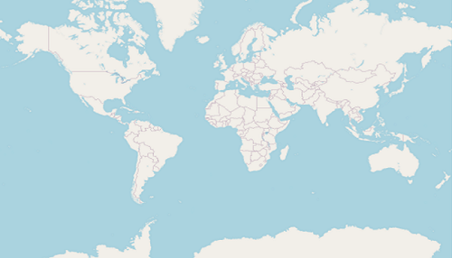
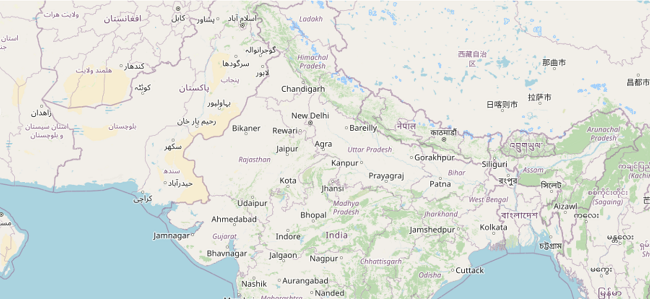
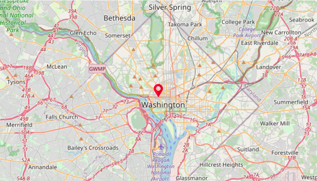
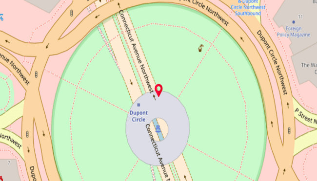
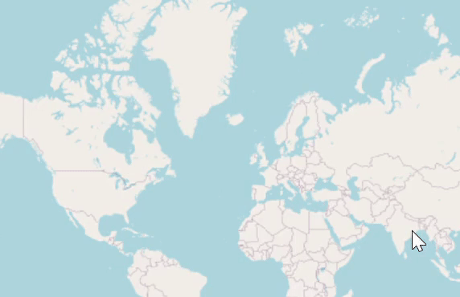
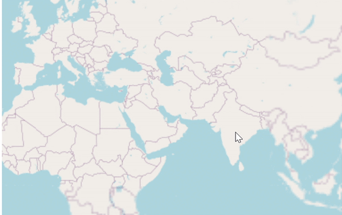
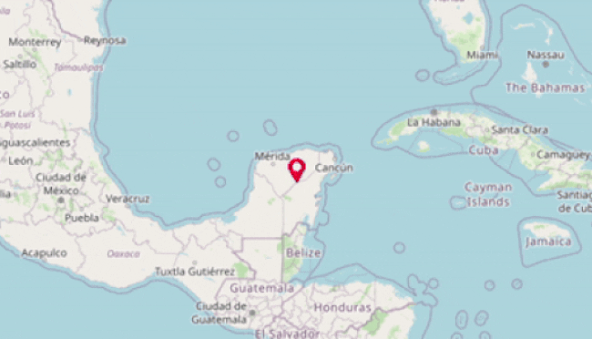

# Zooming and Panning in .NET MAUI Maps (SfMaps)

It is possible to zoom in and out for any layer to take a closer look at a specific region by pinching the map or scrolling the mouse wheel or trackpad. Pan the map to navigate across the regions. You can also customize the zoom level of the rendering.

The procedure for zooming and panning for both layers is very similar.

To learn more about the .NET MAUI Maps zoom and pan, you can check the following video.



**Shape layer**





 <map:SfMaps>
     <map:SfMaps.Layer>
         <map:MapShapeLayer ShapesSource="https://cdn.syncfusion.com/maps/map-data/world-map.json">
              <map:MapShapeLayer.ZoomPanBehavior>
                 <map:MapZoomPanBehavior ZoomLevel = "1" />
              </map:MapShapeLayer.ZoomPanBehavior>
         </map:MapShapeLayer>
     </map:SfMaps.Layer>
 </map:SfMaps>





SfMaps maps = new SfMaps();
MapShapeLayer layer = new MapShapeLayer();
layer.ShapesSource = MapSource.FromUri(new Uri("https://cdn.syncfusion.com/maps/map-data/world-map.json"));
MapZoomPanBehavior zoomPanBehavior = new MapZoomPanBehavior();
zoomPanBehavior.ZoomLevel = 1;
layer.ZoomPanBehavior = zoomPanBehavior;
maps.Layer = layer;
this.Content = maps;





**Tile layer**





 <map:SfMaps>
    <map:SfMaps.Layer>
        <map:MapTileLayer UrlTemplate = "https://tile.openstreetmap.org/{z}/{x}/{y}.png">
              <map:MapTileLayer.ZoomPanBehavior>
                 <map:MapZoomPanBehavior ZoomLevel = "1" />
              </map:MapTileLayer.ZoomPanBehavior>
        </map:MapTileLayer>
    </map:SfMaps.Layer>
</map:SfMaps>





SfMaps map = new SfMaps();
MapTileLayer tileLayer = new MapTileLayer();
tileLayer.UrlTemplate = "https://tile.openstreetmap.org/{z}/{x}/{y}.png";
MapZoomPanBehavior zoomPanBehavior = new MapZoomPanBehavior();
zoomPanBehavior.ZoomLevel = 1;
tileLayer.ZoomPanBehavior = zoomPanBehavior;
map.Layer = tileLayer;
this.Content = map;





## Customizing the zoom level

You can set the zoom level of the map layer by using the [`MapZoomPanBehavior.ZoomLevel`](https://help.syncfusion.com/cr/maui/Syncfusion.Maui.Maps.MapZoomPanBehavior.html#Syncfusion_Maui_Maps_MapZoomPanBehavior_ZoomLevel) property.

The default [`MapZoomPanBehavior.ZoomLevel`](https://help.syncfusion.com/cr/maui/Syncfusion.Maui.Maps.MapZoomPanBehavior.html#Syncfusion_Maui_Maps_MapZoomPanBehavior_ZoomLevel) value is 1, which will show the whole map in the viewport for [`MapTileLayer`](https://help.syncfusion.com/cr/maui/Syncfusion.Maui.Maps.MapTileLayer.html?tabs=tabid-1).





 <map:SfMaps>
   <map:SfMaps.Layer>
        <map:MapTileLayer UrlTemplate = "https://tile.openstreetmap.org/{z}/{x}/{y}.png" >
              <map:MapTileLayer.Center>
                  <map:MapLatLng Latitude = "27.1751"
                                 Longitude="78.0421">
                  </map:MapLatLng>
              </map:MapTileLayer.Center>
              <map:MapTileLayer.ZoomPanBehavior>
                  <map:MapZoomPanBehavior ZoomLevel = "5" />
              </map:MapTileLayer.ZoomPanBehavior>
        </map:MapTileLayer>
   </map:SfMaps.Layer>
</map:SfMaps>





SfMaps map = new SfMaps();
MapTileLayer tileLayer = new MapTileLayer();
tileLayer.UrlTemplate = "https://tile.openstreetmap.org/{z}/{x}/{y}.png";
tileLayer.Center = new MapLatLng(27.1751, 78.0421);
MapZoomPanBehavior zoomPanBehavior = new MapZoomPanBehavior();
zoomPanBehavior.ZoomLevel = 5;
tileLayer.ZoomPanBehavior = zoomPanBehavior;
map.Layer = tileLayer;
this.Content = map;





## Enable zooming 

The zooming feature enables you to zoom in and zoom out the maps to show in-depth information. To enable zooming, set the [`EnableZooming`](https://help.syncfusion.com/cr/maui/Syncfusion.Maui.Maps.MapZoomPanBehavior.html#Syncfusion_Maui_Maps_MapZoomPanBehavior_EnableZooming) property to `true`. The default value of the [`EnableZooming`](https://help.syncfusion.com/cr/maui/Syncfusion.Maui.Maps.MapZoomPanBehavior.html#Syncfusion_Maui_Maps_MapZoomPanBehavior_EnableZooming) is `true`.





 <map:SfMaps>
   <map:SfMaps.Layer>
        <map:MapTileLayer UrlTemplate = "https://tile.openstreetmap.org/{z}/{x}/{y}.png" >
              <map:MapTileLayer.ZoomPanBehavior>
                  <map:MapZoomPanBehavior ZoomLevel = "2" EnableZooming="True" />
              </map:MapTileLayer.ZoomPanBehavior>
        </map:MapTileLayer>
   </map:SfMaps.Layer>
</map:SfMaps>





SfMaps map = new SfMaps();
MapTileLayer tileLayer = new MapTileLayer();
tileLayer.UrlTemplate = "https://tile.openstreetmap.org/{z}/{x}/{y}.png";
MapZoomPanBehavior zoomPanBehavior = new MapZoomPanBehavior();
zoomPanBehavior.ZoomLevel = 2;
zoomPanBehavior.EnableZooming = true;
tileLayer.ZoomPanBehavior = zoomPanBehavior;
map.Layer = tileLayer;
this.Content = map;





## Enable Panning 

The panning feature allows you to move the visible area of the maps when it is zoomed in. To enable panning, set the [`EnablePanning`](https://help.syncfusion.com/cr/maui/Syncfusion.Maui.Maps.MapZoomPanBehavior.html#Syncfusion_Maui_Maps_MapZoomPanBehavior_EnablePanning) property to `true`. The default value of the [`EnablePanning`](https://help.syncfusion.com/cr/maui/Syncfusion.Maui.Maps.MapZoomPanBehavior.html#Syncfusion_Maui_Maps_MapZoomPanBehavior_EnablePanning) is `true`.

N> It is applicable for both tile layer and shape layer.





 <map:SfMaps>
   <map:SfMaps.Layer>
        <map:MapTileLayer UrlTemplate = "https://tile.openstreetmap.org/{z}/{x}/{y}.png" >
              <map:MapTileLayer.ZoomPanBehavior>
                  <map:MapZoomPanBehavior ZoomLevel = "2" EnablePanning="True"/>
              </map:MapTileLayer.ZoomPanBehavior>
        </map:MapTileLayer>
   </map:SfMaps.Layer>
</map:SfMaps>





SfMaps map = new SfMaps();
MapTileLayer tileLayer = new MapTileLayer();
tileLayer.UrlTemplate = "https://tile.openstreetmap.org/{z}/{x}/{y}.png";
MapZoomPanBehavior zoomPanBehavior = new MapZoomPanBehavior();
zoomPanBehavior.ZoomLevel = 2;
zoomPanBehavior.EnablePanning = true;
tileLayer.ZoomPanBehavior = zoomPanBehavior;
map.Layer = tileLayer;
this.Content = map;





## Customizing min and max zoom level

You can set the min and max zoom level of the map layer by setting the value to [`MapZoomPanBehavior.MinZoomLevel`](https://help.syncfusion.com/cr/maui/Syncfusion.Maui.Maps.MapZoomPanBehavior.html#Syncfusion_Maui_Maps_MapZoomPanBehavior_MinZoomLevel) and [`MapZoomPanBehavior.MaxZoomLevel`](https://help.syncfusion.com/cr/maui/Syncfusion.Maui.Maps.MapZoomPanBehavior.html#Syncfusion_Maui_Maps_MapZoomPanBehavior_MaxZoomLevel) properties. The minimum and maximum zooming levels can be restricted using these properties, respectively. The default values of [`MapZoomPanBehavior.MinZoomLevel`](https://help.syncfusion.com/cr/maui/Syncfusion.Maui.Maps.MapZoomPanBehavior.html#Syncfusion_Maui_Maps_MapZoomPanBehavior_MinZoomLevel) and [`MapZoomPanBehavior.MaxZoomLevel`](https://help.syncfusion.com/cr/maui/Syncfusion.Maui.Maps.MapZoomPanBehavior.html#Syncfusion_Maui_Maps_MapZoomPanBehavior_MaxZoomLevel) are 1 and 15, respectively.

However, for [`MapTileLayer`](https://help.syncfusion.com/cr/maui/Syncfusion.Maui.Maps.MapTileLayer.html?tabs=tabid-1), the [`MapZoomPanBehavior.maxZoomLevel`](https://help.syncfusion.com/cr/maui/Syncfusion.Maui.Maps.MapZoomPanBehavior.html#Syncfusion_Maui_Maps_MapZoomPanBehavior_MaxZoomLevel) may vary slightly depending on the providers. Kindly check the respective official website of the map tile providers to know about the maximum zoom level it supports.





  <map:SfMaps>
   <map:SfMaps.Layer>
        <map:MapTileLayer UrlTemplate = "https://tile.openstreetmap.org/{z}/{x}/{y}.png" >
              <map:MapTileLayer.Center>
                  <map:MapLatLng Latitude = "27.1751"
                                 Longitude="78.0421">
                  </map:MapLatLng>
              </map:MapTileLayer.Center>
              <map:MapTileLayer.ZoomPanBehavior>
                  <map:MapZoomPanBehavior ZoomLevel = "5" 
                                          MinZoomLevel= "3"
                                          MaxZoomLevel="10" />
              </map:MapTileLayer.ZoomPanBehavior>
        </map:MapTileLayer>
   </map:SfMaps.Layer>
</map:SfMaps>





SfMaps map = new SfMaps();
MapTileLayer tileLayer = new MapTileLayer();
tileLayer.UrlTemplate = "https://tile.openstreetmap.org/{z}/{x}/{y}.png";
tileLayer.Center = new MapLatLng(27.1751, 78.0421);
MapZoomPanBehavior zoomPanBehavior = new MapZoomPanBehavior();
zoomPanBehavior.ZoomLevel = 5;
zoomPanBehavior.MinZoomLevel = 3;
zoomPanBehavior.MaxZoomLevel = 10;
tileLayer.ZoomPanBehavior = zoomPanBehavior;
map.Layer = tileLayer;
this.Content = map;





## Calculate a zoom level based on map geo-bounds or distance

This feature is used to calculate the zoom level automatically in two ways:

* Distance in radius(Meter/Kilometer/Mile)
* Geo-bounds(Northeast, Southwest)

### Distance in radius 

Calculate the zoom level automatically based on the [`Radius`](https://help.syncfusion.com/cr/maui/Syncfusion.Maui.Maps.MapTileLayer.html#Syncfusion_Maui_Maps_MapTileLayer_Radius) and [`DistanceType`](https://help.syncfusion.com/cr/maui/Syncfusion.Maui.Maps.MapTileLayer.html#Syncfusion_Maui_Maps_MapTileLayer_DistanceType) properties of imagery layer class.

N> [`DistanceType`](https://help.syncfusion.com/cr/maui/Syncfusion.Maui.Maps.MapTileLayer.html#Syncfusion_Maui_Maps_MapTileLayer_DistanceType) property default value is Kilometer.





<ContentPage.Resources>
    <ResourceDictionary>
        <DataTemplate x:Key="MapMarkerTemplate">
            <StackLayout HorizontalOptions="StartAndExpand"
                         VerticalOptions="Center">
                <Image Source="map.png"
                       Scale="1"
                       Aspect="AspectFit"
                       HorizontalOptions="StartAndExpand"
                       VerticalOptions="Center"
                       HeightRequest="35"
                       WidthRequest="25" />
            </StackLayout>
        </DataTemplate>
    </ResourceDictionary>
</ContentPage.Resources>

<maps:SfMaps>
    <maps:SfMaps.Layer>
        <maps:MapTileLayer Radius="5"
                           DistanceType="Kilometer"
                           MarkerTemplate="{StaticResource MapMarkerTemplate}"
                           UrlTemplate="https://tile.openstreetmap.org/{z}/{x}/{y}.png">
            
            <maps:MapTileLayer.Center>
                <maps:MapLatLng Latitude="38.909804"
                                Longitude="-77.043442">
                </maps:MapLatLng>
            </maps:MapTileLayer.Center>
            
            <maps:MapTileLayer.ZoomPanBehavior>
                <maps:MapZoomPanBehavior ZoomLevel="1" />
            </maps:MapTileLayer.ZoomPanBehavior>
            
            <maps:MapTileLayer.Markers>
                <maps:MapMarkerCollection>
                    <maps:MapMarker Latitude="38.909804"
                                    Longitude="-77.043442" />
                </maps:MapMarkerCollection>
            </maps:MapTileLayer.Markers>
        </maps:MapTileLayer>
    </maps:SfMaps.Layer>
</maps:SfMaps>





public LatLngBoundsPage()
{
	InitializeComponent();
    SfMaps map = new SfMaps();
    MapTileLayer tileLayer = new MapTileLayer();
    tileLayer.UrlTemplate = "https://tile.openstreetmap.org/{z}/{x}/{y}.png";
    tileLayer.Radius = 5;
    tileLayer.DistanceType = MapDistanceType.Kilometer;
    MapZoomPanBehavior zoomPanBehavior = new MapZoomPanBehavior();
    zoomPanBehavior.ZoomLevel = 1;
    tileLayer.Center = new MapLatLng(38.909804, -77.043442);
    tileLayer.ZoomPanBehavior = zoomPanBehavior;
    MapMarker mapMarker = new MapMarker();
    mapMarker.Latitude = 38.909804;
    mapMarker.Longitude = -77.043442;
    MapMarkerCollection mapMarkers = new MapMarkerCollection();
    mapMarkers.Add(mapMarker);
    tileLayer.Markers = mapMarkers;
    tileLayer.MarkerTemplate = CreateDataTemplate();
    map.Layer = tileLayer;
    this.Content = map;
}
private DataTemplate CreateDataTemplate()
{
    return new DataTemplate(() =>
    {
        var stackLayout = new StackLayout();
        stackLayout.HorizontalOptions = LayoutOptions.StartAndExpand;
        stackLayout.VerticalOptions = LayoutOptions.Center;
        var image = new Image
        {
            Source = "map.png",
            Scale =1,
            Aspect = Aspect.AspectFit,
            WidthRequest = 25,
            HeightRequest = 35,
            HorizontalOptions = LayoutOptions.Center,
            VerticalOptions = LayoutOptions.Center
        };
        stackLayout.Add(image);
        return new ViewCell { View = stackLayout };
    });
}





### Geo-bounds

Calculate the zoom level automatically based on the [`LatLngBounds(Northeast, Southwest)`](https://help.syncfusion.com/cr/maui/Syncfusion.Maui.Maps.MapTileLayer.html#Syncfusion_Maui_Maps_MapTileLayer_MapLatLngBounds) of the [`MapTileLayer`](https://help.syncfusion.com/cr/maui/Syncfusion.Maui.Maps.MapTileLayer.html?tabs=tabid-1) class.





   <ContentPage.Resources>
    <ResourceDictionary>
        <DataTemplate x:Key="MapMarkerTemplate">
            <StackLayout HorizontalOptions="StartAndExpand"
                         VerticalOptions="Center">
                <Image Source="map.png"
                       Scale="1"
                       Aspect="AspectFit"
                       HorizontalOptions="StartAndExpand"
                       VerticalOptions="Center"
                       HeightRequest="35"
                       WidthRequest="25" />
            </StackLayout>
        </DataTemplate>
    </ResourceDictionary>
</ContentPage.Resources>
    
   <maps:SfMaps>
    <maps:SfMaps.Layer>
        <maps:MapTileLayer MarkerTemplate="{StaticResource MapMarkerTemplate}"
                           UrlTemplate="https://tile.openstreetmap.org/{z}/{x}/{y}.png">
            <maps:MapTileLayer.ZoomPanBehavior>
                <maps:MapZoomPanBehavior MaxZoomLevel="19" />
            </maps:MapTileLayer.ZoomPanBehavior>
            <maps:MapTileLayer.Markers>
                <maps:MapMarkerCollection>
                    <maps:MapMarker Latitude="38.909804"
                                    Longitude="-77.043442" />
                    <maps:MapMarker Latitude="38.909148"
                                    Longitude="-77.043610" />
                </maps:MapMarkerCollection>
            </maps:MapTileLayer.Markers>
            <maps:MapTileLayer.LatLngBounds>
                <maps:MapLatLngBounds>
                    <maps:MapLatLngBounds.Northeast>
                        <maps:MapLatLng>
                            <x:Arguments>
                                <x:Double>38.909804</x:Double>
                                <x:Double>-77.043442</x:Double>
                            </x:Arguments>
                        </maps:MapLatLng>
                    </maps:MapLatLngBounds.Northeast>
                    <maps:MapLatLngBounds.Southwest>
                        <maps:MapLatLng>
                            <x:Arguments>
                                <x:Double>38.909148</x:Double>
                                <x:Double>-77.043610</x:Double>
                            </x:Arguments>
                        </maps:MapLatLng>
                    </maps:MapLatLngBounds.Southwest>
                </maps:MapLatLngBounds>
            </maps:MapTileLayer.LatLngBounds>
        </maps:MapTileLayer>
    </maps:SfMaps.Layer>
</maps:SfMaps>





public LatLngBoundsPage()
{
	InitializeComponent();
    SfMaps map = new SfMaps();
    MapTileLayer tileLayer = new MapTileLayer();
    tileLayer.UrlTemplate = "https://tile.openstreetmap.org/{z}/{x}/{y}.png";
    MapZoomPanBehavior zoomPanBehavior = new MapZoomPanBehavior();
    zoomPanBehavior.MaxZoomLevel = 19;
    tileLayer.ZoomPanBehavior = zoomPanBehavior;
    MapMarker mapMarker = new MapMarker();
    mapMarker.Latitude = 38.909804;
    mapMarker.Longitude = -77.043442;
    MapMarker mapMarker1 = new MapMarker();
    mapMarker1.Latitude = 38.909148;
    mapMarker1.Longitude = -77.043610;
    MapMarkerCollection mapMarkers = new MapMarkerCollection();
    mapMarkers.Add(mapMarker);
    mapMarkers.Add(mapMarker1);
    tileLayer.Markers = mapMarkers;
    tileLayer.MarkerTemplate = CreateDataTemplate();
    MapLatLngBounds bounds = new MapLatLngBounds();
    bounds.Northeast = new MapLatLng(38.909804, -77.043442);
    bounds.Southwest = new MapLatLng(38.909148, -77.043610);
    tileLayer.LatLngBounds = bounds;
    map.Layer = tileLayer;
    this.Content = map;
}

private DataTemplate CreateDataTemplate()
{
    return new DataTemplate(() =>
    {
        var stackLayout = new StackLayout();
        stackLayout.HorizontalOptions = LayoutOptions.StartAndExpand;
        stackLayout.VerticalOptions = LayoutOptions.Center;
        var image = new Image
        {
            Source = "map.png",
            Scale =1,
            Aspect = Aspect.AspectFit,
            WidthRequest = 25,
            HeightRequest = 35,
            HorizontalOptions = LayoutOptions.Center,
            VerticalOptions = LayoutOptions.Center
        };
        stackLayout.Add(image);
        return new ViewCell { View = stackLayout };
    });
}





N> When setting [`LatLngBounds`](https://help.syncfusion.com/cr/maui/Syncfusion.Maui.Maps.MapTileLayer.html#Syncfusion_Maui_Maps_MapTileLayer_MapLatLngBounds) and [`DistanceType`](https://help.syncfusion.com/cr/maui/Syncfusion.Maui.Maps.MapTileLayer.html#Syncfusion_Maui_Maps_MapTileLayer_DistanceType) at the same time, the priority is [`Radius`](https://help.syncfusion.com/cr/maui/Syncfusion.Maui.Maps.MapTileLayer.html#Syncfusion_Maui_Maps_MapTileLayer_Radius) and so calculate zoom level based on radius value.

## Double tap zooming

Double tap zooming can be enabled using [`EnableDoubleTapZooming`](https://help.syncfusion.com/cr/maui/Syncfusion.Maui.Maps.MapZoomPanBehavior.html#Syncfusion_Maui_Maps_MapZoomPanBehavior_EnableDoubleTapZooming) property. The default value of the [`EnableDoubleTapZooming`](https://help.syncfusion.com/cr/maui/Syncfusion.Maui.Maps.MapZoomPanBehavior.html#Syncfusion_Maui_Maps_MapZoomPanBehavior_EnableDoubleTapZooming) is `false`.

N> It is applicable for both tile layer and shape layer.





 <map:SfMaps>
    <map:SfMaps.Layer>
        <map:MapTileLayer UrlTemplate="https://tile.openstreetmap.org/{z}/{x}/{y}.png">
            <map:MapTileLayer.ZoomPanBehavior>
                <map:MapZoomPanBehavior ZoomLevel="2" EnableDoubleTapZooming="True"/>
            </map:MapTileLayer.ZoomPanBehavior>
        </map:MapTileLayer>
    </map:SfMaps.Layer>
</map:SfMaps>





SfMaps map = new SfMaps();
MapTileLayer tileLayer = new MapTileLayer();
tileLayer.UrlTemplate = "https://tile.openstreetmap.org/{z}/{x}/{y}.png";
MapZoomPanBehavior zoomPanBehavior = new MapZoomPanBehavior();
zoomPanBehavior.ZoomLevel = 2;
zoomPanBehavior.EnableDoubleTapZooming = true;
tileLayer.ZoomPanBehavior = zoomPanBehavior;
map.Layer = tileLayer;
this.Content = map;





## Animation

### Zoom level Animation

To perform the animation on zoom level changing using the [`MapTileLayer.EnableZoomingAnimation`](https://help.syncfusion.com/cr/maui/Syncfusion.Maui.Maps.MapLayer.html#Syncfusion_Maui_Maps_MapLayer_EnableZoomingAnimation) property. The default value of the [`EnableZoomingAnimation`](https://help.syncfusion.com/cr/maui/Syncfusion.Maui.Maps.MapLayer.html#Syncfusion_Maui_Maps_MapLayer_EnableZoomingAnimation) is `true`.

N> It is applicable for both tile layer and shape layer.





 <map:SfMaps>
    <map:SfMaps.Layer>
        <map:MapTileLayer UrlTemplate="https://tile.openstreetmap.org/{z}/{x}/{y}.png"
                          EnableZoomingAnimation="True" >
        </map:MapTileLayer>
    </map:SfMaps.Layer>
</map:SfMaps>





SfMaps map = new SfMaps();
MapTileLayer tileLayer = new MapTileLayer();
tileLayer.UrlTemplate = "https://tile.openstreetmap.org/{z}/{x}/{y}.png";
tileLayer.EnableZoomingAnimation = true;
map.Layer = tileLayer;
this.Content = map;





### Center Animation

To perform the animation on center value changing using the [`MapTileLayer.EnableCenterAnimation`](https://help.syncfusion.com/cr/maui/Syncfusion.Maui.Maps.MapTileLayer.html#Syncfusion_Maui_Maps_MapTileLayer_EnableCenterAnimation) property. The default value of the [`EnableCenterAnimation`](https://help.syncfusion.com/cr/maui/Syncfusion.Maui.Maps.MapTileLayer.html#Syncfusion_Maui_Maps_MapTileLayer_EnableCenterAnimation) is `true`.

N> It is applicable only for tile layer.





 <map:SfMaps>
    <map:SfMaps.Layer>
        <map:MapTileLayer UrlTemplate="https://tile.openstreetmap.org/{z}/{x}/{y}.png"
                          EnableCenterAnimation="True" >
        </map:MapTileLayer>
    </map:SfMaps.Layer>
</map:SfMaps>





SfMaps map = new SfMaps();
MapTileLayer tileLayer = new MapTileLayer();
tileLayer.UrlTemplate = "https://tile.openstreetmap.org/{z}/{x}/{y}.png";
tileLayer.EnableCenterAnimation = true;
map.Layer = tileLayer;
this.Content = map;





## Event

The [`ZoomLevelChanging`](https://help.syncfusion.com/cr/maui/Syncfusion.Maui.Maps.MapLayer.html#Syncfusion_Maui_Maps_MapLayer_ZoomLevelChanging) event triggers when the zoom level gets changing. Following arguments can be get from the ZoomLevelChanging event.

* `Cancel` : Used to cancel the zooming.
* [`OldZoomLevel`](https://help.syncfusion.com/cr/maui/Syncfusion.Maui.Maps.ZoomLevelChangingEventArgs.html#Syncfusion_Maui_Maps_ZoomLevelChangingEventArgs_OldZoomLevel) : Returns the previous level after the zooming.
* [`NewZoomLevel`](https://help.syncfusion.com/cr/maui/Syncfusion.Maui.Maps.ZoomLevelChangingEventArgs.html#Syncfusion_Maui_Maps_ZoomLevelChangingEventArgs_NewZoomLevel) : Returns the current level to be zoomed.





 <maps:SfMaps>
    <maps:SfMaps.Layer>
        <maps:MapTileLayer UrlTemplate="https://tile.openstreetmap.org/{z}/{x}/{y}.png"
                           ZoomLevelChanging="MapTileLayer_ZoomLevelChanging" />
    </maps:SfMaps.Layer>
</maps:SfMaps>





private void MapTileLayer_ZoomLevelChanging(object sender, ZoomLevelChangingEventArgs e)
{
    if (e.OldZoomLevel == 10) // Returns the previous zoom level
    {
        e.Cancel = true; // Cancels the zooming event
        var NewZoomLevel = e.NewZoomLevel; // Returns the current zoomed level
    }
}





N> You can refer to our [.NET MAUI Maps](https://www.syncfusion.com/maui-controls/maui-maps) feature tour page for its groundbreaking feature representations. You can also explore our [`.NET MAUI Maps Zoom & Pan example`](https://github.com/syncfusion/maui-demos/) that shows how to configure Maps in .NET MAUI.
