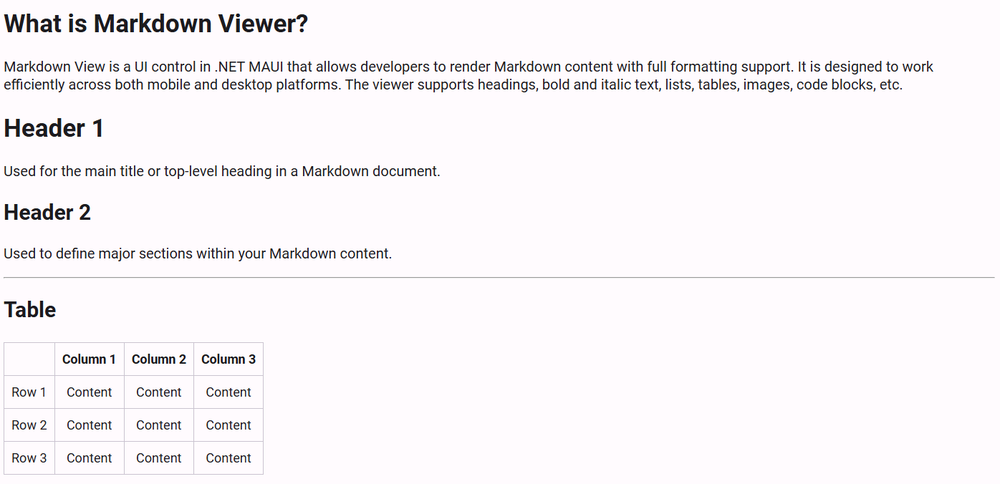

# Getting Started with .NET MAUI MarkdownViewer (SfMarkdownViewer)

This guide details the initial setup and basic usage of the `SfMarkdownViewer` control, offering insight into its ability to render Markdown content with various formatting capabilities across mobile and desktop platforms.




## Prerequisites

Ensure the following are installed before you begin:

1. [.NET 8 SDK](https://dotnet.microsoft.com/en-us/download/dotnet/8.0) or later.
2. Visual Studio 2022 version 17.8 or later with the .NET MAUI workload.

## Step 1: Create a new .NET MAUI project

1. In **Visual Studio**, go to **File > New > Project**.
2. Select the **.NET MAUI App** template and click **Next**.
3. Enter a project name and location, then click **Create**.

## Step 2: Install the Syncfusion® .NET MAUI MarkdownViewer Package

1. Right-click on the project in **Solution Explorer** and choose **Manage NuGet Packages**.
2. Search for `Syncfusion.Maui.MarkdownViewer` and install the latest version.
3. Ensure all dependent packages are installed and the project builds successfully.

## Step 3: Register the Syncfusion Core Handler

The [Syncfusion.Maui.Core](https://www.nuget.org/packages/Syncfusion.Maui.Core) NuGet package is required for all Syncfusion® controls in .NET MAUI. In the **MauiProgram.cs** file, register the handler for Syncfusion® core.





using Microsoft.Extensions.Logging;
using Syncfusion.Maui.Core.Hosting;

namespace MarkdownViewerGettingStarted
{
    public static class MauiProgram
    {
        public static MauiApp CreateMauiApp()
        {
            var builder = MauiApp.CreateBuilder();
            builder
                .UseMauiApp<App>()
                .ConfigureSyncfusionCore()
                .ConfigureFonts(fonts =>
                {
                    fonts.AddFont("OpenSans-Regular.ttf", "OpenSansRegular");
                });

            return builder.Build();
        }
    }
}




## Step 4: Initialize the MarkdownViewer Control

1. To initialize the control, import the `Syncfusion.Maui.MarkdownViewer` namespace.
2. Add an `SfMarkdownViewer` instance to your page.

 



<ContentPage
    . . .    
    xmlns:markdown="clr-namespace:Syncfusion.Maui.MarkdownViewer;
    assembly=Syncfusion.Maui.MarkdownViewer">

    <markdown:SfMarkdownViewer />
    
</ContentPage>
 




using Syncfusion.Maui.MarkdownViewer;

namespace MarkdownViewerGettingStarted
{
    public partial class MainPage : ContentPage
    {
        public MainPage()
        {
            InitializeComponent();  
            SfMarkdownViewer markdownViewer = new SfMarkdownViewer();
            Content = markdownViewer;       
        }
    }   
}







## Prerequisites

Make sure the following are installed:
1. [.NET 8 SDK](https://dotnet.microsoft.com/en-us/download/dotnet/8.0) or later.
2. Set up a .NET MAUI environment with Visual Studio Code.
3. Ensure that the .NET MAUI extension is installed and configured as described [here](https://learn.microsoft.com/en-us/dotnet/maui/get-started/installation?view=net-maui-8.0&tabs=visual-studio-code).

## Step 1: Create a new .NET MAUI project

1. Open the command palette by pressing `Ctrl+Shift+P`, type **.NET:New Project** and press **Enter**.
2. Choose the **.NET MAUI App** template.
3. Select the project location, type the project name, and press **Enter**.
4. Then choose **Create project**.

## Step 2: Install the Syncfusion® MAUI MarkdownViewer NuGet package

1. Press <kbd>Ctrl</kbd> + <kbd>`</kbd> (backtick) to open the integrated terminal in Visual Studio Code.
2. Ensure you're in the project root directory where your .csproj file is located.
3. Run the command `dotnet add package Syncfusion.Maui.MarkdownViewer` to install the MarkdownViewer package.
4. To ensure all dependencies are installed, run `dotnet restore`.

## Step 3: Register the handler

The [Syncfusion.Maui.Core](https://www.nuget.org/packages/Syncfusion.Maui.Core/) NuGet is a dependent package for all Syncfusion® controls of .NET MAUI. In the `MauiProgram.cs` file, register the handler for Syncfusion® core.




using Microsoft.Maui;
using Microsoft.Maui.Hosting;
using Microsoft.Maui.Controls.Compatibility;
using Microsoft.Maui.Controls.Hosting;
using Microsoft.Maui.Controls.Xaml;
using Syncfusion.Maui.Core.Hosting;

namespace MarkdownViewerSample
{
  public static class MauiProgram
  {
    public static MauiApp CreateMauiApp()
    {
        var builder = MauiApp.CreateBuilder();
        builder
        .UseMauiApp<App>()
        .ConfigureSyncfusionCore()
        .ConfigureFonts(fonts =>
        {
            fonts.AddFont("OpenSans-Regular.ttf", "OpenSansRegular");
        });

        return builder.Build();
     }
  }
}     




## Step 4: Initialize the MarkdownViewer Control

1. To initialize the control, import the `Syncfusion.Maui.MarkdownViewer` namespace.
2. Add an `SfMarkdownViewer` instance to your page.

 


<ContentPage
    . . .    
    xmlns:markdown="clr-namespace:Syncfusion.Maui.MarkdownViewer;assembly=Syncfusion.Maui.MarkdownViewer">

    <markdown:SfMarkdownViewer />

</ContentPage>
 




using Syncfusion.Maui.MarkdownViewer;

namespace MarkdownViewerGettingStarted
{
    public partial class MainPage : ContentPage
    {
        public MainPage()
        {
            InitializeComponent();  
            SfMarkdownViewer markdownViewer = new SfMarkdownViewer();
            Content = markdownViewer;    
        }
    }   
}







## Step 5: Add Source to the SfMarkdownViewer

To display Markdown content, assign a string to the `Source` property of the `SfMarkdownViewer` control. This string can contain standard Markdown syntax such as headings, bold text, lists, and images.

 


<markdown:SfMarkdownViewer>
    <markdown:SfMarkdownViewer.Source>
        <x:String>
            <![CDATA[
# What is the Markdown Viewer?  
The Markdown Viewer is a UI control in .NET MAUI that allows developers to render Markdown content with full formatting support. It was designed to work efficiently on both mobile and desktop platforms. The viewer supports headings, bold and italic text, lists, tables, images, code blocks and more.

# Header 1  
Used for the main title or top-level heading in a Markdown document. 

## Header 2  
Used to define major sections within your Markdown content.

### Table 

|              | Column 1 | Column 2 | Column 3 |
|--------------|----------|----------|----------|
| Row 1        | Content  | Content  | Content  |
| Row 2        | Content  | Content  | Content  |
| Row 3        | Content  | Content  | Content  |
            ]]>
        </x:String>
    </markdown:SfMarkdownViewer.Source>
</markdown:SfMarkdownViewer>





public partial class MainPage : ContentPage
{
        private const string markdownContent = @"# What is the Markdown Viewer?  
            The Markdown Viewer is a UI control in .NET MAUI that allows developers to render Markdown content with full formatting support. It was designed to work efficiently on both mobile and desktop platforms. The viewer supports headings, bold and italic text, lists, tables, images, code blocks and more.

            # Header 1  
            Used for the main title or top-level heading in a Markdown document. 

            ## Header 2  
            Used to define major sections within your Markdown content.

            ### Table 

            |              | Column 1 | Column 2 | Column 3 |
            |--------------|----------|----------|----------|
            | Row 1        | Content  | Content  | Content  |
            | Row 2        | Content  | Content  | Content  |
            | Row 3        | Content  | Content  | Content  |";

    public MainPage()
    {
        InitializeComponent();  
        SfMarkdownViewer markdownViewer = new SfMarkdownViewer();
        markdownViewer.Source = markdownContent;
        Content = markdownViewer;       
    }
}  




> For more details about binding Markdown content from various sources, refer to [MarkdownSources](/MarkdownSources.md).

You can access a complete getting started sample [here]().
