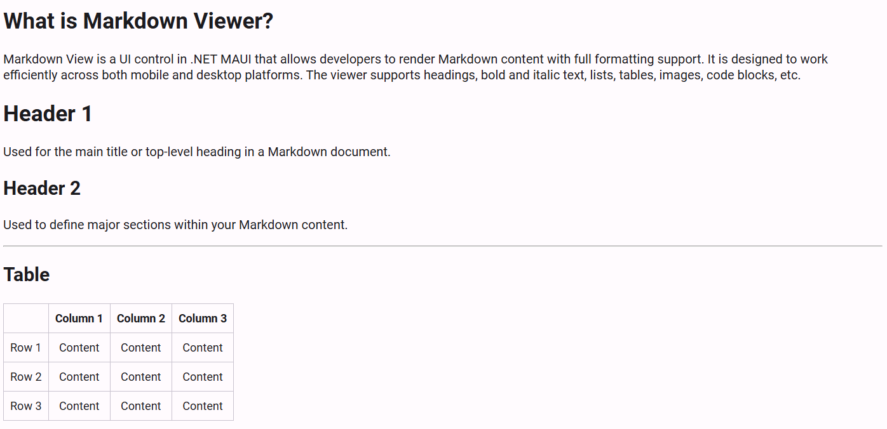

# Getting Started with .NET MAUI MarkdownViewer (SfMarkdownViewer)

This guide details the initial setup and basic usage of the [SfMarkdownViewer](https://help.syncfusion.com/cr/maui/Syncfusion.Maui.MarkdownViewer.SfMarkdownViewer.html) control, offering insight into its ability to render Markdown content with various formatting capabilities across mobile and desktop platforms.

To get start quickly with our [.NET MAUI MarkdownViewer](https://help.syncfusion.com/cr/maui/Syncfusion.Maui.MarkdownViewer.SfMarkdownViewer.html), you can check the below video.






## Prerequisites

Before proceeding, ensure the following are set up:

1. Install [.NET 9 SDK](https://dotnet.microsoft.com/en-us/download/dotnet/9.0) or later.
2. Set up a .NET MAUI environment with Visual Studio 2022 v17.12 or later.

## Step 1: Create a New MAUI Project

1. Go to **File > New > Project** and choose the **.NET MAUI App** template.
2. Name the project and choose a location. Then, click **Next**.
3. Select the .NET framework version and click **Create**.

## Step 2: Install the Syncfusion® MAUI MarkdownViewer NuGet Package

1. In **Solution Explorer**, right-click the project and choose **Manage NuGet Packages**.
2. Search for [Syncfusion.Maui.MarkdownViewer](https://www.nuget.org/packages/Syncfusion.Maui.MarkdownViewer) and install the latest version.
3. Ensure the necessary dependencies are installed correctly, and the project is restored.




## Prerequisites

Before proceeding, ensure the following are set up:

1. Install [.NET 9 SDK](https://dotnet.microsoft.com/en-us/download/dotnet/9.0) or later.
2. Set up a .NET MAUI environment with Visual Studio Code.
3. Ensure that the .NET MAUI workloads are installed and configured as described [here](https://learn.microsoft.com/en-us/dotnet/maui/get-started/installation?view=net-maui-9.0&tabs=visual-studio-code).

## Step 1: Create a New .NET MAUI Project

1. Open the Command Palette by pressing **Ctrl+Shift+P** and type **.NET:New Project** and press Enter.
2. Choose the **.NET MAUI App** template.
3. Select the project location, type the project name and press Enter.
4. Then choose **Create project**

## Step 2: Install the Syncfusion® MAUI MarkdownViewer NuGet Package

1. Press <kbd>Ctrl</kbd> + <kbd>`</kbd> (backtick) to open the integrated terminal in Visual Studio Code.
2. Ensure you're in the project root directory where your .csproj file is located.
3. Run the command `dotnet add package Syncfusion.Maui.MarkdownViewer` to install the Syncfusion® .NET MAUI MarkdownViewer package.
4. To ensure all dependencies are installed, run `dotnet restore`.




## Prerequisites

Before proceeding, ensure the following are set up:

1. Install [.NET 9 SDK](https://dotnet.microsoft.com/en-us/download/dotnet/9.0) or later.
2. Set up a .NET MAUI environment with JetBrains Rider 2024.3 or later.
3. Make sure the MAUI workloads are installed and configured as described [here.](https://www.jetbrains.com/help/rider/MAUI.html#before-you-start)

## Step 1: Create a new .NET MAUI Project

1. Go to **File > New Solution,** Select .NET (C#) and choose the .NET MAUI App template.
2. Enter the Project Name, Solution Name, and Location.
3. Select the .NET framework version and click Create.

## Step 2: Install the Syncfusion® MAUI MarkdownViewer NuGet Package

1. In **Solution Explorer,** right-click the project and choose **Manage NuGet Packages.**
2. Search for [Syncfusion.Maui.MarkdownViewer](https://www.nuget.org/packages/Syncfusion.Maui.MarkdownViewer) and install the latest version.
3. Ensure the necessary dependencies are installed correctly, and the project is restored. If not, Open the Terminal in Rider and manually run: `dotnet restore`




## Step 3: Register Syncfusion handler

Make sure to add the namespace.
 


using Syncfusion.Maui.Core.Hosting;


 
Register the Syncfusion core handler in your `CreateMauiApp` method of `MauiProgram.cs` file to use Syncfusion controls.
 


builder.ConfigureSyncfusionCore();



## Step 4: Import the MarkdownViewer namespace
 
Add the following namespace in your XAML or C#.
 


 
 xmlns:markdown="clr-namespace:Syncfusion.Maui.MarkdownViewer;assembly=Syncfusion.Maui.MarkdownViewer"
 


 
using Syncfusion.Maui.MarkdownViewer;
 



## Step 5: Add a MarkdownViewer component

Initialize the [SfMarkdownViewer](https://help.syncfusion.com/cr/maui/Syncfusion.Maui.MarkdownViewer.SfMarkdownViewer.html) and set its [Source](https://help.syncfusion.com/cr/maui/Syncfusion.Maui.MarkdownViewer.SfMarkdownViewer.html#Syncfusion_Maui_MarkdownViewer_SfMarkdownViewer_Source) property to a string to show Markdown content.
The string can include basic Markdown like headings, bold text, lists, and images.

 


<markdown:SfMarkdownViewer>
    <markdown:SfMarkdownViewer.Source>
        <x:String>
            <![CDATA[
# What is the Markdown Viewer?  
The Markdown Viewer is a UI control in .NET MAUI that allows developers to render Markdown content with full formatting support. It was designed to work efficiently on both mobile and desktop platforms. The viewer supports headings, bold and italic text, lists, tables, images, code blocks and more.

# Header 1  
Used for the main title or top-level heading in a Markdown document. 

## Header 2  
Used to define major sections within your Markdown content.

### Table 

|              | Column 1 | Column 2 | Column 3 |
|--------------|----------|----------|----------|
| Row 1        | Content  | Content  | Content  |
| Row 2        | Content  | Content  | Content  |
| Row 3        | Content  | Content  | Content  |
            ]]>
        </x:String>
    </markdown:SfMarkdownViewer.Source>
</markdown:SfMarkdownViewer>





public partial class MainPage : ContentPage
{
        private const string markdownContent = @"
# What is the Markdown Viewer?  
The Markdown Viewer is a UI control in .NET MAUI that allows developers to render Markdown content with full formatting support. It was designed to work efficiently on both mobile and desktop platforms. The viewer supports headings, bold and italic text, lists, tables, images, code blocks and more.

# Header 1  
Used for the main title or top-level heading in a Markdown document. 

## Header 2  
Used to define major sections within your Markdown content.

### Table 

|              | Column 1 | Column 2 | Column 3 |
|--------------|----------|----------|----------|
| Row 1        | Content  | Content  | Content  |
| Row 2        | Content  | Content  | Content  |
| Row 3        | Content  | Content  | Content  |";

    public MainPage()
    {
        InitializeComponent();  
        SfMarkdownViewer markdownViewer = new SfMarkdownViewer();
        markdownViewer.Source = markdownContent;
    }
}  




N> For more details about binding Markdown content from various sources, refer to [MarkdownSources](https://help.syncfusion.com/maui/markdownviewer/databinding).

The following screenshot illustrates the result of the above code.

You can downlaod the MarkdownViewer getting started sample from [GitHub](https://github.com/SyncfusionExamples/.NET_MAUI_Markdown_Viewer_GettingStarted).
