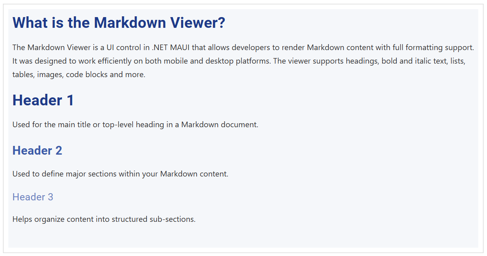

# How to Apply CSS Style Rules in .NET MAUI SfMarkdownViewer

The `SfMarkdownViewer` control in .NET MAUI comes with a set of built-in default styles that ensure Markdown content is rendered cleanly and consistently across platforms. However, in many real-world applications, developers may need to override these defaults to match their app’s branding, improve readability, or create a custom visual experience.

This guide explains how to override the default styles using the `MarkdownStyleSettings` class and the `CssStyleRules` property.

## Defining Styles

**XAML**



<ContentPage.Resources>
    <ResourceDictionary>
        <x:String x:Key="CustomStyle">
        body {
            background: #F5F7FA;
            font-family: 'Segoe UI', sans-serif;
            font-size: 16px;
            color: #2E2E2E;
            line-height: 1.7;
        }

        h1 {
            font-weight: 700;
            font-size: 30px;
            line-height: 38px;
            letter-spacing: 0.5px;
            color: #1E3A8A;
            margin-bottom: 16px;
        }

        h2 {
            font-weight: 600;
            font-size: 24px;
            line-height: 32px;
            letter-spacing: 0.4px;
            color: #3B5BAA;
            margin-top: 24px;
            margin-bottom: 12px;
        }

        h3 {
            font-weight: 500;
            font-size: 20px;
            line-height: 28px;
            letter-spacing: 0.3px;
            color: #6C83C1;
            margin-top: 20px;
            margin-bottom: 10px;
        }
        </x:String>
    </ResourceDictionary>
</ContentPage.Resources>



Apply the defined CSS style to the Markdown Viewer using the `CssStyleRules` property, as shown in the XAML code below:



<ContentPage
    . . .    
    xmlns:markdown="clr-namespace:Syncfusion.Maui.MarkdownViewer;
    assembly=Syncfusion.Maui.MarkdownViewer">
    . . .
    <markdown:SfMarkdownViewer Source={Binding MarkdownContent}>
        <markdown:SfMarkdownViewer.Settings>
            <markdown:MarkdownStyleSettings CssStyleRules="{StaticResource CustomStyle}" />
        </markdown:SfMarkdownViewer.Settings>
    </markdown:SfMarkdownViewer>

</ContentPage>



The output below reflects the styled appearance of the Markdown content.

By defining custom styles, you can transform the Markdown Viewer into a fully branded and polished content surface that fits seamlessly into your app’s design system.

N> Apply CSS styles only when necessary as they will override the properties of individual Markdown elements such as `H1FontSize`, `H1Color`, `BodyTextColor`, `TableHeaderFontSize`, etc., defined in the `MarkdownStyleSettings` class.

### Define Styles for Images

Images are a vital part of Markdown content, providing visual context and detail. SfMarkdownViewer allows you to override the appearance of images through CSS, enabling custom sizing, borders, or even special effects. For example:



<x:String x:Key="CustomStyle">
img {
    border-radius: 8px;
    border: 2px solid #e0e3ea;
    max-width: 95%;
    box-shadow: 0 4px 16px rgba(31,45,61,0.08);
    margin: 12px 0;
}
</x:String>



This CSS makes all images inside the Markdown content appear with rounded corners, a subtle border, and a shadow that helps them blend elegantly with modern app designs. Adjust the `margin` or `max-width` to fit the layout of your application.

### Define Styles for Tables

Tables are commonly used to present data or feature comparisons. The SfMarkdownViewer control provides direct customization through a set of properties in the `MarkdownStyleSettings` class for basic look and feel:

- `TableBackground`: Background color of the entire table.
- `TableHeaderFontSize`: Font size for the header row.
- `TableHeaderTextColor`: Text color for header cells.
- `TableDataFontSize`: Font size for data cells.
- `TableDataTextColor`: Text color for data cells.

When you need advanced styling—like striped rows, custom cell padding, or specific border styles—use CSS in the `CssStyleRules` property. For example:



<x:String x:Key="CustomStyle">
table {
    background: #FAFBFC;
    border-collapse: collapse;
    margin: 16px 0;
    width: 100%;
    border-radius: 6px;
    overflow: hidden;
}
th, td {
    border: 1px solid #E0E4EA;
    padding: 10px 16px;
    text-align: left;
}
th {
    background: #EDF2FB;
    color: #193466;
    font-size: 17px;
    font-weight: 600;
}
tr:nth-child(even) {
    background: #F5F7FB;
}
</x:String>



This level of CSS styling allows you to match your app’s theme or improve data readability far beyond the built-in style properties. Remember that any CSS applied will take precedence over values set via the `MarkdownStyleSettings` table properties.

### Define Styles for ScrollBar

Scrollbars are crucial for navigating through long Markdown documents, especially on desktop platforms or when embedding the control in a constrained space. SfMarkdownViewer enables you to customize scrollbar appearance and behavior via CSS:

- **Scrollbar Visibility:** You can show or hide the scrollbar by targeting the `::-webkit-scrollbar` selector (on applicable platforms).
- **Scrollbar Color:** Make the scrollbar match your branding or fade it as needed.

Example CSS for a modern, visible scrollbar:



<x:String x:Key="CustomStyle">
::-webkit-scrollbar {
    width: 8px;
    background: #F2F4F8;
}
::-webkit-scrollbar-thumb {
    background: #B2B8C6;
    border-radius: 4px;
}
::-webkit-scrollbar-thumb:hover {
    background: #8293AE;
}
</x:String>



You can further hide the scrollbar by setting its width to 0, or match its color and thickness to seamlessly blend with your application's UI. Custom scrollbar styling will be effective on supported platforms (typically Windows and Android). Always verify cross-platform appearance for best results.

With tailored scrollbar, table, and image styles, the SfMarkdownViewer control delivers beautiful, readable, and fully brand-aligned Markdown content in your .NET MAUI applications.
