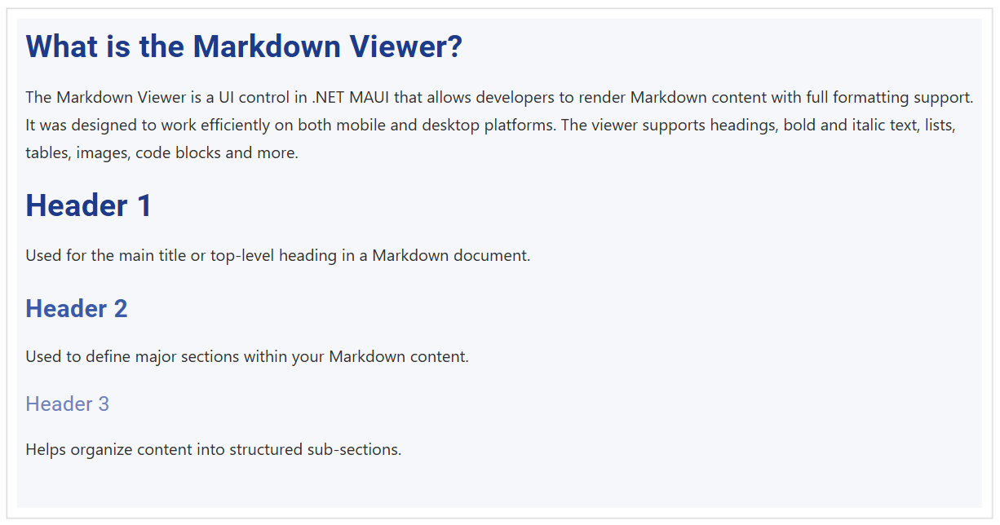
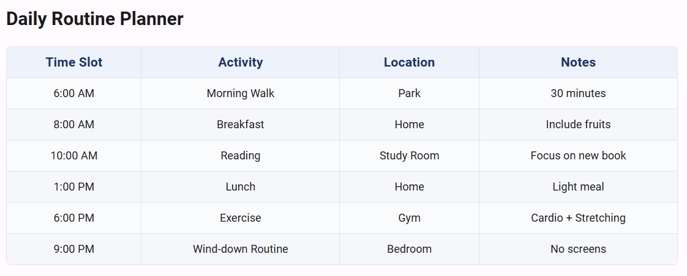
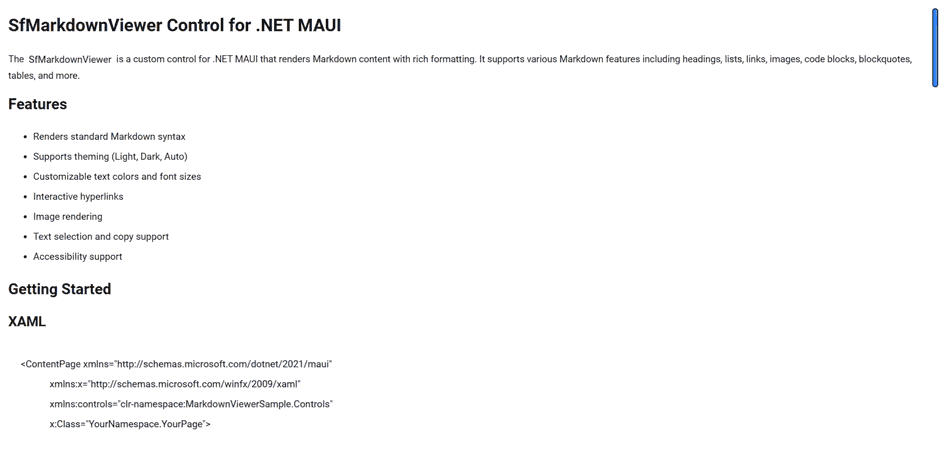

# How to Apply CSS Style Rules in .NET MAUI SfMarkdownViewer

The [SfMarkdownViewer](https://help.syncfusion.com/cr/maui/Syncfusion.Maui.MarkdownViewer.SfMarkdownViewer.html) control in .NET MAUI comes with a set of built-in default styles that ensure markdown content is rendered cleanly and consistently across platforms. However, in many real-world applications, developers may need to override these defaults to match their app's branding, improve readability, or create a custom visual experience.

## Prerequisites

Before using the [SfMarkdownViewer](https://help.syncfusion.com/cr/maui/Syncfusion.Maui.MarkdownViewer.SfMarkdownViewer.html), ensure the following NuGet package is installed in your .NET MAUI project:

- `Syncfusion.Maui.MarkdownViewer`

For a step-by-step setup, refer to the [Getting Started](https://help.syncfusion.com/maui/markdownviewer/gettingstarted) documentation.

This guide explains how to override the default styles using the [MarkdownStyleSettings](https://help.syncfusion.com/cr/maui/Syncfusion.Maui.MarkdownViewer.MarkdownStyleSettings.html) class and the [CssStyleRules](https://help.syncfusion.com/cr/maui/Syncfusion.Maui.MarkdownViewer.MarkdownStyleSettings.html#Syncfusion_Maui_MarkdownViewer_MarkdownStyleSettings_CssStyleRules) property.

## What You Can Style with CSS

- Headings (`h1`–`h6`), paragraphs (`p`), and inline text emphasis.
- Images displayed in markdown content.
- Tables, including rows, headers, and striped rows.
- Code blocks (`pre`, `code`) and blockquotes (`blockquote`).
- Hyperlinks and both unordered and ordered lists.
- Scrollbar appearance (WebKit/Blink-based platforms only — Windows and Android).

N> The supplied CSS rules take precedence over the individual style properties (such as `H1FontSize`, `H1Color`, `BodyTextColor`, `TableHeaderFontSize`) defined in the [MarkdownStyleSettings](https://help.syncfusion.com/cr/maui/Syncfusion.Maui.MarkdownViewer.MarkdownStyleSettings.html) class. CSS `@import`, `@media`, animations, and most pseudo-classes other than `::-webkit-scrollbar*` and `:hover` are not supported.

## Supported CSS Selectors and Properties

| Category | Supported Selectors | Notes |
|----------|---------------------|-------|
| Headings | `h1`, `h2`, `h3`, `h4`, `h5`, `h6` | All standard text properties. |
| Body | `body`, `p` | Background, font, color, line-height. |
| Inline | `strong`, `em`, `a`, `code` | `a` supports color, text-decoration. |
| Lists | `ul`, `ol`, `li` | Padding and margin are honored. |
| Tables | `table`, `thead`, `tbody`, `tr`, `th`, `td` | `tr:nth-child(even)` is supported on WebKit/Blink-based platforms. |
| Code blocks | `pre`, `code` | Background, color, padding, border. |
| Quotes | `blockquote` | Border, color, margin, padding. |
| Images | `img` | Targets only images embedded in the markdown content. |
| Scrollbar | `::-webkit-scrollbar`, `::-webkit-scrollbar-thumb`, `::-webkit-scrollbar-thumb:hover` | WebKit/Blink only (Windows, Android). |

## Define Styles in XAML

The following XAML example defines a CSS resource in `ContentPage.Resources` and applies it through the [CssStyleRules](https://help.syncfusion.com/cr/maui/Syncfusion.Maui.MarkdownViewer.MarkdownStyleSettings.html#Syncfusion_Maui_MarkdownViewer_MarkdownStyleSettings_CssStyleRules) property.




<ContentPage.Resources>
    <ResourceDictionary>
        <x:String x:Key="BaseCustomStyle">
            body {
                background: #F5F7FA;
                font-family: 'Segoe UI', sans-serif;
                font-size: 16px;
                color: #2E2E2E;
                line-height: 1.7;
            }

            h1 {
                font-weight: 700;
                font-size: 30px;
                line-height: 38px;
                letter-spacing: 0.5px;
                color: #1E3A8A;
                margin-bottom: 16px;
            }

            h2 {
                font-weight: 600;
                font-size: 24px;
                line-height: 32px;
                letter-spacing: 0.4px;
                color: #3B5BAA;
                margin-top: 24px;
                margin-bottom: 12px;
            }

            h3 {
                font-weight: 500;
                font-size: 20px;
                line-height: 28px;
                letter-spacing: 0.3px;
                color: #6C83C1;
                margin-top: 20px;
                margin-bottom: 10px;
            }
        </x:String>
    </ResourceDictionary>
</ContentPage.Resources>

<markdown:SfMarkdownViewer Source="{Binding MarkdownContent}">
    <markdown:SfMarkdownViewer.Settings>
        <markdown:MarkdownStyleSettings CssStyleRules="{StaticResource BaseCustomStyle}" />
    </markdown:SfMarkdownViewer.Settings>
</markdown:SfMarkdownViewer>


 

The output below reflects the styled appearance of the markdown content.

By defining custom styles, you can transform SfMarkdownViewer into a fully branded and polished content surface that fits seamlessly into your app's design system.

## Define Styles in C#

The [CssStyleRules](https://help.syncfusion.com/cr/maui/Syncfusion.Maui.MarkdownViewer.MarkdownStyleSettings.html#Syncfusion_Maui_MarkdownViewer_MarkdownStyleSettings_CssStyleRules) property accepts any string of standard CSS, so you can build it in code without a `StaticResource`.




var markdownViewer = new SfMarkdownViewer
{
    Source = markdownContent,
    Settings = new MarkdownStyleSettings
    {
        CssStyleRules =
            "body { font-family: 'Segoe UI', sans-serif; font-size: 16px; color: #2E2E2E; line-height: 1.7; } " +
            "h1 { font-weight: 700; font-size: 30px; color: #1E3A8A; } " +
            "h2 { font-weight: 600; font-size: 24px; color: #3B5BAA; } " +
            "h3 { font-weight: 500; font-size: 20px; color: #6C83C1; }"
    }
};
Content = markdownViewer;




## Define Styles for Images

Images are a vital part of markdown content, providing visual context and detail. SfMarkdownViewer allows you to override the appearance of images through CSS, enabling custom sizing, borders, or even special effects. The `img` selector targets only images embedded in the markdown content.

Add the following rule to your `CssStyleRules` string (XAML or C#) to apply a rounded border and subtle shadow to all rendered images:




<x:String x:Key="ImageCustomStyle">
    img {
        border-radius: 12px;
        border: 8px solid #e0e3ea;
        max-width: 95%;
        box-shadow: 0 4px 16px rgba(31,45,61,0.75);
        margin: 16px 16px;
    }
</x:String>




Adjust the `margin` or `max-width` to fit the layout of your application.

## Define Styles for Tables

Tables are commonly used to present data and comparisons. While basic table styling (such as header font size, text color, and table background) can be set using properties of the [MarkdownStyleSettings](https://help.syncfusion.com/cr/maui/Syncfusion.Maui.MarkdownViewer.MarkdownStyleSettings.html) class (see the [Customize Appearance](https://help.syncfusion.com/maui/markdownviewer/appearance) documentation), you can take your table designs further by using custom CSS through the [CssStyleRules](https://help.syncfusion.com/cr/maui/Syncfusion.Maui.MarkdownViewer.MarkdownStyleSettings.html#Syncfusion_Maui_MarkdownViewer_MarkdownStyleSettings_CssStyleRules) property.

This enables effects such as striped rows, rounded corners, advanced padding, and borders for maximum brand consistency:




<x:String x:Key="TableCustomStyle">
    table {
        background: #FAFBFC;
        border-collapse: collapse;
        margin: 16px 0;
        width: 100%;
        border-radius: 6px;
        overflow: hidden;
    }
    th, td {
        border: 1px solid #E0E4EA;
        padding: 10px 16px;
        text-align: left;
    }
    th {
        background: #EDF2FB;
        color: #193466;
        font-size: 17px;
        font-weight: 600;
    }
    tr:nth-child(even) {
        background: #F5F7FB;
    }
</x:String>




CSS styles provide much finer control over table appearance than the standard style properties. For thorough details on property-based styling, including [TableHeaderFontSize](https://help.syncfusion.com/cr/maui/Syncfusion.Maui.MarkdownViewer.MarkdownStyleSettings.html#Syncfusion_Maui_MarkdownViewer_MarkdownStyleSettings_TableHeaderFontSize) and [TableHeaderTextColor](https://help.syncfusion.com/cr/maui/Syncfusion.Maui.MarkdownViewer.MarkdownStyleSettings.html#Syncfusion_Maui_MarkdownViewer_MarkdownStyleSettings_TableHeaderTextColor), refer to the [Customize Appearance](https://help.syncfusion.com/maui/markdownviewer/appearance) documentation page. When both CSS and style properties are specified, CSS takes precedence.

N> `tr:nth-child(even)` is supported on WebKit/Blink-based platforms (Windows and Android). On other platforms the rule is ignored.

## Define Styles for the Scrollbar

Scrollbars are crucial for navigating through long markdown documents, especially on desktop platforms or when embedding the control in a constrained space. SfMarkdownViewer enables you to customize the scrollbar appearance using CSS:

- **Scrollbar visibility**: You can show or hide the scrollbar by targeting the `::-webkit-scrollbar` selector.
- **Scrollbar color**: Make the scrollbar match your branding or fade it as needed.

Example CSS for a modern, visible scrollbar:




<x:String x:Key="ScrollbarCustomStyle">
    ::-webkit-scrollbar {
        width: 10px;
        background: #eeeeee;
    }
    ::-webkit-scrollbar-thumb {
        background: #3B82F6;
        border-radius: 8px;
        border: 2px solid #1E293B;
    }
    ::-webkit-scrollbar-thumb:hover {
        background: #2563EB;
    }
</x:String>




You can further hide the scrollbar by setting `display: none;` in the `::-webkit-scrollbar` selector or by setting its width to 0, or match its color and thickness to seamlessly blend with your application's UI. Custom scrollbar styling is effective only on WebKit/Blink-based platforms (Windows and Android). On iOS and macOS the rule is ignored. Always verify cross-platform appearance for best results.

## See Also
- [Customize Appearance](https://help.syncfusion.com/maui/markdownviewer/appearance)
- [Loading Markdown Content](https://help.syncfusion.com/maui/markdownviewer/databinding)
- [Retrieve Content Programmatically](https://help.syncfusion.com/maui/markdownviewer/contentretrieval)

With tailored scrollbar, table, image, and body styles, SfMarkdownViewer delivers beautiful, readable, and fully brand-aligned markdown content in your .NET MAUI applications.
