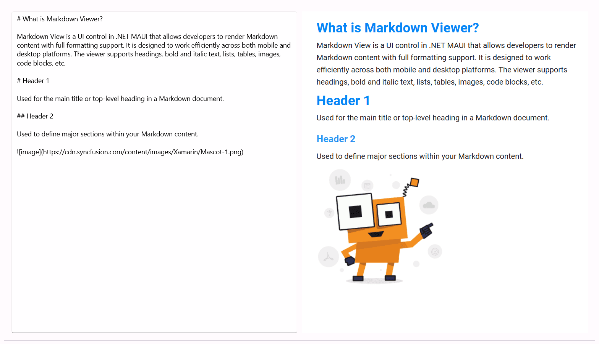

# .NET MAUI SfMarkdownViewer Overview

The .NET MAUI [SfMarkdownViewer](https://help.syncfusion.com/cr/maui/Syncfusion.Maui.MarkdownViewer.SfMarkdownViewer.html) is a lightweight and efficient UI control that enables developers to render Markdown content with full formatting support. It provides a seamless way to display documentation, help content, release notes, and other rich text formats in both mobile and desktop applications.

## Business use cases

- Applications that display in-app documentation such as User guides and Onboarding content.  
- Software products that present release notes and feature updates in a structured and readable format.  
- Help and support modules that provide FAQs, troubleshooting guides, and instructional content.  
- Content-driven applications that require rendering external or dynamic Markdown-based data.  

## Key features

- **Standard Markdown rendering support** allows displaying headings, bold text, lists, tables, images, and code blocks with proper formatting.  
- **Flexible input source support** allows loading Markdown content from local files, embedded resources, or strings.  
- **Smooth scrolling support** allows navigating large Markdown documents with a fluid user experience across devices.  
- **Automatic link rendering support** allows handling hyperlinks for external navigation or internal app navigation. 

## Globalization

The following table summarizes the globalization support available in this control.

    
    Full Support

    
    No Support

<table>
<tr>
<th align="center">Control</th>
<th align="center">Localization</th>
<th align="center">RTL</th>
<th align="center">Time zone</th>
<th align="center">Screen reader</th>
<th align="center">Keyboard navigation</th>
</tr>
<tr>
<td><a href="/maui/markdownviewer/overview">Markdown Viewer</a></td>
<td align="center"></td>
<td align="center"></td>
<td align="center"></td>
<td align="center"></td>
<td align="center"></td>
</tr> 
</table>

## Related controls

- [RichTextEditor](https://help.syncfusion.com/maui/rich-text-editor/overview) for editing rich text content within applications.
- [ListView](https://help.syncfusion.com/maui/listview/overview) for presenting structured content alongside Markdown views. 
- [TextInputLayout](https://help.syncfusion.com/maui/textinputlayout/overview) for capturing and structuring input that can be used to create or update Markdown content.

## See Also

Explore further resources:

- [Getting Started](https://help.syncfusion.com/maui/markdownviewer/gettingstarted) shows a step‑by‑step guide to begin using the MarkdownViewer control.  
- [Data Binding](https://help.syncfusion.com/maui/markdownviewer/databinding) explains how to bind markdown content from local files or data sources to display formatted text easily.  
- [Customization](https://help.syncfusion.com/maui/markdownviewer/appearance) helps customize appearance and behavior of the control.  
- [UI Kit](https://www.syncfusion.com/demos/maui#maui-ui-control) provides interactive demos and ready‑made UI examples. 

## Resources

<!-- Card 1 -->
<a href="https://www.syncfusion.com/maui-controls/maui-markdown-viewer" class="form-card" target="_blank">
  

    <h3 class="form-title">Feature Tour</h3>
    

      Walk through highlights and core capabilities.
    

  

</a>
<!-- Card 2 -->
<a href="https://github.com/syncfusion/maui-demos/tree/master/MAUI/MarkdownViewer" class="form-card" target="_blank">
  

    <h3 class="form-title">Showcase Samples</h3>
    

      Explore sample scenarios for real apps.
    

  

</a>
<!-- Card 3 -->
<a href="https://www.syncfusion.com/tutorial-videos/maui/markdown-viewer" class="form-card" target="_blank">
  

    <h3 class="form-title">Tutorial Videos</h3>
    

      Step‑by‑step guidance through video tutorials.
    

  

</a>
<!-- Card 4 -->
<a href="https://support.syncfusion.com/kb/cross-platforms/category/76" class="form-card" target="_blank">
  

    <h3 class="form-title">Explore KB's</h3>
    

      Find quick solutions and step‑by‑step guidance.
    

  

</a>
<!-- Card 5 -->
<a href="https://www.syncfusion.com/blogs/category/net-maui" class="form-card" target="_blank">
  

    <h3 class="form-title">Explore Blogs</h3>
    

      Read insights, tutorials, and developer journeys.
    

  

</a>
