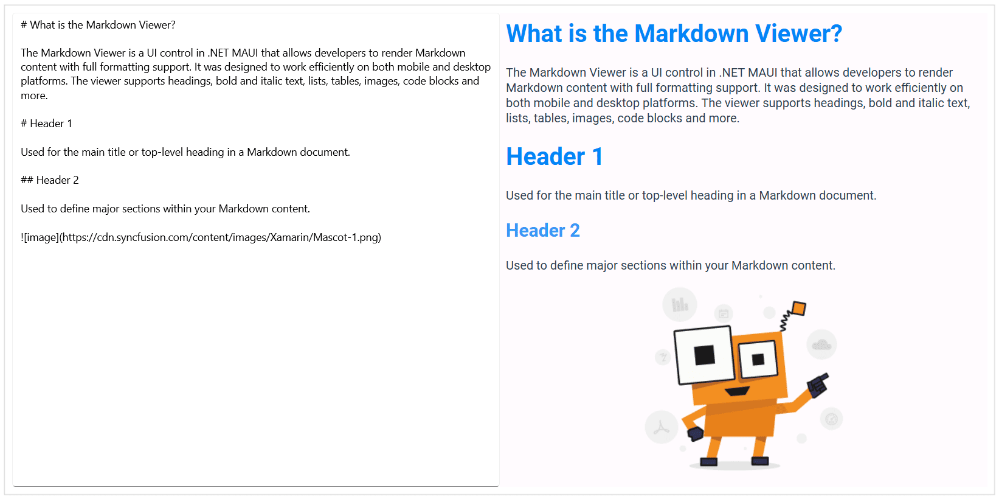

# .NET MAUI SfMarkdownViewer Overview

The .NET MAUI [SfMarkdownViewer](https://help.syncfusion.com/cr/maui/Syncfusion.Maui.MarkdownViewer.SfMarkdownViewer.html) is a lightweight and efficient UI control that enables developers to render Markdown content with full formatting support. It provides a seamless way to display documentation, help content, release notes, and other rich text formats in both mobile and desktop applications.

## Key Features

* **Standard Markdown Support** – Renders headings, bold and italic text, lists, tables, images, code blocks, etc.

* **Flexible Input Sources** – Accepts Markdown from local `.md` files, embedded resources, or direct strings.

* **Smooth Scrolling** – Provides fluid scrolling for large Markdown documents across devices.

## Use Case

* **In-app Documentation**  
  Display user guides, feature tours, and getting started materials directly within the app using Markdown.

* **Release Notes & Feature Updates**  
  Present version updates and feature changes in a consistent, scrollable format.

* **Help & Support Sections**  
  Provide FAQs, troubleshooting steps, and support articles with styled Markdown content.

* **Interactive Links**  
  Seamlessly integrate external URLs or internal navigation using automatic link rendering.

