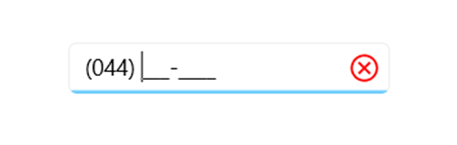
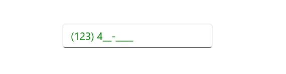
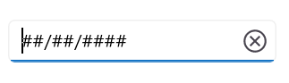
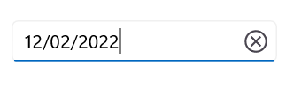
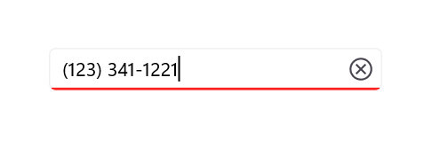
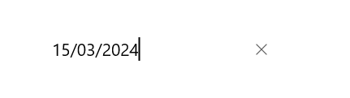
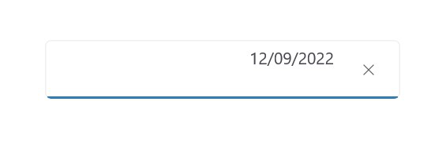
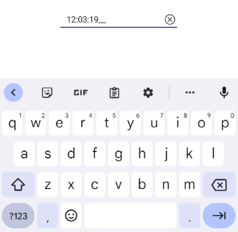
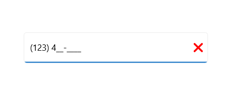
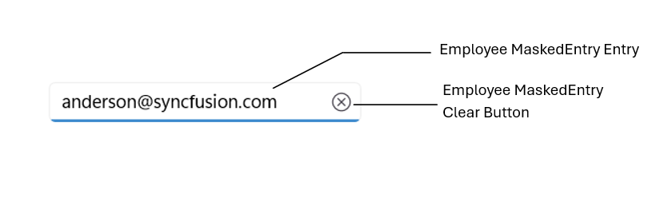

# Basic Features in .NET MAUI Masked Entry (SfMaskedEntry)

## Prerequisites

Before using the [SfMaskedEntry](https://help.syncfusion.com/cr/maui/Syncfusion.Maui.Inputs.SfMaskedEntry.html), ensure the following are set up:

1. Install the [Syncfusion.Maui.Inputs](https://www.nuget.org/packages/Syncfusion.Maui.Inputs) NuGet package in your .NET MAUI project.
2. Register the Syncfusion license in your application. Refer to the [Syncfusion licensing documentation](https://help.syncfusion.com/maui/licensing/overview) for more details.

    ```csharp
    using Syncfusion.Licensing;

    public class App : Application
    {
        public App()
        {
            // Replace the license key with your own.
            SyncfusionLicenseProvider.RegisterLicense("YOUR_LICENSE_KEY");
            InitializeComponent();
        }
    }
    ```

3. Register the Syncfusion core handler in the `CreateMauiApp` method of `MauiProgram.cs`:

    ```csharp
    using Syncfusion.Maui.Core.Hosting;

    public static class MauiProgram
    {
        public static MauiApp CreateMauiApp()
        {
            var builder = MauiApp.CreateBuilder();
            builder
                .UseMauiApp<App>()
                .ConfigureSyncfusionCore();
            return builder.Build();
        }
    }
    ```

4. Add the following namespace declarations to your XAML page and `using` directives to your C# files:

    ```xml
    xmlns:editors="clr-namespace:Syncfusion.Maui.Inputs;assembly=Syncfusion.Maui.Inputs"
    ```

    ```csharp
    using Syncfusion.Maui.Inputs;
    ```

For a step-by-step setup, refer to the [Getting Started](Getting-Started.md) documentation.

## Setting ClearButtonVisibility

The ClearButtonVisibility of type [ClearButtonVisibility](https://help.syncfusion.com/cr/maui/Syncfusion.Maui.Inputs.SfMaskedEntry.html#Syncfusion_Maui_Inputs_SfMaskedEntry_ClearButtonVisibility) controls whether a clear button is displayed, which enables the user to clear the text. The default value of this property is `ClearButtonVisibility.Never`.




<editors:SfMaskedEntry WidthRequest="200"
                          MaskType="Simple"
                          Mask="(000) 000-0000"
                          ClearButtonVisibility="WhileEditing"/>




SfMaskedEntry maskedEntry = new SfMaskedEntry();
maskedEntry.WidthRequest = 200;
maskedEntry.MaskType = MaskedEntryMaskType.Simple;
maskedEntry.Mask = "(000) 000-0000";
maskedEntry.ClearButtonVisibility = ClearButtonVisibility.WhileEditing;





## Setting MaskType

The [MaskType](https://help.syncfusion.com/cr/maui/Syncfusion.Maui.Inputs.SfMaskedEntry.html#Syncfusion_Maui_Inputs_SfMaskedEntry_MaskType) property of type [MaskedEntryMaskType](https://help.syncfusion.com/cr/maui/Syncfusion.Maui.Inputs.MaskedEntryMaskType.html) defines the masking format applied to the user input. The available values are:

- `Simple` — Applies a fixed-format mask (for example, `(000) 000-0000`).
- `RegEx` — Applies a mask based on a regular expression pattern.

The default value is `MaskedEntryMaskType.Simple`.

## Setting ClearButtonColor

The clear button icon color can be changed by using the [ClearButtonColor](https://help.syncfusion.com/cr/maui/Syncfusion.Maui.Inputs.SfMaskedEntry.html#Syncfusion_Maui_Inputs_SfMaskedEntry_ClearButtonColor) property of type `Color`. The default value of the ClearButtonColor property is the default icon color.




<editors:SfMaskedEntry x:Name="maskedEntry"
                          WidthRequest="200"
                          MaskType="Simple"
                          Mask="(000) 000-0000"
                          ClearButtonVisibility="WhileEditing"
                          ClearButtonColor="Red"/>




SfMaskedEntry maskedEntry = new SfMaskedEntry();
maskedEntry.WidthRequest = 200;
maskedEntry.MaskType = MaskedEntryMaskType.Simple;
maskedEntry.Mask = "(000) 000-0000";
maskedEntry.ClearButtonVisibility = ClearButtonVisibility.WhileEditing;
maskedEntry.ClearButtonColor = Colors.Red;






## Setting CursorPosition

The cursor position in the masked entry can either be obtained or updated using the [CursorPosition](https://help.syncfusion.com/cr/maui/Syncfusion.Maui.Inputs.SfMaskedEntry.html#Syncfusion_Maui_Inputs_SfMaskedEntry_CursorPosition) property of type `int`. The default value of this property is `0`.




<editors:SfMaskedEntry WidthRequest="200"
                       MaskType="Simple"
                       Mask="(000) 000-0000"
                       Value="1234567890"
                       CursorPosition="3"/>




SfMaskedEntry maskedEntry = new SfMaskedEntry();
maskedEntry.WidthRequest = 200;
maskedEntry.MaskType = MaskedEntryMaskType.Simple;
maskedEntry.Mask = "(000) 000-0000";
maskedEntry.Value = "1234567890";
maskedEntry.CursorPosition = 3;





## Setting FontSize

The Masked Entry control allows the user to customize the font size of the text inside the entry part using the [FontSize](https://help.syncfusion.com/cr/maui/Syncfusion.Maui.Inputs.SfMaskedEntry.html#Syncfusion_Maui_Inputs_SfMaskedEntry_FontSize) property of type `double`. The default value of the FontSize property is `14`.




<editors:SfMaskedEntry WidthRequest="200"
                          MaskType="Simple"
                          Mask="(000) 000-0000" Value="1234567890"
                          FontSize="18"/>




SfMaskedEntry maskedEntry = new SfMaskedEntry();
maskedEntry.WidthRequest = 200;
maskedEntry.MaskType = MaskedEntryMaskType.Simple;
maskedEntry.Mask = "(000) 000-0000";
maskedEntry.Value = "1234567890";
maskedEntry.FontSize = 18;





## Setting FontAttributes

The Masked Entry control allows the user to customize the font attribute of the text inside the entry part using the [FontAttributes](https://help.syncfusion.com/cr/maui/Syncfusion.Maui.Inputs.SfMaskedEntry.html#Syncfusion_Maui_Inputs_SfMaskedEntry_FontAttributes) property of the type `FontAttributes`.




<editors:SfMaskedEntry WidthRequest="200"
                          MaskType="Simple"
                          Mask="(000) 000-0000" Value="1234567890"
                          FontAttributes="Bold"/>




SfMaskedEntry maskedEntry = new SfMaskedEntry();
maskedEntry.WidthRequest = 200;
maskedEntry.MaskType = MaskedEntryMaskType.Simple;
maskedEntry.Mask = "(000) 000-0000";
maskedEntry.Value = "1234567890";
maskedEntry.FontAttributes = FontAttributes.Bold;





## Setting FontFamily

The Masked Entry control allows the user to customize the text's font family inside the entry part using the [FontFamily](https://help.syncfusion.com/cr/maui/Syncfusion.Maui.Inputs.SfMaskedEntry.html#Syncfusion_Maui_Inputs_SfMaskedEntry_FontFamily) property of the type `string`.




<editors:SfMaskedEntry WidthRequest="200"
                          MaskType="Simple"
                          Mask="(000) 000-0000" Value="1234567890"
                          FontFamily="Lobster-Regular"/>




SfMaskedEntry maskedEntry = new SfMaskedEntry();
maskedEntry.WidthRequest = 200;
maskedEntry.MaskType = MaskedEntryMaskType.Simple;
maskedEntry.Mask = "(000) 000-0000";
maskedEntry.Value = "1234567890";
maskedEntry.FontFamily = "Lobster-Regular";





## Setting Keyboard

The Masked Entry control allows the user to specify the virtual keyboard displayed when entering text using the [Keyboard](https://help.syncfusion.com/cr/maui/Syncfusion.Maui.Inputs.SfMaskedEntry.html#Syncfusion_Maui_Inputs_SfMaskedEntry_Keyboard) property of type `Keyboard`. The default value of this property is `Keyboard.Default`.




<editors:SfMaskedEntry WidthRequest="200"
                       MaskType="Simple"
                       Mask="(000) 000-0000"
                       Keyboard="Numeric"/>




SfMaskedEntry maskedEntry = new SfMaskedEntry();
maskedEntry.WidthRequest = 200;
maskedEntry.MaskType = MaskedEntryMaskType.Simple;
maskedEntry.Mask = "(000) 000-0000";
maskedEntry.Keyboard = Keyboard.Numeric;




## Setting Placeholder

The Masked Entry control allows the user to define the text displayed when the Mask and Value are empty using the [Placeholder](https://help.syncfusion.com/cr/maui/Syncfusion.Maui.Inputs.SfMaskedEntry.html#Syncfusion_Maui_Inputs_SfMaskedEntry_Placeholder) property of type `string`. The default value of the Placeholder property is string.Empty.




<editors:SfMaskedEntry WidthRequest="200"
                          Placeholder="Enter the value"/>




SfMaskedEntry maskedEntry = new SfMaskedEntry();
maskedEntry.WidthRequest = 200;
maskedEntry.Placeholder = "Enter the value";





## Setting PlaceholderColor

The [SfMaskedEntry](https://help.syncfusion.com/cr/maui/Syncfusion.Maui.Inputs.SfMaskedEntry.html) control allows the user to customize the color of the placeholder text using the [PlaceholderColor](https://help.syncfusion.com/cr/maui/Syncfusion.Maui.Inputs.SfMaskedEntry.html#Syncfusion_Maui_Inputs_SfMaskedEntry_PlaceholderColor) property of type `Color`. The default value of the PlaceholderColor property is Colors.Gray.




<editors:SfMaskedEntry WidthRequest="200"
                          Placeholder="Enter the value"
                          PlaceholderColor="Green"/>




SfMaskedEntry maskedEntry = new SfMaskedEntry();
maskedEntry.WidthRequest = 200;
maskedEntry.Placeholder = "Enter the value";
maskedEntry.PlaceholderColor = Colors.Green;





## Setting TextColor

The [SfMaskedEntry](https://help.syncfusion.com/cr/maui/Syncfusion.Maui.Inputs.SfMaskedEntry.html) control allows the user to customize the color of the entered text using the [TextColor](https://help.syncfusion.com/cr/maui/Syncfusion.Maui.Inputs.SfMaskedEntry.html#Syncfusion_Maui_Inputs_SfMaskedEntry_TextColor) property of type `Color`. The default value of the TextColor property is Colors.Black.




<editors:SfMaskedEntry WidthRequest="200"
                          MaskType="Simple"
                          Mask="(000) 000-0000" Value="1234567890"
                          TextColor="Green"/>




SfMaskedEntry maskedEntry = new SfMaskedEntry();
maskedEntry.WidthRequest = 200;
maskedEntry.MaskType = MaskedEntryMaskType.Simple;
maskedEntry.Mask = "(000) 000-0000";
maskedEntry.Value = "1234567890";
maskedEntry.TextColor = Colors.Green;






## Setting PromptChar

Each mask displays a prompt character (`_`) in the absence of user input. Customize this prompt character by using the [PromptChar](https://help.syncfusion.com/cr/maui/Syncfusion.Maui.Inputs.SfMaskedEntry.html#Syncfusion_Maui_Inputs_SfMaskedEntry_PromptChar) property of type `char`. The default value of the PromptChar property is `_`.




<editors:SfMaskedEntry WidthRequest="200"
                          ClearButtonVisibility="WhileEditing"
                          MaskType="Simple"
                          Mask="00/00/0000"
                          PromptChar="#"/>




SfMaskedEntry maskedEntry = new SfMaskedEntry();
maskedEntry.WidthRequest = 200;
maskedEntry.ClearButtonVisibility = ClearButtonVisibility.WhileEditing;
maskedEntry.MaskType = MaskedEntryMaskType.Simple;
maskedEntry.Mask = "00/00/0000";
maskedEntry.PromptChar = '#';






## Setting Value

The [Value](https://help.syncfusion.com/cr/maui/Syncfusion.Maui.Inputs.SfMaskedEntry.html#Syncfusion_Maui_Inputs_SfMaskedEntry_Value) property sets the input value for the Masked Entry control. The default value of the Value property is `string.Empty`.




<editors:SfMaskedEntry WidthRequest="200"
                          ClearButtonVisibility="WhileEditing"
                          MaskType="Simple"
                          Mask="00/00/0000"
                          Value="12/02/2022"/>




SfMaskedEntry maskedEntry = new SfMaskedEntry();
maskedEntry.WidthRequest = 200;
maskedEntry.ClearButtonVisibility = ClearButtonVisibility.WhileEditing;
maskedEntry.MaskType = MaskedEntryMaskType.Simple;
maskedEntry.Mask = "00/00/0000";
maskedEntry.Value = "12/02/2022";






## Setting Stroke

The [SfMaskedEntry](https://help.syncfusion.com/cr/maui/Syncfusion.Maui.Inputs.SfMaskedEntry.html) border color can be changed by using the [Stroke](https://help.syncfusion.com/cr/maui/Syncfusion.Maui.Inputs.SfMaskedEntry.html#Syncfusion_Maui_Inputs_SfMaskedEntry_Stroke) property. The default value of the Stroke property is `Colors.Black`. The thickness of the border can be customized using the [StrokeThickness](https://help.syncfusion.com/cr/maui/Syncfusion.Maui.Inputs.SfMaskedEntry.html#Syncfusion_Maui_Inputs_SfMaskedEntry_StrokeThickness) property of type `double`, whose default value is `1`.




<editors:SfMaskedEntry WidthRequest="200"
                          Mask="(000) 000-0000"
                          ClearButtonVisibility="WhileEditing"
                          Stroke="Red"/>



SfMaskedEntry maskedEntry = new SfMaskedEntry();
maskedEntry.WidthRequest = 200;
maskedEntry.Mask = "(000) 000-0000";
maskedEntry.ClearButtonVisibility = ClearButtonVisibility.WhileEditing;
maskedEntry.Stroke = Colors.Red;




The following image illustrates the result of the above code:



## Setting ShowBorder

The [ShowBorder](https://help.syncfusion.com/cr/maui/Syncfusion.Maui.Inputs.SfMaskedEntry.html#Syncfusion_Maui_Inputs_SfMaskedEntry_ShowBorder) property of [SfMaskedEntry](https://help.syncfusion.com/cr/maui/Syncfusion.Maui.Inputs.SfMaskedEntry.html) is used to modify the visibility of the border. Its default value is `true`. The following code example demonstrates how to change the border visibility:




<editors:SfMaskedEntry WidthRequest="200"
                          Mask="00/00/0000"
                          ClearButtonVisibility="WhileEditing"
                          ShowBorder="False"/>



SfMaskedEntry maskedEntry = new SfMaskedEntry();
maskedEntry.WidthRequest = 200;
maskedEntry.Mask = "00/00/0000";
maskedEntry.ClearButtonVisibility = ClearButtonVisibility.WhileEditing;
maskedEntry.ShowBorder = false;




The following image illustrates the result of the above code:



## Setting TextAlignment

The [SfMaskedEntry](https://help.syncfusion.com/cr/maui/Syncfusion.Maui.Inputs.SfMaskedEntry.html) provides support to customize the text alignment by using the [HorizontalTextAlignment](https://help.syncfusion.com/cr/maui/Syncfusion.Maui.Inputs.SfMaskedEntry.html#Syncfusion_Maui_Inputs_SfMaskedEntry_HorizontalTextAlignment) and [VerticalTextAlignment](https://help.syncfusion.com/cr/maui/Syncfusion.Maui.Inputs.SfMaskedEntry.html#Syncfusion_Maui_Inputs_SfMaskedEntry_VerticalTextAlignment) properties.




<editors:SfMaskedEntry WidthRequest="200"
                          HeightRequest="50"
                          Mask="00/00/0000"
                          ClearButtonVisibility="WhileEditing"
                          HorizontalTextAlignment="Center"
                          VerticalTextAlignment="Start"/>



SfMaskedEntry maskedEntry = new SfMaskedEntry();
maskedEntry.WidthRequest = 200;
maskedEntry.HeightRequest = 50;
maskedEntry.Mask = "00/00/0000";
maskedEntry.ClearButtonVisibility = ClearButtonVisibility.WhileEditing;
maskedEntry.HorizontalTextAlignment = TextAlignment.Center;
maskedEntry.VerticalTextAlignment = TextAlignment.Start;




The following image illustrates the result of the above code:



## Setting SelectAllOnFocus

The [SelectAllOnFocus](https://help.syncfusion.com/cr/maui/Syncfusion.Maui.Inputs.SfMaskedEntry.html#Syncfusion_Maui_Inputs_SfMaskedEntry_SelectAllOnFocus) property allows you to automatically select all the text in the masked entry when the control gains focus. This can improve user efficiency by making it easy to replace the entire content. The default value of this property is `false`.




<editors:SfMaskedEntry WidthRequest="200"
                       MaskType="Simple"
                       Mask="(000) 000-0000"
                       Value="1234567890"
                       SelectAllOnFocus="True"/>




SfMaskedEntry maskedEntry = new SfMaskedEntry();
maskedEntry.WidthRequest = 200;
maskedEntry.MaskType = MaskedEntryMaskType.Simple;
maskedEntry.Mask = "(000) 000-0000";
maskedEntry.Value = "1234567890";
maskedEntry.SelectAllOnFocus = true;





## Setting IsReadOnly

The [IsReadOnly](https://help.syncfusion.com/cr/maui/Syncfusion.Maui.Inputs.SfMaskedEntry.html#Syncfusion_Maui_Inputs_SfMaskedEntry_IsReadOnly) property (inherited from the `Entry` control) allows you to make the masked entry non-editable while keeping it focusable and selectable. When enabled, users can still focus and select text, but cannot modify the value via typing, cut, paste, or the keyboard. The default value of this property is `false`.




<editors:SfMaskedEntry WidthRequest="200"
                       MaskType="Simple"
                       Mask="(000) 000-0000"
                       Value="1234567890"
                       IsReadOnly="True"/>




SfMaskedEntry maskedEntry = new SfMaskedEntry();
maskedEntry.WidthRequest = 200;
maskedEntry.MaskType = MaskedEntryMaskType.Simple;
maskedEntry.Mask = "(000) 000-0000";
maskedEntry.Value = "1234567890";
maskedEntry.IsReadOnly = true;





## Setting ReturnType

The `ReturnType` property specifies the return button (e.g., Next, Done, Go) of the keyboard. It helps manage the flow between multiple input fields by defining what happens when the action button is pressed.

You can define the return key type of [SfMaskedEntry](https://help.syncfusion.com/cr/maui/Syncfusion.Maui.Inputs.SfMaskedEntry.html) by using the ReturnType property. The available enum values are:

- `Default` — Default return key.
- `Done` — Indicates the input is complete.
- `Go` — Indicates navigation, such as opening a URL.
- `Next` — Moves focus to the next input field.
- `Search` — Indicates a search action.
- `Send` — Indicates the message or input should be sent.

N> Default value of ReturnType is `Default`.




<editors:SfMaskedEntry x:Name="maskedentry"
                        Mask="00:00:0000"
                        ClearButtonVisibility="WhileEditing"
                        ReturnType="Next"/>




SfMaskedEntry maskedEntry = new SfMaskedEntry();
maskedEntry.Mask = "00:00:0000";
maskedEntry.ClearButtonVisibility = ClearButtonVisibility.WhileEditing;
maskedEntry.ReturnType = ReturnType.Next;






## Setting ClearButtonPath

The `ClearButtonPath` property allows users to set the path for customizing the appearance of the [SfMaskedEntry](https://help.syncfusion.com/cr/maui/Syncfusion.Maui.Inputs.SfMaskedEntry.html) clear button.




<editors:SfMaskedEntry x:Name="maskedEntry"
                       MaskType="Simple"
                       Mask="(000) 000-0000"
                       ClearButtonVisibility="WhileEditing">
            <editors:SfMaskedEntry.ClearButtonPath>
                <Path Data="M1.70711 0.292893C1.31658 -0.097631 0.683417 -0.097631 0.292893 0.292893C-0.097631 0.683417 -0.097631 1.31658 0.292893 1.70711L5.58579 7L0.292893 12.2929C-0.097631 12.6834 -0.097631 13.3166 0.292893 13.7071C0.683417 14.0976 1.31658 14.0976 1.70711 13.7071L7 8.41421L12.2929 13.7071C12.6834 14.0976 13.3166 14.0976 13.7071 13.7071C14.0976 13.3166 14.0976 12.6834 13.7071 12.2929L8.41421 7L13.7071 1.70711C14.0976 1.31658 14.0976 0.683417 13.7071 0.292893C13.3166 -0.097631 12.6834 -0.097631 12.2929 0.292893L7 5.58579L1.70711 0.292893Z"
                Fill="Red"
                Stroke="Red"/>
            </editors:SfMaskedEntry.ClearButtonPath>
</editors:SfMaskedEntry>




private string _customPath = "M1.70711 0.292893C1.31658 -0.097631 0.683417 -0.097631 0.292893 0.292893C-0.097631 0.683417 -0.097631 1.31658 0.292893 1.70711L5.58579 7L0.292893 12.2929C-0.097631 12.6834 -0.097631 13.3166 0.292893 13.7071C0.683417 14.0976 1.31658 14.0976 1.70711 13.7071L7 8.41421L12.2929 13.7071C12.6834 14.0976 13.3166 14.0976 13.7071 13.7071C14.0976 13.3166 14.0976 12.6834 13.7071 12.2929L8.41421 7L13.7071 1.70711C14.0976 1.31658 14.0976 0.683417 13.7071 0.292893C13.3166 -0.097631 12.6834 -0.097631 12.2929 0.292893L7 5.58579L1.70711 0.292893Z";

var converter = new PathGeometryConverter();
var path = new Path()
{
    Data = (PathGeometry)converter.ConvertFromInvariantString(_customPath),
    Fill = Colors.Red,
    Stroke = Colors.Red
};

SfMaskedEntry maskedEntry = new SfMaskedEntry();
maskedEntry.MaskType = MaskedEntryMaskType.Simple;
maskedEntry.Mask = "(000) 000-0000";
maskedEntry.ClearButtonVisibility = ClearButtonVisibility.WhileEditing;
maskedEntry.ClearButtonPath = path;




The following image illustrates the result of the above code:



## Setting Return Command and Return Command Parameter

- `ReturnCommand`, of type `ICommand`, defines the command to be executed when the return key is pressed.
- `ReturnCommandParameter`, of type `object`, specifies the parameter for the `ReturnCommand`.




<ContentPage.BindingContext>
    <local:CommandDemoViewModel/>
</ContentPage.BindingContext>

<editors:SfMaskedEntry x:Name="maskedEntry"
            ReturnCommand="{Binding AlertCommand}"
            ReturnCommandParameter="Return key is pressed">
</editors:SfMaskedEntry>




var viewModel = new CommandDemoViewModel();

SfMaskedEntry maskedEntry = new SfMaskedEntry();
maskedEntry.ReturnCommand = viewModel.AlertCommand;
maskedEntry.ReturnCommandParameter = "Return key is pressed";







//ViewModel.cs

public class CommandDemoViewModel
{
    public ICommand AlertCommand => new Command<string>(OnAlertCommandExecuted);

    private async void OnAlertCommandExecuted(string parameter)
    {
        var page = Application.Current?.Windows[0]?.Page;
        if (page is not null)
        {
            await page.DisplayAlert("Alert", parameter, "OK");
        }
    }
}





## Automation ID

The [SfMaskedEntry](https://help.syncfusion.com/cr/maui/Syncfusion.Maui.Inputs.SfMaskedEntry.html) control provides `AutomationId` support specifically for the `editable entry` and the `clear button`, enabling UI automation frameworks to reliably target these two elements. Each element's AutomationId is derived from the control's AutomationId to ensure uniqueness.

For example, if the SfMaskedEntry's `AutomationId` is set to "Employee MaskedEntry," the editable entry can be targeted as "Employee MaskedEntry Entry" and the clear button as "Employee MaskedEntry Clear Button." This focused support improves accessibility and automated UI testing by providing stable, predictable identifiers for the primary interactive elements.




<editors:SfMaskedEntry WidthRequest="200"
                       MaskType="Simple"
                       Mask="(000) 000-0000"
                       Value="1234567890"
                       AutomationId="EmployeeMaskedEntry"/>




SfMaskedEntry maskedEntry = new SfMaskedEntry();
maskedEntry.WidthRequest = 200;
maskedEntry.MaskType = MaskedEntryMaskType.Simple;
maskedEntry.Mask = "(000) 000-0000";
maskedEntry.Value = "1234567890";
maskedEntry.AutomationId = "EmployeeMaskedEntry";




The following screenshot illustrates the AutomationIds of inner elements.



## See Also

* [Getting Started with .NET MAUI Masked Entry](getting-started.md)
* [Validation in .NET MAUI Masked Entry](validation.md)
* [Events in .NET MAUI Masked Entry](events.md)
* [SfMaskedEntry API reference](https://help.syncfusion.com/cr/maui/Syncfusion.Maui.Inputs.SfMaskedEntry.html)