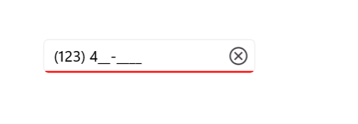
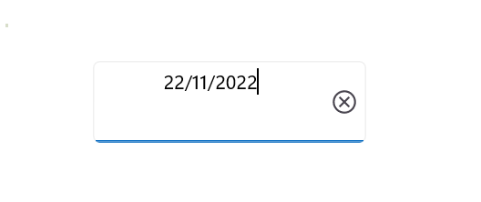

# Basic Features in .NET MAUI Masked Entry (SfMaskedEntry)

## Setting ClearButtonVisibility

The `ClearButtonVisibility` property of type [ClearButtonVisibility](https://help.syncfusion.com/cr/maui/Syncfusion.Maui.Inputs.SfMaskedEntry.html#Syncfusion_Maui_Inputs_SfMaskedEntry_ClearButtonVisibility) controls the visibility of a clear button, allowing users to clear the text. The default value is [ClearButtonVisibility.Never](https://help.syncfusion.com/cr/maui/Syncfusion.Maui.DataForm.MaskedEditorClearButtonVisibility.html#Syncfusion_Maui_DataForm_MaskedEditorClearButtonVisibility_Never).




<editors:SfMaskedEntry WidthRequest="200"
                          MaskType="Simple"
                          Mask="(000) 000-0000"
                          ClearButtonVisibility = "WhileEditing" />




SfMaskedEntry maskedEntry = new SfMaskedEntry();
maskedEntry.WidthRequest = 200;
maskedEntry.MaskType = MaskedEntryMaskType.Simple;
maskedEntry.Mask = "(000) 000-0000";
maskedEntry.ClearButtonVisibility = ClearButtonVisibility.WhileEditing;




## Setting Clear Button Icon Color

The clear button icon color can be changed by using the [ClearButtonColor](https://help.syncfusion.com/cr/maui/Syncfusion.Maui.Inputs.SfMaskedEntry.html#Syncfusion_Maui_Inputs_SfMaskedEntry_ClearButtonColor).




<editors:SfMaskedEntry x:Name="maskedEntry"
                          WidthRequest="200"
                          MaskType="Simple"
                          Mask="(000) 000-0000"
                          ClearButtonVisibility = "WhileEditing"
                          ClearButtonColor="Red" />




SfMaskedEntry maskedEntry = new SfMaskedEntry();
maskedEntry.WidthRequest = 200;
maskedEntry.MaskType = MaskedEntryMaskType.Simple;
maskedEntry.Mask = "(000) 000-0000";
maskedEntry.ClearButtonVisibility = ClearButtonVisibility.WhileEditing;
maskedEntry.ClearButtonColor = Colors.Red;




## Setting CursorPosition

The cursor position within the masked entry can be retrieved or set using the [CursorPosition](https://help.syncfusion.com/cr/maui/Syncfusion.Maui.Inputs.SfMaskedEntry.html#Syncfusion_Maui_Inputs_SfMaskedEntry_CursorPosition) property.

## Setting FontSize

In the Masked Entry control, the font size of text can be set using the [FontSize](https://help.syncfusion.com/cr/maui/Syncfusion.Maui.Inputs.SfMaskedEntry.html#Syncfusion_Maui_Inputs_SfMaskedEntry_FontSize) property, which is of type double.




<editors:SfMaskedEntry WidthRequest="200"
                          MaskType="Simple"
                          Mask="(000) 000-0000" Value="1234"
                          FontSize="18"/>




SfMaskedEntry maskedEntry = new SfMaskedEntry();
maskedEntry.WidthRequest = 200;
maskedEntry.MaskType = MaskedEntryMaskType.Simple;
maskedEntry.Mask = "(000) 000-0000";  
maskedEntry.Value = 1234;
maskedEntry.FontSize = 18;   




## Setting FontAttributes

Customize the font attribute in the Masked Entry control using the [FontAttributes](https://help.syncfusion.com/cr/maui/Syncfusion.Maui.Inputs.SfMaskedEntry.html#Syncfusion_Maui_Inputs_SfMaskedEntry_FontAttributes) property of type FontAttributes.




<editors:SfMaskedEntry WidthRequest="200"
                          MaskType="Simple"
                          Mask="(000) 000-0000" Value="1234"
                          FontAttributes="Bold"/>




SfMaskedEntry maskedEntry = new SfMaskedEntry();
maskedEntry.WidthRequest = 200;
maskedEntry.MaskType = MaskedEntryMaskType.Simple;
maskedEntry.Mask = "(000) 000-0000";  
maskedEntry.Value = 1234;
maskedEntry.FontAttributes = FontAttributes.Bold;   




## Setting FontFamily

Adjust the font family for text in the Masked Entry control using the [FontFamily](https://help.syncfusion.com/cr/maui/Syncfusion.Maui.Inputs.SfMaskedEntry.html#Syncfusion_Maui_Inputs_SfMaskedEntry_FontFamily) property of type string.




<editors:SfMaskedEntry WidthRequest="200"
                          MaskType="Simple"
                          Mask="(000) 000-0000" Value="1234"
                          FontFamily="Lobster-Regular"/>




SfMaskedEntry maskedEntry = new SfMaskedEntry();
maskedEntry.WidthRequest = 200;
maskedEntry.MaskType = MaskedEntryMaskType.Simple;
maskedEntry.Mask = "(000) 000-0000";  
maskedEntry.Value = 1234;
maskedEntry.FontFamily = "Lobster-Regular";  




## Setting Keyboard

Customize which virtual keyboard appears when entering text using the [Keyboard](https://help.syncfusion.com/cr/maui/Syncfusion.Maui.Inputs.SfMaskedEntry.html#Syncfusion_Maui_Inputs_SfMaskedEntry_Keyboard) property of type Keyboard.

## Setting Placeholder

Define the text shown when both Mask and Value are empty using the [Placeholder](https://help.syncfusion.com/cr/maui/Syncfusion.Maui.Inputs.SfMaskedEntry.html#Syncfusion_Maui_Inputs_SfMaskedEntry_Placeholder) property of type `string`. The default is `string.Empty`.




<editors:SfMaskedEntry WidthRequest="200"                         
                          Placeholder="Enter the value"/>




SfMaskedEntry maskedEntry = new SfMaskedEntry();
maskedEntry.WidthRequest = 200;
maskedEntry.Placeholder = "Enter the value";   




## Setting PlaceholderColor

Customize the placeholder text color in [SfMaskedEntry](https://help.syncfusion.com/cr/maui/Syncfusion.Maui.Inputs.SfMaskedEntry.html) using the [PlaceholderColor](https://help.syncfusion.com/cr/maui/Syncfusion.Maui.Inputs.SfMaskedEntry.html#Syncfusion_Maui_Inputs_SfMaskedEntry_PlaceholderColor) property of type `Color`. Default is `Colors.Gray`.




<editors:SfMaskedEntry WidthRequest="200"                         
                          Placeholder="Enter the value"
                          PlaceholderColor="Green"/>




SfMaskedEntry maskedEntry = new SfMaskedEntry();
maskedEntry.WidthRequest = 200;
maskedEntry.Placeholder = "Enter the value"; 
maskedEntry.PlaceholderColor =  Colors.Green; 




## Setting TextColor

Use the [TextColor](https://help.syncfusion.com/cr/maui/Syncfusion.Maui.Inputs.SfMaskedEntry.html#Syncfusion_Maui_Inputs_SfMaskedEntry_TextColor) property to change the entered text color in [SfMaskedEntry](https://help.syncfusion.com/cr/maui/Syncfusion.Maui.Inputs.SfMaskedEntry.html). Default is `Colors.Black`.



<editors:SfMaskedEntry WidthRequest="200"
                          MaskType="Simple"
                          Mask="(000) 000-0000" Value="1234"
                          TextColor="Green"/>




SfMaskedEntry maskedEntry = new SfMaskedEntry();
maskedEntry.WidthRequest = 200;
maskedEntry.MaskType = MaskedEntryMaskType.Simple;
maskedEntry.Mask = "(000) 000-0000";  
maskedEntry.Value = 1234;
maskedEntry.TextColor =  Colors.Green; 




## Stroke

Alter the border color of [SfMaskedEntry](https://help.syncfusion.com/cr/maui/Syncfusion.Maui.Inputs.SfMaskedEntry.html) using the [Stroke](https://help.syncfusion.com/cr/maui/Syncfusion.Maui.Inputs.SfMaskedEntry.html#Syncfusion_Maui_Inputs_SfMaskedEntry_Stroke) property.




<editors:SfMaskedEntry WidthRequest="200"
                          Mask="(000) 000-0000"
                          ClearButtonVisibility="WhileEditing"
                          Stroke="Red"/>                                           



SfMaskedEntry maskedEntry = new SfMaskedEntry();
maskedEntry.WidthRequest = 200;
maskedEntry.Mask = "(000) 000-0000";
maskedEntry.ClearButtonVisibility = ClearButtonVisibility.WhileEditing;
maskedEntry.Stroke = Colors.Red;




The following image shows the result of the above code:

## Border Visibility

The [ShowBorder](https://help.syncfusion.com/cr/maui/Syncfusion.Maui.Inputs.SfMaskedEntry.html#Syncfusion_Maui_Inputs_SfMaskedEntry_ShowBorder) property toggles the border visibility of the [SfMaskedEntry](https://help.syncfusion.com/cr/maui/Syncfusion.Maui.Inputs.SfMaskedEntry.html). Default is `true`.




<editors:SfMaskedEntry WidthRequest="200"
                          Mask="00/00/0000" 
                          ClearButtonVisibility="WhileEditing"
                          ShowBorder="False"/>                                           



SfMaskedEntry maskedEntry = new SfMaskedEntry();
maskedEntry.WidthRequest = 200;
maskedEntry.Mask = "00/00/0000";
maskedEntry.ClearButtonVisibility = ClearButtonVisibility.WhileEditing;
maskedEntry.ShowBorder = false;




The following image shows the result of the above code:

## TextAlignment

Customize text alignment in [SfMaskedEntry](https://help.syncfusion.com/cr/maui/Syncfusion.Maui.Inputs.SfMaskedEntry.html) using [HorizontalTextAlignment](https://help.syncfusion.com/cr/maui/Syncfusion.Maui.Inputs.SfMaskedEntry.html#Syncfusion_Maui_Inputs_SfMaskedEntry_HorizontalTextAlignment) and [VerticalTextAlignment](https://help.syncfusion.com/cr/maui/Syncfusion.Maui.Inputs.SfMaskedEntry.html#Syncfusion_Maui_Inputs_SfMaskedEntry_VerticalTextAlignment) properties.




<editors:SfMaskedEntry WidthRequest="200"
                          HeightRequest="50"
                          Mask="00/00/0000"
                          ClearButtonVisibility="WhileEditing"
                          HorizontalTextAlignment="Center" 
                          VerticalTextAlignment="Start"/>



SfMaskedEntry maskedEntry = new SfMaskedEntry();
maskedEntry.WidthRequest = 200;
maskedEntry.HeightRequest = 50;
maskedEntry.Mask = "00/00/0000";
maskedEntry.ClearButtonVisibility = ClearButtonVisibility.WhileEditing;
maskedEntry.HorizontalTextAlignment = TextAlignment.Center;
maskedEntry.VerticalTextAlignment = TextAlignment.Start;




The following image shows the result of the above code:

## ReturnType

The `ReturnType` property specifies the return button type (e.g., Next, Done, Go) on the keyboard, aiding navigation between inputs by setting the return action.

You can set the return key type in [SfMaskedEntry](https://help.syncfusion.com/cr/maui/Syncfusion.Maui.Inputs.SfMaskedEntry.html) using the `ReturnType` property.

N> The default value of ReturnType is `Default`.




<editors:SfMaskedEntry x:Name="maskedentry" 
                        Mask="00:00:0000"
                        ClearButtonVisibility="WhileEditing"
                        ReturnType="Next"/>




SfMaskedEntry maskedEntry = new SfMaskedEntry();
maskedEntry.Mask = "00:00:0000";
maskedEntry.ClearButtonVisibility = ClearButtonVisibility.WhileEditing;
maskedEntry.ReturnType = ReturnType.Next;




## Clear Button Customization

Customize the clear button's appearance using the `ClearButtonPath` property within [SfMaskedEntry](https://help.syncfusion.com/cr/maui/Syncfusion.Maui.Inputs.SfMaskedEntry.html).




<editors:SfMaskedEntry x:Name="maskedEntry"
                       MaskType="Simple"
                       Mask="(000) 000-0000"
                       ClearButtonVisibility="WhileEditing">
            <editors:SfMaskedEntry.ClearButtonPath>
                <Path Data="M1.70711 0.292893C1.31658 -0.097631 0.683417 -0.097631 0.292893 0.292893C-0.097631 0.683417 -0.097631 1.31658 0.292893 1.70711L5.58579 7L0.292893 12.2929C-0.097631 12.6834 -0.097631 13.3166 0.292893 13.7071C0.683417 14.0976 1.31658 14.0976 1.70711 13.7071L7 8.41421L12.2929 13.7071C12.6834 14.0976 13.3166 14.0976 13.7071 13.7071C14.0976 13.3166 14.0976 12.6834 13.7071 12.2929L8.41421 7L13.7071 1.70711C14.0976 1.31658 14.0976 0.683417 13.7071 0.292893C13.3166 -0.097631 12.6834 -0.097631 12.2929 0.292893L7 5.58579L1.70711 0.292893Z" 
                Fill="Red" 
                Stroke="Red"/>
            </editors:SfMaskedEntry.ClearButtonPath>
</editors:SfMaskedEntry>




private string _customPath = "M1.70711 0.292893C1.31658 -0.097631 0.683417 -0.097631 0.292893 0.292893C-0.097631 0.683417 -0.097631 1.31658 0.292893 1.70711L5.58579 7L0.292893 12.2929C-0.097631 12.6834 -0.097631 13.3166 0.292893 13.7071C0.683417 14.0976 1.31658 14.0976 1.70711 13.7071L7 8.41421L12.2929 13.7071C12.6834 14.0976 13.3166 14.0976 13.7071 13.7071C14.0976 13.3166 14.0976 12.6834 13.7071 12.2929L8.41421 7L13.7071 1.70711C14.0976 1.31658 14.0976 0.683417 13.7071 0.292893C13.3166 -0.097631 12.6834 -0.097631 12.2929 0.292893L7 5.58579L1.70711 0.292893Z";

var converter = new PathGeometryConverter();
var path = new Path() 
{ 
    Data = (PathGeometry)converter.ConvertFromInvariantString(_customPath),
    Fill = Colors.Red,
    Stroke = Colors.Red
};

SfMaskedEntry maskedEntry = new SfMaskedEntry();
maskedEntry.MaskType = MaskedEntryMaskType.Simple;
maskedEntry.Mask = "(000) 000-0000"; 
maskedEntry.ClearButtonVisibility = ClearButtonVisibility.WhileEditing;
maskedEntry.ClearButtonPath = path;




The following image illustrates the result of the above code:

## Return Command and Return Command Parameter

- `ReturnCommand`, of type ICommand, defines the command to be executed when the return key is pressed.
- `ReturnCommandParameter`, of type object, specifies the parameter for the `ReturnCommand`.




<ContentPage.BindingContext>
    <local:CommandDemoViewModel/>
</ContentPage.BindingContext>

<editors:SfMaskedEntry x:Name="maskedEntry"
            ReturnCommand="{Binding AlertCommand}"
            ReturnCommandParameter="Return key is pressed">
</editors:SfMaskedEntry>




var viewModel = new CommandDemoViewModel();

SfMaskedEntry maskedEntry = new SfMaskedEntry();
maskedEntry.ReturnCommand = viewModel.AlertCommand;
maskedEntry.ReturnCommandParameter = "Return key is pressed";







//ViewModel.cs

public class CommandDemoViewModel
{
    public ICommand AlertCommand => new Command<string>(OnAlertCommandExecuted);

    private async void OnAlertCommandExecuted(string parameter)
    {
        await Application.Current.MainPage.DisplayAlert("Alert", parameter, "OK");
    }
}


