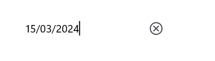

# Basic Features in .NET MAUI Masked Entry (SfMaskedEntry)

## Setting ClearButtonVisibility

The ClearButtonVisibility of type [ClearButtonVisibility](https://help.syncfusion.com/cr/maui/Syncfusion.Maui.Inputs.SfMaskedEntry.html#Syncfusion_Maui_Inputs_SfMaskedEntry_ClearButtonVisibility) controls whether a clear button is displayed, which enables the user to clear the text. The default value of this property is [ClearButtonVisibility.Never](https://help.syncfusion.com/cr/maui/Syncfusion.Maui.DataForm.MaskedEditorClearButtonVisibility.html#Syncfusion_Maui_DataForm_MaskedEditorClearButtonVisibility_Never).




<editors:SfMaskedEntry WidthRequest="200"
                          MaskType="Simple"
                          Mask="(000) 000-0000"
                          ClearButtonVisibility = "WhileEditing" />




SfMaskedEntry maskedEntry = new SfMaskedEntry();
maskedEntry.WidthRequest = 200;
maskedEntry.MaskType = MaskedEntryMaskType.Simple;
maskedEntry.Mask = "(000) 000-0000";
maskedEntry.ClearButtonVisibility = ClearButtonVisibility.WhileEditing;




## Setting Clear Button Icon Color

The clear button icon color can be changed by using the [ClearButtonColor](https://help.syncfusion.com/cr/maui/Syncfusion.Maui.Inputs.SfMaskedEntry.html#Syncfusion_Maui_Inputs_SfMaskedEntry_ClearButtonColor).




<editors:SfMaskedEntry x:Name="maskedEntry"
                          WidthRequest="200"
                          MaskType="Simple"
                          Mask="(000) 000-0000"
                          ClearButtonVisibility = "WhileEditing"
                          ClearButtonColor="Red" />




SfMaskedEntry maskedEntry = new SfMaskedEntry();
maskedEntry.WidthRequest = 200;
maskedEntry.MaskType = MaskedEntryMaskType.Simple;
maskedEntry.Mask = "(000) 000-0000";
maskedEntry.ClearButtonVisibility = ClearButtonVisibility.WhileEditing;
maskedEntry.ClearButtonColor = Colors.Red;




## Setting CursorPosition

The cursor position in the masked entry can either be obtained or updated using the [CursorPosition](https://help.syncfusion.com/cr/maui/Syncfusion.Maui.Inputs.SfMaskedEntry.html#Syncfusion_Maui_Inputs_SfMaskedEntry_CursorPosition) property in SfMaskedEntry.

## Setting FontSize

The Masked Entry control allows the user to customize the font size of the text inside the entry part using the [FontSize](https://help.syncfusion.com/cr/maui/Syncfusion.Maui.Inputs.SfMaskedEntry.html#Syncfusion_Maui_Inputs_SfMaskedEntry_FontSize) property of type double.




<editors:SfMaskedEntry WidthRequest="200"
                          MaskType="Simple"
                          Mask="(000) 000-0000" Value="1234"
                          FontSize="18"/>




SfMaskedEntry maskedEntry = new SfMaskedEntry();
maskedEntry.WidthRequest = 200;
maskedEntry.MaskType = MaskedEntryMaskType.Simple;
maskedEntry.Mask = "(000) 000-0000";  
maskedEntry.Value = 1234;
maskedEntry.FontSize = 18;   




## Setting FontAttributes

The Masked Entry control allows the user to customize the font attribute of the text inside the entry part using the [FontAttributes](https://help.syncfusion.com/cr/maui/Syncfusion.Maui.Inputs.SfMaskedEntry.html#Syncfusion_Maui_Inputs_SfMaskedEntry_FontAttributes) property of the type FontAttributes.




<editors:SfMaskedEntry WidthRequest="200"
                          MaskType="Simple"
                          Mask="(000) 000-0000" Value="1234"
                          FontAttributes="Bold"/>




SfMaskedEntry maskedEntry = new SfMaskedEntry();
maskedEntry.WidthRequest = 200;
maskedEntry.MaskType = MaskedEntryMaskType.Simple;
maskedEntry.Mask = "(000) 000-0000";  
maskedEntry.Value = 1234;
maskedEntry.FontAttributes = FontAttributes.Bold;   




## Setting FontFamily

The Masked Entry control allows the user to customize the text's font family inside the entry part using the [FontFamily](https://help.syncfusion.com/cr/maui/Syncfusion.Maui.Inputs.SfMaskedEntry.html#Syncfusion_Maui_Inputs_SfMaskedEntry_FontFamily) property of the type string.




<editors:SfMaskedEntry WidthRequest="200"
                          MaskType="Simple"
                          Mask="(000) 000-0000" Value="1234"
                          FontFamily="Lobster-Regular"/>




SfMaskedEntry maskedEntry = new SfMaskedEntry();
maskedEntry.WidthRequest = 200;
maskedEntry.MaskType = MaskedEntryMaskType.Simple;
maskedEntry.Mask = "(000) 000-0000";  
maskedEntry.Value = 1234;
maskedEntry.FontFamily = "Lobster-Regular";  




## Setting Keyboard

The Masked Entry control allows the user to specify the virtual keyboard displayed when entering text using the [Keyboard](https://help.syncfusion.com/cr/maui/Syncfusion.Maui.Inputs.SfMaskedEntry.html#Syncfusion_Maui_Inputs_SfMaskedEntry_Keyboard) property of type Keyboard.

## Setting Placeholder

The Masked Entry control allows the user to define the text displayed when the Mask and Value are empty using the [Placeholder](https://help.syncfusion.com/cr/maui/Syncfusion.Maui.Inputs.SfMaskedEntry.html#Syncfusion_Maui_Inputs_SfMaskedEntry_Placeholder) property of type `string`. The default value of the Placeholder property is string.Empty.




<editors:SfMaskedEntry WidthRequest="200"                         
                          Placeholder="Enter the value"/>




SfMaskedEntry maskedEntry = new SfMaskedEntry();
maskedEntry.WidthRequest = 200;
maskedEntry.Placeholder = "Enter the value";   




## Setting PlaceholderColor

The [SfMaskedEntry](https://help.syncfusion.com/cr/maui/Syncfusion.Maui.Inputs.SfMaskedEntry.html) control allows the user to customize the color of the placeholder text using the [PlaceholderColor](https://help.syncfusion.com/cr/maui/Syncfusion.Maui.Inputs.SfMaskedEntry.html#Syncfusion_Maui_Inputs_SfMaskedEntry_PlaceholderColor) property of type `Color`. The default value of the PlaceholderColor property is Colors.Gray.




<editors:SfMaskedEntry WidthRequest="200"                         
                          Placeholder="Enter the value"
                          PlaceholderColor="Green"/>




SfMaskedEntry maskedEntry = new SfMaskedEntry();
maskedEntry.WidthRequest = 200;
maskedEntry.Placeholder = "Enter the value"; 
maskedEntry.PlaceholderColor =  Colors.Green; 




## Setting TextColor

The [SfMaskedEntry](https://help.syncfusion.com/cr/maui/Syncfusion.Maui.Inputs.SfMaskedEntry.html) control provides the user to customize the color of the entered text using the [TextColor](https://help.syncfusion.com/cr/maui/Syncfusion.Maui.Inputs.SfMaskedEntry.html#Syncfusion_Maui_Inputs_SfMaskedEntry_TextColor) property of type `Color`. The default value of the TextColor property is Colors.Black.




<editors:SfMaskedEntry WidthRequest="200"
                          MaskType="Simple"
                          Mask="(000) 000-0000" Value="1234"
                          TextColor="Green"/>




SfMaskedEntry maskedEntry = new SfMaskedEntry();
maskedEntry.WidthRequest = 200;
maskedEntry.MaskType = MaskedEntryMaskType.Simple;
maskedEntry.Mask = "(000) 000-0000";  
maskedEntry.Value = 1234;
maskedEntry.TextColor =  Colors.Green; 




## Stroke

The [SfMaskedEntry](https://help.syncfusion.com/cr/maui/Syncfusion.Maui.Inputs.SfMaskedEntry.html) border color can be changed by using the [Stroke](https://help.syncfusion.com/cr/maui/Syncfusion.Maui.Inputs.SfMaskedEntry.html#Syncfusion_Maui_Inputs_SfMaskedEntry_Stroke) property.




<editors:SfMaskedEntry WidthRequest="200"
                          Mask="(000) 000-0000"
                          ClearButtonVisibility="WhileEditing"
                          Stroke="Red"/>                                           



SfMaskedEntry maskedEntry = new SfMaskedEntry();
maskedEntry.WidthRequest = 200;
maskedEntry.Mask = "(000) 000-0000";
maskedEntry.ClearButtonVisibility = ClearButtonVisibility.WhileEditing;
maskedEntry.Stroke = Colors.Red;




The following image illustrates the result of the above code:

## Border visibility

The [ShowBorder](https://help.syncfusion.com/cr/maui/Syncfusion.Maui.Inputs.SfMaskedEntry.html#Syncfusion_Maui_Inputs_SfMaskedEntry_ShowBorder) property of [SfMaskedEntry](https://help.syncfusion.com/cr/maui/Syncfusion.Maui.Inputs.SfMaskedEntry.html) is used to modify the visibility of the border and its default value is **true**. The following code example demonstrates how to change the border visibility,




<editors:SfMaskedEntry WidthRequest="200"
                          Mask="00/00/0000" 
                          ClearButtonVisibility="WhileEditing"
                          ShowBorder="False"/>                                           



SfMaskedEntry maskedEntry = new SfMaskedEntry();
maskedEntry.WidthRequest = 200;
maskedEntry.Mask = "00/00/0000";
maskedEntry.ClearButtonVisibility = ClearButtonVisibility.WhileEditing;
maskedEntry.ShowBorder = false;




The following image illustrates the result of the above code:

## TextAlignment

The [SfMaskedEntry](https://help.syncfusion.com/cr/maui/Syncfusion.Maui.Inputs.SfMaskedEntry.html) provides support to customize the text alignment by using the [HorizontalTextAlignment](https://help.syncfusion.com/cr/maui/Syncfusion.Maui.Inputs.SfMaskedEntry.html#Syncfusion_Maui_Inputs_SfMaskedEntry_HorizontalTextAlignment) and [VerticalTextAlignment](https://help.syncfusion.com/cr/maui/Syncfusion.Maui.Inputs.SfMaskedEntry.html#Syncfusion_Maui_Inputs_SfMaskedEntry_VerticalTextAlignment) properties.




<editors:SfMaskedEntry WidthRequest="200"
                          HeightRequest="50"
                          Mask="00/00/0000"
                          ClearButtonVisibility="WhileEditing"
                          HorizontalTextAlignment="Center" 
                          VerticalTextAlignment="Start"/>



SfMaskedEntry maskedEntry = new SfMaskedEntry();
maskedEntry.WidthRequest = 200;
maskedEntry.HeightRequest = 50;
maskedEntry.Mask = "00/00/0000";
maskedEntry.ClearButtonVisibility = ClearButtonVisibility.WhileEditing;
maskedEntry.HorizontalTextAlignment = TextAlignment.Center;
maskedEntry.VerticalTextAlignment = TextAlignment.Start;




The following image illustrates the result of the above code:

## Select text on focus

The [SelectAllOnFocus](https://help.syncfusion.com/cr/maui/Syncfusion.Maui.Inputs.SfMaskedEntry.html#Syncfusion_Maui_Inputs_SfMaskedEntry_SelectAllOnFocus) property allows you to automatically select all the text in the masked entry when the control gains focus. This can improve user efficiency by making it easy to replace the entire content. The default value of this property is `false`.




<editors:SfMaskedEntry WidthRequest="200"
                       MaskType="Simple"
                       Mask="(000) 000-0000"
                       Value="1234567890"
                       SelectAllOnFocus="True"/>




SfMaskedEntry maskedEntry = new SfMaskedEntry();
maskedEntry.WidthRequest = 200;
maskedEntry.MaskType = MaskedEntryMaskType.Simple;
maskedEntry.Mask = "(000) 000-0000";
maskedEntry.Value = "1234567890";
maskedEntry.SelectAllOnFocus = true;




## IsReadOnly Mode

The [`IsReadOnly`]() property allows you to make the masked entry non-editable while keeping it focusable and selectable. When enabled, users can still focus and select text, but cannot modify the value via typing, cut, paste, or the keyboard. The default value of this property is `false`.




<editors:SfMaskedEntry WidthRequest="200"
                       MaskType="Simple"
                       Mask="(000) 000-0000"
                       Value="1234567890"
                       IsReadOnly="True" />




SfMaskedEntry maskedEntry = new SfMaskedEntry();
maskedEntry.WidthRequest = 200;
maskedEntry.MaskType = MaskedEntryMaskType.Simple;
maskedEntry.Mask = "(000) 000-0000";
maskedEntry.Value = "1234567890";
maskedEntry.IsReadOnly = true;




## ReturnType

The `ReturnType` property specifies the return button (e.g., Next, Done, Go) of the keyboard. It helps manage the flow between multiple input fields by defining what happens when the action button is pressed.

You can define the return key type of [SfMaskedEntry](https://help.syncfusion.com/cr/maui/Syncfusion.Maui.Inputs.SfMaskedEntry.html) by using the ReturnType property.

N> Default value of ReturnType is `Default`.




<editors:SfMaskedEntry x:Name="maskedentry" 
                        Mask="00:00:0000"
                        ClearButtonVisibility="WhileEditing"
                        ReturnType="Next"/>




SfMaskedEntry maskedEntry = new SfMaskedEntry();
maskedEntry.Mask = "00:00:0000";
maskedEntry.ClearButtonVisibility = ClearButtonVisibility.WhileEditing;
maskedEntry.ReturnType = ReturnType.Next;




## Clear button customization

The `ClearButtonPath` property allows users to set the path for customizing the appearance of the [SfMaskedEntry](https://help.syncfusion.com/cr/maui/Syncfusion.Maui.Inputs.SfMaskedEntry.html) clear button.




<editors:SfMaskedEntry x:Name="maskedEntry"
                       MaskType="Simple"
                       Mask="(000) 000-0000"
                       ClearButtonVisibility="WhileEditing">
            <editors:SfMaskedEntry.ClearButtonPath>
                <Path Data="M1.70711 0.292893C1.31658 -0.097631 0.683417 -0.097631 0.292893 0.292893C-0.097631 0.683417 -0.097631 1.31658 0.292893 1.70711L5.58579 7L0.292893 12.2929C-0.097631 12.6834 -0.097631 13.3166 0.292893 13.7071C0.683417 14.0976 1.31658 14.0976 1.70711 13.7071L7 8.41421L12.2929 13.7071C12.6834 14.0976 13.3166 14.0976 13.7071 13.7071C14.0976 13.3166 14.0976 12.6834 13.7071 12.2929L8.41421 7L13.7071 1.70711C14.0976 1.31658 14.0976 0.683417 13.7071 0.292893C13.3166 -0.097631 12.6834 -0.097631 12.2929 0.292893L7 5.58579L1.70711 0.292893Z" 
                Fill="Red" 
                Stroke="Red"/>
            </editors:SfMaskedEntry.ClearButtonPath>
</editors:SfMaskedEntry>




private string _customPath = "M1.70711 0.292893C1.31658 -0.097631 0.683417 -0.097631 0.292893 0.292893C-0.097631 0.683417 -0.097631 1.31658 0.292893 1.70711L5.58579 7L0.292893 12.2929C-0.097631 12.6834 -0.097631 13.3166 0.292893 13.7071C0.683417 14.0976 1.31658 14.0976 1.70711 13.7071L7 8.41421L12.2929 13.7071C12.6834 14.0976 13.3166 14.0976 13.7071 13.7071C14.0976 13.3166 14.0976 12.6834 13.7071 12.2929L8.41421 7L13.7071 1.70711C14.0976 1.31658 14.0976 0.683417 13.7071 0.292893C13.3166 -0.097631 12.6834 -0.097631 12.2929 0.292893L7 5.58579L1.70711 0.292893Z";

var converter = new PathGeometryConverter();
var path = new Path() 
{ 
    Data = (PathGeometry)converter.ConvertFromInvariantString(_customPath),
    Fill = Colors.Red,
    Stroke = Colors.Red
};

SfMaskedEntry maskedEntry = new SfMaskedEntry();
maskedEntry.MaskType = MaskedEntryMaskType.Simple;
maskedEntry.Mask = "(000) 000-0000"; 
maskedEntry.ClearButtonVisibility = ClearButtonVisibility.WhileEditing;
maskedEntry.ClearButtonPath = path;




The following image illustrates the result of the above code:

## Return Command and Return Command Parameter

- `ReturnCommand`, of type ICommand, defines the command to be executed when the return key is pressed.
- `ReturnCommandParameter`, of type object, specifies the parameter for the `ReturnCommand`.




<ContentPage.BindingContext>
    <local:CommandDemoViewModel/>
</ContentPage.BindingContext>

<editors:SfMaskedEntry x:Name="maskedEntry"
            ReturnCommand="{Binding AlertCommand}"
            ReturnCommandParameter="Return key is pressed">
</editors:SfMaskedEntry>




var viewModel = new CommandDemoViewModel();

SfMaskedEntry maskedEntry = new SfMaskedEntry();
maskedEntry.ReturnCommand = viewModel.AlertCommand;
maskedEntry.ReturnCommandParameter = "Return key is pressed";







//ViewModel.cs

public class CommandDemoViewModel
{
    public ICommand AlertCommand => new Command<string>(OnAlertCommandExecuted);

    private async void OnAlertCommandExecuted(string parameter)
    {
        await Application.Current.MainPage.DisplayAlert("Alert", parameter, "OK");
    }
}




## Automation ID

The [SfMaskedEntry](https://help.syncfusion.com/cr/maui/Syncfusion.Maui.Inputs.SfMaskedEntry.html) control provides `AutomationId` support specifically for the `editable entry` and the `clear button`, enabling UI automation frameworks to reliably target these two elements. Each element’s AutomationId is derived from the control’s AutomationId to ensure uniqueness.

For example, if the SfMaskedEntry’s `AutomationId` is set to “Employee Masked Entry,” the editable entry can be targeted as “Employee Masked Entry Entry” and the clear button as “Employee Masked Entry Clear Button.” This focused support improves accessibility and automated UI testing by providing stable, predictable identifiers for the primary interactive elements.

The following screenshot illustrates the AutomationIds of inner elements.

