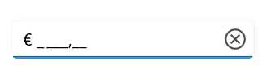

# Culture in .NET MAUI MaskedEntry

The MaskedEntry allows you to set any [Culture](https://help.syncfusion.com/cr/maui/Syncfusion.Maui.Inputs.SfMaskedEntry.html#Syncfusion_Maui_Inputs_SfMaskedEntry_Culture) support for currency symbols, date separators, time separators, group separators, and decimal separators by using the following special symbols.

<table>
<tr>
<th>
Characters</th><th>
Description</th>
</tr>
<tr>
<td>
.
</td>
<td>
Decimal separator determined by current culture.
</td>
</tr>
<tr>
<td>
,
</td>
<td>
Group separator determined by current culture.
</td>
</tr>
<tr>
<td>
/
</td>
<td>
Date separator determined by current culture.
</td>
</tr>
<tr>
<td>
:
</td>
<td>
Time separator determined by current culture.
</td>
</tr>
<tr>
<td>
$
</td>
<td>
Currency symbol determined by current culture.
</td>
</tr>
</table>

The following example shows how to set the France culture for the currency symbol, group separator, and decimal separator.




SfMaskedEntry maskedEntry = new SfMaskedEntry();
maskedEntry.WidthRequest = 200;
maskedEntry.MaskType = MaskedEntryMaskType.Simple;
maskedEntry.Mask = "$ 0,000.00";
maskedEntry.Culture = new CultureInfo("fr-FR"); 




Based on the France Culture, the ‘$’ will be localized to ‘€’; ‘.’ will be localized to ‘,’ and ‘,’ will be localized to ‘ ‘(single white space).

