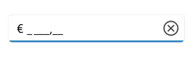

# Culture in .NET MAUI MaskedEntry

## Prerequisites

Before using the [SfMaskedEntry](https://help.syncfusion.com/cr/maui/Syncfusion.Maui.Inputs.SfMaskedEntry.html), ensure the following are set up:

1. Install the [Syncfusion.Maui.Inputs](https://www.nuget.org/packages/Syncfusion.Maui.Inputs) NuGet package in your .NET MAUI project.
2. Register the Syncfusion core handler in the `CreateMauiApp` method of `MauiProgram.cs`:

    ```csharp
    using Syncfusion.Maui.Core.Hosting;

    public static class MauiProgram
    {
        public static MauiApp CreateMauiApp()
        {
            var builder = MauiApp.CreateBuilder();
            builder
                .UseMauiApp<App>()
                .ConfigureSyncfusionCore();
            return builder.Build();
        }
    }
    ```

3. Add the following namespace declaration to your XAML page and `using` directive to your C# files:

    ```xml
    xmlns:editors="clr-namespace:Syncfusion.Maui.Inputs;assembly=Syncfusion.Maui.Inputs"
    ```

    ```csharp
    using Syncfusion.Maui.Inputs;
    ```

For a step-by-step setup, refer to the [Getting Started](Getting-Started.md) documentation.

The MaskedEntry allows you to set any [Culture](https://help.syncfusion.com/cr/maui/Syncfusion.Maui.Inputs.SfMaskedEntry.html#Syncfusion_Maui_Inputs_SfMaskedEntry_Culture) support for currency symbols, date separators, time separators, group separators, and decimal separators by using the following special symbols.

<table>
<tr>
<th>
Characters</th><th>
Description</th>
</tr>
<tr>
<td>
.
</td>
<td>
Decimal separator determined by current culture.
</td>
</tr>
<tr>
<td>
,
</td>
<td>
Group separator determined by current culture.
</td>
</tr>
<tr>
<td>
/
</td>
<td>
Date separator determined by current culture.
</td>
</tr>
<tr>
<td>
:
</td>
<td>
Time separator determined by current culture.
</td>
</tr>
<tr>
<td>
$
</td>
<td>
Currency symbol determined by current culture.
</td>
</tr>
</table>

The following example shows how to set the France culture for the currency symbol, group separator, and decimal separator.




SfMaskedEntry maskedEntry = new SfMaskedEntry();
maskedEntry.WidthRequest = 200;
maskedEntry.MaskType = MaskedEntryMaskType.Simple;
maskedEntry.Mask = "$ 0,000.00";
maskedEntry.Culture = new CultureInfo("fr-FR"); 




Based on the France Culture, the ‘$’ will be localized to ‘€’; ‘.’ will be localized to ‘,’ and ‘,’ will be localized to ‘ ‘(single white space).



## See Also

* [Getting Started with .NET MAUI Masked Entry](getting-started.md)
* [Validation in .NET MAUI Masked Entry](validation.md)
* [ormatting in .NET MAUI Masked Entry](formatting.md)
* [SfMaskedEntry API reference](https://help.syncfusion.com/cr/maui/Syncfusion.Maui.Inputs.SfMaskedEntry.html)