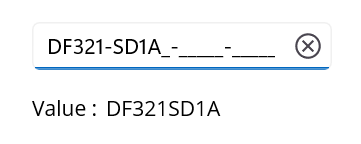
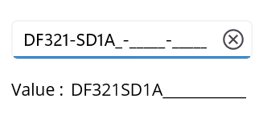
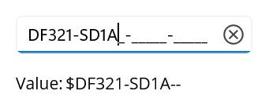
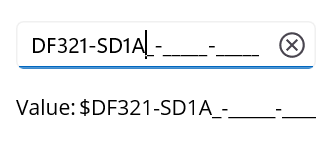

# Formatting value in .NET MAUI MaskedEntry

The [MaskedEntry](https://help.syncfusion.com/cr/maui/Syncfusion.Maui.Inputs.SfMaskedEntry.html) control allows you to format input values with prompt and literal characters defined in the mask expression by setting the [ValueMaskFormat](https://help.syncfusion.com/cr/maui/Syncfusion.Maui.Inputs.MaskedEntryMaskFormat.html) property. By default, the [Value](https://help.syncfusion.com/cr/maui/Syncfusion.Maui.Inputs.SfMaskedEntry.html#Syncfusion_Maui_Inputs_SfMaskedEntry_Value) property of the control includes the characters typed by the user and any prompt or literal characters in the input. The control provides several formatting options, which are listed as follows.

1. ExcludePromptAndLiterals
2. IncludePrompt
3. IncludeLiterals
4. IncludePromptAndLiterals

## Exclude prompts and literals

Set up the MaskedEntry to exclude prompt and literal characters, preserving only the typed characters.




<VerticalStackLayout Spacing="10" VerticalOptions="Center">
    <editors:SfMaskedEntry x:Name="maskedEntry" WidthRequest="200"
                              MaskType="Simple"
                              ClearButtonVisibility="WhileEditing"
                              Mask=">AAAAA-AAAAA-AAAAA-AAAAA"
                              Value="DF321SD1A"
                              ValueMaskFormat="ExcludePromptAndLiterals"/>
    <HorizontalStackLayout Spacing="2" HeightRequest="40" WidthRequest="200">
        <Label Text="Value :"/>
        <Label x:Name="valueDisplay" 
               Text="{Binding Path=Value, Source={x:Reference maskedEntry}}" 
               HeightRequest="40" />
    </HorizontalStackLayout>
</VerticalStackLayout>




public partial class MainPage : ContentPage
{
    public MainPage()
    {
        InitializeComponent();
        SfMaskedEntry maskedEntry = new SfMaskedEntry
        {
            WidthRequest = 200,
            MaskType = MaskedEntryMaskType.Simple,
            ClearButtonVisibility = ClearButtonVisibility.WhileEditing,
            Mask = ">AAAAA-AAAAA-AAAAA-AAAAA",
            Value = "DF321SD1A",
            ValueMaskFormat = MaskedEntryMaskFormat.ExcludePromptAndLiterals
        };
        Label valueLabel = new Label
        {
            Text = "Value :"
        };
        Label valueDisplay = new Label
        {
            HeightRequest = 40
        };
        valueDisplay.SetBinding(Label.TextProperty, new Binding
        {
            Path = "Value",
            Source = maskedEntry
        });
        HorizontalStackLayout valueLayout = new HorizontalStackLayout
        {
            Spacing = 2,
            HeightRequest = 40,
            WidthRequest = 200,
            Children = { valueLabel, valueDisplay }
        };
        VerticalStackLayout mainLayout = new VerticalStackLayout
        {
            Spacing = 10,
            VerticalOptions = LayoutOptions.Center,
            Children = { maskedEntry, valueLayout }
        };
        Content = mainLayout;
    }
}




## Include prompts

Set up the MaskedEntry to preserve typed and prompt characters, excluding literals.




<VerticalStackLayout Spacing="10" VerticalOptions="Center">
    <editors:SfMaskedEntry x:Name="maskedEntry" WidthRequest="200"
                              MaskType="Simple"
                              ClearButtonVisibility="WhileEditing"
                              Mask=">AAAAA-AAAAA-AAAAA-AAAAA"
                              Value="DF321SD1A"
                              ValueMaskFormat="IncludePrompt"/>
    <HorizontalStackLayout Spacing="2" HeightRequest="40" WidthRequest="200">
        <Label Text="Value :"/>
        <Label x:Name="valueDisplay" 
               Text="{Binding Path=Value, Source={x:Reference maskedEntry}}" 
               HeightRequest="40" />
    </HorizontalStackLayout>
</VerticalStackLayout>




public partial class MainPage : ContentPage
{
    public MainPage()
    {
        InitializeComponent();
        SfMaskedEntry maskedEntry = new SfMaskedEntry
        {
            WidthRequest = 200,
            MaskType = MaskedEntryMaskType.Simple,
            ClearButtonVisibility = ClearButtonVisibility.WhileEditing,
            Mask = ">AAAAA-AAAAA-AAAAA-AAAAA",
            Value = "DF321SD1A",
            ValueMaskFormat = MaskedEntryMaskFormat.IncludePrompt
        };
        Label valueLabel = new Label
        {
            Text = "Value :"
        };
        Label valueDisplay = new Label
        {
            HeightRequest = 40
        };
        valueDisplay.SetBinding(Label.TextProperty, new Binding
        {
            Path = "Value",
            Source = maskedEntry
        });
        HorizontalStackLayout valueLayout = new HorizontalStackLayout
        {
            Spacing = 2,
            HeightRequest = 40,
            WidthRequest = 200,
            Children = { valueLabel, valueDisplay }
        };
        VerticalStackLayout mainLayout = new VerticalStackLayout
        {
            Spacing = 10,
            VerticalOptions = LayoutOptions.Center,
            Children = { maskedEntry, valueLayout }
        };
        Content = mainLayout;
    }
}




## Include literals

Keep typed and literal characters in the input but exclude prompt characters.




<VerticalStackLayout Spacing="10" VerticalOptions="Center">
    <editors:SfMaskedEntry x:Name="maskedEntry" WidthRequest="200"
                              MaskType="Simple"
                              ClearButtonVisibility="WhileEditing"
                              Mask=">AAAAA-AAAAA-AAAAA-AAAAA"
                              Value="DF321SD1A"
                              ValueMaskFormat="IncludeLiterals"/>
    <HorizontalStackLayout Spacing="2" HeightRequest="40" WidthRequest="200">
        <Label Text="Value :"/>
        <Label x:Name="valueDisplay" 
               Text="{Binding Path=Value, Source={x:Reference maskedEntry}}" 
               HeightRequest="40" />
    </HorizontalStackLayout>
</VerticalStackLayout>




public partial class MainPage : ContentPage
{
    public MainPage()
    {
        InitializeComponent();
        SfMaskedEntry maskedEntry = new SfMaskedEntry
        {
            WidthRequest = 200,
            MaskType = MaskedEntryMaskType.Simple,
            ClearButtonVisibility = ClearButtonVisibility.WhileEditing,
            Mask = ">AAAAA-AAAAA-AAAAA-AAAAA",
            Value = "DF321SD1A",
            ValueMaskFormat = MaskedEntryMaskFormat.IncludeLiterals
        };
        Label valueLabel = new Label
        {
            Text = "Value :"
        };
        Label valueDisplay = new Label
        {
            HeightRequest = 40
        };
        valueDisplay.SetBinding(Label.TextProperty, new Binding
        {
            Path = "Value",
            Source = maskedEntry
        });
        HorizontalStackLayout valueLayout = new HorizontalStackLayout
        {
            Spacing = 2,
            HeightRequest = 40,
            WidthRequest = 200,
            Children = { valueLabel, valueDisplay }
        };
        VerticalStackLayout mainLayout = new VerticalStackLayout
        {
            Spacing = 10,
            VerticalOptions = LayoutOptions.Center,
            Children = { maskedEntry, valueLayout }
        };
        Content = mainLayout;
    }
}




## Include prompts and literals

Maintain typed, prompt, and literal characters in the input.




<VerticalStackLayout Spacing="10" VerticalOptions="Center">
    <editors:SfMaskedEntry x:Name="maskedEntry" WidthRequest="200"
                              MaskType="Simple"
                              ClearButtonVisibility="WhileEditing"
                              Mask=">AAAAA-AAAAA-AAAAA-AAAAA"
                              Value="DF321SD1A"
                              ValueMaskFormat="IncludePromptAndLiterals"/>
    <HorizontalStackLayout Spacing="2" HeightRequest="40" WidthRequest="200">
        <Label Text="Value :"/>
        <Label x:Name="valueDisplay" 
               Text="{Binding Path=Value, Source={x:Reference maskedEntry}}" 
               HeightRequest="40" />
    </HorizontalStackLayout>
</VerticalStackLayout>




public partial class MainPage : ContentPage
{
    public MainPage()
    {
        InitializeComponent();
        SfMaskedEntry maskedEntry = new SfMaskedEntry
        {
            WidthRequest = 200,
            MaskType = MaskedEntryMaskType.Simple,
            ClearButtonVisibility = ClearButtonVisibility.WhileEditing,
            Mask = ">AAAAA-AAAAA-AAAAA-AAAAA",
            Value = "DF321SD1A",
            ValueMaskFormat = MaskedEntryMaskFormat.IncludePromptAndLiterals
        };
        Label valueLabel = new Label
        {
            Text = "Value :"
        };
        Label valueDisplay = new Label
        {
            HeightRequest = 40
        };
        valueDisplay.SetBinding(Label.TextProperty, new Binding
        {
            Path = "Value",
            Source = maskedEntry
        });
        HorizontalStackLayout valueLayout = new HorizontalStackLayout
        {
            Spacing = 2,
            HeightRequest = 40,
            WidthRequest = 200,
            Children = { valueLabel, valueDisplay }
        };
        VerticalStackLayout mainLayout = new VerticalStackLayout
        {
            Spacing = 10,
            VerticalOptions = LayoutOptions.Center,
            Children = { maskedEntry, valueLayout }
        };
        Content = mainLayout;
    }
}




