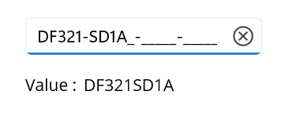
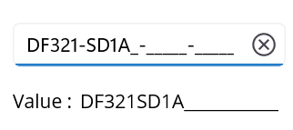
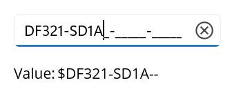
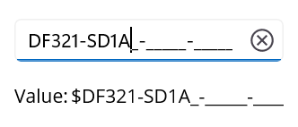

# Formatting Value in .NET MAUI Masked Entry

## Prerequisites

Before using the [SfMaskedEntry](https://help.syncfusion.com/cr/maui/Syncfusion.Maui.Inputs.SfMaskedEntry.html), ensure the following are set up:

1. Install the [Syncfusion.Maui.Inputs](https://www.nuget.org/packages/Syncfusion.Maui.Inputs) NuGet package in your .NET MAUI project.
2. Register the Syncfusion license in your application. Refer to the [Syncfusion licensing documentation](https://help.syncfusion.com/maui/licensing/overview) for more details.

    ```csharp
    using Syncfusion.Licensing;

    public class App : Application
    {
        public App()
        {
            // Replace the license key with your own.
            SyncfusionLicenseProvider.RegisterLicense("YOUR_LICENSE_KEY");
            InitializeComponent();
        }
    }
    ```

3. Register the Syncfusion core handler in the `CreateMauiApp` method of `MauiProgram.cs`:

    ```csharp
    using Syncfusion.Maui.Core.Hosting;

    public static class MauiProgram
    {
        public static MauiApp CreateMauiApp()
        {
            var builder = MauiApp.CreateBuilder();
            builder
                .UseMauiApp<App>()
                .ConfigureSyncfusionCore();
            return builder.Build();
        }
    }
    ```

4. Add the following namespace declaration to your XAML page and `using` directive to your C# files:

    ```xml
    xmlns:editors="clr-namespace:Syncfusion.Maui.Inputs;assembly=Syncfusion.Maui.Inputs"
    ```

    ```csharp
    using Syncfusion.Maui.Inputs;
    ```

For a step-by-step setup, refer to the [Getting Started](getting-started.md) documentation.

The [SfMaskedEntry](https://help.syncfusion.com/cr/maui/Syncfusion.Maui.Inputs.SfMaskedEntry.html) control allows you to format input values with prompt and literal characters defined in the mask expression by setting the [ValueMaskFormat](https://help.syncfusion.com/cr/maui/Syncfusion.Maui.Inputs.SfMaskedEntry.html#Syncfusion_Maui_Inputs_SfMaskedEntry_ValueMaskFormat) property. The default value of `ValueMaskFormat` is `MaskedEntryMaskFormat.IncludePromptAndLiterals`, which means the [Value](https://help.syncfusion.com/cr/maui/Syncfusion.Maui.Inputs.SfMaskedEntry.html#Syncfusion_Maui_Inputs_SfMaskedEntry_Value) property of the control includes the characters typed by the user and any prompt or literal characters in the input.

The available formatting options are:

- `ExcludePromptAndLiterals` — Returns only the characters typed by the user.
- `IncludePrompt` — Returns the typed characters and the prompt characters, but excludes the literal characters.
- `IncludeLiterals` — Returns the typed characters and the literal characters, but excludes the prompt characters.
- `IncludePromptAndLiterals` — Returns the typed characters, prompt characters, and literal characters.

> **Note:** The `ValueMaskFormat` property applies to the `Simple` [MaskType](https://help.syncfusion.com/cr/maui/Syncfusion.Maui.Inputs.SfMaskedEntry.html#Syncfusion_Maui_Inputs_SfMaskedEntry_MaskType). When using `RegEx`, the mask is treated as a regular expression and the formatting options do not apply.

In the examples below, the mask `>AAAAA-AAAAA-AAAAA-AAAAA` is used, where `>` converts the following characters to uppercase and `A` represents an alphanumeric character (letter or digit) that is required. The literal `-` separates the segments.

## ExcludePromptAndLiterals

Configure the Masked Entry to exclude prompt and literal characters, preserving only the characters typed by the user. With this option, the resulting `Value` is `DF321SD1A` (the literals `-` and any unfilled prompt slots `_` are removed).




<editors:SfMaskedEntry x:Name="maskedEntry" WidthRequest="200"
                            MaskType="Simple"
                            ClearButtonVisibility="WhileEditing"
                            Mask=">AAAAA-AAAAA-AAAAA-AAAAA"
                            Value="DF321SD1A"
                            ValueMaskFormat="ExcludePromptAndLiterals"/>




SfMaskedEntry maskedEntry = new SfMaskedEntry
{
    WidthRequest = 200,
    MaskType = MaskedEntryMaskType.Simple,
    ClearButtonVisibility = ClearButtonVisibility.WhileEditing,
    Mask = ">AAAAA-AAAAA-AAAAA-AAAAA",
    Value = "DF321SD1A",
    ValueMaskFormat = MaskedEntryMaskFormat.ExcludePromptAndLiterals
};




The resulting `Value` property is `DF321SD1A`.



## IncludePrompt

Configure the Masked Entry to preserve typed and prompt characters while excluding the literal characters. With this option, the resulting `Value` is `DF321SD1A`.




<editors:SfMaskedEntry x:Name="maskedEntry" WidthRequest="200"
                            MaskType="Simple"
                            ClearButtonVisibility="WhileEditing"
                            Mask=">AAAAA-AAAAA-AAAAA-AAAAA"
                            Value="DF321SD1A"
                            ValueMaskFormat="IncludePrompt"/>




SfMaskedEntry maskedEntry = new SfMaskedEntry
{
    WidthRequest = 200,
    MaskType = MaskedEntryMaskType.Simple,
    ClearButtonVisibility = ClearButtonVisibility.WhileEditing,
    Mask = ">AAAAA-AAAAA-AAAAA-AAAAA",
    Value = "DF321SD1A",
    ValueMaskFormat = MaskedEntryMaskFormat.IncludePrompt
};







## IncludeLiterals

Configure the Masked Entry to keep typed and literal characters while excluding prompt characters. With this option, the resulting `Value` is `DF321-SD1A` .




<editors:SfMaskedEntry x:Name="maskedEntry" WidthRequest="200"
                            MaskType="Simple"
                            ClearButtonVisibility="WhileEditing"
                            Mask=">AAAAA-AAAAA-AAAAA-AAAAA"
                            Value="DF321SD1A"
                            ValueMaskFormat="IncludeLiterals"/>




SfMaskedEntry maskedEntry = new SfMaskedEntry
{
    WidthRequest = 200,
    MaskType = MaskedEntryMaskType.Simple,
    ClearButtonVisibility = ClearButtonVisibility.WhileEditing,
    Mask = ">AAAAA-AAAAA-AAAAA-AAAAA",
    Value = "DF321SD1A",
    ValueMaskFormat = MaskedEntryMaskFormat.IncludeLiterals
};







## IncludePromptAndLiterals

Configure the Masked Entry to maintain typed, prompt, and literal characters in the input. This is the default option. The resulting `Value` is `DF321-SD1A`.




<editors:SfMaskedEntry x:Name="maskedEntry" WidthRequest="200"
                            MaskType="Simple"
                            ClearButtonVisibility="WhileEditing"
                            Mask=">AAAAA-AAAAA-AAAAA-AAAAA"
                            Value="DF321SD1A"
                            ValueMaskFormat="IncludePromptAndLiterals"/>




SfMaskedEntry maskedEntry = new SfMaskedEntry
{
    WidthRequest = 200,
    MaskType = MaskedEntryMaskType.Simple,
    ClearButtonVisibility = ClearButtonVisibility.WhileEditing,
    Mask = ">AAAAA-AAAAA-AAAAA-AAAAA",
    Value = "DF321SD1A",
    ValueMaskFormat = MaskedEntryMaskFormat.IncludePromptAndLiterals
};







## See Also

* [Getting Started with .NET MAUI Masked Entry](getting-started.md)
* [Basic Features in .NET MAUI Masked Entry](basic-features.md)
* [Validation in .NET MAUI Masked Entry](validation.md)
* [Events in .NET MAUI Masked Entry](events.md)
* [SfMaskedEntry API reference](https://help.syncfusion.com/cr/maui/Syncfusion.Maui.Inputs.SfMaskedEntry.html)