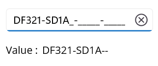
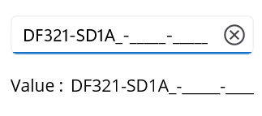

# Formatting value in .NET MAUI MaskedEntry

The [MaskedEntry](https://help.syncfusion.com/cr/maui/Syncfusion.Maui.Inputs.SfMaskedEntry.html) control allows you to format input values with prompt and literal characters defined in the mask expression by setting the [ValueMaskFormat](https://help.syncfusion.com/cr/maui/Syncfusion.Maui.Inputs.MaskedEntryMaskFormat.html) property. By default, the [Value](https://help.syncfusion.com/cr/maui/Syncfusion.Maui.Inputs.SfMaskedEntry.html#Syncfusion_Maui_Inputs_SfMaskedEntry_Value) property of the control includes the characters typed by the user and any prompt or literal characters in the input. The control provides several formatting options, which are listed as follows.

1. ExcludePromptAndLiterals
2. IncludePrompt
3. IncludeLiterals
4. IncludePromptAndLiterals

## Exclude prompts and literals

Set up the MaskedEntry to exclude prompt and literal characters, preserving only the typed characters.




<syncfusion:SfMaskedEntry WidthRequest="200"
                          MaskType="Simple"
                          Mask=">AAAAA-AAAAA-AAAAA-AAAAA"
                          Value="DF321SD1A"
                          ValueMaskFormat="ExcludePromptAndLiterals"/>




maskedEntry.WidthRequest = "200";
maskedEntry.MaskType = MaskedEntryMaskType.Simple;
maskedEntry.Mask = ">AAAAA-AAAAA-AAAAA-AAAAA";
maskedEntry.Value = "DF321SD1A";
maskedEntry.ValueMaskFormat = MaskedEntryMaskFormat.ExcludePromptAndLiterals;




## Include prompts

Set up the MaskedEntry to preserve typed and prompt characters, excluding literals.




<syncfusion:SfMaskedEntry WidthRequest="200"
                          MaskType="Simple"
                          Mask=">AAAAA-AAAAA-AAAAA-AAAAA"
                          Value="DF321SD1A"
                          ValueMaskFormat="IncludePrompt"/>




maskedEntry.WidthRequest = "200";
maskedEntry.MaskType = MaskedEntryMaskType.Simple;
maskedEntry.Mask = ">AAAAA-AAAAA-AAAAA-AAAAA";
maskedEntry.Value = "DF321SD1A";
maskedEntry.ValueMaskFormat = MaskedEntryMaskFormat.IncludePrompt;




## Include literals

Keep typed and literal characters in the input but exclude prompt characters.




<syncfusion:SfMaskedEntry WidthRequest="200"
                          MaskType="Simple"
                          Mask=">AAAAA-AAAAA-AAAAA-AAAAA"
                          Value="DF321SD1A"
                          ValueMaskFormat="IncludeLiterals"/>




maskedEntry.WidthRequest = "200";
maskedEntry.MaskType = MaskedEntryMaskType.Simple;
maskedEntry.Mask = ">AAAAA-AAAAA-AAAAA-AAAAA";
maskedEntry.Value = "DF321SD1A";
maskedEntry.ValueMaskFormat = MaskedEntryMaskFormat.IncludeLiterals;




## Include prompts and literals

Maintain typed, prompt, and literal characters in the input.




<syncfusion:SfMaskedEntry WidthRequest="200"
                          MaskType="Simple"
                          Mask=">AAAAA-AAAAA-AAAAA-AAAAA"
                          Value="DF321SD1A"
                          ValueMaskFormat="IncludePromptAndLiterals"/>




maskedEntry.WidthRequest = "200";
maskedEntry.MaskType = MaskedEntryMaskType.Simple;
maskedEntry.Mask = ">AAAAA-AAAAA-AAAAA-AAAAA";
maskedEntry.Value = "DF321SD1A";
maskedEntry.ValueMaskFormat = MaskedEntryMaskFormat.IncludePromptAndLiterals;




