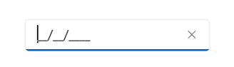
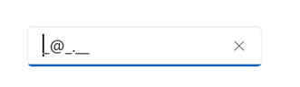
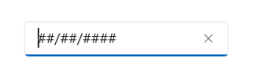

# Getting Started with MAUI Masked Entry (SfMaskedEntry)

This section explains you the steps required to configure a `SfMaskedEntry` control in a real-time scenario and provides a walk-through on some of the customization features available in `SfMaskedEntry` control.

## Creating an application using the .NET MAUI Masked Entry

This section explains the steps required to work with the `SfMaskedEntry` control for .NET MAUI.

## Adding a .NET MAUI Masked Entry reference

Syncfusion .NET MAUI controls are available in [Nuget.org](https://www.nuget.org/). To add [.NET MAUI Masked Entry] to your project, open the NuGet package manager in Visual Studio, search for [Syncfusion.Maui.Inputs](https://www.nuget.org/packages/Syncfusion.Maui.Inputs) and then install it.

## Handler registration 

 In the MauiProgram.cs file, register the handler for Syncfusion core.


using Microsoft.Maui;
using Microsoft.Maui.Hosting;
using Microsoft.Maui.Controls.Compatibility;
using Microsoft.Maui.Controls.Hosting;
using Microsoft.Maui.Controls.Xaml;
using Syncfusion.Maui.Core.Hosting;

namespace MaskedEntrySample
{
    public static class MauiProgram
    {
        public static MauiApp CreateMauiApp()
        {
            var builder = MauiApp.CreateBuilder();
            builder
            .UseMauiApp<App>()
            .ConfigureSyncfusionCore()
            .ConfigureFonts(fonts =>
            {
                fonts.AddFont("OpenSans-Regular.ttf", "OpenSansRegular");
            });

            return builder.Build();
        }      
    }
}   

 

## Adding the .NET MAUI Masked Entry control

Step 1: Add the NuGet to the project as discussed in the above reference section. 

Step 2: Add the namespace, as shown in the following code sample:





	<xmlns:syncfusion="clr-namespace:Syncfusion.Maui.Inputs;assembly=Syncfusion.Maui.Inputs"/>





	using Syncfusion.Maui.Inputs;





## Initialize Masked Entry

Now, add the `SfMaskedEntry` control with a required optimal name using the included namespace.





	<syncfusion:SfMaskedEntry x:Name="maskedentry" />
	




        maskedEntry = new SfMaskedEntry();




 ## Initialize MaskedEntry control using simple mask




        <syncfusion:SfMaskedEntry WidthRequest="200"
                                  MaskType="Simple"
                                  Mask="00/00/0000" />




        maskedEntry = new SfMaskedEntry();
        maskedEntry.Width = "200";
        maskedEntry.MaskType = MaskedTextBoxMaskType.Simple;
        maskedEntry.Mask = "00/00/0000";




## Initialize MaskedEntry control using RegEx mask




        <syncfusion:SfMaskedEntry WidthRequest="200"
                                  MaskType="RegEx"
                                  Mask="[A-Za-z0-9._%-]+@[A-Za-z0-9]+\.[A-Za-z]{2,3}" />




        maskedEntry = new SfMaskedEntry();
        maskedEntry.Width = "200";
        maskedEntry.MaskType = MaskedEntryMaskType.RegEx;
        maskedEntry.Mask = "[A-Za-z0-9._%-]+@[A-Za-z0-9]+\\.[A-Za-z]{2,3}";




## Setting the prompt character

Every single mask displays a prompt character ('_') in the absence of your input. You can customize this prompt character by using the `PromptChar` property.




        maskedEntry = new SfMaskedEntry();
        maskedEntry.Width = "200";
        maskedEntry.MaskType = MaskedEntryMaskType.Simple;
        maskedEntry.Mask = "00/00/0000";
        maskedEntry.PromptChar = '#';




## Setting the value

The `Value` property is used to set the input value for MaskedEntry control.




<syncfusion:SfMaskedEntry WidthRequest="200"
                          MaskType="Simple"
                          Mask="00/00/0000"
                          Value="12/02/2022" />




        maskedEntry = new SfMaskedEntry();
        maskedEntry.Width = "200";
        maskedEntry.MaskType = MaskedEntryMaskType.Simple;
        maskedEntry.Mask = "00/00/0000";
        maskedEntry.Value = "12/02/2022";




