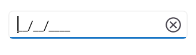
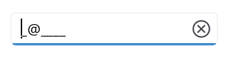
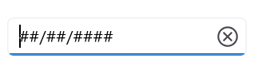
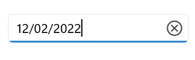

# Getting Started with .NET MAUI Masked Entry

This section guides you through setting up and configuring a [Masked Entry](https://help.syncfusion.com/cr/maui/Syncfusion.Maui.Inputs.SfMaskedEntry.html) in your .NET MAUI application. Follow the steps below to add a basic Masked Entry to your project.

To quickly get started with the .NET MAUI Masked Entry, watch this video.






## Prerequisites

Before proceeding, ensure the following are in place:

1. Install [.NET 8 SDK](https://dotnet.microsoft.com/en-us/download/dotnet/8.0) or later.
2. Set up a .NET MAUI environment with Visual Studio 2022 (v17.8 or later).

## Step 1: Create a New MAUI Project

1. Go to **File > New > Project** and choose the **.NET MAUI App** template.
2. Name the project and choose a location. Then, click **Next**.
3. Select the .NET framework version and click **Create**.

## Step 2: Install the Syncfusion® MAUI Inputs NuGet Package

1. In **Solution Explorer**, right-click the project and choose **Manage NuGet Packages**.
2. Search for [Syncfusion.Maui.Inputs](https://www.nuget.org/packages/Syncfusion.Maui.Inputs) and install the latest version.
3. Ensure the necessary dependencies are installed correctly, and the project is restored.

## Step 3: Register the handler

 [Syncfusion.Maui.Core](https://www.nuget.org/packages/Syncfusion.Maui.Core) nuget is a dependent package for all Syncfusion® controls of .NET MAUI. In the MauiProgram.cs file, register the handler for Syncfusion® core.


using Microsoft.Maui;
using Microsoft.Maui.Hosting;
using Microsoft.Maui.Controls.Compatibility;
using Microsoft.Maui.Controls.Hosting;
using Microsoft.Maui.Controls.Xaml;
using Syncfusion.Maui.Core.Hosting;

namespace MaskedEntrySample
{
    public static class MauiProgram
    {
        public static MauiApp CreateMauiApp()
        {
            var builder = MauiApp.CreateBuilder();
            builder
            .UseMauiApp<App>()
            .ConfigureSyncfusionCore()
            .ConfigureFonts(fonts =>
            {
                fonts.AddFont("OpenSans-Regular.ttf", "OpenSansRegular");
            });

            return builder.Build();
        }      
    }
}   

 

## Step 4: Add a Basic Masked Entry

Step 1: Add the namespace as shown in the following code sample.





	<xmlns:syncfusion="clr-namespace:Syncfusion.Maui.Inputs;assembly=Syncfusion.Maui.Inputs"/>





	using Syncfusion.Maui.Inputs;





Step 2: Add the [SfMaskedEntry](https://help.syncfusion.com/cr/maui/Syncfusion.Maui.Inputs.SfMaskedEntry.html) control with a required optimal name using the included namespace.





	<syncfusion:SfMaskedEntry x:Name="maskedentry" />
	




        maskedEntry = new SfMaskedEntry();








## Prerequisites

Before proceeding, ensure the following are set up:

1. Install [.NET 8 SDK](https://dotnet.microsoft.com/en-us/download/dotnet/8.0) or later is installed.
2. Set up a .NET MAUI environment with Visual Studio Code.
3. Ensure that the .NET MAUI extension is installed and configured as described [here.](https://learn.microsoft.com/en-us/dotnet/maui/get-started/installation?view=net-maui-8.0&tabs=visual-studio-code)

## Step 1: Create a New MAUI Project

1. Open the Command Palette by pressing **Ctrl+Shift+P** and type **.NET:New Project** and press Enter.
2. Choose the **.NET MAUI App** template.
3. Select the project location, type the project name and press Enter.
4. Then choose **Create project**

## Step 2: Install the Syncfusion® MAUI Inputs NuGet Package

1. Press <kbd>Ctrl</kbd> + <kbd>`</kbd> (backtick) to open the integrated terminal in Visual Studio Code.
2. Ensure you're in the project root directory where your .csproj file is located.
3. Run the command `dotnet add package Syncfusion.Maui.Inputs` to install the Syncfusion® .NET MAUI Inputs package.
4. To ensure all dependencies are installed, run `dotnet restore`.

## Step 3: Register the handler

 [Syncfusion.Maui.Core](https://www.nuget.org/packages/Syncfusion.Maui.Core) nuget is a dependent package for all Syncfusion® controls of .NET MAUI. In the MauiProgram.cs file, register the handler for Syncfusion® core.


using Microsoft.Maui;
using Microsoft.Maui.Hosting;
using Microsoft.Maui.Controls.Compatibility;
using Microsoft.Maui.Controls.Hosting;
using Microsoft.Maui.Controls.Xaml;
using Syncfusion.Maui.Core.Hosting;

namespace MaskedEntrySample
{
    public static class MauiProgram
    {
        public static MauiApp CreateMauiApp()
        {
            var builder = MauiApp.CreateBuilder();
            builder
            .UseMauiApp<App>()
            .ConfigureSyncfusionCore()
            .ConfigureFonts(fonts =>
            {
                fonts.AddFont("OpenSans-Regular.ttf", "OpenSansRegular");
            });

            return builder.Build();
        }      
    }
}   

 

## Step 4: Add a Basic Masked Entry

Step 1: Add the NuGet to the project as discussed in the above reference section. 

Step 2: Add the namespace as shown in the following code sample.





	<xmlns:syncfusion="clr-namespace:Syncfusion.Maui.Inputs;assembly=Syncfusion.Maui.Inputs"/>





	using Syncfusion.Maui.Inputs;





Step 3: Add the [SfMaskedEntry](https://help.syncfusion.com/cr/maui/Syncfusion.Maui.Inputs.SfMaskedEntry.html) control with a required optimal name using the included namespace.





	<syncfusion:SfMaskedEntry x:Name="maskedentry" />
	




        maskedEntry = new SfMaskedEntry();









## Prerequisites

Before proceeding, ensure the following are set up:

1. Ensure you have the latest version of JetBrains Rider.
2. Install [.NET 8 SDK](https://dotnet.microsoft.com/en-us/download/dotnet/8.0) or later is installed.
3. Make sure the MAUI workloads are installed and configured as described [here.](https://www.jetbrains.com/help/rider/MAUI.html#before-you-start)

## Step 1: Create a new .NET MAUI Project

1. Go to **File > New Solution,** Select .NET (C#) and choose the .NET MAUI App template.
2. Enter the Project Name, Solution Name, and Location.
3. Select the .NET framework version and click Create.

## Step 2: Install the Syncfusion® MAUI Inputs NuGet Package

1. In **Solution Explorer,** right-click the project and choose **Manage NuGet Packages.**
2. Search for [Syncfusion.Maui.Inputs](https://www.nuget.org/packages/Syncfusion.Maui.Inputs/) and install the latest version.
3. Ensure the necessary dependencies are installed correctly, and the project is restored. If not, Open the Terminal in Rider and manually run: `dotnet restore`

## Step 3: Register the handler

 [Syncfusion.Maui.Core](https://www.nuget.org/packages/Syncfusion.Maui.Core) nuget is a dependent package for all Syncfusion® controls of .NET MAUI. In the MauiProgram.cs file, register the handler for Syncfusion® core.


using Microsoft.Maui;
using Microsoft.Maui.Hosting;
using Microsoft.Maui.Controls.Compatibility;
using Microsoft.Maui.Controls.Hosting;
using Microsoft.Maui.Controls.Xaml;
using Syncfusion.Maui.Core.Hosting;

namespace MaskedEntrySample
{
    public static class MauiProgram
    {
        public static MauiApp CreateMauiApp()
        {
            var builder = MauiApp.CreateBuilder();
            builder
            .UseMauiApp<App>()
            .ConfigureSyncfusionCore()
            .ConfigureFonts(fonts =>
            {
                fonts.AddFont("OpenSans-Regular.ttf", "OpenSansRegular");
            });

            return builder.Build();
        }      
    }
}   

 

## Step 4: Add a Basic Masked Entry

Step 1: Add the NuGet to the project as discussed in the above reference section. 

Step 2: Add the namespace as shown in the following code sample.





	<xmlns:syncfusion="clr-namespace:Syncfusion.Maui.Inputs;assembly=Syncfusion.Maui.Inputs"/>





	using Syncfusion.Maui.Inputs;





Step 3: Add the [SfMaskedEntry](https://help.syncfusion.com/cr/maui/Syncfusion.Maui.Inputs.SfMaskedEntry.html) control with a required optimal name using the included namespace.





	<syncfusion:SfMaskedEntry x:Name="maskedentry" />
	




        maskedEntry = new SfMaskedEntry();








## Step 5: Adding Mask to the Masked Entry

### Initialize MaskedEntry control using simple mask




<syncfusion:SfMaskedEntry WidthRequest="200"
                          MaskType="Simple"
                          Mask="00/00/0000" />




maskedEntry = new SfMaskedEntry();
maskedEntry.WidthRequest = "200";
maskedEntry.MaskType = MaskedEntryMaskType.Simple;
maskedEntry.Mask = "00/00/0000";




### Initialize MaskedEntry control using RegEx mask




<syncfusion:SfMaskedEntry WidthRequest="200"
                          MaskType="RegEx"
                          Mask="[A-Za-z0-9._%-]+@[A-Za-z0-9]+.[A-Za-z]{2,3}" />




maskedEntry = new SfMaskedEntry();
maskedEntry.WidthRequest = "200";
maskedEntry.MaskType = MaskedEntryMaskType.RegEx;
maskedEntry.Mask = "[A-Za-z0-9._%-]+@[A-Za-z0-9]+.[A-Za-z]{2,3}";




## Setting the prompt character

Every single mask displays a prompt character ('_') in the absence of your input. Customize this prompt character by using the [PromptChar](https://help.syncfusion.com/cr/maui/Syncfusion.Maui.Inputs.SfMaskedEntry.html#Syncfusion_Maui_Inputs_SfMaskedEntry_PromptChar) property.




<syncfusion:SfMaskedEntry WidthRequest="200"
                          MaskType="Simple"
                          Mask="00/00/0000"
                          PromptChar="#" />
                          



maskedEntry = new SfMaskedEntry();
maskedEntry.WidthRequest = "200";
maskedEntry.MaskType = MaskedEntryMaskType.Simple;
maskedEntry.Mask = "00/00/0000";
maskedEntry.PromptChar = '#';




## Setting the value

The [Value](https://help.syncfusion.com/cr/maui/Syncfusion.Maui.Inputs.SfMaskedEntry.html#Syncfusion_Maui_Inputs_SfMaskedEntry_Value) property sets the input value for the MaskedEntry control.




<syncfusion:SfMaskedEntry WidthRequest="200"
                          MaskType="Simple"
                          Mask="00/00/0000"
                          Value="12/02/2022" />




maskedEntry = new SfMaskedEntry();
maskedEntry.WidthRequest = "200";
maskedEntry.MaskType = MaskedEntryMaskType.Simple;
maskedEntry.Mask = "00/00/0000";
maskedEntry.Value = "12/02/2022";




N> 
Get the complete getting started sample from the [GitHub](https://github.com/SyncfusionExamples/maui-maskedentry-samples) link.

N> You can refer to our [.NET MAUI Masked Entry](https://www.syncfusion.com/maui-controls/maui-masked-entry) feature tour page for its groundbreaking feature representations. You can also explore our [.NET MAUI Masked Entry Example](https://github.com/syncfusion/maui-demos/tree/master/MAUI/Inputs/SampleBrowser.Maui.Inputs/Samples/MaskedEntry) that shows you how to render the Masked Entry in .NET MAUI.

