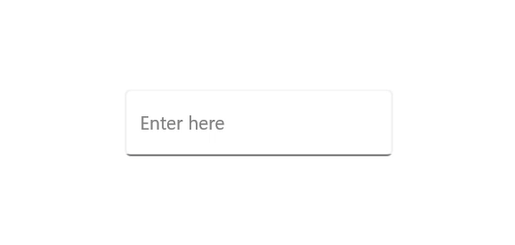

# Hiding Prompt Characters in .NET MAUI Masked Entry (SfMaskedEntry)

When the HidePromptOnLeave property is set to true, prompt characters are ignored when the control loses focus. Again, the prompt characters are restored when the control is focused.





<editors:SfMaskedEntry x:Name="maskedEntry" 
                       WidthRequest="200";
                       Placeholder="Enter here"
                       MaskType="Simple"
                       Mask="00/00/0000" 
                       PromptChar="#"
                       HidePromptOnLeave="True" />





SfMaskedEntry maskedEntry = new SfMaskedEntry();
maskedEntry.WidthRequest = 200;
maskedEntry.Placeholder="Enter here";
maskedEntry.MaskType = MaskedEntryMaskType.Simple;
maskedEntry.Mask = "00/00/0000";
maskedEntry.PromptChar = '#';
maskedEntry.HidePromptOnLeave = true;





