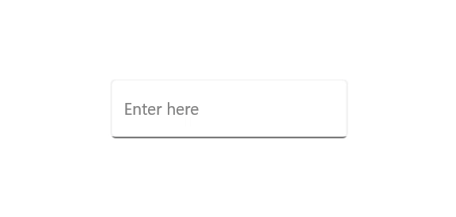

# Hiding Prompt Characters in .NET MAUI Masked Entry

## Prerequisites

Before using the [SfMaskedEntry](https://help.syncfusion.com/cr/maui/Syncfusion.Maui.Inputs.SfMaskedEntry.html), ensure the following NuGet package is installed in your .NET MAUI project:

- `Syncfusion.Maui.Inputs`

For a step-by-step setup, refer to the [Getting Started](Getting-Started.md) documentation.

## Setting HidePromptOnLeave

The [HidePromptOnLeave](https://help.syncfusion.com/cr/maui/Syncfusion.Maui.Inputs.SfMaskedEntry.html#Syncfusion_Maui_Inputs_SfMaskedEntry_HidePromptOnLeave) property of type `bool` controls whether unfilled prompt positions are displayed when the control does not have focus. The default value is `false`, which means prompt characters are always shown. When set to `true`, prompt characters are hidden when the control loses focus and restored when the control regains focus.

The control is considered to have lost focus when the user taps outside the entry, navigates to another input, or moves focus programmatically via the `Unfocused` event. To programmatically focus the entry and restore the prompt, call `maskedEntry.Focus()`.

> **Note:** Unlike setting [PromptChar](https://help.syncfusion.com/cr/maui/Syncfusion.Maui.Inputs.SfMaskedEntry.html#Syncfusion_Maui_Inputs_SfMaskedEntry_PromptChar) to a space character, `HidePromptOnLeave` only hides the prompt when the control is unfocused and does not affect the value of the unfilled positions.

The following example demonstrates how to hide prompt characters when the Masked Entry control loses focus:




<editors:SfMaskedEntry x:Name="maskedEntry"
                       Placeholder="Enter here"
                       MaskType="Simple"
                       Mask="00/00/0000"
                       PromptChar="#"
                       HidePromptOnLeave="True"/>




SfMaskedEntry maskedEntry = new SfMaskedEntry
{
    Placeholder = "Enter here",
    MaskType = MaskedEntryMaskType.Simple,
    Mask = "00/00/0000",
    PromptChar = '#',
    HidePromptOnLeave = true
};




The following GIF shows the `HidePromptOnLeave` behavior: prompt characters are visible while the control is focused, and hidden when the control loses focus.

## See Also

* [Getting Started](getting-started.md)
* [Basic Features](basic-features.md)
* [Formatting Value](formatting-value.md)