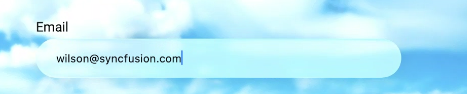

# Liquid Glass Effect in .NET MAUI Masked Entry

The Liquid Glass Effect introduces a modern, translucent design with adaptive color tinting and light refraction, creating a sleek, glass-like user experience that remains clear and accessible while maintaining readable contrast. This section explains how to enable and customize the effect in the Syncfusion® .NET MAUI Masked Entry (SfMaskedEntry) control.

## Prerequisites

Before using the [SfMaskedEntry](https://help.syncfusion.com/cr/maui/Syncfusion.Maui.Inputs.SfMaskedEntry.html), Install the [Syncfusion.Maui.Inputs](https://www.nuget.org/packages/Syncfusion.Maui.Inputs) and [Syncfusion.Maui.Core](https://www.nuget.org/packages/Syncfusion.Maui.Core) NuGet packages in your .NET MAUI project. The `Syncfusion.Maui.Core` package is required for the [SfGlassEffectView](https://help.syncfusion.com/cr/maui/Syncfusion.Maui.Core.SfGlassEffectView.html) container used to host the Liquid Glass Effect.

For a step-by-step setup, refer to the [Getting Started](Getting-Started.md) documentation.

N>
* The Liquid Glass Effect is supported only on **.NET 10** targeting **macOS 26 or higher** and **iOS 26 or higher**.
* It is not supported on Android or Windows.

## Apply liquid glass effect

Follow these steps to enable and configure the Liquid Glass Effect in the Masked Entry control:

### Step 1: Wrap the control inside the glass effect view

To apply the Liquid Glass Effect to the Syncfusion® .NET MAUI [SfMaskedEntry](https://help.syncfusion.com/cr/maui/Syncfusion.Maui.Inputs.SfMaskedEntry.html) control, wrap it inside the [SfGlassEffectView](https://help.syncfusion.com/cr/maui/Syncfusion.Maui.Core.SfGlassEffectView.html) container.

For more details, refer to the [Liquid Glass Getting Started documentation](https://help.syncfusion.com/maui/liquid-glass-ui/getting-started).

### Step 2: Customize the background

To achieve a glass-like background in the Masked Entry, set the `Background` property to `Transparent`. The background will then be treated as a tinted color, ensuring a consistent glass effect across the controls.

### Step 3: Configure the glass effect

The [SfGlassEffectView](https://help.syncfusion.com/cr/maui/Syncfusion.Maui.Core.SfGlassEffectView.html) exposes the following key properties:

- `EffectType`: Defines the glass style. The available values are `Regular` and `Clear`. The default value is `Regular`.
- `CornerRadius`: The corner radius of the glass container.
- `EnableShadowEffect`: Indicates whether a drop shadow is rendered behind the glass container. The default value is `false`.

The following code snippet demonstrates how to apply the Liquid Glass Effect to the [SfMaskedEntry](https://help.syncfusion.com/cr/maui/Syncfusion.Maui.Inputs.SfMaskedEntry.html) control:




<Grid>
    <Image Source="Wallpaper.png" Aspect="AspectFill"/>
    <core:SfGlassEffectView CornerRadius="20"
                            HeightRequest="40"
                            EffectType="Regular"
                            EnableShadowEffect="True">
        <inputs:SfMaskedEntry WidthRequest="200"
                              Background="Transparent"
                              ClearButtonVisibility="WhileEditing"
                              MaskType="RegEx"
                              Mask="[A-Za-z0-9._%-]+@[A-Za-z0-9]+\.[A-Za-z]{2,3}"/>
    </core:SfGlassEffectView>
</Grid>




using Syncfusion.Maui.Core;
using Syncfusion.Maui.Inputs;

var grid = new Grid();

var image = new Image
{
    Source = "Wallpaper.png",
    Aspect = Aspect.AspectFill
};
grid.Children.Add(image);

var glassEffect = new SfGlassEffectView
{
    CornerRadius = 20,
    HeightRequest = 40,
    EffectType = LiquidGlassEffectType.Regular,
    EnableShadowEffect = true
};

var maskedEntry = new SfMaskedEntry
{
    WidthRequest = 200,
    ClearButtonVisibility = ClearButtonVisibility.WhileEditing,
    MaskType = MaskedEntryMaskType.RegEx,
    Background = Colors.Transparent,
    Mask = "[A-Za-z0-9._%-]+@[A-Za-z0-9]+\\.[A-Za-z]{2,3}"
};

glassEffect.Content = maskedEntry;
grid.Children.Add(glassEffect);
this.Content = grid;




The following screenshot illustrates the `SfMaskedEntry` within an `SfGlassEffectView` container using the Liquid Glass Effect. The Masked Entry renders with a glass-like background, while the underlying wallpaper remains visible through the control.

## See Also

* [Basic Features](Basic-Features.md)
* [Mask Types](Mask-Types.md)