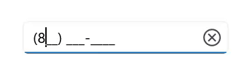
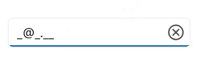

# Mask Types in .NET MAUI MaskedEntry

Each [MaskType](https://help.syncfusion.com/cr/maui/Syncfusion.Maui.Inputs.SfMaskedEntry.html#Syncfusion_Maui_Inputs_SfMaskedEntry_MaskType) consists of different mask elements combined to form a mask expression. Based on complexity and usage, mask types are classified as:

1. Simple
2. RegEx

## Simple

Expressions generated with letters, digits, and special characters fall under this category, mainly used for fixed-length inputs like phone numbers.

### Simple Mask Elements

<table>
<tr>
<th>
Elements</th><th>
Description</th></tr>
<tr>
<td>
0</td><td>
Digit, required. This element accepts any single digit between 0 and 9.</td></tr>
<tr>
<td>
9</td><td>
Digit or space, optional.</td></tr>
<tr>
<td>
#</td><td>
Digit or space, optional. Plus (+) and minus (-) signs are allowed.</td></tr>
<tr>
<td>
L</td><td>
Letter, required. Restricts input to the ASCII letters a-z and A-Z. This mask element is equivalent to [a-z A-Z] in regular expressions.</td></tr>
<tr>
<td>
?</td><td>
Letter, optional. Restricts input to the ASCII letters a-z and A-Z. This mask element is equivalent to [a-z A-Z]? in regular expressions.</td></tr>
<tr>
<td>
C</td><td>
Character, optional. </td></tr>
<tr>
<td>
A</td><td>
Alphanumeric, required.</td></tr>
<tr>
<td>
<</td><td>
Shift down. Converts all the characters that follow to lowercase.</td></tr>
<tr>
<td> > </td><td>
Shift up. Converts all the characters that follow to uppercase.</td></tr>
</table>




<editors:SfMaskedEntry WidthRequest="200"
                          ClearButtonVisibility="WhileEditing"
                          MaskType="Simple"
                          Mask="(000) 000-0000" />




SfMaskedEntry maskedEntry = new SfMaskedEntry();
maskedEntry.WidthRequest = 200;
maskedEntry.ClearButtonVisibility = ClearButtonVisibility.WhileEditing;
maskedEntry.MaskType = MaskedEntryMaskType.Simple;
maskedEntry.Mask = "(000) 000-0000";   




## RegEx

The expressions that are generated with regular expressions come under this group. For example, alpha numeric values [0-9A-Z].

### RegEx mask elements

<table>
<tr>
<th>
Elements</th><th>
Description</th></tr>
<tr>
<td>
[ABC]</td><td>
Accepts any single character included in the specified set of characters.</td></tr>
<tr>
<td>
[^ABC]</td><td>
Accepts any single character not included in the specified set of characters.</td></tr> 
<tr>
<td>
[0-9A-Z]</td><td>
Accepts any digit between 0-9 and character between A-Z.</td></tr>
<tr>
<td>
\d</td><td>
Accepts any digit. Same as [0-9].</td></tr>
<tr>
<td>
\D</td><td>
Accepts any non digit. Same as [^0-9].</td></tr>
<tr>
<td>
\w</td><td>
Accepts any  word character. \w is the same as [a-zA-Z_0-9].</td></tr>
<tr>
<td>
\W</td><td>
Accepts any  non word character. \W is the same as [^a-zA-Z_0-9].</td></tr>
<tr>
<td>
\s</td><td>
Accepts any  white space characters.</td></tr>
<tr>
<td>
\S</td><td>
Accepts any non white space characters.</td></tr>
<tr>
<td>
\S</td><td>
Accepts any non white space characters.</td></tr>
<tr>
<td>
(?=ABC)</td><td>
Matches a group after the main expression without including it in the result.</td></tr>
<tr>
<td>
(?!ABC)</td><td>
Specifies a group that cannot match after the main expression.</td></tr>
<tr>
<td>
{n}</td><td>
Accepts the input for n number of times.</td></tr>
<tr>
<td>
{n,}</td><td>
Accepts the input for 'n' and more than 'n' number of times. </td></tr>
<tr>
<td>
{n,m}</td><td>
Accepts the input for n minimum number of times and m maximum number of times.</td></tr>
<tr>
<td>
+</td><td>
Accepts one or more matches for the preceding character.</td></tr>
<tr>
<td>
*</td><td>
Accepts zero or more matches for the preceding character.</td></tr>
<tr>
<td>
?</td><td>
Optional input (Zero or one occurrence  of the matching input)</td></tr>
<tr>
<td>
|</td><td>
Acts like a Boolean OR. Matches the expression before or after the |.</td></tr>
<tr>
<td>
.</td><td>
Accepts any character. It can be changed based on culture</td></tr>
</table>




<editors:SfMaskedEntry WidthRequest="200"
                          ClearButtonVisibility="WhileEditing"
                          MaskType="RegEx"
                          Mask="[A-Za-z0-9._%-]+@[A-Za-z0-9]+\.[A-Za-z]{2,3}" />




SfMaskedEntry maskedEntry = new SfMaskedEntry();
maskedEntry.WidthRequest = 200;
maskedEntry.ClearButtonVisibility = ClearButtonVisibility.WhileEditing;
maskedEntry.MaskType = MaskedEntryMaskType.RegEx;
maskedEntry.Mask = "[A-Za-z0-9._%-]+@[A-Za-z0-9]+\.[A-Za-z]{2,3}";  




