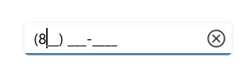
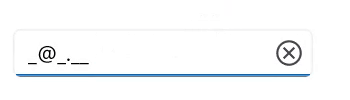

# Mask Types in .NET MAUI Masked Entry

The [MaskType](https://help.syncfusion.com/cr/maui/Syncfusion.Maui.Inputs.SfMaskedEntry.html#Syncfusion_Maui_Inputs_SfMaskedEntry_MaskType) property of type [MaskedEntryMaskType](https://help.syncfusion.com/cr/maui/Syncfusion.Maui.Inputs.MaskedEntryMaskType.html) defines the masking format applied to the user input. The default value is `MaskedEntryMaskType.Simple`.

The following table summarizes the differences between the available mask types:

| Mask type | When to use | Format syntax | [ValueMaskFormat](formatting-value.md) |
| --- | --- | --- | --- |
| `Simple` | Fixed-format input such as phone numbers, dates, or product keys. | Mask elements (for example, `0`, `9`, `L`, `>`). | Supported. |
| `RegEx` | Custom validation patterns such as email addresses, IP addresses, or custom rules. | Standard .NET regular expressions. | Not supported (the mask is treated as a regex). |

The available mask types are:

- [Simple](#simple) - fixed-format masks built from mask elements.
- [RegEx](#regex) - masks that use standard regular-expression patterns.

## Prerequisites

Before using the [SfMaskedEntry](https://help.syncfusion.com/cr/maui/Syncfusion.Maui.Inputs.SfMaskedEntry.html), ensure the following NuGet package is installed in your .NET MAUI project:

- `Syncfusion.Maui.Inputs`

For a step-by-step setup, refer to the [Getting Started](Getting-Started.md) documentation.

## Simple

Masks that use a combination of letters, digits, and special characters fall into the Simple group. Simple masks are mainly used for fixed-length inputs, such as phone numbers, dates, or product keys. The mask is built from the mask elements listed below.

The [PromptChar](basic-features.md#setting-promptchar) and [ValueMaskFormat](formatting-value.md) properties are only supported by the `Simple` mask type.

### Simple mask elements

<table>
<tr>
<th>
Elements</th><th>
Description</th></tr>
<tr>
<td>
0</td><td>
Digit, required. This element accepts any single digit between 0 and 9.</td></tr>
<tr>
<td>
9</td><td>
Digit or space, optional. This element does not allow sign characters.</td></tr>
<tr>
<td>
#</td><td>
Digit or space, optional. Plus (+) and minus (-) signs are allowed.</td></tr>
<tr>
<td>
L</td><td>
Letter, required. Restricts input to the ASCII letters a-z and A-Z. This mask element is equivalent to <code>[a-zA-Z]</code> in regular expressions.</td></tr>
<tr>
<td>
?</td><td>
Letter, optional. Restricts input to the ASCII letters a-z and A-Z. This mask element is equivalent to <code>[a-zA-Z]?</code> in regular expressions.</td></tr>
<tr>
<td>
C</td><td>
Character, optional. Accepts any printable ASCII character.</td></tr>
<tr>
<td>
A</td><td>
Alphanumeric, required. Accepts any digit (0-9) or ASCII letter (a-z, A-Z).</td></tr>
<tr>
<td>
&lt;</td><td>
Shift down. Converts all the characters that follow to lowercase.</td></tr>
<tr>
<td>
&gt;</td><td>
Shift up. Converts all the characters that follow to uppercase.</td></tr>
</table>

### Simple mask example

The following example formats input as a U.S. phone number using the Simple mask `(000) 000-0000`:




<editors:SfMaskedEntry WidthRequest="200"
                          ClearButtonVisibility="WhileEditing"
                          MaskType="Simple"
                          Mask="(000) 000-0000"/>




SfMaskedEntry maskedEntry = new SfMaskedEntry();
maskedEntry.WidthRequest = 200;
maskedEntry.ClearButtonVisibility = ClearButtonVisibility.WhileEditing;
maskedEntry.MaskType = MaskedEntryMaskType.Simple;
maskedEntry.Mask = "(000) 000-0000";




The mask renders the input as `(123) 456-7890` when the user types the digits `1234567890`.

The following example uses the `>` shift modifier to convert input to uppercase:

```XAML
<editors:SfMaskedEntry WidthRequest="200"
                       MaskType="Simple"
                       Mask=">AAAA-AAAA"/>
```

Typing `abcd1234` is rendered as `ABCD-1234`.



## RegEx

RegEx masks use standard regular-expression patterns to validate input, for example `[0-9A-Z]` for alphanumeric values or `[A-Za-z0-9._%-]+@[A-Za-z0-9]+\.[A-Za-z]{2,3}` for an email address.

> **Note:** When `MaskType` is `RegEx`, the [ValueMaskFormat](formatting-value.md) property is not applied because the mask is treated as a regular expression.

### RegEx mask elements

The following table lists the most common regular-expression elements supported by the RegEx mask type:

<table>
<tr>
<th>
Elements</th><th>
Description</th></tr>
<tr>
<td>
[ABC]</td><td>
Accepts any single character included in the specified set of characters.</td></tr>
<tr>
<td>
[^ABC]</td><td>
Accepts any single character not included in the specified set of characters.</td></tr> 
<tr>
<td>
[0-9A-Z]</td><td>
Accepts any digit between 0-9 and character between A-Z.</td></tr>
<tr>
<td>
\d</td><td>
Accepts any digit. Same as [0-9].</td></tr>
<tr>
<td>
\D</td><td>
Accepts any non digit. Same as [^0-9].</td></tr>
<tr>
<td>
\w</td><td>
Accepts any  word character. \w is the same as [a-zA-Z_0-9].</td></tr>
<tr>
<td>
\W</td><td>
Accepts any  non word character. \W is the same as [^a-zA-Z_0-9].</td></tr>
<tr>
<td>
\s</td><td>
Accepts any  white space characters.</td></tr>
<tr>
<td>
\S</td><td>
Accepts any non white space characters.</td></tr>
<tr>
<td>
\S</td><td>
Accepts any non white space characters.</td></tr>
<tr>
<td>
(?=ABC)</td><td>
Matches a group after the main expression without including it in the result.</td></tr>
<tr>
<td>
(?!ABC)</td><td>
Specifies a group that cannot match after the main expression.</td></tr>
<tr>
<td>
{n}</td><td>
Accepts the input for n number of times.</td></tr>
<tr>
<td>
{n,}</td><td>
Accepts the input for 'n' and more than 'n' number of times. </td></tr>
<tr>
<td>
{n,m}</td><td>
Accepts the input for n minimum number of times and m maximum number of times.</td></tr>
<tr>
<td>
+</td><td>
Accepts one or more matches for the preceding character.</td></tr>
<tr>
<td>
*</td><td>
Accepts zero or more matches for the preceding character.</td></tr>
<tr>
<td>
?</td><td>
Optional input (Zero or one occurrence  of the matching input)</td></tr>
<tr>
<td>
|</td><td>
Acts like a Boolean OR. Matches the expression before or after the |.</td></tr>
<tr>
<td>
.</td><td>
Accepts any character. It can be changed based on culture</td></tr>
</table>

### RegEx mask example

The following example validates an email address using the RegEx mask `[A-Za-z0-9._%-]+@[A-Za-z0-9]+\.[A-Za-z]{2,3}`:




<editors:SfMaskedEntry WidthRequest="200"
                       ClearButtonVisibility="WhileEditing"
                       MaskType="RegEx"
                       Mask="[A-Za-z0-9._%-]+@[A-Za-z0-9]+\.[A-Za-z]{2,3}"/>




SfMaskedEntry maskedEntry = new SfMaskedEntry();
maskedEntry.WidthRequest = 200;
maskedEntry.ClearButtonVisibility = ClearButtonVisibility.WhileEditing;
maskedEntry.MaskType = MaskedEntryMaskType.RegEx;
maskedEntry.Mask = "[A-Za-z0-9._%-]+@[A-Za-z0-9]+\\.[A-Za-z]{2,3}";




The mask accepts strings such as `user@example.com` and rejects incomplete or malformed values.



## See Also

* [Getting Started](getting-started.md)
* [Basic Features](basic-features.md)
* [Formatting Value](formatting-value.md)
* [Validation](validation.md)