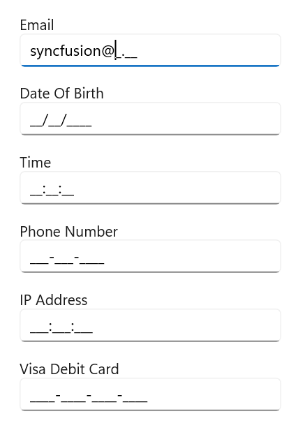

# .NET MAUI MaskedEntry Overview

The [.NET MAUI MaskedEntry](https://help.syncfusion.com/cr/maui/Syncfusion.Maui.Inputs.SfMaskedEntry.html) is an advanced version of the input control that restricts input of certain characters, text, and numbers by using a mask pattern. This control creates a template for providing information such as telephone numbers, email IDs, IP addresses, product keys, and more.

## Business use cases

- Form-based applications that require **structured input such as phone numbers, email addresses, or identification numbers**.  
- Enterprise applications that enforce **validated and formatted data entry for critical fields**.  
- Financial and business systems that require **standardized input formats for codes, keys, or account numbers**.  
- Data entry applications that need **input validation and formatting to improve data accuracy and consistency**.  

## Key features

- **Mask type support** allows defining fixed or variable length input patterns using simple or regular expression masks.  
- **Prompt character customization** allows setting default placeholder characters when input is not provided.  
- **Value handling support** allows entering values and performing clipboard operations based on configured formats.  
- **Value mask format support** allows controlling how values are stored and displayed, including prompt characters and literals.  
- **UI customization support** allows modifying the appearance of the control to match application design.  

## Globalization

The following table summarizes the globalization support available in the [SfMaskedEntry](https://www.syncfusion.com/maui-controls/maui-masked-entry) control.

 Full Support   
 Not Applicable

<table>
<tr>
<th align="center">Control</th>
<th align="center">Localization</th>
<th align="center">RTL</th>
<th align="center">Time zone</th>
<th align="center">Screen reader</th>
<th align="center">Keyboard navigation</th>
</tr>
<tr>
<td><a href="/maui/masked-entry/overview">Masked Entry</a></td>
<td align="center"></td>
<td align="center"></td>
<td align="center"></td>
<td align="center"></td>
<td align="center"></td>
</tr> 
</table>

## Related controls

- **[ComboBox](https://help.syncfusion.com/maui/combobox/overview)** for selecting values from predefined lists with optional input.
- **[DataForm](https://help.syncfusion.com/maui/dataform/overview)** for integrating masked input fields within forms.  
- **[TextInputLayout](https://help.syncfusion.com/maui/textinputlayout/overview)** for enhancing input fields with labels and validation UI.

## Next steps

Explore further resources:

- [Getting Started](https://help.syncfusion.com/maui/masked-entry/getting-started) - step-by-step guide to begin using the MaskedEntry control.  
- [Mask Types](https://help.syncfusion.com/maui/masked-entry/mask-types) - configure mask patterns and input formats.  
- [Features](https://help.syncfusion.com/maui/masked-entry/basic-features) - built‑in options for validation, placeholders, and easy formatting.
- [UI Kit](https://www.syncfusion.com/demos/maui#maui-ui-control) - explore interactive demos and ready‑made UI examples.

## Learnings

<!-- Card 1 -->
<a href="https://www.syncfusion.com/blogs/category/net-maui" class="form-card" target="_blank">
  

    <h3 class="form-title">Explore Blogs</h3>
    

      Read insights, tutorials, and developer journeys.
    

  

</a>
<!-- Card 2 -->
<a href="https://support.syncfusion.com/kb/cross-platforms/category/76" class="form-card" target="_blank">
  

    <h3 class="form-title">Explore KB's</h3>
    

      Find quick solutions and step‑by‑step guidance.
    

  

</a>
<!-- Card 3 -->
<a href="https://www.syncfusion.com/maui-controls/maui-masked-entry" class="form-card" target="_blank">
  

    <h3 class="form-title">Feature Tour</h3>
    

      Walk through highlights and core capabilities.
    

  

</a>
<!-- Card 4 -->
<a href="https://www.syncfusion.com/tutorial-videos/maui/masked-entry" class="form-card" target="_blank">
  

    <h3 class="form-title">Tutorial Videos</h3>
    

      Step‑by‑step guidance through video tutorials.
    

  

</a>