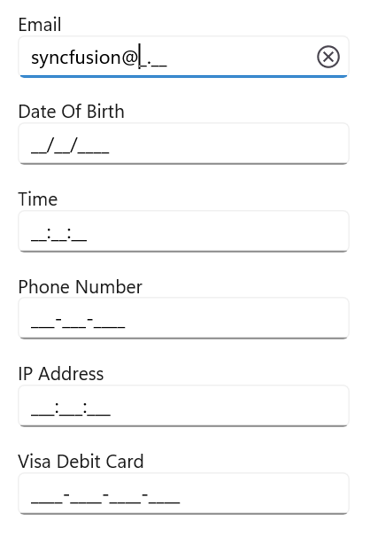

# .NET MAUI MaskedEntry Overview

The [.NET MAUI MaskedEntry](https://help.syncfusion.com/cr/maui/Syncfusion.Maui.Inputs.SfMaskedEntry.html) is an advanced input control that restricts the input of certain characters, text, and numbers through a mask pattern. This control facilitates templates for input types such as telephone numbers, email IDs, IP addresses, product keys, and more.

## Key Features

* **MaskTypes**: The input can be masked with fixed or variable lengths by setting the mask type to simple or regex.
* **PromptChar**: Customize the prompt characters used as default input characters in the absence of user input.
* **Value**: Enter values and perform clipboard operations in the control based on the ValueMaskFormat property.
* **ValueMaskFormat**: Set formatted values in the control using mask format values, including prompt, literals, or both.
* **Customization**: Customize the UI of the masked text box to fit specific design requirements.
