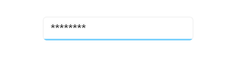

# Show Password Character in .NET MAUI Masked Entry (SfMaskedEntry)

## Password Char

The SfMaskedEntry control supports to work as a password text box when setting a character to the [PasswordChar](https://help.syncfusion.com/cr/maui/Syncfusion.Maui.Inputs.SfMaskedEntry.html#Syncfusion_Maui_Inputs_SfMaskedEntry_PasswordChar) property.



 <editors:SfMaskedEntry x:Name="maskedEntry"
                        WidthRequest="200"
                        Mask="\w+" 
                        MaskType="RegEx" 
                        PasswordChar="*"/>




SfMaskedEntry maskedEntry = new SfMaskedEntry();
maskedEntry.WidthRequest = 200;
maskedEntry.Mask = "\w+";
maskedEntry.MaskType = MaskedEntryMaskType.RegEx;
maskedEntry.PasswordChar = '*';




## Password Delay Duration

The [PasswordDelayDuration]() setting on a `MaskedEntry` controls how long the most-recently typed character remains visible before being replaced by the mask character. Use this to provide brief visual confirmation to users while preserving password privacy.




        <syncfusion:SfMaskedEntry
            x:Name="passwordEntry"
                    WidthRequest="200"
                    Mask="(000)-000-000" 
                    MaskType="Simple" 
                    PasswordChar="*"
                    PasswordDelayDuration="2000" />




