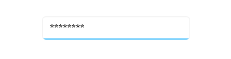
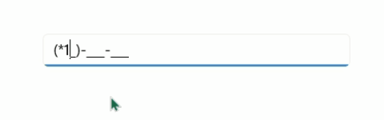

# Show Password Character in .NET MAUI Masked Entry

The SfMaskedEntry control can be used as a password text box by setting a character for the [PasswordChar](https://help.syncfusion.com/cr/maui/Syncfusion.Maui.Inputs.SfMaskedEntry.html#Syncfusion_Maui_Inputs_SfMaskedEntry_PasswordChar) property. To improve the user experience, the most-recently typed character can remain visible briefly before being masked by using the [PasswordDelayDuration](https://help.syncfusion.com/cr/maui/Syncfusion.Maui.Inputs.SfMaskedEntry.html#Syncfusion_Maui_Inputs_SfMaskedEntry_PasswordDelayDuration) property.

## Prerequisites

Before using the [SfMaskedEntry](https://help.syncfusion.com/cr/maui/Syncfusion.Maui.Inputs.SfMaskedEntry.html), ensure the following are set up:

1. Install the [Syncfusion.Maui.Inputs](https://www.nuget.org/packages/Syncfusion.Maui.Inputs) NuGet package in your .NET MAUI project.
2. Register the Syncfusion license in your application. Refer to the [Syncfusion licensing documentation](https://help.syncfusion.com/maui/licensing/overview) for more details.

    ```csharp
    using Syncfusion.Licensing;

    public class App : Application
    {
        public App()
        {
            // Replace the license key with your own.
            SyncfusionLicenseProvider.RegisterLicense("YOUR_LICENSE_KEY");
            InitializeComponent();
        }
    }
    ```

3. Register the Syncfusion core handler in the `CreateMauiApp` method of `MauiProgram.cs`:

    ```csharp
    using Syncfusion.Maui.Core.Hosting;

    public static class MauiProgram
    {
        public static MauiApp CreateMauiApp()
        {
            var builder = MauiApp.CreateBuilder();
            builder
                .UseMauiApp<App>()
                .ConfigureSyncfusionCore();
            return builder.Build();
        }
    }
    ```

4. Add the following namespace declaration to your XAML page and `using` directive to your C# files:

    ```xml
    xmlns:editors="clr-namespace:Syncfusion.Maui.Inputs;assembly=Syncfusion.Maui.Inputs"
    ```

    ```csharp
    using Syncfusion.Maui.Inputs;
    ```

For a step-by-step setup, refer to the [Getting Started](getting-started.md) documentation.

## Password Char

The [PasswordChar](https://help.syncfusion.com/cr/maui/Syncfusion.Maui.Inputs.SfMaskedEntry.html#Syncfusion_Maui_Inputs_SfMaskedEntry_PasswordChar) property of type `char` defines the character that is displayed in place of each typed character. The default value is `'\0'`, which means the typed characters are shown normally. When set to any other value (for example, `*` or `•`), all typed characters are masked with that character, making the control behave like a password text box.

The underlying value is still retrievable through the [Value](https://help.syncfusion.com/cr/maui/Syncfusion.Maui.Inputs.SfMaskedEntry.html#Syncfusion_Maui_Inputs_SfMaskedEntry_Value) property; only the visual rendering is affected. When [PromptChar](basic-features.md#setting-promptchar) is also set, the `PromptChar` is shown in unfilled slots and the `PasswordChar` is shown in filled slots.

> **Note:** The `PasswordChar` is purely visual. Screen readers and accessibility tools typically still read the underlying value, so do not rely on the password mask as a security control.




<editors:SfMaskedEntry x:Name="maskedEntry"
                       WidthRequest="200"
                       Mask="\w+"
                       MaskType="RegEx"
                       PasswordChar="*"/>




SfMaskedEntry maskedEntry = new SfMaskedEntry();
maskedEntry.WidthRequest = 200;
maskedEntry.Mask = "\w+";
maskedEntry.MaskType = MaskedEntryMaskType.RegEx;
maskedEntry.PasswordChar = '*';




In the example above, typing `secret` is rendered as `******`. The `Value` property still contains the string `secret`.



## Password Delay Duration

The [PasswordDelayDuration](https://help.syncfusion.com/cr/maui/Syncfusion.Maui.Inputs.SfMaskedEntry.html#Syncfusion_Maui_Inputs_SfMaskedEntry_PasswordDelayDuration) property of type `int` controls how long (in milliseconds) the most-recently typed character remains visible before being replaced by the [PasswordChar](#password-char). This provides brief visual confirmation to the user while preserving password privacy. The default value is `0`, which masks the character immediately. Set the value to a positive number to enable the delay.

When the control loses focus, the timer is canceled and the most-recently typed character is masked immediately. The delay is reset for each new character typed.




<editors:SfMaskedEntry x:Name="passwordEntry"
                       WidthRequest="200"
                       Mask="(000)-000-000"
                       MaskType="Simple"
                       PasswordChar="*"
                       PasswordDelayDuration="2000"/>




SfMaskedEntry passwordEntry = new SfMaskedEntry
{
    WidthRequest = 200,
    Mask = "(000)-000-000",
    MaskType = MaskedEntryMaskType.Simple,
    PasswordChar = '*',
    PasswordDelayDuration = 2000
};




In the example above, each character is shown for 2000 milliseconds (2 seconds) before being replaced by `*`.

The following GIF demonstrates the password delay behavior: each typed character is briefly visible before being masked.



## See Also

* [Getting Started with .NET MAUI Masked Entry](getting-started.md)
* [Basic Features in .NET MAUI Masked Entry](basic-features.md)
* [Mask Types in .NET MAUI Masked Entry](Mask-Types.md)
* [Formatting Value in .NET MAUI Masked Entry](formatting-value.md)
* [Validation in .NET MAUI Masked Entry](validation.md)
* [Events in .NET MAUI Masked Entry](events.md)
* [SfMaskedEntry API reference](https://help.syncfusion.com/cr/maui/Syncfusion.Maui.Inputs.SfMaskedEntry.html)
